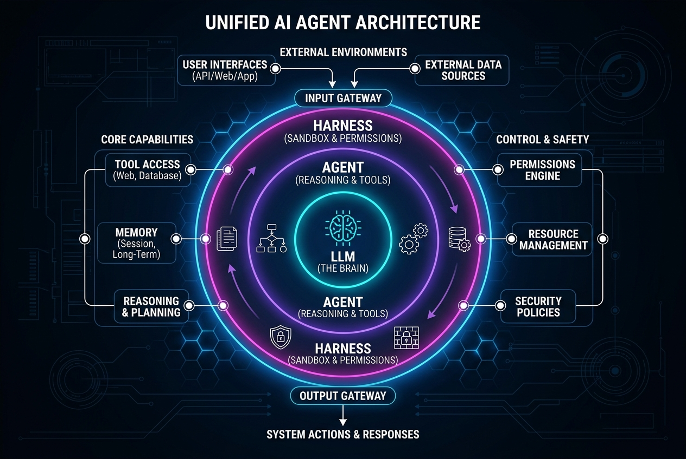

*Claude Code Series: [Setting up Claude Code](/blog/setting-up-claude-code/) (Next) &rarr;*

### Recommended Background Reading
If you are new to agentic terminal coding tools, you might want to read our series on Google's Antigravity CLI:
*   [Setting up Google Antigravity CLI: The AI-First Terminal Assistant](/blog/setting-up-antigravity-cli/) — Installation and configuration guide for `agy`.

If you have been keeping up with the rapid pace of AI development, you’ve likely heard of **Claude Code**—Anthropic’s agentic command-line tool that can navigate your codebase, run tests, fix bugs, and execute terminal commands. 

However, as tools like Claude Code gain traction, terminology is becoming increasingly blurred. Developers and tech enthusiasts frequently ask questions like:
* *Is Claude Code a new model, like Claude 3.5 Sonnet or Claude 3 Opus?*
* *What is the difference between an LLM, an Agent, and a Harness?*
* *Why do agents need a harness in the first place?*

To use these tools effectively and build on top of them, we need to demystify the architectural stack behind agentic coding. Let's break down the three layers that power Claude Code and tools like it.

---

### The Three-Layer Architecture of Agentic AI

At a high level, modern coding tools are not monolithic AI models. Instead, they are hierarchical software systems made of three distinct layers:

1. **The LLM (The Brain/Engine)**
2. **The Agent (The Reasoning Loop)**
3. **The Harness (The Sandbox & Interface)**

Below is a conceptual architecture diagram mapping out how these layers interact:

---

### Layer 1: The Large Language Model (LLM) — The Brain

At the absolute center of any agentic system is the **Large Language Model (LLM)**. 

* **What it is:** A stateless neural network trained on vast amounts of text and code to predict the next token (word or character sequence).
* **Examples:** Claude 3.7 Sonnet, Claude 3 Opus, Gemini 1.5 Pro, GPT-4o.
* **How it behaves:** If you give an LLM an input (a prompt), it returns a completion. Once that turn is over, the LLM has no memory of the interaction unless the conversation history is passed back to it in the next turn.

**Critical Limitation:** A raw LLM is completely isolated. It cannot read your local files, run terminal commands, inspect the internet, or evaluate whether a line of code it wrote actually compiles. It is a brain without hands.

---

### Layer 2: The Agent — The Reasoning & Tool Loop

To turn a stateless model into an active helper, we wrap it in an **Agent**.

* **What it is:** A stateful software program that coordinates a reasoning and execution loop (often based on patterns like *ReAct*—Reason and Action).
* **How it behaves:** Instead of just outputting code, the agent is prompted to think step-by-step:
  1. **Observe:** Analyze the current state of the workspace.
  2. **Plan:** Decide what sub-tasks are needed to achieve the user's goal.
  3. **Act:** Write down a *tool call* (e.g., "I want to call the tool `read_file` with parameter `src/index.js`").
  4. **Reflect:** Once the tool's result is returned, evaluate the outcome and decide if the plan needs adjustment.

The Agent layer gives the LLM "tools". By generating structured text (like JSON or XML blocks), the LLM expresses an *intent* to run a tool, which the agent system then processes.

---

### Layer 3: The Harness — The Sandbox, Safeties, & Interface

An Agent can generate a request to run a tool, but it still needs a medium to execute that tool safely on a computer. This is the role of the **Harness**.

* **What it is:** The execution environment and runtime scaffold. It is the CLI application you install on your system (e.g., via `npm install -g @anthropic-ai/claude-code`) or the containerized environment in which the agent runs.
* **What it does:** 
  * **Interprets Tool Calls:** When the Agent outputs `[run_command: "npm test"]`, the Harness intercepts this string, spins up a shell process, runs the test command, captures stdout/stderr, and formats that output back into the Agent's conversation history.
  * **Enforces Safety & Permissions:** The Harness sits between the agent and your operating system. If the agent tries to run `rm -rf /` or modify a sensitive file, the Harness halts execution and prompts you: *"Claude Code wants to run this command. Allow? [y/N]"*.
  * **Manages Context:** LLMs have finite context windows. The Harness prunes long terminal outputs, compresses file views, and curates history so the LLM doesn't run out of memory or become too expensive to run.

---

### Claude Code vs. Claude Opus: The Relation

A common source of confusion is the relationship between **Claude Code** and models like **Claude Opus** or **Claude 3.7 Sonnet**. 

| Concept | Claude Code | Claude Opus / 3.7 Sonnet |
| :--- | :--- | :--- |
| **Type** | **Application (Harness & Agent)** | **Underlying Model (LLM Brain)** |
| **Where it runs** | Locally in your terminal | Anthropic's cloud servers (accessed via API) |
| **Responsibility** | Interacting with files, running tests, prompting user consent | Generating text, planning, predicting code edits |
| **Analogy** | The Chassis and Controls of a car | The Engine under the hood |

When you run `claude` in your terminal, the **Claude Code** application initializes a local shell environment (the Harness). When you ask it to fix a bug, it makes API calls to Anthropic's server hosting **Claude 3.7 Sonnet** (or another model you select). The model returns reasoning and tool requests, which Claude Code executes locally.

---

### Why Do We Need an Evaluation/Test Harness?

Beyond runtime scaffolding, there is a second type of harness that is essential for agentic AI: the **Evaluation Harness** (such as [SWE-bench](https://www.swebench.com/)). 

When developers build agents, they need to measure how well they perform. A test harness:
1. **Clones a codebase** at a specific historical commit.
2. **Spawns the agent** and gives it a description of a real GitHub issue.
3. **Restricts the agent** to a sandboxed environment to see if it can modify the codebase to resolve the issue.
4. **Applies the agent's code changes** and runs the project's pre-existing unit tests.
5. **Verifies the outcome:** If the tests pass and the bug is resolved, the agent passes the benchmark.

Without these evaluation harnesses, we would have no objective way to know if a model upgrade (e.g., going from Claude 3.5 to Claude 3.7) makes our coding agents more capable or merely more verbose.

---

### Summary

Understanding the distinction between LLMs, Agents, and Harnesses is crucial as software development becomes increasingly agentic:
* **The LLM** is the core cognitive engine.
* **The Agent** is the loop that gives the engine reasoning and tool-using capabilities.
* **The Harness** is the safety-gated execution environment that allows the agent to interact with the real world.

By combining these three components, **Claude Code** moves beyond basic code completion, functioning as a true pair-programmer that operates safely right in your terminal.
