*AI/ML Basics Series: &larr; [What is a Model Weight? Demystifying Tensors, Matrices, and File Formats](/blog/what-is-a-model-weight/) (Previous) | [The Model Taxonomy: LLMs, Vision Models, VLAs, and Diffusion](/blog/model-taxonomy/) (Next) &rarr;*

### Recommended Background Reading
Before diving into the lifecycle, make sure you understand the foundational data structures and formats of model weights:
*   [What is a Model Weight? Demystifying Tensors, Matrices, and File Formats](/blog/what-is-a-model-weight/) — A guide to tensors, weights, biases, and serialization formats.

---

Understanding the difference between the **Training** and **Inference** phases of a machine learning model is the foundation of AI engineering. While ML researchers focus heavily on the mathematics of training, software engineers and DevOps professionals must master the entire lifecycle to build, optimize, and scale AI-powered applications.

At its core, the difference comes down to a single question: **Are we updating the model's weights, or are we using them?**

Let's trace the journey of an AI model from raw numerical weights to a production-ready, low-latency API.

---

### The Big Picture: Training vs. Inference

Before diving into code and math, here is a high-level conceptual flow showing how raw data becomes a trained model, which is then frozen and served:

```mermaid
graph TD
    %% Training Phase
    subgraph Training ["Phase 1: Training (Stateful & Compute-Heavy)"]
        A[Raw Training Data] --> B[Forward Pass]
        B --> C[Calculate Loss / Error]
        C --> D[Backpropagation / Gradients]
        D --> E[Update Weights]
        E -->|Epoch Loop| B
    end

    %% Transition
    E -->|Freeze & Export| F[Frozen Model Weights]

    %% Serving/Inference Phase
    subgraph Inference ["Phase 2: Inference (Stateless & Latency-Critical)"]
        G[User Query / Input] --> H[Load Frozen Weights]
        H --> I[Forward Pass Only]
        I --> J[Generate Prediction / Token]
        J --> K[API Response]
    end

    classDef training fill:#2a1f3d,stroke:#a15eff,stroke-width:2px;
    classDef inference fill:#1a3d3c,stroke:#00f2fe,stroke-width:2px;
    classDef weights fill:#111520,stroke:#3b4252,stroke-width:2px;
    
    class B,C,D,E training;
    class H,I,J,K inference;
    class F weights;
```



---

### Phase 1: Training (The Stateful Phase)

Training is the process of teaching a model to recognize patterns by showing it examples. This phase is **stateful**, meaning the model is constantly modifying its inner state (weights and biases).

#### 1. Weight Initialization
When training starts, the model’s weights are initialized—either randomly (for training from scratch) or using pre-existing weights (for fine-tuning a pre-trained model).

#### 2. The Forward Pass
Inputs are passed through the model's layers. Each layer performs matrix multiplications and applies activation functions (like ReLU or Gelu), outputting a prediction.

#### 3. Loss Calculation
The model's prediction is compared against the actual target (ground truth) using a **loss function** (e.g., Mean Squared Error or Cross-Entropy). The output of this function is a single number representing how "wrong" the model's prediction was.

#### 4. The Backward Pass (Backpropagation)
This is the heart of training. Using calculus (specifically the Chain Rule), the system calculates the gradient of the loss with respect to every weight in the network. A gradient tells us how much we need to adjust a specific weight to decrease the loss.

#### 5. Optimization (Updating Weights)
An optimizer (like SGD or AdamW) updates the weights using the calculated gradients:

$$\text{New Weight} = \text{Old Weight} - (\text{Learning Rate} \times \text{Gradient})$$

This process is repeated millions of times across batches of data (epochs) until the loss stops decreasing.

---

### Phase 2: Exporting and Freezing Weights

Once training is complete, the model's parameters (weights and biases) are fixed. We no longer need the optimizer state, gradients, or backpropagation machinery. 

To prepare the model for production, we **freeze** the weights and export them.

*   **Stripping Overhead**: We remove training-specific parameters (like optimizer states and learning rates), which often take up 2x to 3x more memory than the weights themselves.
*   **Serialization Formats**: The model is saved into formats optimized for loading and executing matrix math:
    *   **Safetensors**: A modern, secure format developed by Hugging Face that prevents arbitrary code execution and allows fast memory mapping (`mmap`).
    *   **ONNX (Open Neural Network Exchange)**: A cross-platform serialization format that compiles the model's graph for fast inference on different engines.
    *   **GGUF**: Designed specifically for local CPU/GPU execution (commonly used with llama.cpp and Ollama).
*   **Quantization**: To run models on smaller hardware, we can compress the weights from 16-bit floating points (FP16) down to 8-bit, 4-bit, or even 2-bit integers (INT4/INT8), drastically reducing memory usage with minimal loss in accuracy.

---

### Phase 3: Inference (The Stateless Phase)

Inference is the process of using the trained, frozen model to make predictions on new, unseen data. Unlike training, inference is **stateless** and **latency-critical**.

During inference, we only perform the **Forward Pass**. There is no backpropagation, no gradient tracking, and the weights never change.

#### Key Performance Metrics in Inference:
*   **Time to First Token (TTFT)**: How long it takes for the model to process the prompt and start generating the first word (prefill phase).
*   **Inter-Token Latency**: The speed at which subsequent words are generated (decode phase).
*   **Throughput**: The total number of tokens generated per second across all active users.

---

### Mapping to Code: PyTorch Example

To understand how this maps to actual code, let's look at `scripts/training_vs_inference.py`. This script showcases how PyTorch manages internal states differently depending on whether it is training or executing inference.

```python
# File: scripts/training_vs_inference.py
# Execution: Run in python terminal or script environment
import torch
import torch.nn as nn
import torch.optim as optim

# Define a simple Neural Network
class SimpleModel(nn.Module):
    def __init__(self):
        super().__init__()
        self.linear = nn.Linear(10, 2)

    def forward(self, x):
        return self.linear(x)

model = SimpleModel()

# ==========================================
# 🏋️ PHASE 1: THE TRAINING PIPELINE
# ==========================================
print("--- Starting Training Phase ---")
model.train()  # 1. Enable training mode (activates dropout, batchnorm, etc.)

optimizer = optim.SGD(model.parameters(), lr=0.01)
criterion = nn.MSELoss()

# Mock Input and Ground Truth target
inputs = torch.randn(1, 10)
targets = torch.randn(1, 2)

# Forward pass
outputs = model(inputs)
loss = criterion(outputs, targets)
print(f"Calculated Training Loss: {loss.item():.4f}")

# Backward pass (Backpropagation)
optimizer.zero_grad()  # Reset existing gradients
loss.backward()        # 2. Compute gradients for all weights
optimizer.step()       # 3. Update weights using optimizer
print("Weights updated successfully.\n")


# ==========================================
# 🚀 PHASE 2: THE INFERENCE PIPELINE
# ==========================================
print("--- Starting Inference Phase ---")
model.eval()  # 1. Enable evaluation/inference mode (deactivates training logic)

# Disable gradient tracking to save compute and VRAM
with torch.no_grad():  # 2. Turn off the autograd engine entirely
    inference_input = torch.randn(1, 10)
    prediction = model(inference_input)  # 3. Forward pass only
    
print(f"Inference Prediction Output: {prediction.numpy()}")
```

---

### Summary Comparison Table

Here is a side-by-side comparison of the two lifecycles:

| Metric / Aspect | Training Phase | Inference Phase |
| :--- | :--- | :--- |
| **Primary Goal** | Minimize model error (Loss) by updating weights. | Generate fast, accurate predictions. |
| **Weight State** | **Dynamic** (updated constantly). | **Static / Frozen** (read-only). |
| **Computation** | Forward pass + Backward pass (Backpropagation). | Forward pass only (no gradients). |
| **Hardware Priority** | Maximum parallel FLOPs, high-bandwidth VRAM (e.g., NVIDIA H100s). | Low latency, memory bandwidth, energy efficiency (e.g., custom TPUs, Edge NPUs). |
| **State** | Stateful (requires optimizer parameters, gradients). | Stateless (each query is independent). |
| **Batch Size** | Large (e.g., 32, 64, or 1024 to stabilize gradient updates). | Small (often batch size 1 for instant response, or dynamic batching for scale). |

### What's Next?
Now that we have covered the basic transition from weights to serving, our next post will explore **Model Taxonomy**—breaking down how these lifecycles differ when dealing with Vision Transformers, Diffusion Models, and Vision-Language-Action (VLA) robotics models!
