*AI/ML Basics Series: &larr; [Training vs. Inference Lifecycle: A Developer's Guide to Weights, Backpropagation, and Serving](/blog/training-vs-inference-lifecycle/) (Previous)*

### Prior Reading Material
Before exploring the model taxonomy, you can read the previous posts in the AI/ML Basics series:
*   [What is a Model Weight? Demystifying Tensors, Matrices, and File Formats](/blog/what-is-a-model-weight/) — A guide to tensors, weights, biases, and serialization formats.
*   [Training vs. Inference Lifecycle: A Developer's Guide to Weights, Backpropagation, and Serving](/blog/training-vs-inference-lifecycle/) — Tracing the journey of model weights from training statefulness to stateless production inference.

---

The modern artificial intelligence landscape has expanded far beyond simple classifiers. Developers and systems engineers are now tasking neural networks with generating coherent prose, identifying defects in satellite imagery, synthesizing high-fidelity digital art, and even operating robotic manipulators in real-time.

To design efficient architectures, scale serving infrastructure, and select the right foundation models, you must understand the **Model Taxonomy**. 

In this post, we break down the four dominant pillars of the modern AI ecosystem: **Large Language Models (LLMs)**, **Vision Models**, **Vision-Language-Action (VLA) Models**, and **Diffusion Models**.

---

### The Modality Map

Before we dive into the specific architectures, here is a high-level representation of how data flows through these four classes of models:

```mermaid
graph TD
    %% Modalities
    Text[Text Prompt]
    Image[Pixels / Video]
    Noise[Gaussian Noise]
    Action[Motor Controls / Actions]

    %% Models
    subgraph Models ["Neural Architectures"]
        LLM[LLM<br>Decoder-Only Transformer]
        VM[Vision Model<br>ViT / CNN]
        VLA[VLA Model<br>Vision-Language-Action]
        DM[Diffusion Model<br>U-Net / DiT]
    end

    %% Flows
    Text --> LLM -->|Text Tokens| TextOut[Generated Text]
    Image --> VM -->|Embeddings / Labels| EmbedOut[Semantic Output]
    Text & Image --> VLA -->|Action Tokens| Action
    Text & Noise --> DM -->|Denoised Latents| ImageOut[Synthesized Image]

    classDef text fill:#2a1f3d,stroke:#a15eff,stroke-width:2px;
    classDef image fill:#1a3d3c,stroke:#00f2fe,stroke-width:2px;
    classDef model fill:#111520,stroke:#3b4252,stroke-width:2px;
    
    class Text,TextOut text;
    class Image,ImageOut,Noise image;
    class LLM,VM,VLA,DM model;
```



---

### 1. Large Language Models (LLMs)

Large Language Models are designed to process, understand, and generate natural language.

*   **Primary Modality**: Text-in $\rightarrow$ Text-out.
*   **Core Architecture**: Decoder-only Transformers (e.g., Llama, GPT, Mistral).
*   **How They Work**:
    *   **Tokenization**: Raw text is split into sub-word tokens (numerical integers mapped to a vocabulary).
    *   **Causal Self-Attention**: The model reads input tokens and uses attention masks to ensure a token can only look at *previous* tokens, predicting the single most likely *next* token.
    *   **Autoregressive Loop**: Once the next token is generated, it is appended to the input context, and the entire sequence is fed back into the model to generate the subsequent token.

#### Key Developer Concerns:
*   **The KV Cache Bottleneck**: During the autoregressive generation (decode phase), the model has to recalculate Key and Value tensors for all previous tokens in every step. Storing these in GPU VRAM (the Key-Value Cache) is the main memory bottleneck for scaling concurrent users.
*   **Memory vs. Compute**: The prefill phase (processing the input prompt) is highly compute-bound. The decode phase (generating tokens one by one) is highly memory-bandwidth bound.

---

### 2. Vision Models

Vision Models process visual data to perform tasks like classification, object detection, or segmenting specific pixels.

*   **Primary Modality**: Pixels-in $\rightarrow$ Features / Labels / Embeddings-out.
*   **Core Architectures**:
    *   **Convolutional Neural Networks (CNNs)**: Rely on sliding filters (kernels) to extract local spatial patterns (edges, textures).
    *   **Vision Transformers (ViTs)**: Divide an image into a grid of non-overlapping patches (e.g., 16x16 pixels), project each patch into a linear embedding, add positional encodings, and feed them into a standard Transformer encoder as if they were text tokens.
*   **Multimodal Alignment (CLIP)**: Contrastive Language-Image Pretraining (CLIP) trains a text encoder and an image encoder simultaneously to align their vector outputs. This lets us compare text descriptions and images in the same mathematical space.

```python
# Conceptualizing ViT Patching in PyTorch
# File: scripts/vit_patching_example.py
import torch
import torch.nn as nn

class PatchEmbedding(nn.Module):
    def __init__(self, in_channels=3, patch_size=16, embed_dim=768):
        super().__init__()
        # Using a Convolution layer with stride equal to patch size to split & project patches
        self.proj = nn.Conv2d(
            in_channels, 
            embed_dim, 
            kernel_size=patch_size, 
            stride=patch_size
        )

    def forward(self, x):
        # Input shape: [Batch, Channels, Height, Width] -> e.g., [1, 3, 224, 224]
        x = self.proj(x) # Output shape: [Batch, EmbedDim, H_patches, W_patches] -> [1, 768, 14, 14]
        x = x.flatten(2) # Output shape: [Batch, EmbedDim, NumPatches] -> [1, 768, 196]
        x = x.transpose(1, 2) # Output shape: [Batch, NumPatches, EmbedDim] -> [1, 196, 768]
        return x
```

---

### 3. Vision-Language-Action (VLA) Models

VLA models represent the frontier of Physical AI and robotics. They ingest visual inputs and instructions, then translate them directly into physical actions.

*   **Primary Modality**: (Pixels + Text Instruction)-in $\rightarrow$ Robotic Actions / Control commands-out.
*   **Core Architecture**: A Vision Encoder (like ViT) coupled with a Language Decoder (like Llama), trained to output action tokens (e.g., RT-X, Octo, GR00T).
*   **How They Work**:
    *   The camera feed is processed by the vision encoder.
    *   The language prompt (e.g., *"Pick up the red block and place it in the bin"*) is tokenized.
    *   Both visual embeddings and text tokens are fed into the LLM backbone.
    *   Instead of predicting the next English word, the model is trained to output specialized **action tokens** that represent numerical values for joint angles, gripper states, or delta-coordinates.

#### Key Developer Concerns:
*   **Inference Frequency**: Unlike an LLM which can stream tokens at human reading speeds (10-30Hz), a robotic control loop must run at high, consistent speeds (e.g., 50-100Hz) with zero jitter to prevent physical damage or erratic movements.
*   **Generalization**: Adapting to novel environments (changes in lighting, different table textures) without having to retrain the control model.

---

### 4. Diffusion Models

Diffusion models are generative networks primarily used to create high-fidelity images, video, and audio.

*   **Primary Modality**: Text Prompt/Latent Vectors-in $\rightarrow$ Pixels-out.
*   **Core Architecture**: U-Net or Diffusion Transformers (DiT, e.g., Sora, Stable Diffusion 3).
*   **How They Work**:
    *   **The Forward Process (Training)**: The network takes a clean training image and gradually adds Gaussian noise over several steps until the image becomes pure noise.
    *   **The Reverse Process (Inference)**: The model starts with pure random noise and is trained to predict the *exact noise* added at any given step. By subtracting the predicted noise step-by-step, the model reconstructs a clear image from scratch.
    *   **Conditioning**: The reverse process is guided by text embeddings (via cross-attention layers) to steer the noise-subtraction process toward generating an image that matches the text prompt.

---

### Summary Comparison Table

| Aspect | Large Language Models (LLMs) | Vision Models (ViTs/CNNs) | Vision-Language-Action (VLAs) | Diffusion Models |
| :--- | :--- | :--- | :--- | :--- |
| **Core Modality** | Text in / Text out | Images in / Labels or Features out | Images + Text in / Motor controls out | Noise + Text in / Images out |
| **Common Backbone** | Decoder-only Transformer | CNN / Encoder-only Transformer | ViT + LLM Decoder | U-Net / Diffusion Transformer (DiT) |
| **Output Type** | Autoregressive text tokens | Categorical tags / Dense embeddings | Multi-joint delta coordinates | Pixel array / Latent matrix |
| **Hardware Bottleneck**| Memory bandwidth (Decode phase VRAM limits) | Compute (Flops during large batch inference) | Low-latency latency spikes, I/O latency | Iterative denoising steps (requires fast matrix multiply) |
| **Execution Style** | Sequential loop (token-by-token) | Single forward pass | Real-time continuous loop (10-100Hz) | Iterative loop (e.g., 20-50 denoising steps) |

### What's Next?
In our next post, we will explore **Physical AI Models** in detail—focusing on how models like NVIDIA's GR00T and RT-X bridge the gap between digital reasoning and the messy physics of the real world!
