*AI Inference Deep-Dive Series: Part 1*

### Prior Reading Material
Before diving into the mechanics of inference, make sure you understand the foundational data structures and model lifecycles:
*   [What is a Model Weight? Demystifying Tensors, Matrices, and File Formats](/blog/what-is-a-model-weight/) — A guide to tensors, weights, biases, and serialization formats.
*   [Training vs. Inference Lifecycle: A Developer's Guide to Weights, Backpropagation, and Serving](/blog/training-vs-inference-lifecycle/) — Tracing the journey of model weights from training statefulness to stateless production inference.
*   [The Model Taxonomy: LLMs, Vision Models, VLAs, and Diffusion](/blog/model-taxonomy/) — Breakdown of modern classes of models, their modal domains, architectures, and use cases.

---

For most software developers, their first encounter with artificial intelligence is incredibly simple: import a library, instantiate a model class, and call a `predict()` or `generate()` function. 

But in production, serving foundation models at scale is a complex systems engineering problem. A model containing 70 billion parameters demands gigabytes of high-bandwidth memory, consumes massive compute resources, and introduces significant latency challenges.

To deploy, scale, and optimize these systems, you must understand the fundamentals of **AI Inference**. 

This post kicks off our **AI Inference Deep-Dive Series**, starting with the core mechanics of inference, how it differs from training at a systems level, and the key performance metrics you must optimize.

---

### What is Inference?

In the machine learning lifecycle, **Inference** is the phase where a fully trained neural network is applied to new, unseen data to compute a prediction, classification, or generation.

Conceptually, inference is a series of matrix multiplications. Input data (e.g., text tokens or pixel values) is converted into mathematical vectors (embeddings), passed through successive layers of weights and biases, and transformed into an output probability distribution.

At a systems level, inference is defined by two key characteristics:
1.  **Frozen Parameters**: The weights and biases of the model are read-only and static. 
2.  **Statelessness**: Every request is independent. The model does not need to store historical state between requests (though systems might cache keys and values for efficiency within a single generation loop).

---

### The Paradigm Shift: Training vs. Inference

While both phases execute the forward pass (matrix math), they run on entirely different software stacks and introduce contrasting hardware bottlenecks.

```mermaid
graph TD
    subgraph TrainingStack ["🏋️ Training Environment"]
        T1[Gradients & Autograd Engine]
        T2[Optimizer States - AdamW]
        T3[Activation Cache for Backpropagation]
    end

    classDef training fill:#2a1f3d,stroke:#a15eff,stroke-width:2px;
    class T1,T2,T3 training;
```




#### 1. Memory Overhead
During training, a single parameter requires up to **four times** more memory than its base footprint:
*   **Base Weights (16-bit)**: 2 bytes per parameter.
*   **Gradients**: 2 bytes per parameter.
*   **AdamW Optimizer States**: 8 bytes per parameter (stores momentum and variance tracking).
*   **Activation Caching**: Memory reserved to store intermediate layer outputs needed for the chain-rule backpropagation pass.

In inference, the optimizer states and gradients are stripped. The activation memory is only needed for the currently executing layer, drastically lowering the overall VRAM footprint.

#### 2. Data Flow
Training processes inputs in large, stable batches to calculate average gradients and stabilize model updates. 

Inference, however, is user-driven. Requests arrive asynchronously, meaning the server must process requests individually (batch size 1) or utilize specialized schedulers to dynamically bundle requests (continuous batching) to maintain high throughput.

---

### Key Performance Metrics

When serving models in production, developers must optimize for three core metrics:

```
                  ┌────────────────────── Latency ──────────────────────┐
Prompt Sent ─────►│ ◄─── TTFT ───► │ ◄────── Inter-Token Latency ──────► │ ◄───── User Receives Complete Output
                  └────────────────┴────────────────────────────────────┘
```

#### 1. Time to First Token (TTFT)
The latency from the moment a user submits a prompt to the moment the model generates its first output character or token. 
*   **Why it matters**: Crucial for user experience. A high TTFT makes an application feel sluggish or unresponsive.
*   **The Phase**: This corresponds to the **Prefill Phase**, where the entire input prompt is processed in parallel. It is highly compute-bound.

#### 2. Inter-Token Latency
The time elapsed between generating consecutive tokens (e.g., words in a sentence).
*   **Why it matters**: Determines the speed at which text streams to the user. Humans read at roughly 25-30 milliseconds per token; anything slower feels disjointed.
*   **The Phase**: This corresponds to the **Decode Phase**, where the model generates one token at a time. It is highly memory-bandwidth bound because the model must read all weights from global GPU memory into cache memory for *every single token generated*.

#### 3. Throughput
The total volume of tokens generated per second across all active requests on the server (Tokens/Sec).
*   **Why it matters**: Crucial for cost and infrastructure scaling. High throughput means you can handle more concurrent users on a single GPU.

---

### Systems-Level Optimization: Memory Mapping (mmap)

Because inference uses frozen, read-only weights, modern serving engines like `llama.cpp` and `vLLM` skip traditional file reading loops. Instead, they use the operating system's `mmap` (memory mapping) system call.

```python
# Conceptualizing mmap in Python
# File: scripts/mmap_weights_example.py
import mmap
import os

def load_weights_mmap(file_path):
    # Get the file descriptor
    fd = os.open(file_path, os.O_RDONLY)
    
    # Map the entire file into the process's virtual address space
    # The OS will load pages into physical RAM on-demand when read
    mapped_file = mmap.mmap(fd, 0, access=mmap.ACCESS_READ)
    
    # Read a chunk of weights without loading the full file into memory
    print(f"Mapped file size: {len(mapped_file)} bytes")
    header = mapped_file[0:128]
    
    # Close mapping
    mapped_file.close()
    os.close(fd)

# Note: This allows multiple processes to share the same physical memory 
# pages containing the weights, reducing memory consumption at scale.
```

Using `mmap` provides two key benefits:
1.  **Instant Startup**: The model is "loaded" in milliseconds because the OS only loads pages from disk into memory when those specific layers are executed during the forward pass.
2.  **Shared Memory**: If you run multiple worker processes serving the same model, the OS maps them to the exact same physical memory pages, preventing duplicate memory allocations.

---

### Prefill vs. Decode Summary

| Dimension | Prefill Phase (TTFT) | Decode Phase (Inter-Token Latency) |
| :--- | :--- | :--- |
| **Execution Frequency** | Once per request | Once per generated token (looping) |
| **Primary Bottleneck** | **Compute Bound** (requires high FLOPs) | **Memory Bandwidth Bound** (VRAM read speeds) |
| **Batch Size** | 1 (containing the entire prompt sequence) | 1 (single token per step, or dynamic batches) |
| **VRAM Read Profile** | Read weights once, run heavy parallel math | Read *all* weights repeatedly for each token |

### What's Next?
Now that we have established the baseline differences between prefill and decode, our next post will explore **The Two Pillars: Prefill vs. Decode** in detail—unpacking the mathematical mechanics, why memory bandwidth becomes the ultimate speed limit, and how KV Caching changes the game!
