*AI Inference Deep-Dive Series: &larr; [Basics of AI Inference: Demystifying Latency, Throughput, and Serving](/blog/basics-of-ai-inference/) (Previous) | [Understanding the KV Cache: The VRAM Bottleneck of LLM Serving](/blog/understanding-kv-cache/) (Next) &rarr;*

### Prior Reading Material
Before diving into the execution phases of inference, make sure you understand the baseline systems metrics and training vs. inference differences:
*   [Basics of AI Inference: Demystifying Latency, Throughput, and Serving](/blog/basics-of-ai-inference/) — Tracing the core performance metrics (TTFT, throughput, inter-token latency) and introductory OS-level optimizations.
*   [Training vs. Inference Lifecycle: A Developer's Guide to Weights, Backpropagation, and Serving](/blog/training-vs-inference-lifecycle/) — Tracing the journey of model weights from training statefulness to stateless production inference.

---

In our previous post, we defined the foundational metrics of AI inference: Time to First Token (TTFT), Inter-Token Latency, and Throughput. 

To optimize these metrics in production, we must look under the hood of the LLM execution pipeline. When a user submits a prompt, the serving engine does not run a uniform loop. Instead, the inference lifecycle is divided into two entirely distinct phases: **Prefill** and **Decode**.

These two phases represent the "two pillars" of LLM serving. They operate on different mathematical shapes, run on different sub-components of the GPU, and are limited by completely different physical hardware bottlenecks.

---

### The Prefill Phase: Computing the Prompt (Compute-Bound)

The **Prefill** phase is the starting point of any inference request. When you submit a prompt (e.g., 1,024 tokens), the model must process the entire prompt sequence to understand the context and generate the very first token.

#### Core Mechanics
During prefill, the entire input prompt is fed into the transformer network simultaneously. 

*   **Activation Shape**: The activation tensor passing through the network has a shape of `[Batch Size, Sequence Length, Hidden Dimension]`. Because the full prompt sequence is processed in parallel, the matrix multiplications are large: we multiply large activation matrices by the parameter weight matrices.
*   **KV Cache Generation**: As the prompt passes through the attention layers, the key-value (KV) states for every prompt token are calculated and saved to VRAM. This is a critical write operation that prepares the engine for the next phase.

#### The Hardware Bottleneck: Compute-Bound
The prefill phase is highly **compute-bound**. Because we are multiplying large matrices, the ratio of mathematical operations (FLOPs) to memory accesses (bytes read from VRAM) is extremely high. 

Under the hood, the GPU's execution units (Tensor Cores) are kept fully saturated. The speed of the prefill phase is determined by the **GPU's raw compute power (TFLOPS)**.

---

### The Decode Phase: Autoregressive Generation (Memory-Bound)

Once the first token is generated (ending the prefill phase and establishing our TTFT), the engine switches to the **Decode** phase. This phase is responsible for generating all subsequent tokens, one by one, autoregressively.

#### Core Mechanics
Unlike prefill, the decode phase cannot process tokens in parallel. To generate token $N$, the model must receive token $N-1$ as its input. 

*   **Activation Shape**: The activation tensor shrinks to a shape of `[Batch Size, 1, Hidden Dimension]`. 
*   **The Weight Transfer Nightmare**: Because the sequence length is 1, the matrix multiplications are incredibly small—they are vector-matrix multiplications. However, to calculate the output for this single input vector, the GPU must still load **every single weight parameter** of the model from the global VRAM (High-Bandwidth Memory) into the local GPU SRAM (L1/L2 Cache and registers).

#### The Hardware Bottleneck: Memory-Bandwidth-Bound
The decode phase is extremely **memory-bandwidth-bound**. 

To generate a single token, we perform a relatively small amount of math, but we must read gigabytes of weights. The GPU's Tensor Cores sit idle, starved of data, waiting for the slow memory bus to deliver the parameters from VRAM. The speed of the decode phase is limited entirely by the **GPU's VRAM memory bandwidth (GB/s)**.

---

### Visualizing the Execution Loop

Here is the system flow mapping the transitions between the two phases:

```mermaid
graph TD
    Start([User Prompt Submitted]) --> Prefill[Prefill Phase: Process Entire Prompt Parallel]
    Prefill --> WriteKV[Write Prompt KV States to Cache]
    WriteKV --> Gen1[Generate First Token: TTFT Ends]
    
    Gen1 --> DecodeInit{Is Generation Finished?}
    
    DecodeInit -- No --> Decode[Decode Phase: Process 1 Token Autoregressively]
    Decode --> ReadKV[Read Prior KV Cache]
    ReadKV --> UpdateKV[Append New Token to KV Cache]
    UpdateKV --> GenNext[Generate Next Token]
    GenNext --> DecodeInit
    
    DecodeInit -- Yes --> End([Return Final Output])
    
    style Prefill fill:#1a3d3c,stroke:#00f2fe,stroke-width:2px;
    style Decode fill:#2a1f3d,stroke:#a15eff,stroke-width:2px;
```



---

### Proving the Bottleneck: Arithmetic Intensity

We can prove these bottlenecks mathematically using the concept of **Arithmetic Intensity**, defined as the number of floating-point operations (FLOPs) executed per byte of memory transferred:

$$\text{Arithmetic Intensity} = \frac{\text{FLOPs}}{\text{Bytes Transferred}}$$

Let's look at the mathematical properties of a single projection layer in a model with $P$ parameters. The activation size has a hidden dimension of $D$, batch size of $B$, and sequence length of $S$.

*   **Memory Transfer (Bytes)**: To execute the layer, we must read the weights from VRAM. At FP16 precision, this requires $2 \times P$ bytes.
*   **Math Operations (FLOPs)**: For matrix-vector multiplication, we perform $2 \times B \times S \times P$ operations.

Now, let's calculate the Arithmetic Intensity for both phases:

#### 1. Prefill Phase ($S = 1024$)
$$\text{Arithmetic Intensity} = \frac{2 \times B \times 1024 \times P}{2 \times P} = B \times 1024 \text{ FLOPs/byte}$$
Even with a batch size of 1, the arithmetic intensity is **1,024 FLOPs/byte**. Modern GPUs (like an H100) have a "roofline" threshold of around 150 FLOPs/byte. Since 1,024 is far above this threshold, the prefill phase falls squarely in the **compute-bound** region.

#### 2. Decode Phase ($S = 1$)
$$\text{Arithmetic Intensity} = \frac{2 \times B \times 1 \times P}{2 \times P} = B \text{ FLOPs/byte}$$
For a batch size of 1, the arithmetic intensity is a mere **1 FLOP/byte**. Because 1 is far below the GPU's roofline threshold, the decode phase is severely **memory-bandwidth-bound**.

---

### Simulating the Intensity in Python

To see how these theoretical equations impact resource usage, we can run a headless python simulation of a transformer layer. 

The script is saved at `scripts/prefill_decode_simulator.py`. You can run it on your local system:

```bash
# Run the simulation script
python scripts/prefill_decode_simulator.py
```

Here is the core logic and outputs from the simulation of a 32-layer, 8-billion parameter class model:

```python
# Simplified simulation excerpt from scripts/prefill_decode_simulator.py
def simulate_layer(batch_size, seq_len, hidden_dim, num_layers, precision_bytes=2):
    layer_params = 12 * (hidden_dim * hidden_dim) # simplified projections
    total_weights_bytes = layer_params * precision_bytes
    
    # Prefill math
    prefill_flops = num_layers * (2 * batch_size * seq_len * layer_params)
    prefill_intensity = prefill_flops / (total_weights_bytes * num_layers)
    
    # Decode math
    decode_flops = num_layers * (2 * batch_size * 1 * layer_params)
    decode_intensity = decode_flops / (total_weights_bytes * num_layers)
    
    return prefill_intensity, decode_intensity
```

**Simulation Output:**
```text
============================================================
LLM LAYER SIMULATOR (Layer Params: 201.33 M)
Batch Size: 4 | Prompt Length: 1024 | Hidden Dim: 4096
============================================================
1. PREFILL PHASE:
   - Total FLOPS required: 52776.56 GFLOPs
   - Weight memory read:   12.885 GB
   - Arithmetic Intensity: 4096.00 FLOPs/byte
   - Classification:       COMPUTE-BOUND
------------------------------------------------------------
2. DECODE PHASE (Single Token):
   - Total FLOPS required: 51.54 GFLOPs
   - Weight memory read:   12.885 GB
   - Arithmetic Intensity: 4.00 FLOPs/byte
   - Classification:       MEMORY-BANDWIDTH-BOUND
============================================================
```

---

### The Crucial Optimizer: The KV Cache

Because the decode phase executes autoregressively, calculating the self-attention of the current token requires comparing it to all previous tokens in the sequence. 

If we didn't save historical states, we would have to recompute the key and value vectors of every single past token for every new token we generated. This would turn the decode phase into a quadratic $O(N^2)$ compute nightmare, blowing up our latency.

To avoid this, we use the **KV Cache**:
1.  **Prefill Phase**: We calculate the Key and Value matrices for all prompt tokens and store them in memory.
2.  **Decode Phase**: We only calculate Key and Value vectors for the *single* new token, and append them to our cache. We read the cached keys and values of previous tokens from VRAM to compute attention.

#### The Trade-Off: VRAM Capacity
While the KV Cache saves massive compute time, it introduces a new constraint: **memory capacity**. The cache grows linearly with sequence length, batch size, and model size:

$$\text{KV Cache Size} = 2 \times \text{Layers} \times \text{Heads} \times \text{HeadDim} \times \text{SeqLen} \times \text{BatchSize} \times \text{Bytes}$$

For a Llama 3 70B model with a batch size of 16 and a context of 8k tokens, the KV cache alone demands **22.5 GB of VRAM**. This capacity limit is what restricts the maximum batch size and context window a GPU server can handle before running out of memory (OOM).

---

### Summary of Differences

| Metric | Prefill Phase (TTFT) | Decode Phase (Inter-Token Latency) |
| :--- | :--- | :--- |
| **Input Token Count** | Large (prompt length $N$) | Exactly 1 (the last generated token) |
| **GPU Core State** | Fully saturated Tensor Cores | Idle Tensor Cores (starved of data) |
| **Bottleneck Resource** | Compute Performance (TFLOPS) | Memory Bandwidth (GB/s VRAM speed) |
| **KV Cache Action** | Write full prompt keys/values | Read past keys/values + append new |
| **Optimization Target** | Maximize parallel execution (TFLOPS) | Maximize weight reuse & batching (GB/s) |

---

### What's Next?

Understanding the prefill and decode bottlenecks is the key to unlocking serving performance. 

Now that we know *why* decode is memory-bandwidth bound and *how* the KV cache capacity limits batching, our next post will explore **Inference Optimizations: Speeding up Prefill and Decode**. We will examine how algorithms like **FlashAttention** reduce memory read times, how **Speculative Decoding** bypasses the autoregressive memory bottleneck, and how **PagedAttention** prevents memory fragmentation!
