*Autonomous AI Agents & Frameworks Series: Part 1*

### Prior Reading Material
Before exploring agent loops, ensure you understand the core mechanics of model weights and stateless inference:
*   [The Model Taxonomy: LLMs, Vision Models, VLAs, and Diffusion](/blog/model-taxonomy/) — Breakdown of model modalities, architectures, and how they interpret symbols and tokens.
*   [Training vs. Inference Lifecycle: A Developer's Guide to Weights, Backpropagation, and Serving](/blog/training-vs-inference-lifecycle/) — Tracing the journey of model weights from training statefulness to stateless production inference.

---

Over the past three years, the developer experience of building with artificial intelligence has shifted dramatically. It started with simple text generation APIs, progressed to Retrieval-Augmented Generation (RAG) pipelines, and has now arrived at **Agentic AI**.

Traditional software is deterministic: write input, execute code branches, receive output. If you feed a raw LLM a complex goal (e.g., *"Write a complete Python web app and test its endpoints"*), the model will output a single block of text representing code. But if there is a syntax error or a missing import, the system fails.

**Agents** solve this by wrapping stateless models inside stateful execution loops. Instead of completing a prompt in a single pass, an agent loops dynamically: it plans a step, calls a tool, inspects the result, adjusts its reasoning, and repeats until the goal is achieved.

In this post, we kick off the **Autonomous AI Agents & Frameworks Series** by dissecting the architecture of agent loops, tracing their complexity levels, and examining the trade-offs of single-agent vs. multi-agent systems.

---

### Level 1: The ReAct Pattern (Single-Agent Loops)

The baseline architecture for almost all modern agents is the **ReAct** (Reasoning + Acting) pattern. Developed in 2022, ReAct combines chain-of-thought reasoning with tool call execution in a cyclic loop:

```mermaid
graph TD
    Goal([User Goal]) --> Reason[Reasoning: Analyze state & plan next step]
    Reason --> Act[Act: Output tool call instructions]
    Act --> Observe[Observe: Execute tool and return output]
    Observe --> UpdateContext[Update Context Window with Tool Output]
    UpdateContext --> Verify{Is Goal Achieved?}
    Verify -- No --> Reason
    Verify -- Yes --> Finish([Return Final Result])

    style Reason fill:#1a3d3c,stroke:#00f2fe,stroke-width:2px;
    style Act fill:#2a1f3d,stroke:#a15eff,stroke-width:2px;
```



#### The Loop in Action
To see how this works in a running script, you can execute a conceptual simulator of the ReAct pattern locally:

```bash
# Run the ReAct simulator script
python scripts/agent_react_simulator.py
```

The simulator prints the following thought-action cycles for a multi-step weather and traffic routing task:

```text
===========================================================================
Agent Task: Check weather in SF and find commute time to Silicon Valley
===========================================================================
[STEP 1]
🤔 Thought: I need to check the current weather in San Francisco to see if there are any environmental delays.
🛠️  Action: Call tool 'weather_api' with args: San Francisco
👁️  Observation: Rainy, 58°F, wind 12mph

[STEP 2]
🤔 Thought: The weather is rainy. Rain typically causes traffic delays. I need to calculate the commute time...
🛠️  Action: Call tool 'traffic_api' with args: ('San Francisco', 'Silicon Valley', 'rain')
👁️  Observation: 75 minutes (Heavy Rain delays on US-101 S)

[STEP 3]
🤔 Thought: I now have both the weather condition (rainy) and the adjusted commute time (75 minutes)...
🛠️  Action: Finish

[FINAL RESPONSE] -> Commute time from SF to Silicon Valley today is 75 minutes due to heavy rain delays.
===========================================================================
```

#### The Single-Agent Bottleneck: Context Decay
While single-agent scripts are highly capable, they run into a hard scaling ceiling: **Context Bloat and Degradation**.

At every iteration of the loop, the agent's new thought, the tool call, and the tool observation are appended to the model's context window. As the context window grows:
1.  **Instruction following decays**: The model struggles to remember its original system instructions amidst the noise of dozens of tool outputs.
2.  **Infinite Loops**: If a tool returns an error, a single-agent loop often gets stuck repeating the exact same failed action (e.g., querying the same database column over and over).
3.  **Cost**: Large context sizes dramatically increase token costs and prefill latencies.

---

### Level 2: Multi-Agent Orchestration

To overcome the limits of a single-agent loop, modern architectures split complex tasks across multiple, specialized agent personas. This is **Multi-Agent Orchestration**.

Instead of writing one massive prompt containing 50 system rules and 20 tool definitions, developers build specialized nodes:
*   **Researcher Agent**: Has access to search tools and document databases.
*   **Writer Agent**: Optimized to synthesize research into clean markdown.
*   **QA Editor Agent**: Has tools to check grammar, structure, and fact-check.

#### Coordination Topologies
Multi-agent systems generally organize around two primary topologies:

```
1. Hierarchical (Supervisor)              2. Collaborative (Choreographed Graph)
        ┌──────────────┐                            ┌──────────────┐
        │  Supervisor  │                    ┌──────►│  Researcher  │──────┐
        └──────┬───────┘                    │       └──────────────┘      │
        ┌──────┴──────┐                     │                             ▼
        ▼             ▼                     │                       ┌──────────┐
  ┌──────────┐  ┌──────────┐                │                       │  Writer  │
  │Researcher│  │  Writer  │                │                       └────┬─────┘
  └──────────┘  └──────────┘                │                             │
                                            └───────◄─  QA Editor  ◄──────┘
                                                    └─────────────────────┘
```

1.  **Hierarchical (Supervisor/Router)**: A central router agent receives the user request, breaks it into subtasks, delegates them to specific agents, compiles their outputs, and returns the final result.
2.  **Choreographed (State Graph)**: There is no central supervisor. Instead, the workflow is defined as a graph. Agents transition control to other agents by returning specific outputs (e.g., when the Coder Agent finishes writing a file, the graph automatically passes the file to the QA Agent).

#### Real-World Implementation: The OpenClaw Platform
To see orchestration in action on local workstations, developers use platforms like **[OpenClaw](https://github.com/openclaw/openclaw)**. Rather than running closed-source APIs, OpenClaw operates as a self-hosted modular assistant (an "AI Butler") that coordinates multiple micro-agents via a unified message bus (linking to platforms like Telegram or Discord), showcasing how decentralized orchestrated agent networks interact in real-time.

---

### Level 3: Autonomous Self-Improving Loops

The highest tier of agentic complexity is represented by systems that can dynamically modify their own code or expand their own toolsets.

Rather than relying on hardcoded Python functions registered as tools, a self-improving agent runs in a persistent loop where it can:
1.  Write a new helper script to solve a novel task.
2.  Test the script in a sandbox.
3.  Store the compiled script in a **persistent skill library** (a Vector database of custom tools).
4.  Retrieve and call that custom tool in future sessions when encountering similar tasks.

#### Case Study: Nous Research's Hermes Agent
A prime example of this level is **Nous Research's [Hermes Agent](https://github.com/NousResearch/Hermes-Agent)** loop. Powered by open-weights reasoning models, the Hermes Agent runs a persistent, multi-turn loop that allows the agent to inspect its own tool execution logs, write custom Python skill plugins locally on-the-fly, test them for errors, save them to its toolbox, and use them to solve downstream tasks in subsequent prompts. This shifts the agent from a static, pre-programmed script executor into a dynamic, self-evolving system.

---

### Comparative Landscape of Frameworks

Developers building agentic systems typically choose between several leading frameworks:

*   **[LangChain](https://www.langchain.com/)**: Best for linear pipelines, prompt templates, and basic chains.
*   **[LangGraph](https://langchain-ai.github.io/langgraph/)**: Specifically designed for stateful, cyclic multi-agent graphs. It models workflows as nodes (agents/tools) and edges (transitions).
*   **[CrewAI](https://www.crewai.com/)**: A high-level framework focusing on role-playing agent groups (Crews) with built-in task delegation and memories.
*   **[AutoGen](https://microsoft.github.io/autogen/)**: Microsoft's framework designed for event-driven, multi-agent conversations and high-concurrency message passing.

---

### What's Next?

Understanding the landscape of agent loops is the first step. Our next post in this series, **Nous Research's Hermes Agent: Self-Improving Autonomous Systems**, will dive deep into how persistent memory layers and dynamic tool generation operate, tracing the boundaries of self-hosted learning loops!
