*Autonomous AI Agents & Frameworks Series: &larr; [The Landscape of Agentic AI: From Single-Agent Scripts to Multi-Agent Networks](/blog/landscape-of-agentic-ai/) (Previous) | [The Self-Hosted AI Butler: Modular Assistance with OpenClaw](/blog/openclaw-self-hosted-ai-butler/) (Next) &rarr;*

### Prior Reading Material
Before exploring self-improving code loops, we recommend reading the prerequisite posts in this series and the foundational LLM guides:
*   [The Landscape of Agentic AI: From Single-Agent Scripts to Multi-Agent Networks](/blog/landscape-of-agentic-ai/) — Demystifying the ReAct loop, context bloat, and hierarchical coordination graphs.
*   [Training vs. Inference Lifecycle: A Developer's Guide to Weights, Backpropagation, and Serving](/blog/training-vs-inference-lifecycle/) — An inside look at how static weights perform stateless token predictions during inference.

---

In the landscape of AI assistant systems, most terminal agents (like basic ReAct scripts or pre-configured chat agents) are **static**. They operate with a fixed list of tools programmed in Python or JavaScript. If a user asks a static agent to perform a task outside its direct API scope—such as converting a proprietary raw video codec or parsing an obscure XML format—the agent fails because it doesn't have the necessary function registered in its context.

To solve this, Nous Research introduced the concept of **[Hermes Agent](https://github.com/NousResearch/Hermes-Agent)**: a self-improving, autonomous agent loop designed to run locally, inspect its own tool deficits, write custom tool modules on-the-fly, compile/test them in a sandbox, and save them to a persistent **Skill Library** for future runs.

In this second installment of the **Autonomous AI Agents & Frameworks Series**, we'll dive deep under the hood of self-improving systems, inspect the architecture of the Hermes Agent loop, and build a localized Python simulation of a skill compiler.

---

### Setting Up Hermes Agent Locally

Hermes Agent is designed to be installed quickly on local workstations:

#### 1. Quick Installation
Choose the command that matches your operating system:

*   **Linux / macOS / WSL2:** Run the following command in your terminal:
    ```bash
    curl -fsSL https://hermes-agent.nousresearch.com/install.sh | bash
    ```
*   **Windows (PowerShell):** Run this in your native PowerShell:
    ```powershell
    iex (irm https://hermes-agent.nousresearch.com/install.ps1)
    ```

#### 2. Initial Configuration
Once installed, authenticate and initialize the tool gateway:
```bash
# Initialize zero-config authentication and link capabilities
hermes setup --portal
```

For developers looking to inspect or customize the engine itself, you can clone the repository from source:
```bash
git clone https://github.com/NousResearch/hermes-agent.git
cd hermes-agent
```

---

### The Architecture of a Self-Improving Loop

A self-improving loop shifts the responsibility of tool creation from the human developer to the agent itself. Instead of failing when a tool is missing, the agent initiates a sub-routine: **Create, Test, and Catalog**.

```mermaid
graph TD
    UserGoal([User Goal]) --> ToolCheck{Has Suitable Tool?}
    ToolCheck -- Yes --> Exec[Execute Tool & Return Output]
    ToolCheck -- No --> Draft[Draft New Python Tool Code]
    Draft --> Sandbox[Execute Tool in Isolated Sandbox]
    Sandbox --> Verify{Does Code Pass Tests?}
    Verify -- No (Error) --> FeedBack[Feed Stacktrace back to LLM]
    FeedBack --> Draft
    Verify -- Yes --> Save[Register tool in Skill Library & save to disk]
    Save --> Exec
    
    style ToolCheck fill:#1a3d3c,stroke:#00f2fe,stroke-width:2px;
    style Sandbox fill:#2a1f3d,stroke:#a15eff,stroke-width:2px;
    style Verify fill:#1d2b3a,stroke:#3b82f6,stroke-width:2px;
```



#### The Four Core Layers

1.  **The Orchestrator**: Manages the outer execution state. It receives the high-level goal and evaluates whether the current toolbox is sufficient.
2.  **The Code/Skill Sandbox**: An isolated runtime environment. Because the agent is generating arbitrary Python code, running it directly on the host machine is dangerous. The sandbox executes code in a restricted container or subprocess, capturing `stdout`, `stderr`, and return codes.
3.  **The Compilation & Test Harness**: Automatically writes and executes test suites (assertions) against the new tool code. If the test fails, the error output is parsed and fed back into the agent's context window as a reflection prompt.
4.  **The Skill Library (Vector Store / Disk Index)**: When a tool is compiled successfully, it is stored alongside its metadata (docstrings, input/output schemas). The orchestrator queries this library using semantic search at the beginning of each turn to fetch relevant tools.

---

### Static vs. Self-Improving Agents: A Technical Comparison

| Feature | Static Agents (e.g., standard ReAct) | Self-Improving Agents (e.g., Hermes Agent) |
| :--- | :--- | :--- |
| **Tool Availability** | Hardcoded by developers at start time | Dynamically generated on demand |
| **Failure Resolution** | Retries the same prompt or returns an error | Writes a new script to resolve missing capabilities |
| **Execution Cost** | Flat per-turn cost | Higher initial prefill cost during skill compilation |
| **Safety Profile** | Low risk (restricted tool access) | High risk (requires sandboxing to run generated code) |
| **Persistence** | Session-based memory | Cross-session tool repository growth |

---

### Hands-On: Simulating a Hermes Skill Builder

To understand how an agent tests and compiles its own skills, we can inspect a script that simulates this workflow. Let's look at `scripts/hermes_skill_builder.py`, a headless simulator that attempts to build a specific mathematical parsing tool, runs assertions on it, catches errors, and "refines" it until it compiles.

Create and run this simulation script in your workspace using the command:
```bash
python scripts/hermes_skill_builder.py
```

Here is the source code of the simulator:

```python
# scripts/hermes_skill_builder.py
import sys
import subprocess
import os

# Simulated draft code generated by the agent (first attempt contains a bug)
FAILED_DRAFT = """
def parse_and_sum_hex(hex_string: str) -> int:
    # BUG: Forgot to split by comma, and didn't strip whitespace
    numbers = hex_string.strip()
    return sum(int(n, 16) for n in numbers)
"""

# Simulated corrected draft code generated by the agent (second attempt)
SUCCESS_DRAFT = """
def parse_and_sum_hex(hex_string: str) -> int:
    # Corrected: Splits by comma and handles hex conversions safely
    parts = [p.strip() for p in hex_string.split(",") if p.strip()]
    return sum(int(p, 16) for p in parts)
"""

TEST_SUITE = """
# Test assertions
def test_tool():
    result = parse_and_sum_hex("0x0A, 0x14, 0x05")
    assert result == 35, f"Expected 35, got {result}"
    print("ALL TESTS PASSED SUCCESSFULLY!")

if __name__ == "__main__":
    test_tool()
"""

def run_sandbox_test(code: str, test_assertions: str) -> tuple[bool, str]:
    sandbox_file = "scratch/temp_sandbox_tool.py"
    os.makedirs("scratch", exist_ok=True)
    
    with open(sandbox_file, "w") as f:
        f.write(code + "\n" + test_assertions)
        
    try:
        # Run in a separate headless process to simulate an isolated sandbox
        res = subprocess.run([sys.executable, sandbox_file], capture_output=True, text=True, timeout=5)
        if res.returncode == 0:
            return True, res.stdout
        else:
            return False, res.stderr
    finally:
        if os.path.exists(sandbox_file):
            os.remove(sandbox_file)

def main():
    print("=== STARTING HERMES SKILL BUILDER SIMULATION ===")
    
    print("\n[CYCLE 1] Compiling initial agent draft (with known syntax/logic bug)...")
    success, output = run_sandbox_test(FAILED_DRAFT, TEST_SUITE)
    if not success:
        print("❌ Test failed! Sending stacktrace back to LLM:")
        print(f"--- STACKTRACE ---\n{output.strip()}\n------------------")
    
    print("\n[CYCLE 2] Agent receives stacktrace, reflects, and submits a corrected draft...")
    success, output = run_sandbox_test(SUCCESS_DRAFT, TEST_SUITE)
    if success:
        print("✅ Test succeeded!")
        print(f"Output: {output.strip()}")
        print("\n[PERSISTENCE] Saving 'parse_and_sum_hex' to local Skill Store library.")
        
        # Save verified skill
        os.makedirs("contents/skills", exist_ok=True)
        with open("contents/skills/hex_parser.py", "w") as f:
            f.write(SUCCESS_DRAFT)
        print("💾 Skill saved to contents/skills/hex_parser.py")

if __name__ == "__main__":
    main()
```

If you run the simulator, it prints the complete compilation lifecycle. The agent is notified of the test failure in Cycle 1, uses the traceback feedback to correct the logic in Cycle 2, and saves the verified script to the local project store under `contents/skills/hex_parser.py`.

---

### Key Takeaways for Developers

When designing systems using open-weights reasoning models like **Llama 3** or **Hermes**:

1.  **State Isolation is Crucial**: Never allow a self-improving agent to write code directly into the active source directories without sandboxed compilation. A single syntax error will brick the orchestrator itself.
2.  **Assertive Prompts**: The agent should not just generate code; it should be prompted to write its own test cases. Unit tests act as the objective fitness function in self-improving loops.
3.  **Semantic Retrieval**: As your agent writes more skills, passing all skill code in the system prompt will exhaust the context window. Maintain a local vector store containing the docstrings and functional schemas of the custom skills, and dynamically inject only the relevant tools needed for the user's specific request.

---

### What's Next?

Self-improving agents are ideal for complex, programmatic tasks, but they require significant computing overhead and sandboxing infrastructure. What if we want a modular, self-hosted agent that runs locally and connects directly to our daily messaging loops with pre-configured tools?

In our next post, **[The Self-Hosted AI Butler: Modular Assistance with OpenClaw](/blog/openclaw-self-hosted-ai-butler/)**, we'll explore setting up the open-source **OpenClaw** framework, configuring custom tool bundles, and deploying an autonomous assistant directly on local developer workstations!
