*Autonomous AI Agents & Frameworks Series: &larr; [Nous Research's Hermes Agent: Self-Improving Autonomous Systems](/blog/hermes-agent-self-improving-systems/) (Previous) | Part 3*

### Prior Reading Material
Before setting up your local AI butler, we recommend exploring the architectural patterns and learning cycles of agentic loops:
*   [The Landscape of Agentic AI: From Single-Agent Scripts to Multi-Agent Networks](/blog/landscape-of-agentic-ai/) — Tracing the ReAct pattern, context decay, and multi-agent coordination graph topologies.
*   [Nous Research's Hermes Agent: Self-Improving Autonomous Systems](/blog/hermes-agent-self-improving-systems/) — Deep-dive into sandboxed compilers, persistent skill stores, and self-correcting code generation loops.

---

Many developers want a personal AI assistant—an \"AI Butler\"—that runs on their local workstation, acts as an extension of their shell, and connects directly to their daily communication tools (like Telegram, Discord, or Slack). While cloud-hosted options exist, they raise privacy concerns and offer limited local file system integration.

Enter **[OpenClaw](https://github.com/openclaw/openclaw)**. OpenClaw is an open-source, self-hosted framework designed to run lightweight agent loops on local hardware. Rather than compiling its own skills on-the-fly like a self-improving agent, OpenClaw relies on a modular, developer-defined architecture: **ClawHub**.

In this third part of our **Autonomous AI Agents & Frameworks Series**, we will detail the system architecture of OpenClaw, walk through a local installation, and write a custom file organization skill from scratch.

---

### OpenClaw System Architecture

Unlike standard monolithic CLI wrappers, OpenClaw is a Node.js-based service that separates the user interface (Gateways) from the core agent execution loop and tool orchestration:

```mermaid
graph LR
    User([User]) <--> Gateway[Gateways: Telegram, Discord, Slack]
    Gateway <--> Engine[OpenClaw Core Engine]
    Engine <--> Controller[Session & State Controller]
    Controller <--> LLM[Local/Cloud LLM provider]
    Controller <--> ClawHub[ClawHub: Custom Skills Registry]
    
    style Gateway fill:#1a3d3c,stroke:#00f2fe,stroke-width:2px;
    style ClawHub fill:#2a1f3d,stroke:#a15eff,stroke-width:2px;
```



#### Key Architecture Components

1.  **Gateways**: Node.js connectors that translate platform-specific events (e.g. Telegram webhook requests or Discord WebSocket frames) into a unified message bus format.
2.  **State Controller**: Maintains conversation history, token usage profiles, and session state across multiple active chat threads.
3.  **ClawHub**: The local skill loader. On startup, ClawHub scans the workspace skills directory, reads the instruction sets of all registered modules, and automatically formats them as system tools for the model.

---

### Setting Up OpenClaw Locally

OpenClaw can be installed globally via npm or run from source using pnpm workspaces. Let's set up the system on a macOS/Linux workstation.

#### 1. Installation & Configuration

The simplest way to install the OpenClaw service is via npm:
```bash
npm install -g openclaw
```

After installation, initiate the interactive setup command to configure your local or remote LLM provider (such as Ollama or Anthropic/OpenAI keys) and setup your gateway integrations:
```bash
openclaw setup
```

This generates a configuration file in your home directory (typically `~/.openclaw/config.json`) specifying model parameters and active gateways:
```json
{
  "llm": {
    "provider": "ollama",
    "model": "llama3",
    "baseUrl": "http://localhost:11434/v1"
  },
  "gateways": {
    "telegram": {
      "enabled": true,
      "botToken": "your-telegram-bot-token-here",
      "allowedUserIds": [123456789]
    }
  },
  "skillsDirectory": "~/.openclaw/workspace/skills"
}
```

---

### Writing a Custom Skill: The File Organizer

In the OpenClaw ecosystem, a **Skill** is simply a directory containing a `SKILL.md` markdown file. This file provides the agent with metadata (YAML frontmatter) and plain-English instructions detailing how to perform a task.

Let's build a skill for organizing downloaded files by type. 

#### Step 1: Create the Skill Directory and SKILL.md
Create a folder named `~/.openclaw/workspace/skills/file-organizer/` and add the following `SKILL.md` file:

```markdown
---
name: file-organizer
description: Scans a local folder and organizes files into subdirectories based on extension.
---
# Task Instructions
When the user asks to clean up or organize a specific folder (e.g. `~/Downloads` or `~/Desktop`):
1. Resolve the folder path.
2. Run the organization script using the shell `exec` tool:
   `python scripts/organize.py --path [target_path]`
3. Return the console summary of the python script run back to the user in chat.
```

#### Step 2: Write the Helper Python Script
Create the helper script called `scripts/organize.py` that is executed by the agent's shell `exec` tool:

```python
# scripts/organize.py
import os
import shutil
import argparse
from pathlib import Path

def main():
    parser = argparse.ArgumentParser()
    parser.add_argument("--path", required=True, help="Target folder path to clean")
    args = parser.parse_args()
    
    path = Path(args.path)
    if not path.exists() or not path.is_dir():
        print(f"Error: The directory '{args.path}' does not exist.")
        return
        
    categories = {
        "Images": [".jpg", ".jpeg", ".png", ".gif", ".webp"],
        "Documents": [".pdf", ".docx", ".txt", ".xlsx", ".csv", ".md"],
        "Archives": [".zip", ".tar", ".gz", ".rar"],
        "Scripts": [".py", ".sh", ".js", ".json"]
    }
    
    moved_count = 0
    for item in path.iterdir():
        if item.is_file():
            ext = item.suffix.lower()
            target_folder = "Others"
            for cat, extensions in categories.items():
                if ext in extensions:
                    target_folder = cat
                    break
            target_dir = path / target_folder
            os.makedirs(target_dir, exist_ok=True)
            shutil.move(str(item), str(target_dir / item.name))
            moved_count += 1
            
    print(f"Cleaned folder: Organized {moved_count} files in {args.path}.")

if __name__ == "__main__":
    main()
```

#### Launching the Butler

Start the OpenClaw daemon:
```bash
openclaw start
```

Once running, you can send a message to your configured Telegram bot:
> *"Clean up my downloads folder at /Users/username/Downloads"*

The OpenClaw engine will:
1.  Parse the incoming chat text and query ClawHub for match descriptions.
2.  Select the `file-organizer` skill based on its description matching the intent.
3.  Read the `SKILL.md` instructions and execute the `python scripts/organize.py --path /Users/username/Downloads` shell command.
4.  Capture the console stdout output and send it back to you via Telegram!

---

### Features & Security Hardening

When self-hosting an AI agent with local file execution privileges, keep these security guidelines in mind:

*   **User Restriction**: Always define `allowedUserIds` in your gateway configurations. If you leave your gateway public, anyone on Telegram or Discord could send commands to delete your home directory.
*   **Path Sandboxing**: Modify your python scripts or CLI permissions to verify that they do not operate outside specific directories (e.g. block operations in `/System`, `/etc`, or `/usr/bin`).
*   **Minimal Execution Privileges**: Run the OpenClaw process under a dedicated non-admin user account on your local machine to limit system exposure.

---

### What's Next?

OpenClaw gives us a highly customizable assistant for executing standalone tasks. However, its tool chaining is linear. If a task requires complex routing—such as querying a DB, analyzing the result, making a decision, and looping back for editing—a simple linear chain falls short.

In our next post, **[LangChain vs. LangGraph: Moving from Chains to Cyclic State Graphs](/blog/langchain-vs-langgraph-cyclic-state-graphs/)**, we'll explore why standard chains break during complex agent coordination and how graph-based state machines provide the stability required for enterprise-grade reasoning loops!
