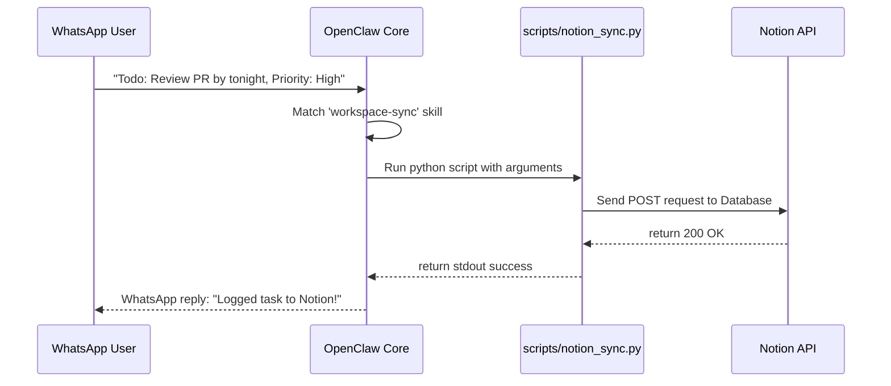

*Autonomous AI Agents & Frameworks Series: &larr; [The Self-Hosted AI Butler: Modular Assistance with OpenClaw](/blog/openclaw-self-hosted-ai-butler/) (Previous) | [LangChain vs. LangGraph: Moving from Chains to Cyclic State Graphs](/blog/langchain-vs-langgraph-cyclic-state-graphs/) (Next) &rarr;*

### Prior Reading Material
Before exploring gateway integrations and automated backend workflows, ensure you have configured your local OpenClaw workspace:
*   [The Self-Hosted AI Butler: Modular Assistance with OpenClaw](/blog/openclaw-self-hosted-ai-butler/) — Detailed guide on global installation, initializing configuration parameters, and configuring basic skills.
*   [Nous Research's Hermes Agent: Under the Hood](/blog/hermes-agent-self-improving-systems/) — Deep-dive into sandboxed compilation, persistent skill stores, and self-correcting code generation loops.
*   [The Landscape of Agentic AI: From Single-Agent Scripts to Multi-Agent Networks](/blog/landscape-of-agentic-ai/) — Analyzing the ReAct pattern, context windows, and multi-agent coordination graphs.

---

In our previous post, we walked through setting up **[OpenClaw](https://github.com/openclaw/openclaw)** as a self-hosted AI Butler running in the background of your local workstation. While interacting via a local shell or terminal-bound API is functional, the true power of a personal assistant lies in connecting it to your daily communication channels.

WhatsApp is the most widely used messaging platform, making it the ideal interface for triggering local scripts, capturing tasks, and logging notes on-the-fly. 

In this fourth part of the **Autonomous AI Agents & Frameworks Series**, we'll walk step-by-step through configuring OpenClaw's WhatsApp gateway, authenticating a secure local session, and building a custom skill that automatically syncs chat tasks to a Notion database.

---

### Step 1: Configuring the WhatsApp Gateway

OpenClaw's WhatsApp gateway uses the open-source **Baileys** library (a pure Node.js WhatsApp Web API wrapper) to establish a local connection, eliminating the need for an expensive Meta developer account or official business API credentials.

Open your main configuration file (located at `~/.openclaw/config.json`) and enable the WhatsApp gateway:

```json
{
  "llm": {
    "provider": "ollama",
    "model": "llama3",
    "baseUrl": "http://localhost:11434/v1"
  },
  "gateways": {
    "whatsapp": {
      "enabled": true,
      "sessionName": "butler-session",
      "allowedPhoneNumbers": ["15551234567"]
    }
  },
  "skillsDirectory": "~/.openclaw/workspace/skills"
}
```

> [!IMPORTANT]  
> **Security Checklist:** Always populate the `allowedPhoneNumbers` array with your specific country code and phone number (e.g. `"15551234567"`). If you leave this empty, anyone who discovers your bot's number can send execution triggers to your workstation.

---

### Step 2: Authenticating the Local Session

Start the OpenClaw service from your terminal:
```bash
openclaw start
```

Upon launching the WhatsApp gateway for the first time, OpenClaw will output a **QR Code** directly into your terminal console:

```
[OpenClaw] Initializing WhatsApp Gateway...
[OpenClaw] Generating QR Code. Please scan using WhatsApp Link Device:

 █▀▀▀▀▀█  ▄ █▄▄▄▄▀█ █▀▀▀▀▀█
 █ ███ █ ▀▀▀█ ▄▄▀▀  █ ███ █
 █ ▀▀▀ █ ▄▀█▄█▀█▄▀▄ █ ▀▀▀ █
 ▀▀▀▀▀▀▀ ▀ ▀ ▀ ▀ ▀▀ ▀▀▀▀▀▀▀
 
```

To link your bot:
1.  Open WhatsApp on your mobile device.
2.  Go to **Settings** -> **Linked Devices** -> **Link a Device**.
3.  Point your phone's camera at the QR code printed in your terminal.

Once scanned, the session credentials are saved locally to `~/.openclaw/auth/butler-session/`. The service will now log in automatically on future boot sequences without requiring a rescanning step.

---

### Step 3: Designing the Notion Sync Skill

Let's build a custom workflow skill. When you send a message to your bot on WhatsApp (e.g., *"Todo: Review the PR by tonight, Priority: High"*), the agent will match the intent, extract the task details, and run a Python script to write it to your Notion workspace database.



#### 1. Create the Skill Directory & Schema
Create a folder named `~/.openclaw/workspace/skills/workspace-sync/` and add the `SKILL.md` file:

```markdown
---
name: workspace-sync
description: Extracts tasks from a prompt and syncs them directly to a Notion database.
---
# Task Instructions
When the user prefix is 'Todo:' or they ask to add a task, note, or item to their database/workspace:
1. Extract the Task Name (the text following 'Todo:') and the Priority (default to 'Medium' if not specified).
2. Execute the python sync script using the local terminal `exec` tool:
   `python scripts/notion_sync.py --task "[task_name]" --priority "[priority]"`
3. Reply to the user on WhatsApp confirming the task has been synchronized.
```

#### 2. Write the Notion API Integration Script
Create the helper script at `scripts/notion_sync.py` to handle the API calls. Ensure you have the `requests` library installed:

```python
# scripts/notion_sync.py
import argparse
import requests
import os

NOTION_TOKEN = "your-notion-integration-token-here"
DATABASE_ID = "your-notion-database-id-here"

def add_notion_task(task_name: str, priority: str):
    url = "https://api.notion.com/v1/pages"
    headers = {
        "Authorization": f"Bearer {NOTION_TOKEN}",
        "Content-Type": "application/json",
        "Notion-Version": "2022-06-28"
    }
    
    payload = {
        "parent": { "database_id": DATABASE_ID },
        "properties": {
            "Name": {
                "title": [
                    { "text": { "content": task_name } }
                ]
            },
            "Priority": {
                "select": { "name": priority }
            }
        }
    }
    
    res = requests.post(url, json=payload, headers=headers)
    if res.status_code == 200:
        print(f"Success: Synced '{task_name}' (Priority: {priority}) to Notion.")
    else:
        print(f"Error: Failed to sync to Notion. Status Code: {res.status_code}, Detail: {res.text}")

if __name__ == "__main__":
    parser = argparse.ArgumentParser()
    parser.add_argument("--task", required=True)
    parser.add_argument("--priority", default="Medium")
    args = parser.parse_args()
    
    add_notion_task(args.task, args.priority)
```

---

### Step 4: Testing the Workflow

With `openclaw start` running, send a message to your linked number on WhatsApp:

> **User:** *Todo: Write CI/CD pipeline verification checks, Priority: High*

The OpenClaw daemon logs the event:
```text
[Gateway] Received WhatsApp message from 15551234567: "Todo: Write CI/CD..."
[ClawHub] Prompt matched to skill 'workspace-sync'
[Executor] Executing: python scripts/notion_sync.py --task "Write CI/CD pipeline verification checks" --priority "High"
[Executor] Success: Synced 'Write CI/CD...' (Priority: High) to Notion.
[Gateway] Sent WhatsApp reply: "Successfully synced task to Notion!"
```

Check your Notion workspace, and you will see the new row added to your task database with its priority selector populated!

---

### Key Takeaways for Developers

*   **Gateway Isolation**: Running Node.js gateways (like Baileys for WhatsApp) localizes your credentials. Your session keys are stored locally, not on external cloud platform databases.
*   **Prompt Sanitization**: Ensure your `SKILL.md` instruction block escapes user strings inside execution parameters. This prevents prompt injection attacks where a user could append shell characters (e.g. `; rm -rf ~`) to hijack the `exec` tool.
*   **Health and Fallbacks**: If the Notion API is down, configure your Python script to cache tasks in a local SQLite file and synchronize them once connectivity is restored.

---

### What's Next?

Connecting local assistant engines to channels like WhatsApp gives you a powerful execution interface. However, OpenClaw workflows are strictly sequential. If a task requires complex graph routing—such as compiling code, running tests, catching errors, correcting them, and looping back—a simple linear chain falls short.

In our next post, **[LangChain vs. LangGraph: Moving from Chains to Cyclic State Graphs](/blog/langchain-vs-langgraph-cyclic-state-graphs/)**, we'll dive into the limits of sequential chains and map how LangGraph represents agents as stateful graphs!
