*AI Inference Deep-Dive Series: &larr; [The Landscape of LLM Inference Engines: Open Source vs. Enterprise](/blog/inference-engines-landscape/) (Previous) | [Token Economics, LLM Gateways, and Router9](/blog/token-economics-llm-gateways-router9/) (Next) &rarr;*

### Prior Reading Material
Before diving into serving optimizations, ensure you understand the mechanics of KV caching and basic inference phases:
*   [The Landscape of LLM Inference Engines: Open Source vs. Enterprise](/blog/inference-engines-landscape/) — A comparison of vLLM, TensorRT-LLM, TGI, SGLang, and llama.cpp.
*   [Understanding the KV Cache: The VRAM Bottleneck of LLM Serving](/blog/understanding-kv-cache/) — Formulating VRAM limits, memory requirements per token, and context length bottlenecks.
*   [The Two Pillars of LLM Inference: Prefill vs. Decode](/blog/prefill-vs-decode/) — Demystifying compute-bound prefill vs. memory-bandwidth-bound decode phases.

---

In local and cloud LLM serving, performance is governed by two main metrics: **Time to First Token (TTFT)** and **Inter-Token Latency (ITL)**. 
- TTFT is dominated by the **prefill** phase, which processes the input prompt and is compute-bound.
- ITL is dominated by the **decode** phase, which generates tokens one-by-one and is memory-bandwidth-bound.

Optimizing an inference engine requires addressing these distinct bottlenecks. In this fifth post of the **AI Inference Deep-Dive Series**, we'll analyze the technical implementations of key optimizations: **FlashAttention** and **chunked prefill** for the prefill phase, alongside **speculative decoding** and **KV cache compression** for the decode phase.

---

### Phase 1: Prefill Optimizations (Improving TTFT)

#### 1. FlashAttention: IO-Aware Attention

In standard attention, calculating query-key-value ($Q, K, V$) matrices requires writing intermediate attention weights ($S, P$) to high-bandwidth global memory (HBM), and reading them back for the final output. As context length grows, this creates a memory read/write bottleneck.

**[FlashAttention](https://github.com/Dao-AILab/flash-attention)** resolves this by partitioning input matrices into blocks and loading them into fast GPU SRAM. Using online softmax scaling, it calculates attention incrementally without storing the massive intermediate attention matrices in HBM:

```mermaid
graph TD
    subgraph Standard [Standard Attention: Massive HBM I/O Overhead]
        direction LR
        S_HBM_In[HBM: Q, K, V] --> S_Reg1[GPU Register]
        S_Reg1 --> S_HBM_Mid["HBM: Attention Weights (S, P)"]
        S_HBM_Mid --> S_Reg2[GPU Register]
        S_Reg2 --> S_HBM_Out[HBM: Output]
    end

    subgraph Flash [FlashAttention: In-SRAM Tiling & Softmax]
        direction LR
        F_HBM_In[HBM: Q, K, V] --> F_SRAM[GPU SRAM]
        F_SRAM --> F_HBM_Out[HBM: Output]
    end

    style Standard fill:#20181e,stroke:#ff5353,stroke-width:1px
    style Flash fill:#10221e,stroke:#00f2fe,stroke-width:1px
    style S_HBM_Mid fill:#381d22,stroke:#ff5353,stroke-dasharray: 3 3
    style F_SRAM fill:#14322c,stroke:#00f2fe,stroke-width:1px
```



By avoiding HBM roundtrips, FlashAttention speeds up attention computations by 2x to 4x while remaining mathematically exact.

#### 2. Chunked Prefill

During high-concurrency serving, incoming requests with long prompts block ongoing decode loops. This is because a large prefill takes a long time on the GPU, creating a "prefill bubble" that stalls token generation for other users.

**Chunked Prefill** solves this by dividing long prompts into smaller chunks (e.g. 512 tokens). Instead of executing a single 4096-token prefill, the engine processes one chunk, runs a round of decode steps for active requests, processes the next chunk, and repeats. This evens out inter-token latency and prevents user requests from stalling.

---

### Phase 2: Decode Optimizations (Improving ITL & Throughput)

#### 1. Speculative Decoding

Because the decode phase is memory-bound, the GPU spends most of its time loading the model's weights from HBM to SRAM for every single token generated.

**Speculative Decoding** bypasses this by pairing a large target model (e.g. Llama-3-70B) with a much smaller draft model (e.g. Llama-3-8B).
1.  The draft model rapidly generates a sequence of $K$ candidate tokens (cheap memory reads).
2.  The target model processes all $K$ tokens in parallel in a **single forward pass** (which is compute-bound, utilizing GPU cores efficiently).
3.  The target model accepts or rejects the candidate tokens based on logit verification.

If 4 out of 5 candidate tokens are accepted, the engine gets 4 tokens for the memory-access cost of a single target-model forward pass, speeding up serving by 1.5x to 2.5x.

#### 2. KV Cache Compression & Eviction

Maintaining KV caches for thousands of tokens consumes substantial VRAM, limiting batch sizes.
- **H2O (Heavy Hitter Oracle)**: Keeps only the most important tokens in cache by tracking which tokens receive the highest attention scores.
- **StreamingLLM**: Keeps only "attention sinks" (the first few tokens) and the most recent tokens, discarding intermediate ones. This allows models to run on infinite text streams with a fixed-size cache memory footprint.

---

### Summary of Optimization Techniques

| Optimization | Targeted Phase | Primary Bottleneck | Performance Metric Impact |
| :--- | :--- | :--- | :--- |
| **FlashAttention** | Prefill | Memory Bandwidth (HBM IO) | Lower TTFT, better scaling at long context |
| **Chunked Prefill** | Prefill | Scheduling Bubble / Compute Stalls | Lower Inter-Token Latency (ITL) variance |
| **Speculative Decoding** | Decode | Memory Bandwidth (Weight loading) | Up to 2.5x faster Generation Speed (ITL) |
| **KV Cache Compression** | Decode | VRAM Capacity (VRAM Bloat) | Higher Max Batch Size, higher overall throughput |

---

### Hands-On: Speculative Decoding Simulator

To understand the validation mechanism of speculative decoding, we can inspect a script that simulates candidate generation and target verification. Let's look at `scripts/speculative_decoding_simulator.py`.

Run this simulator locally to see how draft sequences are evaluated:
```bash
python scripts/speculative_decoding_simulator.py
```

Here is the source code of the simulator:

```python
# scripts/speculative_decoding_simulator.py
import random

def simulate_speculative_decoding():
    # Vocabulary mapping
    vocab = ["the", "quick", "brown", "fox", "jumps", "over", "lazy", "dog"]
    
    # Draft model candidate generation (fast, but prone to errors)
    draft_tokens = ["the", "quick", "red", "fox", "leaps"]
    
    # Target model validation distribution (ground-truth probabilities)
    # The target model accepts a token if our simulation random-draw passes
    target_acceptance_probabilities = {
        "the": 0.99,
        "quick": 0.95,
        "red": 0.05,  # Target prefers "brown"
        "fox": 0.90,
        "leaps": 0.10 # Target prefers "jumps"
    }
    
    accepted_tokens = []
    rejected_at = None
    
    print("=== STARTING SPECULATIVE DECODING VALIDATION ===")
    print(f"Draft Model Candidates: {draft_tokens}")
    
    for i, token in enumerate(draft_tokens):
        prob = target_acceptance_probabilities.get(token, 0.0)
        # Target model check
        if random.random() < prob:
            accepted_tokens.append(token)
            print(f"✅ Token '{token}' accepted (Prob: {prob:.2f})")
        else:
            rejected_at = i
            print(f"❌ Token '{token}' REJECTED (Prob: {prob:.2f})")
            # Target model generates its own correction token
            corrected_token = "brown" if token == "red" else "jumps"
            accepted_tokens.append(corrected_token)
            print(f"🔧 Target model corrected token to: '{corrected_token}'")
            break
            
    print("\n--- PERFORMANCE SUMMARY ---")
    draft_count = len(draft_tokens)
    accepted_count = len(accepted_tokens) - 1 if rejected_at is not None else len(accepted_tokens)
    
    print(f"Total draft tokens evaluated: {draft_count}")
    print(f"Tokens accepted before rejection: {accepted_count}")
    print(f"Final validated sequence: {' '.join(accepted_tokens)}")
    print("=================================================")

if __name__ == "__main__":
    simulate_speculative_decoding()
```

If the draft model proposes a wrong token (e.g. `red` instead of `brown`), the target model rejects it, appends the correct token, and halts validation of subsequent tokens. The remaining tokens in the draft sequence are discarded, and draft generation restarts from the correction token.

---

### What's Next?

Optimizing prefill and decode speeds is essential for single-instance engines, but when dealing with thousands of users, managing scaling across multiple nodes requires robust orchestration. How do we calculate cost-per-token efficiency, compare pay-as-you-go APIs with flat-rate token plans, and configure local-to-cloud gateways?

In our next post, **[Token Economics, LLM Gateways, and Router9](/blog/token-economics-llm-gateways-router9/)**, we'll dive into cost calculations, token economics, and setting up gateways for local-to-cloud fallback!
