*AI Inference Deep-Dive Series: &larr; [Inference Optimizations: Speeding up Prefill and Decode](/blog/inference-optimizations-prefill-decode/) (Previous) | Part 6*

### Prior Reading Material
Before exploring routing architecture and cost optimization, we recommend reviewing the performance tuning and resource scaling steps in this series:
*   [Inference Optimizations: Speeding up Prefill and Decode](/blog/inference-optimizations-prefill-decode/) — Demystifying FlashAttention, chunked prefill, speculative decoding, and cache eviction.
*   [Understanding the KV Cache: The VRAM Bottleneck of LLM Serving](/blog/understanding-kv-cache/) — Deep-dive into calculating VRAM footprints and context capacity formulas.
*   [The Landscape of LLM Inference Engines: Open Source vs. Enterprise](/blog/inference-engines-landscape/) — Reviewing the production tools for local vs. enterprise LLM serving.

---

In enterprise AI deployment, scaling is not just a compute problem; it is a financial one. As application usage grows, token costs accumulate rapidly. Developers must navigate a complex economic matrix: **Token Economics**.

To manage these costs while meeting latency and uptime SLAs, modern architectures place a proxy layer between the client applications and the LLM providers. This is the **LLM Gateway**.

In this sixth part of the **AI Inference Deep-Dive Series**, we'll detail the economics of token serving, explore the layout of open-source gateways, and inspect the routing patterns of smart token brokers like **Router9**.

---

### The FinOps of Token Economics

When calculating the cost of running LLM features, developers must evaluate three cost elements:

1.  **Prefill (Input) Token Cost**: Processing input prompts is compute-bound. Providers typically charge a baseline rate per million input tokens (e.g. $3.00/M tokens).
2.  **Decode (Output) Token Cost**: Because generating output tokens is memory-bound and executed sequentially, output tokens are significantly more expensive to serve, typically costing 3x to 4x more than input tokens (e.g. $15.00/M tokens).
3.  **Prompt Caching Discounts**: Many API providers offer discounts (up to 50%) for tokens that match pre-cached context windows (like system instructions or large document contexts), making prompt design critical for cost optimization.

#### The Cost Formula

The total cost ($C$) for a given set of requests can be formulated as:

$$C = (T_{input\_raw} \times R_{input}) + (T_{input\_cached} \times R_{cached}) + (T_{output} \times R_{output})$$

Where:
- $T$ represents the token count.
- $R$ represents the rate per token.

---

### Implementing the Gateway Pattern

An **LLM Gateway** (such as the open-source **[LiteLLM](https://github.com/BerriAI/litellm)** framework) acts as a reverse proxy. Instead of coding vendor-specific SDK integrations for every model, applications send standard OpenAI-compatible JSON payloads to the gateway.

```mermaid
graph TD
    Client[Client App] --> Gateway[LLM Gateway: LiteLLM]
    Gateway --> Fallback{Health Check / Rate Limit?}
    Fallback -- Healthy (Local) --> Ollama[Local: Ollama / vLLM]
    Fallback -- Failover / Rate Limited --> Cloud[Cloud: Anthropic / OpenAI]
    
    style Gateway fill:#1a3d3c,stroke:#00f2fe,stroke-width:2px;
    style Fallback fill:#2a1f3d,stroke:#a15eff,stroke-width:2px;
```



#### Gateway Benefits
*   **Unified Interface**: Standardizes the API request/response formats.
*   **Failover & Retries**: Automatically routes requests to a backup provider if the primary endpoint throws a 503 error or hits a rate limit.
*   **Load Balancing**: Distributes token generation workloads across multiple local GPU nodes.

---

### Intelligent Routing with Router9

While gateways handle basic load balancing, an intelligent router like **Router9** optimizes for cost vs. capability. 

Not all user queries require a frontier model (like Claude 3.5 Sonnet). A classification task can be solved by a 8B local model, while a complex mathematical optimization requires a larger model. Router9 evaluates incoming prompts and routes them dynamically:

1.  **Complexity Classifier**: Runs a fast, low-cost classifier (e.g. a small BERT model or regex heuristic) to score prompt difficulty.
2.  **SLA Monitor**: Checks current latency trends across endpoints.
3.  **Router Node**: Sends the request to the cheapest model that satisfies both the capability threshold and the latency SLA.

---

### Hands-On: Building an LLM Gateway Router

Let's write a python script that simulates an intelligent LLM gateway router. The script receives query prompts, categorizes their complexity, checks the cost-per-token of available models, and routes the request to the most cost-effective endpoint.

Execute this simulation script in your workspace using the command:
```bash
python scripts/llm_gateway_router.py
```

Here is the source code of the simulator:

```python
# scripts/llm_gateway_router.py
import json

class LLMGatewayRouter:
    def __init__(self):
        # Model registry with costs per 1M tokens (USD) and capabilities
        self.models = {
            "local-llama-8b": {
                "input_cost_per_m": 0.0,    # Self-hosted local run
                "output_cost_per_m": 0.0,
                "complexity_threshold": 4,  # Can handle simple tasks
                "latency_sec": 0.5
            },
            "cloud-mid-model": {
                "input_cost_per_m": 0.75,
                "output_cost_per_m": 3.00,
                "complexity_threshold": 7,  # Handles medium reasoning
                "latency_sec": 1.2
            },
            "cloud-frontier-model": {
                "input_cost_per_m": 3.00,
                "output_cost_per_m": 15.00,
                "complexity_threshold": 10, # Handles complex tasks
                "latency_sec": 2.0
            }
        }

    def classify_complexity(self, prompt: str) -> int:
        # Heuristic classifier simulating a router's entry classifier
        prompt_lower = prompt.lower()
        if "optimize" in prompt_lower or "architect" in prompt_lower or "debug" in prompt_lower:
            return 9  # High complexity
        elif "summarize" in prompt_lower or "format" in prompt_lower or "classify" in prompt_lower:
            return 3  # Low complexity
        else:
            return 6  # Medium complexity

    def calculate_estimated_cost(self, model_name: str, input_tokens: int, output_tokens: int) -> float:
        meta = self.models[model_name]
        in_cost = (input_tokens / 1_000_000) * meta["input_cost_per_m"]
        out_cost = (output_tokens / 1_000_000) * meta["output_cost_per_m"]
        return in_cost + out_cost

    def route_request(self, prompt: str, input_tokens: int, expected_output_tokens: int) -> dict:
        complexity = self.classify_complexity(prompt)
        selected_model = None
        
        # Route to the cheapest model that meets complexity needs
        sorted_models = sorted(self.models.items(), key=lambda x: x[1]["output_cost_per_m"])
        for name, meta in sorted_models:
            if meta["complexity_threshold"] >= complexity:
                selected_model = name
                break
                
        # Default fallback to frontier
        if not selected_model:
            selected_model = "cloud-frontier-model"
            
        cost = self.calculate_estimated_cost(selected_model, input_tokens, expected_output_tokens)
        
        return {
            "prompt": prompt,
            "routed_model": selected_model,
            "complexity_score": complexity,
            "estimated_cost_usd": round(cost, 6),
            "expected_latency_sec": self.models[selected_model]["latency_sec"]
        }

def main():
    router = LLMGatewayRouter()
    
    prompts = [
        ("Summarize this article and format it as a JSON block", 1500, 300),
        ("Write a script to parse data and output the result", 800, 400),
        ("Debug this complex memory leak and optimize the C++ pointer allocations", 3000, 1000)
    ]
    
    print("=== STARTING GATEWAY ROUTER SIMULATION ===")
    for prompt, in_tokens, out_tokens in prompts:
        decision = router.route_request(prompt, in_tokens, out_tokens)
        print(f"\nPrompt: '{decision['prompt']}'")
        print(f"  ├─ Complexity Score: {decision['complexity_score']}/10")
        print(f"  ├─ Routed Model:     {decision['routed_model']}")
        print(f"  ├─ Expected Latency: {decision['expected_latency_sec']}s")
        print(f"  └─ Estimated Cost:   ${decision['estimated_cost_usd']:.6f} USD")
    print("\n==========================================")

if __name__ == "__main__":
    main()
```

If you run the router simulator, it selects the local model for the simple summary task (costing $0.00), the mid-tier model for the script writing task, and escalates to the cloud frontier model only for the complex memory leak debug task, demonstrating the immediate financial savings of intelligent query classification.

---

### FinOps Checklist for Production Scaling

If you are planning to roll out LLM features to production, implement this gateway configuration checklist:

1.  **Set Up Local Fallback**: Use gateways to route simple, repeatable queries to local servers running **vLLM** or **Ollama** first, saving cloud token budgets.
2.  **Enable Prompt Caching**: Ensure your gateway forwards matching cache headers to support prompt caching on supported providers.
3.  **Active Rate Limit Tracking**: Configure token buckets in your gateway to automatically throttle users who exceed rate limits before they exhaust downstream API quotas.

---

### What's Next?

Optimizing the costs of single LLM queries is the baseline. But as agentic networks grow, we shift from single-model calls to networks of cooperative nodes that interact, check each other's work, and run in loops. How do standard linear chains fail in these graph-based workflows?

In our next post, **[LangChain vs. LangGraph: Moving from Chains to Cyclic State Graphs](/blog/langchain-vs-langgraph-cyclic-state-graphs/)**, we'll dive into the limitations of sequential chains and map how LangGraph represents agents as stateful graphs!
