*Series: &larr; [Token Economics, LLM Gateways, and Router9](/blog/token-economics-llm-gateways-router9/) (Previous) | [vLLM vs. llama.cpp: Which is the Real Production King?](/blog/vllm-vs-llamacpp-production-comparison/) (Next) &rarr;*

### Prior Reading Material
Before exploring multimodal routing and MoE architectures, we recommend reading our foundational guides on weights, taxonomy, and local serving engines:
*   [The Landscape of LLM Inference Engines: Open Source vs. Enterprise](/blog/inference-engines-landscape/) — Under the hood of engines like vLLM, llama.cpp, SGLang, and TGI.
*   [The Model Taxonomy: LLMs, Vision Models, VLAs, and Diffusion](/blog/model-taxonomy/) — Categorizing and understanding symbol interpretation across different model modalities.
*   [Training vs. Inference Lifecycle: A Developer's Guide to Weights, Backpropagation, and Serving](/blog/training-vs-inference-lifecycle/) — Tracing the journey of weights from stateful training to stateless serving.
*   [Basics of AI Inference](/blog/basics-of-ai-inference/) — Understanding prompt compilation, prefill, and decode phases.

---

In July 2026, **[Thinking Machines Lab](https://thinkingmachines.ai)** (founded by former OpenAI CTO Mira Murati) shook up the developer ecosystem by releasing **Inkling**—a massive, open-weights multimodal model under the Apache-2.0 license. 

Unlike typical frontier models that target raw benchmark supremacy in a closed-API sandbox, Inkling is designed from the ground up to be a robust, highly adaptable base model. It is tailored for developers who want to perform domain-specific adaptation, custom fine-tuning, and offline local deployment.

In this deep dive, we will analyze the technical architecture of Inkling, breaking down its Mixture-of-Experts (MoE) parameters, multimodal encoding layers, and local serving footprints.

---

### Inkling at a Glance: Key Specifications

Inkling stands out due to its scale and open-weights availability on platforms like **[Hugging Face](https://huggingface.co)**. Let's compare its basic parameters with other leading models in the ecosystem:

| Specification | Thinking Machines' Inkling | Llama-3-70B | Mixtral 8x22B |
| :--- | :--- | :--- | :--- |
| **Release Date** | July 2026 | April 2024 | April 2024 |
| **Total Parameters** | **975 Billion** | 70 Billion | 141 Billion |
| **Active Parameters** | **41 Billion** | 70 Billion | 39 Billion |
| **Context Window** | **1,000,000 tokens** | 8,192 tokens | 65,536 tokens |
| **Modalities** | Text, Image, Audio (In) $\rightarrow$ Text (Out) | Text (In) $\rightarrow$ Text (Out) | Text (In) $\rightarrow$ Text (Out) |
| **License** | **Apache-2.0** | Llama 3 License | Apache-2.0 |

Inkling was pretrained on a massive **45 trillion tokens** of text, image, audio, and video data, allowing it to natively represent and interpret multi-sensory contexts.

---

### Mixture-of-Experts (MoE) Architecture & Parameter Routing

Although Inkling boasts **975 billion total parameters**, it only activates **41 billion parameters** per token. This is accomplished via a sparse **Mixture-of-Experts (MoE)** routing topology. 

#### Active vs. Total Parameters
In a standard dense transformer (like Llama-3-70B), every single input token is processed by every weight in the network. In a sparse MoE model, the Feed-Forward Network (FFN) layers are replaced by multiple independent "experts." A small gating network (router) evaluates each token and routes it to the top-2 or top-4 experts that are best suited to handle its semantic context.

Here is how the token routing path operates sequentially within the Inkling MoE FFN layer:

```mermaid
graph LR
    subgraph Token Routing [Token Routing and Expert Activation]
        T_In[Input Token] --> G_Router[Gating Router]
        G_Router -->|Top-K Selection| E_Active[Active Experts: 41B params]
        G_Router -.->|Unused| E_Inactive[Inactive Experts: 934B params]
        E_Active --> O_Concat[Concat & Weighted Output]
    end

    style Token Routing fill:#13111c,stroke:#a15eff,stroke-width:1px
    style E_Active fill:#1a3028,stroke:#00f2fe,stroke-width:1px
    style E_Inactive fill:#261b20,stroke:#ff5353,stroke-width:1px,stroke-dasharray: 3 3
```



Because only a fraction of the experts are activated (41B active parameters), the compute cost per token (FLOPs) remains comparable to a medium-sized model, while the total model capacity (975B parameters) allows it to retain a vast repository of structured domain knowledge.

---

### Multimodal Alignment: Native Image and Audio Processing

Unlike pipeline architectures that stack separate speech-to-text or vision-encoding models, Inkling is a native **multimodal model**. It processes text, image, and audio inputs through shared embedding spaces.

*   **Vision Encoding**: Inkling processes visual inputs via a high-resolution ViT (Vision Transformer) encoder. Images are divided into $14\times14$ pixel patches, flattened, and projected into the transformer's latent space alongside text embeddings.
*   **Audio Encoding**: Audio signals are converted into log-mel spectrograms and processed through a convolutional front-end, aligning raw audio waveforms with tokenized sequences.

This unified representation space enables the model to perform low-latency tasks like audio-visual question answering without intermediate conversion delays.

---

### Serving Inkling Locally & Cloud Integrations

Serving a 975B parameter model—even an MoE model with 41B active parameters—poses a severe VRAM memory capacity challenge. Although compute is cheap, the entire 975B parameters must be loaded into memory to support real-time expert routing.

#### 1. Hardware Footprint
To serve Inkling in FP16 precision, you need approximately **1.95 Terabytes of VRAM**. In a quantized FP8 format, this requirement drops to **975 Gigabytes**, which can be distributed across:
*   A cluster of $8\times$ NVIDIA H100 (80GB VRAM each) using Tensor Parallelism.
*   Decentralized inference networks like **[Modal](https://modal.com)** or **[OpenRouter](https://openrouter.ai)**.
*   Unified enterprise platforms like **[NVIDIA NIM](https://www.nvidia.com/en-us/ai-data-science/generative-ai/nim/)** with optimized KV-cache and Expert-Offloading patterns.

#### 2. Hands-On: Expert Weight Routing Simulator
To visualize how the MoE routing mechanism dynamically selects experts based on input tokens, we can run a local Python script simulating a top-2 gating router. Let's look at `scripts/moe_routing_simulator.py`.

Save this script locally to simulate routing across 8 conceptual domain experts:

```python
# scripts/moe_routing_simulator.py
import random

def simulate_moe_routing():
    # List of 8 available domain experts in our FFN layer
    experts = [
        "Code Expert", "Math Expert", "Creative Writer", "Vision Analyzer",
        "Audio Transcriber", "System Architect", "Translator", "General Assistant"
    ]
    
    # Simple input prompts to test routing
    prompts = [
        ("Write a fast sorting function in Rust.", ["Code Expert", "System Architect"]),
        ("Calculate the derivative of x^2 + 5x.", ["Math Expert", "General Assistant"]),
        ("Analyze the audio waveform features.", ["Audio Transcriber", "System Architect"]),
    ]
    
    print("=== STARTING INKLING MoE ROUTER SIMULATOR ===")
    
    for i, (prompt, target_experts) in enumerate(prompts, 1):
        print(f"\n[Token Sequence {i}]: \"{prompt}\"")
        
        # Calculate routing probabilities (adding minor random noise for simulation)
        routed = []
        for exp in experts:
            base_prob = 0.85 if exp in target_experts else 0.05
            prob = min(1.0, max(0.0, base_prob + random.uniform(-0.02, 0.02)))
            routed.append((exp, prob))
        
        # Sort experts by router probability score
        routed.sort(key=lambda x: x[1], reverse=True)
        
        # Select top-2 active experts for execution
        top_2 = routed[:2]
        inactive = routed[2:]
        
        print("🚦 Gating Router Probabilities:")
        for exp, p in top_2:
            print(f"  🟢 Active: {exp:<20} (Routing Score: {p:.2f})")
        for exp, p in inactive[:2]:
            print(f"  🔴 Inactive: {exp:<20} (Routing Score: {p:.2f})")
            
    print("\n=============================================")

if __name__ == "__main__":
    simulate_moe_routing()
```

If you run this simulator, you can verify how the gating router dynamically filters out irrelevant weights, directing token inputs to the most computationally-efficient pathways.

---

### What's Next?

Inkling represents a major milestone in open-source AI, proving that massive multimodal capabilities can be distributed outside closed API gates. But how does this scale compare to lightweight engines running on local edge hardware? 

In our next post, **[vLLM vs. llama.cpp: Which is the Real Production King?](/blog/vllm-vs-llamacpp-production-comparison/)**, we will shift from massive cloud scale to localized serving, comparing the memory footprints and hardware constraints of running LLMs directly on local Macbooks and edge workstations!
