*Autonomous AI Agents & Frameworks Series: &larr; [OpenClaw in Action: Connecting WhatsApp to Automated Workflows](/blog/openclaw-whatsapp-workflows/) (Previous) | Part 5*

### Prior Reading Material
Before diving into graph-based agent orchestration, we recommend reviewing the foundational posts on local agents and loop mechanics:
*   [OpenClaw in Action: Connecting WhatsApp to Automated Workflows](/blog/openclaw-whatsapp-workflows/) — Configuring WhatsApp gateway sessions and building custom Notion sync automation skills.
*   [The Self-Hosted AI Butler: Modular Assistance with OpenClaw](/blog/openclaw-self-hosted-ai-butler/) — Setting up local OpenClaw pipelines and registering custom skills.
*   [Nous Research's Hermes Agent: Under the Hood](/blog/hermes-agent-self-improving-systems/) — Understanding sandboxed testing and skill-compilation loops.
*   [The Landscape of Agentic AI: From Single-Agent Scripts to Multi-Agent Networks](/blog/landscape-of-agentic-ai/) — Reviewing the ReAct loop, context decay, and multi-agent coordination graph topologies.

---

In the early stages of building LLM applications, developers typically start with linear pipelines: take a user query, fetch documents from a database, construct a prompt, feed it to a model, and return the result. These sequential pipelines are easily modeled using standard chains (like **[LangChain](https://www.langchain.com/)** and its LangChain Expression Language / LCEL).

However, linear chains break when tasks require **decision-making and loops**. For example, if we want an agent to write code, execute a test suite, inspect errors, correct the code, and loop back to testing until the code passes, a linear pipeline cannot handle this flow.

To solve this, developers are shifting to **[LangGraph](https://langchain-ai.github.io/langgraph/)**, a framework designed to model agentic workflows as stateful, cyclic graphs.

In this fourth part of the **Autonomous AI Agents & Frameworks Series**, we'll analyze why sequential chains fail at complex tasks, contrast their architectures, and walk through a Python simulation of a cyclic state graph.

---

### Why Sequential Chains Fail

A standard chain is a **Directed Acyclic Graph (DAG)**. It executes nodes sequentially and flows in one direction:

```
[User Query] ──► [Retrieve Documents] ──► [Format Prompt] ──► [LLM Inference] ──► [Output]
```

This model is insufficient for agentic loops because:
1.  **No Support for Cycles**: Standard chains cannot loop back to a previous node based on an LLM output (e.g., rewriting code after a failed test).
2.  **No Native State Management**: A chain executes nodes as independent functions. Passing conversational history, intermediate variables, and tool outputs requires custom scaffolding.
3.  **Hard to Resume/Inspect**: In multi-step runs, inspecting the intermediate state or pausing the execution to wait for human approval (Human-in-the-loop) is difficult to implement.

---

### LangGraph: State Machines for LLMs

LangGraph models agent loops as **State Machines**. It is defined by three core elements:

1.  **State Schema**: A persistent, shared data structure (often a typed dictionary) that is passed to every node in the graph. As nodes execute, they return updates to this state.
2.  **Nodes**: Python functions that receive the current state, perform a computation (e.g., calling an LLM or running a local tool), and return state updates.
3.  **Edges**: Define how control flows between nodes.
    *   *Normal Edges*: Direct transition from Node A to Node B.
    *   *Conditional Edges*: Evaluate the current state (often utilizing an LLM decision) and route control to different nodes dynamically.

```mermaid
graph TD
    Start([Start]) --> Code[Node: Code Generator]
    Code --> Test[Node: Test Suite]
    Test --> Verify{Conditional Edge: Pass?}
    Verify -- Yes --> End([Finish])
    Verify -- No (Error) --> Code
    
    style Code fill:#1a3d3c,stroke:#00f2fe,stroke-width:2px;
    style Test fill:#2a1f3d,stroke:#a15eff,stroke-width:2px;
    style Verify fill:#1d2b3a,stroke:#3b82f6,stroke-width:2px;
```



---

### Architectural Comparison: LangChain vs. LangGraph

| Architectural Element | LangChain Chains | LangGraph Graphs |
| :--- | :--- | :--- |
| **Topology** | Directed Acyclic Graph (DAG) | Stateful Cyclic Graph |
| **State Tracking** | Transformed per step, no global state | Shared, mutable State Schema |
| **Looping / Cycles** | Unsupported (requires custom loops) | Natively supported via cyclic edges |
| **Branching Mode** | Static conditional routers | Dynamic routing nodes & parallel execution |
| **Human-in-the-Loop** | Complex to configure | Native support (pause at node for user input) |

---

### Hands-On: Simulating a Cyclic State Graph

Let's write a python script that simulates a LangGraph state machine. The script defines a state schema, nodes for coding and testing, and a conditional edge that decides whether to finish or loop back to correct errors.

Run this simulator locally to see the state transitions:
```bash
python scripts/langgraph_simulator.py
```

Here is the source code of the simulator:

```python
# scripts/langgraph_simulator.py
import sys

# 1. State Schema Definition
class AgentState:
    def __init__(self, prompt: str):
        self.prompt = prompt
        self.generated_code = ""
        self.test_output = ""
        self.error_trace = ""
        self.attempts = 0
        self.finished = False

# 2. Node Functions
def code_generator_node(state: AgentState):
    state.attempts += 1
    print(f"\n[NODE] Code Generator (Attempt {state.attempts})")
    
    if state.attempts == 1:
        # Simulate generating code with a syntax error
        state.generated_code = "def add(a, b): return a + b +"
        print("  └─ Generated initial draft code (contains syntax error).")
    else:
        # Simulate generating corrected code
        state.generated_code = "def add(a, b): return a + b"
        print("  └─ Generated corrected draft code.")
    return state

def test_suite_node(state: AgentState):
    print("[NODE] Test Suite Running...")
    code = state.generated_code
    
    # Simple validation parser
    try:
        compile(code, "<string>", "exec")
        state.test_output = "PASS"
        state.error_trace = ""
        print("  └─ Syntax validation passed!")
    except SyntaxError as e:
        state.test_output = "FAIL"
        state.error_trace = str(e)
        print(f"  └─ Syntax validation failed: {e}")
        
    return state

# 3. Conditional Edge Routing
def route_after_test(state: AgentState) -> str:
    print("[EDGE] Evaluating test results...")
    if state.test_output == "PASS":
        print("  └─ Routing to: FINISH")
        return "finish"
    else:
        if state.attempts >= 3:
            print("  └─ Max attempts reached. Routing to: FINISH (Fail)")
            return "finish"
        print("  └─ Routing to: CODE_GENERATOR (Retry Loop)")
        return "retry"

# 4. Engine Coordinator Run Loop
def run_compiled_graph(initial_prompt: str):
    print("=== STARTING LANGGRAPH SIMULATOR ===")
    state = AgentState(initial_prompt)
    
    # Start node execution loop
    state = code_generator_node(state)
    
    while not state.finished:
        state = test_suite_node(state)
        next_step = route_after_test(state)
        
        if next_step == "finish":
            state.finished = True
        elif next_step == "retry":
            state = code_generator_node(state)
            
    print("\n--- FINAL RESULT ---")
    print(f"Status:   {state.test_output}")
    print(f"Attempts: {state.attempts}")
    print(f"Code:     {state.generated_code}")
    print("====================================")

if __name__ == "__main__":
    run_compiled_graph("Write a python add function")
```

If you run the simulator, you can watch the state schema updates. In Attempt 1, the code fails compilation, triggering the conditional edge to route back to the generator node. The generator inspects the error trace, submits the corrected code, passes the test suite, and completes the loop!

---

### Designing Enterprise Graphs

When structuring graphs for production agents, follow these guidelines:

*   **State Reduction**: Keep only the necessary variables in the state schema. Too much state information increases context size and degrades model performance.
*   **Edge Validation**: Conditional edges must handle unexpected model choices. Always implement default fallback routes if the classifier fails.
*   **Depth Thresholds**: Always specify a maximum recursion limit (e.g. max attempts) inside your routers to prevent infinite run loops when an agent cannot resolve a code bug.
