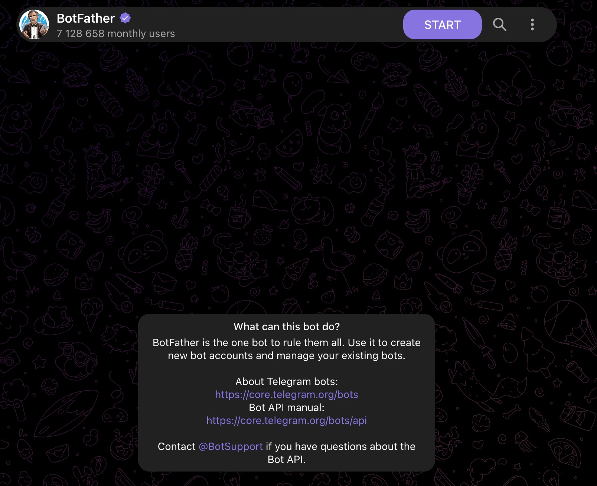

*Series: &larr; [LangChain vs. LangGraph: Moving from Chains to Cyclic State Graphs](/blog/langchain-vs-langgraph-cyclic-state-graphs/) (Previous)*

### Prior Reading Material
Before connecting messaging gateways, ensure you have set up the core OpenClaw repository and understand how skills and workflows are structured:
*   [LangChain vs. LangGraph: Moving from Chains to Cyclic State Graphs](/blog/langchain-vs-langgraph-cyclic-state-graphs/) — Deep-dive into cyclic states and agentic routing.
*   [OpenClaw in Action: Connecting WhatsApp to Automated Workflows](/blog/openclaw-whatsapp-workflows/) — Integrating WhatsApp sessions and logging automated Notion databases.
*   [The Self-Hosted AI Butler: Modular Assistance with OpenClaw](/blog/openclaw-self-hosted-ai-butler/) — Detailed guide on repository cloning, environment setups, and local LLM integrations.

---

Following a request from our LinkedIn community, we are zooming in on a specific, highly requested integration. While many advanced developers utilize WhatsApp sessions, connecting a local agent to **Telegram** remains the absolute gold standard for open-source AI projects. It provides a native, clean developer API (Bot Tokens) that doesn't require scanning browser QR codes or managing continuous web-session states.

This guide provides a beginner-friendly, step-by-step walkthrough to connect OpenClaw to Telegram. We will assume no prior knowledge and cover bot token creation via BotFather, configuration setups, allowed-list security filtering, and startup testing.

---

### Step 1: OpenClaw Core Prerequisites

Before configuring the gateway, make sure OpenClaw is installed and configured on your machine.
1.  **Clone & Install**: Ensure you have cloned the repository and installed the Python virtual environment as detailed in [The Self-Hosted AI Butler](/blog/openclaw-self-hosted-ai-butler/).
2.  **Verify local execution**: Make sure you can query the agent from the CLI:
    ```bash
    python main.py --query "hello"
    ```

If the agent responds successfully, you are ready to configure the Telegram gateway.

---

### Step 2: Creating a Telegram Bot via BotFather

Telegram makes bot creation incredibly simple through a built-in administrative account named **BotFather**.

1.  **Find BotFather**: Open Telegram, search for `@BotFather` (ensure it has the official blue checkmark), and click **Start**.
2.  **Request New Bot**: Send the command `/newbot`.
3.  **Name Your Bot**: 
    *   First, choose a friendly name (e.g. `My AI Butler`).
    *   Second, choose a unique username ending in `bot` (e.g. `naren_ai_butler_bot`).
4.  **Save the Token**: BotFather will reply with your API Access Token:
    ```text
    Use this token to access the HTTP API:
    123456789:ABCdefGhIJKlmNoPQRsTUVwxyZ
    Keep your token secure and store it safely...
    ```

    Here is what the conversation flow with BotFather looks like in Telegram:

    

---

### Step 3: Configuring the Gateway Settings

OpenClaw manages its connections through a centralized configuration file in your home directory (typically `~/.openclaw/config.json`, which resolves to `/Users/<username>/.openclaw/config.json` on macOS). 

To enable the Telegram gateway, open your `~/.openclaw/config.json` file and update the `gateway` block to match the structure below:

```json
{
  "gateway": "telegram",
  "telegram": {
    "bot_token": "123456789:ABCdefGhIJKlmNoPQRsTUVwxyZ",
    "allowed_chat_ids": [
      987654321
    ]
  }
}
```

#### Critical Security Rule: `allowed_chat_ids`
> [!CAUTION]
> Always restrict `allowed_chat_ids` to your specific user ID. If this array is left empty, *anyone* who finds your bot on Telegram can trigger shell commands, download files, or execute Python scripts on your host workstation!

*Tip: You can find your specific User/Chat ID by messaging `@userinfobot` on Telegram.*

---

### Step 4: Launching the Bot

Once configured, starting the bot is a single-line command:

```bash
python main.py --gateway telegram
```

The terminal log will output the connection status:
```text
========================================================
[OpenClaw] Initializing Telegram Gateway Connection...
[OpenClaw] Gateway Connected! Listening as @naren_ai_butler_bot
========================================================
```

---

### Step 5: Testing & Basic Commands

Open a chat with your newly created Telegram bot on your phone or desktop and send a test message:

*   `Task`: `/start` or `/help`
*   `Response`: "Hello! I am your local AI Butler. Let me know what tasks you need executed today."

From there, you can pass natural language instructions, and OpenClaw will automatically coordinate your registered FFN tools (such as Notion logging, file organization, or directory summary scripts).

---

### Hands-On: Gateway Router Tester

To test if your gateway configuration correctly filters message senders before passing queries to your local model, you can run a local test script simulating the routing logic. Let's look at `scripts/telegram_gateway_tester.py`.

Save this script locally to test the security filtering:

```python
# scripts/telegram_gateway_tester.py

class TelegramGateway:
    def __init__(self, bot_token, allowed_chat_ids):
        self.bot_token = bot_token
        self.allowed_chat_ids = allowed_chat_ids

    def process_message(self, sender_chat_id, text_content):
        # 1. Security Check: Filter incoming message sender
        if sender_chat_id not in self.allowed_chat_ids:
            return f"❌ Blocked: Unauthorized Chat ID {sender_chat_id}"
            
        # 2. Process query
        print(f"📡 Processing request from Chat ID {sender_chat_id}: \"{text_content}\"")
        return f"✅ Processing success: Bot response to \"{text_content}\""

def run_gateway_test():
    # Setup gateway with allowed Chat ID configurations
    config_token = "123456789:ABCdefGhIJKlmNoPQRsTUVwxyZ"
    config_allowed_ids = [987654321]
    
    gateway = TelegramGateway(bot_token=config_token, allowed_chat_ids=config_allowed_ids)
    
    print("=== STARTING TELEGRAM GATEWAY TESTER ===")
    
    # Test Case 1: Authorized Sender
    res_1 = gateway.process_message(987654321, "List my daily tasks")
    print(f"Result: {res_1}\n")
    
    # Test Case 2: Unauthorized Sender
    res_2 = gateway.process_message(111111111, "Execute shell script")
    print(f"Result: {res_2}\n")
    
    print("=======================================")

if __name__ == "__main__":
    run_gateway_test()
```

By keeping unauthorized users out, you can run powerful local terminal scripts with complete peace of mind!
