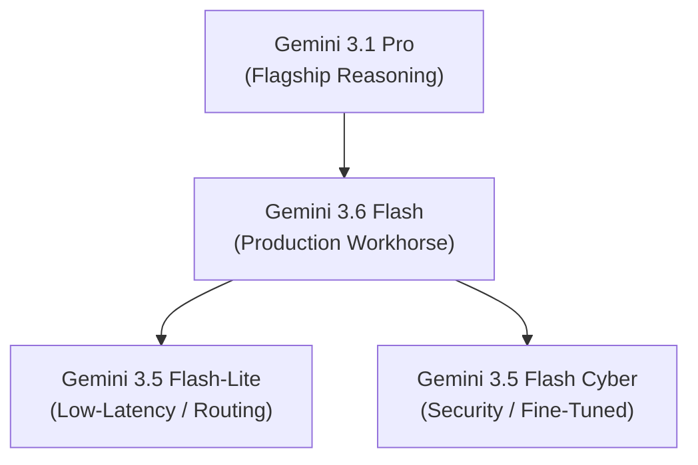

*Series: &larr; [Connecting Telegram to OpenClaw: A Complete Step-by-Step Guide](/blog/openclaw-telegram-step-by-step-guide/) (Previous) | [Under the Hood of Moonshot AI's Kimi K3](/blog/moonshot-ai-kimi-k3-thinking-models/) (Next) &rarr;*

### Prior Reading Material
Before diving into Google's latest model releases, it is helpful to establish context around model taxonomy, proxy gateway layers, and open-source agent interfaces:
*   [Anthropic's Claude Model Family: Specs, Pros, Cons, and Use Cases](/blog/claude-models-comparison-guide/) — A look at how model providers tier and parameterize their offerings.
*   [OpenClaw in Action: Connecting WhatsApp to Automated Workflows](/blog/openclaw-whatsapp-workflows/) — Running local gateway connections and LLM configurations.
*   [Thinking Machines' Inkling: Under the Hood of the 975B Parameter Open Multimodal MoE](/blog/thinking-machines-inkling-open-multimodal-moe/) — A deep-dive into Mixture-of-Experts routing mechanics.

---

On July 21, 2026, Google significantly expanded its frontier AI line with the release of new models in the **Gemini 3** family: **Gemini 3.6 Flash**, **Gemini 3.5 Flash-Lite**, and the specialized **Gemini 3.5 Flash Cyber**. 

This updates Google's model portfolio, reinforcing a multi-tiered approach that separates high-reasoning, standard production workhorse, low-latency utility, and specialized security tasks. Developers building production agents need to understand how these models compare amongst themselves and against older generations to optimize latency, cost, and accuracy.

---

## The Gemini 3 Portfolio

Google's current lineup is divided into four distinct tiers:



### 1. Gemini 3.1 Pro (Flagship Reasoning)
*   **Role**: The heavy-lifter. Built for multi-step reasoning, complex code refactoring, massive mathematical problems, and long-form analytical reasoning.
*   **Key Feature**: Features a massive **2-million token context window** and native multimodal processing across text, audio, images, and video.
*   **Ideal for**: Complex coding agents (like [OpenClaw](https://github.com/openclaw/openclaw)), research synthesis, and high-precision extraction.

### 2. Gemini 3.6 Flash (Production Workhorse)
*   **Role**: The daily workhorse. Striking a optimal balance between cost-efficiency, throughput, and reasoning quality.
*   **Key Feature**: Bumps token efficiency and reasoning speed compared to the older Gemini 3.5 Flash model (from May 2026) while maintaining low runtime latency.
*   **Ideal for**: Inline pair programming autocomplete, real-time chat agents, and high-frequency production APIs.

### 3. Gemini 3.5 Flash-Lite (Low-Latency Router)
*   **Role**: The utility model. Extremely fast and cheap.
*   **Key Feature**: Sub-100ms time-to-first-token (TTFT) response latency.
*   **Ideal for**: Pre-classification, gateway routing (e.g. deciding if a prompt needs a Pro model or can be handled locally), token compression, and simple text parsing.

### 4. Gemini 3.5 Flash Cyber (Vulnerability Resolution)
*   **Role**: Cyber defense specialist.
*   **Key Feature**: Fine-tuned on high-quality security vulnerability datasets. It parses system logs, identifies software dependencies with known security issues, and outputs secure code fixes.
*   **Ideal for**: DevSecOps CI/CD verification pipelines. *(Currently in a limited-access pilot for trusted partners).*

---

## Comparison Matrix

Below is a technical comparison of the active Gemini 3 family models:

| Model Tier | Context Window | Latency Profile | Cost (Input / Output per 1M) | Primary Strengths |
| :--- | :--- | :--- | :--- | :--- |
| **Gemini 3.1 Pro** | 2,000,000 | Moderate (500ms - 1.2s TTFT) | \$7.00 / \$21.00 | Math, complex codebases, multi-turn reasoning |
| **Gemini 3.6 Flash** | 1,000,000 | Fast (150ms - 300ms TTFT) | \$0.075 / \$0.30 | Multimodal chat, general-purpose coding |
| **Gemini 3.5 Flash-Lite** | 500,000 | Ultra-Fast (<100ms TTFT) | \$0.03 / \$0.12 | Classification, semantic routing, text scrubbing |
| **Gemini 3.5 Flash Cyber** | 1,000,000 | Fast (150ms - 300ms TTFT) | Custom Pilot Pricing | Vulnerability auditing, security patch drafting |

---

## Architectural Comparison with Previous Generations

Migrating from older model families (such as **Gemini 2.5** and the now-deprecated **Gemini 2.0**) offers several major infrastructure advantages:

1.  **Native Multimodality**: While older models processed audio and video by converting them into text transcripts or keyframe images first, the Gemini 3 family uses a single shared embedding space. It processes video and audio tracks natively, which drastically reduces ingestion costs and latency.
2.  **Context Window Efficiency**: Gemini 3.1 Pro's 2M context window relies on linear scaling techniques that maintain high retrieval recall (the "needle-in-a-haystack" test) even when packed close to 100% capacity. Older models began losing recall once the context exceeded 100k tokens.
3.  **Prompt Caching Support**: The Gemini 3 API natively supports context caching. For long-running developer agents, system instructions or repository context schemas remain cached in memory, cutting input token costs by up to 50% for repeating requests.

---

## Head-to-Head Benchmark: Gemini 3.6 Flash vs. Gemini 3.5 Flash

To quantify the generational leap between **Gemini 3.5 Flash** (released in May 2026) and the new **Gemini 3.6 Flash**, Google released extensive benchmark evaluations across software engineering, machine learning automation, computer use, and token efficiency.

### Key Performance & Metric Differences

1. **Token Efficiency & Reduced Verbosity**:
   On the *Artificial Analysis Index*, Gemini 3.6 Flash uses **17% fewer output tokens** on average compared to 3.5 Flash to solve the exact same tasks. On multi-turn software engineering tasks like *DeepSWE*, output token consumption decreases by up to **65%**, dramatically reducing overall API costs and latency.

2. **Agentic & Software Engineering Performance**:
   - **DeepSWE (Software Bug Resolution)**: 3.6 Flash achieves **49.0%** vs. 37.0% for 3.5 Flash, demonstrating significantly higher precision with fewer unwanted code edits and execution loops.
   - **MLE Bench (ML Pipeline Engineering)**: 3.6 Flash scores **63.9%** vs. 49.7% for 3.5 Flash in automated machine learning task execution.

3. **Computer Use & Visual Understanding**:
   - **OSWorld-Verified**: 3.6 Flash achieves **83.0%** vs. 78.4% for 3.5 Flash when executing native GUI desktop automation tasks.

4. **Knowledge Work & Reasoning**:
   - **GDPval-AA v2**: 3.6 Flash achieves a score of **1421** vs. 1349 for 3.5 Flash in document extraction, financial data parsing, and multi-turn research synthesis.

### Benchmark Breakdown Table

| Evaluation Benchmark | Domain / Capabilities | Gemini 3.5 Flash | Gemini 3.6 Flash | Delta / Gain |
| :--- | :--- | :--- | :--- | :--- |
| **DeepSWE** | Autonomous Code Bug Fixing | 37.0% | **49.0%** | **+12.0%** |
| **MLE Bench** | ML Model & Data Engineering | 49.7% | **63.9%** | **+14.2%** |
| **OSWorld-Verified** | Native GUI & Computer Use | 78.4% | **83.0%** | **+4.6%** |
| **GDPval-AA v2** | Document Analysis & Knowledge | 1349 | **1421** | **+72 pts** |
| **Output Token Overhead** | Average Tokens per Task | 100% Baseline | **-17% (up to -65%)** | **Higher Efficiency** |

---

## Code Example: Building a Multi-Tier Gemini Router

Below is a complete, production-ready Python example demonstrating how to build an intelligent gateway router using the new **Gemini 3.5 Flash-Lite** and **Gemini 3.6 Flash** models. 

This script uses the official [Google GenAI SDK](https://github.com/google-gemini/antigravity-sdk-python) to classify prompt difficulty using the ultra-fast **Flash-Lite** model and only upgrades to **3.6 Flash** for complex coding or reasoning requests.

```python
# scripts/gemini_smart_router.py
import os
import json
import time
from google import genai
from google.genai import types

def run_smart_router():
    # Make sure you have your API key set up under /Users/<username>/.zshrc
    # Generate your API key in: https://aistudio.google.com/apikey
    api_key = os.environ.get("GEMINI_API_KEY")
    if not api_key:
        raise ValueError("Error: GEMINI_API_KEY environment variable is not set.")

    # Initialize client
    client = genai.Client(api_key=api_key)

    # 1. User Prompts
    prompts = [
        "Sort this list of names alphabetically: [Dave, Alice, Charlie, Bob]",
        "Refactor this Python code to use asynchronous execution (asyncio) and avoid thread deadlock:\n\ndef run_task(data):\n    res = compute(data)\n    save_to_db(res)"
    ]

    for idx, prompt in enumerate(prompts, 1):
        print(f"\n--- Evaluating Prompt #{idx} ---")
        print(f"User Input: {prompt[:100]}...")

        # 2. Step 1: Pre-Classification with Gemini 3.5 Flash-Lite (Low Cost/Latency)
        start_time = time.time()
        
        classification_prompt = f"""
        Analyze the following prompt and classify its difficulty level.
        Return a JSON object with a single key: "complexity".
        Values must be either "simple" (tasks like sorting, greeting, basic edits) or "complex" (algorithmic tasks, coding refactors, deep reasoning).
        
        Prompt to evaluate: "{prompt}"
        """

        response = client.models.generate_content(
            model='gemini-3.5-flash-lite',
            contents=classification_prompt,
            config=types.GenerateContentConfig(
                response_mime_type="application/json"
            )
        )
        
        classification_time = time.time() - start_time
        try:
            complexity_data = json.loads(response.text)
            complexity = complexity_data.get("complexity", "simple")
        except Exception:
            complexity = "simple"

        print(f"Classification Result: {complexity.upper()} (resolved in {classification_time:.2f}s)")

        # 3. Step 2: Routing the Task
        task_start = time.time()
        if complexity == "complex":
            print("Routing to Gemini 3.6 Flash (Production Workhorse)...")
            task_response = client.models.generate_content(
                model='gemini-3.6-flash',
                contents=prompt
            )
        else:
            print("Routing to Gemini 3.5 Flash-Lite (Low Latency)...")
            task_response = client.models.generate_content(
                model='gemini-3.5-flash-lite',
                contents=prompt
            )
        
        task_time = time.time() - task_start
        print(f"Task Completed in: {task_time:.2f}s")
        print(f"Response:\n{task_response.text}\n")

if __name__ == "__main__":
    run_smart_router()
```

---

## Conclusion

The expansion of the **Gemini 3** family provides developers with the granular tiers needed to balance budget and performance. For general applications, migrating to **Gemini 3.6 Flash** provides immediate cost savings and context window gains over legacy models. When latency is paramount, pairing it with **Gemini 3.5 Flash-Lite** creates highly efficient, responsive agentic systems.

### References & Resources:
*   [Google AI Studio](https://aistudio.google.com/apikey) — Get your free developer API key to test the models.
*   [Google Developer Documentation](https://ai.google.dev/) — Authoritative guides, SDK libraries, and API reference sheets.
*   [Gemini API Reference](https://ai.google.dev/api) — Complete endpoint schemas, model availability list, and system metrics.
*   [OpenClaw Repository](https://github.com/openclaw/openclaw) — Connect your new Gemini models to custom agent interfaces and tools.
