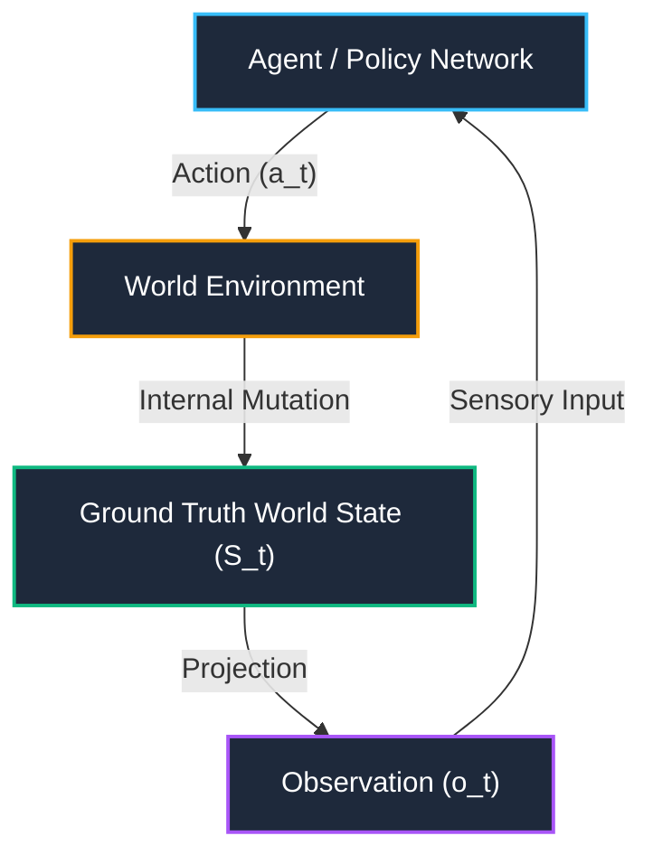
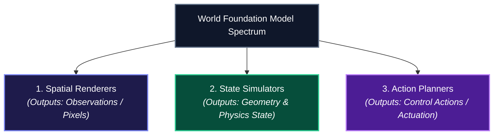

*Series: &larr; [Google's Gemini 3 Family: The Comprehensive Developer Guide and Model Comparison](/blog/gemini-3-model-family-comparison-guide/) (Previous)*

### Prior Reading Material
Before diving into spatial architectures and world models, review our earlier posts on agentic control loops and model taxonomy:
*   [Google's Gemini 3 Family: The Comprehensive Developer Guide and Model Comparison](/blog/gemini-3-model-family-comparison-guide/) — A look at model efficiency, task routing, and latency tiers.
*   [LangChain vs. LangGraph: Cyclic State Graphs for Autonomous AI Agents](/blog/langchain-vs-langgraph-cyclic-state-graphs/) — Modeling non-linear loops and persistent state machines.
*   [OpenClaw: The Open-Source Self-Hosted AI Butler Infrastructure](/blog/openclaw-self-hosted-ai-butler/) — Grounding LLMs with OS execution tools and continuous agent loops.

---

> **Inspiration & Reference**: This article draws foundational inspiration from Dr. Fei-Fei Li and the World Labs team's essay, [*A Functional Taxonomy of World Models*](https://drfeifei.substack.com/p/a-functional-taxonomy-of-world-models). We expand upon their functional categorization (Renderers, Simulators, Planners) by examining the underlying software architectures, spatial data structures, and providing an executable POMDP control loop simulation for software engineers.

---

The phrase **"World Model"** has become one of the most overloaded terms in artificial intelligence. 

Ask a generative video researcher, and a world model is a diffusion transformer predicting video frames. Ask a roboticist, and it is a physics-grounded state estimator predicting joint torque trajectories. Ask an autonomous vehicle engineer, and it is a high-definition 3D simulator modeling sensor telemetry.

While Large Language Models (LLMs) learn the statistical distribution of human text tokens, **World Foundation Models (WFMs)** learn the statistical structure of space, time, physical laws, and geometry. 

To build autonomous agents that interact with the physical or virtual world, software engineers must look past marketing buzzwords and evaluate world models by their **functional contracts**.

---

## The Core Control Loop: POMDP Grounding

At the foundation of any world model is the classic **Partially Observable Markov Decision Process (POMDP)** control loop. An agent does not experience the true state of the universe directly; it observes a sensory projection of it, computes an action, and mutates the environment.



*   **World State ($S_t$)**: The complete, ground-truth physics description of reality (3D spatial geometry, object positions, mass, velocities, lighting, and rigid-body mechanics).
*   **Observation ($o_t$)**: The partial camera pixel frame, point cloud, or acoustic telemetry received by an agent's sensors.
*   **Action ($a_t$)**: The physical control command (motor torque, camera displacement, or text instruction) executed by the agent.

Depending on which slice of this control loop a model predicts, world foundation models split into **three distinct functional classes**:

---

## The Three Pillars of World Models



### 1. Spatial Renderers (Observation-Space Models)
*   **Target Output**: Pixels, 2D latents, or video streams ($o_{t+1}$).
*   **Key Implementations**: [OpenAI Sora](https://openai.com/sora), [Runway Gen-3](https://runwayml.com/), [Google Genie 3](https://deepmind.google/technologies/genie/), World Labs RTFM.
*   **How They Work**: Renderers predict what a human camera operator or observer would see. Conditioned on text or user controls, they generate high-resolution video frames frame-by-frame using autoregressive diffusion models.
*   **Engineering Trade-off**: High visual realism, but low structural fidelity. Because renderers do not maintain explicit 3D mesh geometry, objects may warp, morph, or lose identity when the virtual camera pans away and returns.

### 2. State Simulators (Structural & Physical Models)
*   **Target Output**: Persistent 3D geometry, spatial depth, velocity fields, and collision boundaries ($S_{t+1}$).
*   **Key Implementations**: [World Labs 3D Spatial Models](https://www.worldlabs.ai/), [NVIDIA Isaac Sim](https://developer.nvidia.com/isaac-sim), [MuJoCo](https://mujoco.org/), [3D Gaussian Splatting / Nerfstudio](https://docs.nerf.studio/).
*   **How They Work**: Rather than generating raw 2D pixel matrices, state simulators compute explicit 3D representations (point clouds, voxel grids, 3D Gaussians, or SDFs). They enforce spatial continuity and physical conservation laws.
*   **Engineering Trade-off**: Absolute geometric consistency and multi-view stability, but higher computational cost for real-time rendering.

### 3. Action Planners (Perception-to-Control Models)
*   **Target Output**: Actuation commands, joint velocity vectors, or discrete task operations ($a_t$).
*   **Key Implementations**: Vision-Language-Action (VLA) models, World Action Models (WAMs), [OpenVLA](https://openvla.github.io/).
*   **How They Work**: Planners invert the rendering process. Given visual observations ($o_t$) and a target goal state ($g$), they compute the optimal control sequence necessary to reach the goal.
*   **Engineering Trade-off**: Direct applicability for robotics and autonomous agents, requiring fine-grained sensorimotor calibration.

---

## Architectural Comparison Matrix

| Dimension | Spatial Renderers | State Simulators | Action Planners |
| :--- | :--- | :--- | :--- |
| **Output Contract** | 2D Video Frames / Pixels | 3D Geometry, Mesh, Depth, Physics | Control Actions / Joint Velocities |
| **Underlying Substrate** | Latent Diffusion / Autoregressive | 3D Gaussian Splats, NeRFs, Rigid Dynamics | Policy Networks / VLA Transformers |
| **3D Geometric Consistency** | Low (Subject to visual hallucinations) | **Absolute (Ground Truth 3D State)** | Task-Dependent |
| **Physics Grounding** | Visual Plausibility | Mathematical / Physical Laws | Sensorimotor Control |
| **Primary Use Cases** | Interactive Media, Game Generation | Robot Training Simulators, Digital Twins | Autonomous Robotics, Spatial Agents |

---

## Code Example: Building a World Model Simulator Pipeline

Below is a Python demonstration illustrating how software engineers can structure a modular World Model control loop using clean object-oriented contracts:

```python
# scripts/world_model_simulation.py
import dataclasses
from typing import List, Tuple

@dataclasses.dataclass
class Vector3D:
    x: float
    y: float
    z: float

@dataclasses.dataclass
class WorldState:
    """Represents ground-truth 3D physical environment state."""
    timestamp: float
    object_positions: dict[str, Vector3D]
    object_velocities: dict[str, Vector3D]
    gravity: float = 9.81

@dataclasses.dataclass
class Observation:
    """Sensory observation payload projected from WorldState."""
    camera_frame_id: int
    depth_map_shape: Tuple[int, int]
    detected_entities: List[str]

class StateSimulator:
    """State Simulator: Computes physical state evolution S_{t+1}."""
    def step(self, current_state: WorldState, action_vector: Vector3D, dt: float) -> WorldState:
        new_positions = {}
        for obj_name, pos in current_state.object_positions.items():
            vel = current_state.object_velocities.get(obj_name, Vector3D(0, 0, 0))
            # Apply kinematic physics step: x_new = x + v*dt
            new_positions[obj_name] = Vector3D(
                x=pos.x + vel.x * dt + action_vector.x * dt,
                y=pos.y + vel.y * dt + action_vector.y * dt,
                z=pos.z + vel.z * dt - current_state.gravity * (dt ** 2)
            )
        return WorldState(
            timestamp=current_state.timestamp + dt,
            object_positions=new_positions,
            object_velocities=current_state.object_velocities
        )

class ActionPlanner:
    """Action Planner: Computes action a_t given observation o_t and goal."""
    def plan_next_action(self, observation: Observation, goal_entity: str) -> Vector3D:
        if goal_entity in observation.detected_entities:
            print(f"[ActionPlanner] Target '{goal_entity}' detected. Initiating trajectory.")
            return Vector3D(x=0.5, y=0.0, z=0.1)
        print(f"[ActionPlanner] Searching for target '{goal_entity}'...")
        return Vector3D(x=0.0, y=0.0, z=0.0)

# Quick verification run
if __name__ == "__main__":
    initial_state = WorldState(
        timestamp=0.0,
        object_positions={"robot_gripper": Vector3D(0, 1, 0)},
        object_velocities={"robot_gripper": Vector3D(0.1, 0, 0)}
    )
    simulator = StateSimulator()
    planner = ActionPlanner()
    
    obs = Observation(camera_frame_id=101, depth_map_shape=(640, 480), detected_entities=["robot_gripper"])
    action = planner.plan_next_action(obs, goal_entity="robot_gripper")
    next_state = simulator.step(initial_state, action, dt=0.1)
    
    print(f"Updated World State at t={next_state.timestamp:.1f}s: {next_state.object_positions}")
```

---

## The Convergence: Unified Spatial Foundation Models

The future of World Models lies in **Unification**. Rather than treating Renderers, Simulators, and Planners as isolated software components, modern spatial AI research is building unified models where:

1. A single spatial latent space maintains explicit 3D geometry.
2. The renderer outputs photorealistic multi-view video streams directly from the spatial latent space.
3. The planner queries the same spatial representation to output robot control policies.

As spatial computing hardware and autonomous robotics mature, understanding these three pillars will allow developers to architect robust, physically grounded AI systems.
