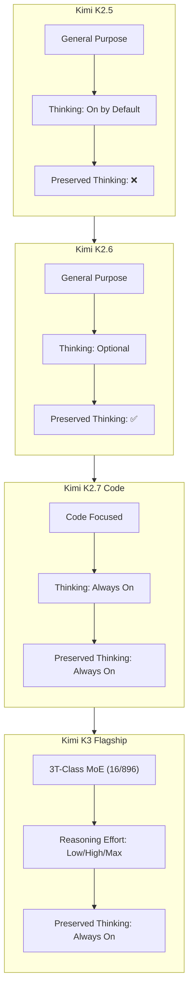
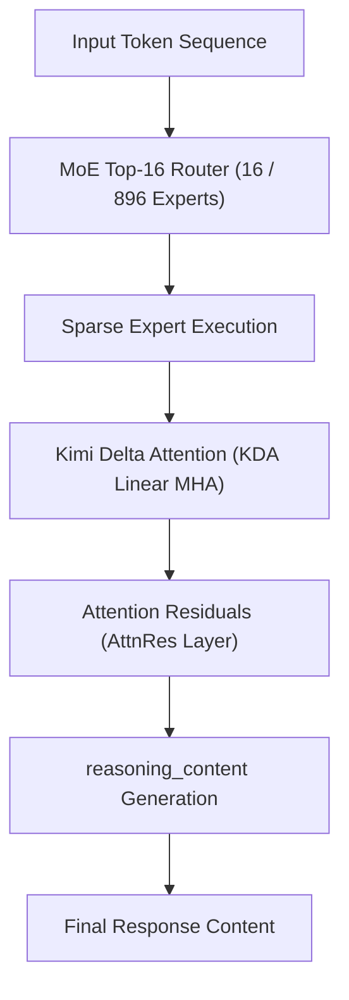

*Series: &larr; [Google's Gemini 3 Family: The Comprehensive Developer Guide and Model Comparison](/blog/gemini-3-model-family-comparison-guide/) (Previous)*

### Prior Reading Material
Before diving into Kimi K3's architecture, explore our prerequisite articles on open-weights model scaling, reasoning gateways, and local serving optimizations:
*   [Google's Gemini 3 Family: The Comprehensive Developer Guide and Model Comparison](/blog/gemini-3-model-family-comparison-guide/) — Architectural analysis of Gemini 3.6 Flash, 3.5 Flash-Lite, and intelligent task routing.
*   [Thinking Machines' Inkling: Under the Hood of the 975B Parameter Open Multimodal MoE](/blog/thinking-machines-inkling-open-multimodal-moe/) — Analyzing Mixture-of-Experts (MoE) routing parameters and local/cloud serving footprints.
*   [vLLM vs. llama.cpp: Which is the Real Production King?](/blog/vllm-vs-llamacpp-production-comparison/) — Benchmarking multi-GPU tensor parallelism against low-overhead edge serving.

---

The landscape of artificial intelligence is experiencing a fundamental architectural shift. While traditional auto-regressive language models generate tokens sequentially based solely on static context, **thinking models** (or reasoning models) introduce a dedicated pre-response deliberation phase. By generating internal "reasoning tokens" before returning a final answer, these models break down complex problems, plan execution steps, and evaluate edge cases in real time.

[Moonshot AI](https://platform.kimi.ai/) has emerged at the forefront of this paradigm shift with the release of **Kimi K3**, a flagship 2.8-trillion parameter Mixture-of-Experts (MoE) model. Kimi K3 introduces groundbreaking features such as **Preserved Thinking** across multi-turn conversations, configurable **Reasoning Effort**, and a native **1-million token context window**.

In this guide, we dive deep into the architecture of Kimi K3, compare it against its predecessor generations (`kimi-k2.7-code`, `kimi-k2.6`, and `kimi-k2.5`), explore official [Kimi Platform Documentation](https://platform.kimi.ai/docs/models) capabilities, and build a complete Python integration client.

---

### The Evolution of Kimi Models: From K2.5 to K3

To select the optimal model for production workloads, developers must understand the feature progression across Moonshot AI's model family.



#### Detailed Model Capability Matrix

| Model Identifier | Primary Focus | Thinking Behavior | Preserved Thinking | Reasoning Effort Control | Max Context Window |
| :--- | :--- | :--- | :--- | :--- | :--- |
| **`kimi-k3`** | Flagship Reasoning & Multimodal | **Always On** | **Always On** | Configurable (`low`, `high`, `max`) | **1,000,000 tokens** |
| **`kimi-k2.7-code`** | Code Generation & Debugging | **Always On** | **Always On** | Fixed | 256,000 tokens |
| **`kimi-k2.7-code-highspeed`** | High-Throughput Code Generation | **Always On** | **Always On** | Fixed (Low Latency) | 256,000 tokens |
| **`kimi-k2.6`** | General Purpose Reasoning | On by default (Can disable) | Supported | Fixed | 128,000 tokens |
| **`kimi-k2.5`** | Legacy General Purpose | On by default (Can disable) | **Not Supported** | Fixed | 128,000 tokens |

---

### Key Capabilities & Architectural Mechanics

According to the official [Kimi Platform Documentation](https://platform.kimi.ai/docs/models), thinking models operate by populating a dedicated `reasoning_content` field in API responses prior to returning the final `content` payload.

#### 1. Thinking Tokens & `reasoning_content`
When a query is received, Kimi K3 allocates compute to generate internal reasoning tokens. These tokens are returned in the response object under `message.reasoning_content`.

```json
{
  "id": "chatcmpl-kimi-k3-98234",
  "object": "chat.completion",
  "choices": [
    {
      "index": 0,
      "message": {
        "role": "assistant",
        "reasoning_content": "1. Analyze system requirements...\n2. Check for race conditions in mutex locking...\n3. Formulate C++ thread pool solution.",
        "content": "Here is the thread-safe implementation of the worker queue..."
      }
    }
  ]
}
```

> [!NOTE]
> Thinking before answering significantly improves model accuracy on complex logic, algorithmic code generation, and multi-step tool calls, at the cost of higher latency and token consumption.

#### 2. Configurable Reasoning Effort
For `kimi-k3`, developers can steer the depth of reasoning using the top-level `reasoning_effort` request parameter:
*   **`low`**: Minimizes thinking token overhead for fast, latency-sensitive tasks.
*   **`high`**: Standard reasoning depth for balanced logic and speed.
*   **`max`** *(Default)*: Maximum deliberation depth for complex architecture design, hard mathematical proofs, and multi-file debugging.

#### 3. Preserved Thinking Across Multi-turn Chats
In traditional reasoning APIs, the reasoning tokens of prior turns are discarded, forcing the model to re-analyze the entire conversation history from scratch on every turn. 

With **Preserved Thinking** (supported in `kimi-k3`, `kimi-k2.7-code`, and `kimi-k2.6`), the assistant's previous `reasoning_content` blocks are preserved in the conversation history passed back to the API. This enables the model to build upon its earlier internal logic without repeating multi-step plan evaluations.

---

### Kimi K3 Architecture: KDA & Attention Residuals

Kimi K3 scales to **2.8 trillion parameters** across **896 MoE experts**, activating **16 experts per token**. Operating a model of this magnitude with a 1-million token context window requires radical attention layer optimizations:

1.  **Kimi Delta Attention (KDA)**: A hybrid linear attention mechanism that compresses long-context key-value (KV) representations, eliminating the quadratic VRAM overhead of standard Multi-Head Attention (MHA).
2.  **Attention Residuals (AttnRes)**: A residual layer routing technique that stabilizes gradient flow across thousands of expert routes, yielding a **2.5x increase in training and inference scaling efficiency** compared to the K2 generation.



---

### Hands-On Implementation: Building a Kimi K3 Python Client

The Kimi API is fully OpenAI-compatible. Below is a complete Python script (`scripts/kimi_k3_reasoning_client.py`) demonstrating how to query `kimi-k3` with configurable `reasoning_effort` and maintain a multi-turn session with **Preserved Thinking**.

```python
#!/usr/bin/env python3
"""
scripts/kimi_k3_reasoning_client.py
-----------------------------------
Demonstration script for Moonshot AI's Kimi K3 model API.
Illustrates reasoning effort control, extracting reasoning_content,
and maintaining Preserved Thinking in multi-turn chats.
"""

import os
from openai import OpenAI

# Initialize client pointing to Kimi API endpoint
# Replace placeholder with your environment variable: KIMI_API_KEY
client = OpenAI(
    api_key=os.environ.get("KIMI_API_KEY", "your-api-key-here"),
    base_url="https://api.kimi.ai/v1"
)

def query_kimi_k3(prompt: str, reasoning_effort: str = "max"):
    """
    Sends a prompt to kimi-k3 and extracts both reasoning and output tokens.
    """
    print(f"\n[Querying kimi-k3 | Reasoning Effort: {reasoning_effort}]...")
    
    response = client.chat.completions.create(
        model="kimi-k3",
        messages=[
            {"role": "system", "content": "You are an expert systems engineer."},
            {"role": "user", "content": prompt}
        ],
        extra_body={
            "reasoning_effort": reasoning_effort
        }
    )

    message = response.choices[0].message
    
    # Extract reasoning tokens if present
    reasoning = getattr(message, "reasoning_content", None)
    if reasoning:
        print("\n--- 🧠 MODEL REASONING (reasoning_content) ---")
        print(reasoning)
        print("---------------------------------------------\n")
    
    print("--- 💬 FINAL RESPONSE ---")
    print(message.content)
    print("------------------------\n")
    
    return message

def multi_turn_preserved_thinking_demo():
    """
    Demonstrates Preserved Thinking across multiple chat turns.
    """
    print("\n=== Multi-Turn Chat with Preserved Thinking ===")
    history = [
        {"role": "system", "content": "You are a senior Rust architect."}
    ]
    
    # Turn 1: Initial complex request
    user_turn1 = "Design a lock-free ring buffer in Rust. Explain memory ordering choices."
    history.append({"role": "user", "content": user_turn1})
    
    resp1 = client.chat.completions.create(
        model="kimi-k3",
        messages=history,
        extra_body={"reasoning_effort": "high"}
    )
    
    msg1 = resp1.choices[0].message
    # Append full message (including reasoning_content) to preserve thinking context
    history.append({
        "role": "assistant",
        "content": msg1.content,
        "reasoning_content": getattr(msg1, "reasoning_content", "")
    })
    
    print(f"Turn 1 Response Received ({len(msg1.content)} chars).")
    
    # Turn 2: Follow-up question relying on prior reasoning
    user_turn2 = "Now update the implementation to support single-producer multi-consumer (SPMC)."
    history.append({"role": "user", "content": user_turn2})
    
    resp2 = client.chat.completions.create(
        model="kimi-k3",
        messages=history,
        extra_body={"reasoning_effort": "max"}
    )
    
    msg2 = resp2.choices[0].message
    print("\n--- Turn 2 Final Response ---")
    print(msg2.content[:300] + "...\n")

if __name__ == "__main__":
    # Example 1: Single query with max reasoning
    query_kimi_k3("Write a lock-free concurrent hashmap in C++20.", reasoning_effort="max")
    
    # Example 2: Multi-turn session
    multi_turn_preserved_thinking_demo()
```

To run this script locally:
```bash
export KIMI_API_KEY="your-actual-api-key"
python3 scripts/kimi_k3_reasoning_client.py
```

---

### Industry Benchmarks & Model Comparison

How does **Kimi K3** compare against other frontier open-weights and managed models across the mid-2026 AI landscape?

#### Frontier Model Architectural Comparison

| Model | Provider | Parameter Scale | Architecture | Active Parameters | Context Window | Open Weights |
| :--- | :--- | :--- | :--- | :--- | :--- | :--- |
| **Kimi K3** | Moonshot AI | **2.8 Trillion** | MoE + KDA | 16 / 896 Experts | **1,000,000** | Expected July 2026 |
| **Qwen 3.8-Max** | Alibaba Cloud | 2.4 Trillion | Sparse MoE | Dynamic Routing | 128,000 | Preview (Open Soon) |
| **Claude Fable 5** | Anthropic | Undisclosed | Hybrid Dense/MoE | Undisclosed | 200,000 | No (API Only) |
| **Gemini 3.6 Flash** | Google | Undisclosed | Dense Multimodal | Undisclosed | 1,000,000 | No (API Only) |
| **Inkling 975B** | Thinking Machines | 975 Billion | MoE | 8 / 128 Experts | 128,000 | **Yes (Apache-2.0)** |

---

### Developer Recommendations & Summary

1.  **For Complex Reasoning & System Architecture**: Use **`kimi-k3`** with `reasoning_effort: "max"`. Its 2.8T MoE parameters and KDA linear attention excel at high-level planning and hard logic.
2.  **For High-Speed Code Generation**: Use **`kimi-k2.7-code-highspeed`**. It retains always-on thinking and preserved thinking while optimizing token generation throughput for IDE autocomplete and auto-fix loops.
3.  **For Multi-Turn Agentic Pipelines**: Ensure your client framework stores and returns `reasoning_content` in conversation turn payloads to take full advantage of **Preserved Thinking**.

With the upcoming open-weights release of Kimi K3, developers will gain access to 3-trillion parameter reasoning capabilities on local and private cloud infrastructure!
