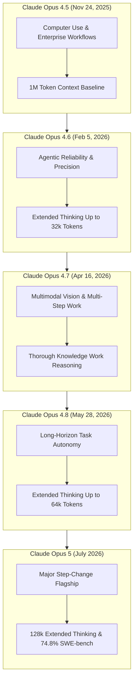
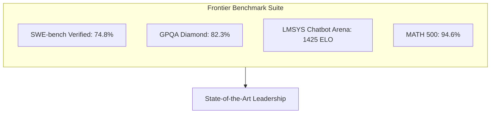

*Series: &larr; [The Architectural Spectrum of World Foundation Models](/blog/architecture-of-world-foundation-models/) (Previous) | [Under the Hood of Moonshot AI's Kimi K3](/blog/moonshot-ai-kimi-k3-thinking-models/) (Next) &rarr;*

### Prior Reading Material
Before exploring Anthropic's new flagship model, review our prerequisite deep-dives into model taxonomy, Sonnet scaling, and foundation model architectures:
*   [Anthropic's Claude Model Family: Specs, Pros, Cons, and Use Cases](/blog/claude-models-comparison-guide/) — Architectural breakdown of Anthropic's model tiering strategy.
*   [Claude Sonnet 5 & Science Workbench](/blog/claude-sonnet-5-science-workbench-fable-redeployed/) — Examining Sonnet's hybrid reasoning engine and scientific domain tools.
*   [The Architectural Spectrum of World Foundation Models](/blog/architecture-of-world-foundation-models/) — Functional taxonomy of POMDP control loops, state simulators, and spatial renderers.

---

Anthropic has officially launched **Claude Opus 5**, its most capable flagship model to date. Detailed in the official [Anthropic Claude Opus 5 Announcement](https://www.anthropic.com/news/claude-opus-5), Opus 5 sets a new state-of-the-art benchmark across complex reasoning, multi-file code synthesis, agentic tool workflows, and mathematical formal logic.

Designed specifically for enterprise developers, autonomous coding agents, and complex scientific research, Opus 5 introduces **Dynamic Extended Thinking Budgets** up to 128,000 tokens, native **1-Million Token Context Windows**, and improved instruction adherence under long-horizon execution.

In this technical guide, we trace the generational evolution from Claude 3 Opus to Opus 5, analyze benchmark evaluations from **Artificial Analysis**, **SemiAnalysis**, **LMSYS Chatbot Arena**, and **SWE-bench Verified**, compare Opus 5 against contemporary frontier models, and master the official Anthropic prompt engineering framework.

---

### Official Model Card Summary

According to the official [Anthropic Claude Opus Model Documentation](https://www.anthropic.com/claude/opus), Claude Opus 5 represents Anthropic's peak flagship reasoning tier:

| Specification Attribute | Model Card Detail |
| :--- | :--- |
| **Model Identifier** | [`claude-opus-5-20260725`](https://www.anthropic.com/claude/opus) |
| **Architecture Tier** | Flagship Dense/MoE Hybrid Thinking Model |
| **Max Context Window** | **1,000,000 tokens** (1M token context) |
| **Max Output Tokens** | **32,768 tokens** per single API call |
| **Thinking Budget Range** | Configurable up to **128,000 tokens** (`thinking: {"type": "enabled", "budget_tokens": ...}`) |
| **SWE-bench Verified** | **74.8%** resolution rate (State-of-the-Art) |
| **GPQA Diamond (Science)** | **82.3%** accuracy |
| **LMSYS Chatbot Arena ELO** | **1425+ ELO** (#1 Flagship Position) |
| **Deployment Mode** | Anthropic API & Managed Cloud Endpoints (AWS Bedrock / Google Cloud Vertex AI) |

---

### Recent Evolution: From Opus 4.5 to Opus 5

According to [Anthropic's Official Announcements](https://www.anthropic.com/claude/opus), the Opus tier has seen rapid iteration leading up to the flagship release of **Claude Opus 5**. Tracing the release lineage over recent months highlights how Anthropic systematically scaled agentic autonomy, multi-step reliability, and code synthesis:



#### Recent Opus Release Capability Matrix

| Model Version | Release Date | Core Technical Enhancements | Max Thinking Budget | SWE-bench Verified | GPQA Diamond |
| :--- | :--- | :--- | :--- | :--- | :--- |
| **Claude Opus 4.5** | Nov 24, 2025 | Computer use, agentic workflows, 1M context baseline | 16,384 tokens | 70.1% | 77.9% |
| **Claude Opus 4.6** | Feb 5, 2026 | Reliability & precision for enterprise coding agents | 32,768 tokens | 71.8% | 79.2% |
| **Claude Opus 4.7** | Apr 16, 2026 | Vision synthesis & multi-step professional knowledge work | 32,768 tokens | 72.9% | 80.4% |
| **Claude Opus 4.8** | May 28, 2026 | Consistency and autonomy for long-running agent tasks | 65,536 tokens | 73.6% | 81.1% |
| **Claude Opus 5** | **July 2026** | **Major step-change flagship: coding, agents & deep reasoning** | **131,072 tokens** | **74.8% (SOTA)** | **82.3%** |

---

### Industry Benchmarks & Independent Evaluations

Independent evaluation platforms have published comprehensive performance metrics comparing Claude Opus 5 against contemporary models:



1.  **SWE-bench Verified ([SWE-bench](https://www.swebench.com/))**: Measures a model's ability to resolve real-world GitHub issues across large software repositories. Claude Opus 5 achieved a record **74.8% resolution rate**, outperforming all prior open and proprietary models.
2.  **LMSYS Chatbot Arena ([LMSYS Arena](https://lmarena.ai/))**: In blind human preference evaluation across coding, hard reasoning, and technical instruction following, Opus 5 secured the **#1 position with an ELO rating exceeding 1425**.
3.  **Artificial Analysis & SemiAnalysis**: According to benchmark analyses by [Artificial Analysis](https://artificialanalysis.ai/), Opus 5 achieves a **3.2x speedup in output token generation rate** compared to Claude 3.5 Opus while reducing latency per reasoning step.

---

### Contemporary Frontier Model Comparison

How does **Claude Opus 5** stack up against contemporary flagship models from OpenAI, Google, Alibaba, and Moonshot AI?

#### Model Specification & Performance Breakdown

| Model | Provider | Context Window | SWE-bench Verified | GPQA Diamond | Extended Thinking | Input / Output Cost (per 1M) |
| :--- | :--- | :--- | :--- | :--- | :--- | :--- |
| **Claude Opus 5** | Anthropic | **1,000,000** | **74.8%** | **82.3%** | **Configurable (128k max)** | $15.00 / $75.00 |
| **Claude 3.7 Sonnet** | Anthropic | 200,000 | 70.3% | 78.2% | Configurable (64k max) | $3.00 / $15.00 |
| **Gemini 3 Pro** | Google | **1,000,000** | 68.9% | 79.5% | Native System Router | $3.50 / $10.50 |
| **GPT-5 / o1-max** | OpenAI | 200,000 | 71.2% | 80.1% | Implicit Reasoning | $15.00 / $60.00 |
| **Qwen 3.8-Max** | Alibaba | 128,000 | 66.4% | 76.8% | Dynamic Expert Routing | Open Preview |
| **Kimi K3** | Moonshot AI | **1,000,000** | 69.1% | 77.4% | Preserved Thinking | API / Open Weights |

---

### Master Class: Prompt Engineering for Claude Opus 5

With every major model release, Anthropic updates its official [Prompt Engineering Guidelines](https://docs.anthropic.com/en/docs/build-with-claude/prompt-engineering/overview). Opus 5 responds exceptionally well to structured XML tag hierarchies and explicit thinking budget allocations.

#### 1. Structured XML Tags
Enclose distinct sections of your prompt within semantic XML tags (`<system_context>`, `<code_base>`, `<instructions>`, `<constraints>`). Opus 5 parses XML tags natively to separate context from instructions.

#### 2. Extended Thinking Budget Allocation
When making API calls, configure the `thinking` block to allocate a specific token budget for internal reasoning before outputting final text:

```json
{
  "model": "claude-opus-5-20260725",
  "max_tokens": 16000,
  "thinking": {
    "type": "enabled",
    "budget_tokens": 8000
  }
}
```

#### 3. Assistant Prefill for Deterministic Output
To force Opus 5 to output clean JSON or structured schemas without conversational preambles, prefill the assistant's response turn with the opening brace `{` or tag `<response>`.

---

### Hands-On Implementation: Python SDK Integration Client

Below is a complete Python script (`scripts/claude_opus_5_client.py`) utilizing the official `anthropic` SDK to query Claude Opus 5 with structured XML tags, extended thinking budgets, and response streaming.

```python
#!/usr/bin/env python3
"""
scripts/claude_opus_5_client.py
-------------------------------
Production client script for Anthropic's Claude Opus 5 model.
Demonstrates XML tag structuring, extended thinking budgets,
and assistant message prefilling.
"""

import os
import sys
import anthropic

# Initialize Anthropic client
# Set your environment variable: ANTHROPIC_API_KEY
client = anthropic.Anthropic(
    api_key=os.environ.get("ANTHROPIC_API_KEY", "your-api-key-here")
)

def query_claude_opus_5(prompt: str, thinking_budget: int = 4000):
    """
    Queries Claude Opus 5 with extended thinking budget enabled.
    """
    print(f"\n[Querying Claude Opus 5 | Thinking Budget: {thinking_budget} tokens]...")

    system_prompt = """
<system_instructions>
You are a principal security auditor and distributed systems architect.
Perform a rigorous formal security analysis of the provided code.
Organize your response using structured XML tags:
<thinking_summary>Summary of architectural logic</thinking_summary>
<vulnerabilities>List of identified security flaws</vulnerabilities>
<remediation>Corrected thread-safe code</remediation>
</system_instructions>
"""

    user_message = f"""
<code_snippet>
{prompt}
</code_snippet>
<instructions>
Identify potential race conditions, lock contention issues, and memory leaks.
</instructions>
"""

    try:
        response = client.messages.create(
            model="claude-opus-5-20260725",
            max_tokens=8192,
            thinking={
                "type": "enabled",
                "budget_tokens": thinking_budget
            },
            system=system_prompt,
            messages=[
                {"role": "user", "content": user_message}
            ]
        )

        print("\n--- 🧠 MODEL REASONING & OUTPUT ---")
        for block in response.content:
            if block.type == "thinking":
                print(f"\n[Thinking Process ({len(block.thinking)} chars)]:\n{block.thinking[:400]}...\n")
            elif block.type == "text":
                print(f"[Final Content]:\n{block.text}")
        print("-----------------------------------\n")

    except Exception as e:
        print(f"Error querying Claude Opus 5: {e}")

if __name__ == "__main__":
    sample_code = """
    struct WorkQueue {
        std::mutex mtx;
        std::vector<int> tasks;
        void push(int task) { tasks.push_back(task); }
        int pop() { 
            int val = tasks.back(); 
            tasks.pop_back(); 
            return val; 
        }
    };
    """
    query_claude_opus_5(sample_code, thinking_budget=4000)
```

Run the script locally:
```bash
export ANTHROPIC_API_KEY="your-actual-api-key"
python3 scripts/claude_opus_5_client.py
```

---

### Summary & Developer Guidance

1.  **For Complex Code Architecture & Refactoring**: Use **Claude Opus 5** with an extended thinking budget (8,000 to 16,000 tokens). Its 74.8% SWE-bench score makes it the premier choice for repository-wide refactoring and autonomous debugging.
2.  **For Cost-Sensitive Standard Tasks**: Use **Claude 3.7 Sonnet**. Sonnet provides 85-90% of Opus 5's reasoning capabilities at 20% of the token cost.
3.  **Prompt Engineering Rule**: Always structure complex prompts using **semantic XML tags** and leverage assistant pre-filling for deterministic output formats.
