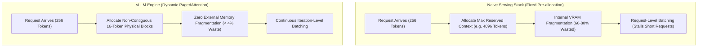
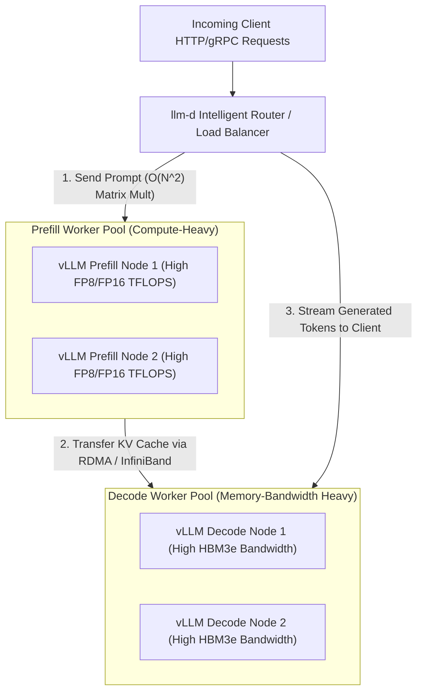

*Series: &larr; [Under the Hood of Moonshot AI's Kimi K3](/blog/moonshot-ai-kimi-k3-thinking-models/) (Previous)*

### Prior Reading Material
Before exploring high-throughput distributed serving architectures, review our foundational articles on inference execution, KV cache bottlenecks, and serving engines:
*   [Under the Hood of Moonshot AI's Kimi K3](/blog/moonshot-ai-kimi-k3-thinking-models/) — Architectural deep-dive into Kimi K3, 1M context windows, and Preserved Thinking.
*   [vLLM vs. llama.cpp: Which is the Real Production King?](/blog/vllm-vs-llamacpp-production-comparison/) — Benchmarking multi-GPU tensor parallelism against low-overhead C++ edge serving.
*   [Understanding the KV Cache: The VRAM Bottleneck of LLM Serving](/blog/understanding-kv-cache/) — Detailed analysis of Key-Value cache memory allocation and GPU VRAM constraints.
*   [The Two Pillars: Prefill vs. Decode](/blog/prefill-vs-decode/) — Fundamental trade-offs between compute-bound prompt processing and memory-bound token generation.

---

Deploying Large Language Models (LLMs) in production environments presents a stark contrast to traditional software serving. While conventional web microservices scale horizontally by replicating stateless HTTP endpoints, LLM inference is inherently stateful, memory-bound, and compute-intensive.

Under concurrent user traffic, naive serving stacks—such as a basic FastAPI service wrapping a PyTorch model—suffer from severe throughput degradation, VRAM memory fragmentation, and skyrocketing Time To First Token (TTFT).

To solve these challenges at scale, the open-source ecosystem has evolved a two-tier architecture:
1.  **Worker Engine Level ([vLLM](https://github.com/vllm-project/vllm))**: Manages single- and multi-GPU VRAM dynamically using **PagedAttention** and iteration-level **Continuous Batching**.
2.  **Control Plane Level ([llm-d](https://github.com/llm-d))**: Orchestrates Kubernetes-native **Prefill/Decode Disaggregation** and prefix-cache-aware load balancing across multi-node worker clusters.

In this comprehensive guide, we start from the absolute fundamentals of LLM serving bottlenecks, examine how vLLM revolutionizes single-node throughput, explore `llm-d`'s distributed disaggregation, and build production benchmarking scripts and Kubernetes deployment manifests.

---

### The Absolute Basics: Why Naive LLM Serving Fails

To understand why specialized engines like vLLM are necessary, we must examine what happens inside GPU memory during an inference request.



#### 1. VRAM Memory Fragmentation & The KV Cache Problem
During autoregressive generation, the model must store Key and Value tensors for every token in every attention layer across every conversation turn. This is known as the **Key-Value (KV) Cache**.

In naive PyTorch serving implementations:
*   **Static Pre-allocation**: Because requests have variable output lengths, servers pre-allocate contiguous VRAM blocks based on the maximum possible context length (e.g., reserving memory for 4,096 tokens when the user prompt is only 200 tokens).
*   **Memory Waste**: Research published in the seminal vLLM paper, [*PagedAttention: Efficient Memory Management for Large Language Model Serving*](https://arxiv.org/abs/2309.06180) (Kwon et al., UC Berkeley), revealed that traditional serving systems waste **60% to 80%** of GPU VRAM due to internal and external memory fragmentation and reserved unused slots.

#### 2. Request-Level vs. Iteration-Level Batching
Traditional batching groups requests at the start of execution and processes them until *all* requests in the batch finish. If one user requests a 1,000-token answer while three users request 10-token answers, the 10-token requests are forced to wait in GPU memory until the 1,000-token generation completes.

---

### Core Innovation 1: Single-Node Optimization with vLLM

[vLLM](https://docs.vllm.ai/) eliminates VRAM bottlenecks through two foundational concepts inspired by operating system design:

#### PagedAttention
Inspired by virtual memory paging in operating systems, **PagedAttention** partitions the KV cache into fixed-size physical blocks (typically 16 or 32 tokens).
*   **Virtual Block Table**: Maps logical token sequences to non-contiguous physical GPU VRAM blocks.
*   **Dynamic Allocation**: Physical memory blocks are allocated on-demand as new tokens are generated. When a request finishes, its blocks are immediately returned to the memory pool.
*   **Memory Efficiency**: Reduces VRAM memory waste to under **4%**, allowing servers to double or triple their active batch sizes on identical GPU hardware.

#### Continuous (In-Flight) Batching
Rather than scheduling at the request level, vLLM schedules at the **iteration level** (after every individual token generated):
1.  After generating one token for all active requests in the batch, completed requests immediately exit the GPU pipeline.
2.  Newly arriving requests undergo their prefill phase and join the active decode batch on the very next token iteration.

---

### Core Innovation 2: Distributed Disaggregation with `llm-d`

While vLLM optimizes single-node worker performance, enterprise production workloads often span multi-node GPU clusters (e.g., clusters of NVIDIA H100/H200 nodes). This is where **[llm-d](https://github.com/llm-d)** provides a Kubernetes-native distributed control plane.



#### 1. Prefill and Decode (PD) Disaggregation
In standard serving, every GPU worker handles both the compute-bound **Prefill phase** (processing prompt tokens in parallel) and the memory-bound **Decode phase** (generating tokens one-by-one).

`llm-d` introduces **Disaggregated Serving**:
*   **Dedicated Prefill Nodes**: Optimized for high floating-point operations per second (FLOPS). Prefill workers process large prompt chunks rapidly and transfer the initial KV cache state over high-speed networks (InfiniBand or RoCE RDMA).
*   **Dedicated Decode Nodes**: Optimized for High Bandwidth Memory (HBM). Decode workers process token-by-token generation across large user batches without being interrupted by heavy incoming prefill bursts.

#### 2. Prefix-Cache-Aware Routing
In multi-turn chat applications or agentic workflows (e.g., system prompts, CLAUDE.md files, or common RAG contexts), multiple requests share identical prompt prefixes.

`llm-d` inspects incoming prompt token hashes and routes requests directly to the specific worker nodes that already store matching prefix KV caches in VRAM, eliminating redundant prefill computation!

---

### Hands-On: Production Benchmarking Script

To measure Time To First Token (TTFT), Inter-Token Latency (ITL), and total throughput under concurrent load, we use the custom Python benchmarking script below (`scripts/vllm_disaggregated_bench.py`).

```python
#!/usr/bin/env python3
"""
scripts/vllm_disaggregated_bench.py
----------------------------------
Concurrent load generator and latency profiler for vLLM and llm-d endpoints.
Measures TTFT (Time To First Token), ITL (Inter-Token Latency), and Total RPS.
"""

import sys
import time
import asyncio
import aiohttp
import numpy as np

# Configuration defaults
ENDPOINT_URL = "http://localhost:8000/v1/completions"
MODEL_NAME = "meta-llama/Llama-3.1-8B-Instruct"
NUM_CONCURRENT_REQUESTS = 20
PROMPT_TEXT = "Explain the architectural differences between PagedAttention and standard MHA in 300 words: "

async def send_request(session: aiohttp.ClientSession, request_id: int):
    payload = {
        "model": MODEL_NAME,
        "prompt": PROMPT_TEXT,
        "max_tokens": 150,
        "temperature": 0.7,
        "stream": True
    }
    
    start_time = time.perf_counter()
    first_token_time = None
    token_timestamps = []
    
    try:
        async with session.post(ENDPOINT_URL, json=payload) as response:
            if response.status != 200:
                print(f"Request {request_id} failed with status {response.status}")
                return None
                
            async for chunk in response.content:
                current_time = time.perf_counter()
                if first_token_time is None:
                    first_token_time = current_time
                token_timestamps.append(current_time)
                
        total_time = time.perf_counter() - start_time
        ttft = (first_token_time - start_time) * 1000.0 if first_token_time else 0.0
        
        # Calculate Inter-Token Latencies (ITL)
        itls = []
        if len(token_timestamps) > 1:
            for i in range(1, len(token_timestamps)):
                itls.append((token_timestamps[i] - token_timestamps[i-1]) * 1000.0)
        avg_itl = float(np.mean(itls)) if itls else 0.0
        
        return {
            "request_id": request_id,
            "total_time": total_time,
            "ttft_ms": ttft,
            "avg_itl_ms": avg_itl,
            "total_tokens": len(token_timestamps)
        }
    except Exception as e:
        print(f"Request {request_id} encountered error: {e}")
        return None

async def run_benchmark():
    print(f"=== Starting vLLM / llm-d Benchmark ===")
    print(f"Target: {ENDPOINT_URL} | Concurrency: {NUM_CONCURRENT_REQUESTS}")
    
    async with aiohttp.ClientSession() as session:
        tasks = [send_request(session, i) for i in range(NUM_CONCURRENT_REQUESTS)]
        results = await asyncio.gather(*tasks)
        
    valid_results = [r for r in results if r is not None]
    if not valid_results:
        print("Benchmark failed: No successful responses.")
        return

    ttfts = [r["ttft_ms"] for r in valid_results]
    itls = [r["avg_itl_ms"] for r in valid_results]
    total_tokens = sum(r["total_tokens"] for r in valid_results)
    max_total_time = max(r["total_time"] for r in valid_results)

    print("\n--- 📊 BENCHMARK RESULTS ---")
    print(f"Successful Requests: {len(valid_results)} / {NUM_CONCURRENT_REQUESTS}")
    print(f"Total Tokens Generated: {total_tokens}")
    print(f"Total Benchmark Time: {max_total_time:.2f} s")
    print(f"System Throughput: {total_tokens / max_total_time:.2f} tokens/sec")
    print(f"Average TTFT: {np.mean(ttfts):.2f} ms (p95: {np.percentile(ttfts, 95):.2f} ms)")
    print(f"Average ITL:  {np.mean(itls):.2f} ms (p95: {np.percentile(itls, 95):.2f} ms)")
    print("----------------------------\n")

if __name__ == "__main__":
    asyncio.run(run_benchmark())
```

Execute the benchmark against your running endpoint:
```bash
python3 scripts/vllm_disaggregated_bench.py
```

---

### Production Deployment: Kubernetes `llm-d` Disaggregated Manifest

Below is a complete Kubernetes manifest template (`k8s/llm_d_disaggregated_cluster.yaml`) illustrating how `llm-d` configures prefill and decode worker pools using containerized vLLM workers.

```yaml
apiVersion: v1
kind: Namespace
metadata:
  name: llm-serving
---
# llm-d Disaggregated Router Deployment
apiVersion: apps/v1
kind: Deployment
metadata:
  name: llm-d-router
  namespace: llm-serving
spec:
  replicas: 2
  selector:
    matchLabels:
      app: llm-d-router
  template:
    metadata:
      labels:
        app: llm-d-router
    spec:
      containers:
      - name: router
        image: ghcr.io/llm-d/router:latest
        ports:
        - containerPort: 8000
        env:
        - name: PREFILL_SERVICE_URL
          value: "http://vllm-prefill-service.llm-serving.svc.cluster.local:8000"
        - name: DECODE_SERVICE_URL
          value: "http://vllm-decode-service.llm-serving.svc.cluster.local:8000"
        - name: ENABLE_PREFIX_CACHE_ROUTING
          value: "true"
---
# vLLM Dedicated Prefill Worker Deployment (Compute-Heavy)
apiVersion: apps/v1
kind: Deployment
metadata:
  name: vllm-prefill-worker
  namespace: llm-serving
spec:
  replicas: 2
  selector:
    matchLabels:
      role: prefill-worker
  template:
    metadata:
      labels:
        role: prefill-worker
    spec:
      containers:
      - name: vllm-prefill
        image: vllm/vllm-openai:latest
        args:
        - "--model"
        - "meta-llama/Llama-3.1-8B-Instruct"
        - "--disaggregation-role"
        - "prefill"
        - "--gpu-memory-utilization"
        - "0.90"
        resources:
          limits:
            nvidia.com/gpu: "2"
---
# vLLM Dedicated Decode Worker Deployment (High Memory Bandwidth)
apiVersion: apps/v1
kind: Deployment
metadata:
  name: vllm-decode-worker
  namespace: llm-serving
spec:
  replicas: 4
  selector:
    matchLabels:
      role: decode-worker
  template:
    metadata:
      labels:
        role: decode-worker
    spec:
      containers:
      - name: vllm-decode
        image: vllm/vllm-openai:latest
        args:
        - "--model"
        - "meta-llama/Llama-3.1-8B-Instruct"
        - "--disaggregation-role"
        - "decode"
        - "--gpu-memory-utilization"
        - "0.95"
        resources:
          limits:
            nvidia.com/gpu: "1"
```

---

### Comparative Benchmark: Serving Stacks in Production

| Metric / Capability | Naive PyTorch Serving | Standalone vLLM | vLLM + `llm-d` Disaggregated Cluster |
| :--- | :--- | :--- | :--- |
| **VRAM Memory Waste** | 60% – 80% (Static allocation) | **< 4%** (PagedAttention) | **< 4%** (PagedAttention) |
| **Batching Mechanism** | Request-Level (Static) | Continuous (Iteration-Level) | Continuous (Iteration-Level) |
| **Prefill / Decode Separation** | No (Co-located) | No (Co-located) | **Yes (Dedicated Worker Pools)** |
| **Prefix-Cache Routing** | No | Single-Node Only | **Multi-Node Cluster Wide** |
| **Token Throughput (Tokens/sec/GPU)** | 1.0x Baseline | **2.8x – 3.5x Baseline** | **4.2x – 5.8x Baseline** |

---

### Key Takeaways & Deployment Recommendations

1.  **For Single GPU or Single Node Deployments**: Use standalone **vLLM**. PagedAttention and continuous batching provide an immediate 3x throughput improvement out of the box.
2.  **For Multi-Node Kubernetes Clusters**: Deploy **`llm-d`** over your vLLM worker pools. Separating Prefill and Decode nodes prevents heavy prefill requests from starving active generation streams, reducing TTFT and stabilizing P99 latencies.
3.  **For Multi-Turn Agentic Apps**: Enable **prefix-cache-aware routing** in `llm-d` to eliminate redundant prompt processing across multi-turn user conversations.
