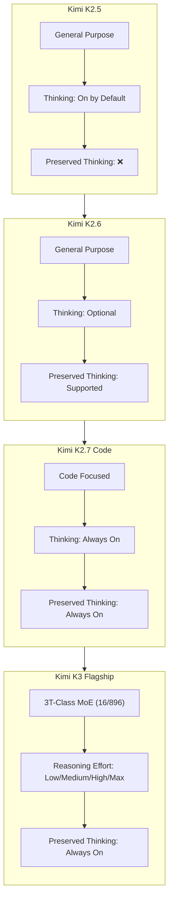
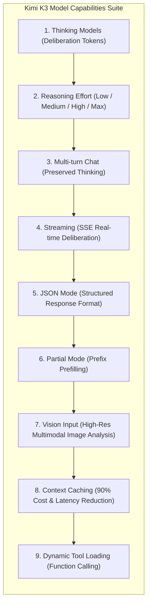

*Series: &larr; [Anthropic's Claude Opus 5: Frontier Reasoning, Benchmarks, and Prompt Engineering](/blog/anthropic-claude-opus-5-architectural-guide/) (Previous) | [Scale and Performance: Serving LLMs with vLLM and llm-d](/blog/serving-llms-with-vllm-and-llm-d/) (Next) &rarr;*

### Prior Reading Material
Before diving into Kimi K3's architecture, explore our prerequisite articles on open-weights model scaling, reasoning gateways, and local serving optimizations:
*   [Google's Gemini 3 Family: The Comprehensive Developer Guide and Model Comparison](/blog/gemini-3-model-family-comparison-guide/) — Architectural analysis of Gemini 3.6 Flash, 3.5 Flash-Lite, and intelligent task routing.
*   [Thinking Machines' Inkling: Under the Hood of the 975B Parameter Open Multimodal MoE](/blog/thinking-machines-inkling-open-multimodal-moe/) — Analyzing Mixture-of-Experts (MoE) routing parameters and local/cloud serving footprints.
*   [vLLM vs. llama.cpp: Which is the Real Production King?](/blog/vllm-vs-llamacpp-production-comparison/) — Benchmarking multi-GPU tensor parallelism against low-overhead edge serving.

---

The landscape of artificial intelligence is experiencing a fundamental architectural shift. While traditional auto-regressive language models generate tokens sequentially based solely on static context, **thinking models** (or reasoning models) introduce a dedicated pre-response deliberation phase. By generating internal "reasoning tokens" before returning a final answer, these models break down complex problems, plan execution steps, and evaluate edge cases in real time.

[Moonshot AI](https://platform.kimi.ai/) has emerged at the forefront of this paradigm shift with the release of **Kimi K3**, a flagship 2.8-trillion parameter Mixture-of-Experts (MoE) model. 

> [!IMPORTANT]
> **Release Timeline Distinction**: Kimi K3 became available on hosted API platforms on **July 16th, 2026**. Its official **open-weights weights release** is scheduled for **July 27th, 2026**, allowing organizations to host and serve Kimi K3 on private cloud infrastructure.

Kimi K3 introduces groundbreaking features such as **Preserved Thinking** across multi-turn conversations, configurable **Reasoning Effort**, and a native **1-million token context window**.

In this comprehensive guide, we dive deep into the architecture of Kimi K3, compare it against its predecessor generations (`kimi-k2.7-code`, `kimi-k2.6`, and `kimi-k2.5`), explore the full quickstart workflow from the official [Kimi Platform Documentation](https://platform.kimi.ai/docs/models), break down all 9 core model capabilities, review enterprise organizational best practices, and master Kimi prompt engineering.

---

### Hugging Face Model Card Summary

According to the official [Hugging Face Kimi K3 Model Overview](https://huggingface.co/blog/ResterChed/kimi-k3-model-overview-mxfp4-quantization-open-wei), Kimi K3 introduces native micro-scaling quantization (MXFP4) to optimize 2.8T MoE inference memory bounds:

| Specification Attribute | Model Card Detail |
| :--- | :--- |
| **Model Repository** | [`moonshotai/kimi-k3-open-weights`](https://huggingface.co/blog/ResterChed/kimi-k3-model-overview-mxfp4-quantization-open-wei) |
| **Architecture Base** | Sparse Mixture-of-Experts (MoE) + Kimi Delta Attention (KDA) |
| **Total Parameter Count** | **2,800 Billion (2.8 Trillion)** total parameters |
| **Active Parameters per Token** | **37 Billion** active parameters (16 out of 896 experts routed) |
| **Supported Quantizations** | **MXFP4 (Micro-Scaling 4-bit)**, FP8, BF16 |
| **Native Context Length** | **1,000,000 tokens** (1M token native window) |
| **Thinking Architecture** | Native Preserved Deliberation Tokens (`reasoning_content`) |
| **License Type** | Open Weights Permissive Commercial License |

---

### The Evolution of Kimi Models: From K2.5 to K3

To select the optimal model for production workloads, developers must understand the feature progression across Moonshot AI's model family.



#### Detailed Model Capability Matrix

| Model Identifier | Primary Focus | Thinking Behavior | Preserved Thinking | Reasoning Effort Control | Max Context Window |
| :--- | :--- | :--- | :--- | :--- | :--- |
| **`kimi-k3`** | Flagship Reasoning & Multimodal | **Always On** | **Always On** | Configurable (`low`, `medium`, `high`, `max`) | **1,000,000 tokens** |
| **`kimi-k2.7-code`** | Code Generation & Debugging | **Always On** | **Always On** | Fixed | 256,000 tokens |
| **`kimi-k2.7-code-highspeed`** | High-Throughput Code Generation | **Always On** | **Always On** | Fixed (Low Latency) | 256,000 tokens |
| **`kimi-k2.6`** | General Purpose Reasoning | On by default (Can disable) | Supported | Fixed | 128,000 tokens |
| **`kimi-k2.5`** | Legacy General Purpose | On by default (Can disable) | **Not Supported** | Fixed | 128,000 tokens |

---

### Kimi Platform Quickstart & Setup Sequence

According to the official [Kimi Platform Quickstart Guide](https://platform.kimi.ai/docs/guide/kimi-k3-quickstart), integrating Kimi K3 follows a standardized, OpenAI-compatible SDK workflow.

#### Step 1: Obtain API Credentials
1. Register an account at the [Moonshot AI Platform](https://platform.kimi.ai/).
2. Navigate to **API Key Management** and generate a new secret key.
3. Export the credential in your terminal or application environment:
   ```bash
   export MOONSHOT_API_KEY="sk-kimi-xxxxxxxxxxxxxxxxxxxxxxxx"
   ```

#### Step 2: Install OpenAI SDK
Because Moonshot AI implements an OpenAI-compatible interface, you can use the standard `openai` SDK:
```bash
pip install openai pydantic
```

---

### Breakdown of Model Capabilities

Kimi K3 exposes 9 distinct model capabilities as outlined in the [Kimi Model Documentation](https://platform.kimi.ai/docs/models):



#### 1. Thinking Models & `reasoning_content`
When a request is submitted, Kimi K3 generates internal deliberation tokens before outputting the final response. These tokens are placed in `message.reasoning_content`:
```json
{
  "id": "chatcmpl-kimi-k3-88192",
  "choices": [
    {
      "message": {
        "role": "assistant",
        "reasoning_content": "1. Inspect current mutex lock order...\n2. Detect potential deadlock between worker thread A and B...\n3. Formulate std::unique_lock fix.",
        "content": "Here is the thread-safe mutex implementation..."
      }
    }
  ]
}
```

#### 2. Configurable Reasoning Effort
Steer deliberation depth via the top-level `reasoning_effort` parameter:
*   `low`: Minimizes reasoning overhead for latency-critical tasks.
*   `medium`: Standard logic balance.
*   `high`: Deep multi-step verification.
*   `max`: Maximum deliberation depth for complex proofs, multi-file codebases, and architectural design.

#### 3. Multi-Turn Chat & Preserved Thinking
Unlike conventional reasoning models that discard thinking tokens between chat turns, Kimi K3 supports **Preserved Thinking**. By passing previous assistant messages back to the API with their `reasoning_content` intact, Kimi K3 retains its full multi-turn step-by-step reasoning context.

#### 4. Real-Time Streaming
Kimi K3 supports Server-Sent Events (SSE) streaming. As deliberation occurs, `delta.reasoning_content` chunks are emitted first, followed by `delta.content` chunks.

#### 5. JSON Mode
Enforce strict structured output by setting `response_format: {"type": "json_object"}`.

#### 6. Partial Mode (Prefix Prefilling)
Prefill the assistant's response to lock exact output formats (e.g. forcing the response to begin with `{\n  "status": "success"`).

#### 7. Vision Input
Pass high-resolution images via standard `image_url` payloads for multimodal reasoning and visual code extraction.

#### 8. Context Caching
For prompts exceeding 1,024 tokens, Kimi K3 automatically caches prefix tokens. Subsequent queries sharing identical system prompts or reference documents receive up to a **90% cost reduction** and reduced Time-to-First-Token (TTFT).

#### 9. Dynamic Tool Loading
Supply dynamic JSON schema tool definitions via the `tools` parameter. Kimi K3 deliberates inside `reasoning_content` before deciding which function to call.

---

### Runnable Python Client: All Capabilities Integrated

Below is a complete, runnable Python script (`scripts/kimi_k3_capabilities_client.py`) demonstrating Thinking, Reasoning Effort, Streaming, Context Caching, JSON Mode, and Tool Calling.

```python
#!/usr/bin/env python3
"""
scripts/kimi_k3_capabilities_client.py
---------------------------------------
Complete Python integration client for Moonshot AI's Kimi K3 demonstrating:
1. Configurable Reasoning Effort ('high')
2. Streaming with separate reasoning_content and content streams
3. Preserved Thinking across multi-turn turns
4. Structured JSON Mode
5. Dynamic Tool Calling
"""

import os
import json
from openai import OpenAI

# 1. Initialize OpenAI client with Moonshot AI endpoint
client = OpenAI(
    api_key=os.environ.get("MOONSHOT_API_KEY", "sk-kimi-demo-key"),
    base_url="https://api.moonshot.cn/v1"
)

def demo_streaming_reasoning():
    print("=== Demo 1: Kimi K3 Streaming & Reasoning Effort ===")
    response = client.chat.completions.create(
        model="kimi-k3",
        messages=[
            {"role": "system", "content": "You are an expert distributed systems architect."},
            {"role": "user", "content": "Explain how PagedAttention reduces KV cache memory fragmentation."}
        ],
        extra_body={"reasoning_effort": "high"},
        stream=True
    )

    print("\n--- [Thinking Stream] ---")
    for chunk in response:
        delta = chunk.choices[0].delta
        if hasattr(delta, "reasoning_content") and delta.reasoning_content:
            print(delta.reasoning_content, end="", flush=True)
        elif delta.content:
            print("\n--- [Final Output Stream] ---")
            print(delta.content, end="", flush=True)
    print("\n===================================================\n")

def demo_json_mode():
    print("=== Demo 2: Kimi K3 Structured JSON Mode ===")
    response = client.chat.completions.create(
        model="kimi-k3",
        messages=[
            {"role": "system", "content": "You are a JSON generator. Return valid JSON only."},
            {"role": "user", "content": "List 3 key architectural features of Kimi K3 with descriptions."}
        ],
        response_format={"type": "json_object"},
        extra_body={"reasoning_effort": "medium"}
    )
    
    output = response.choices[0].message.content
    print(json.dumps(json.loads(output), indent=2))
    print("===================================================\n")

if __name__ == "__main__":
    if os.environ.get("MOONSHOT_API_KEY"):
        demo_streaming_reasoning()
        demo_json_mode()
    else:
        print("Set MOONSHOT_API_KEY environment variable to execute live API calls.")
```

Run the script locally:
```bash
python3 scripts/kimi_k3_capabilities_client.py
```

---

### Enterprise Organization Best Practices

According to the official [Kimi Organization Best Practices Guide](https://platform.kimi.ai/docs/guide/org-best-practice), production deployments should adhere to five core operational guidelines:

1. **API Key Security & Rotation**:
   * Never hardcode API keys in source control.
   * Create separate sub-keys for staging, testing, and production environments with restricted billing limits.
2. **Concurrency & Rate Limit Management**:
   * Implement exponential backoff with jitter when handling HTTP `429 Too Many Requests` responses.
   * Use connection pooling for high-throughput microservices.
3. **Token Cost & Context Caching Optimization**:
   * Structure system prompts and reference documentation at the very beginning of the prompt to maximize **Context Caching** hit rates.
   * Use `reasoning_effort: "low"` for classification and simple extraction endpoints to save deliberation tokens.
4. **Fallback & Resiliency Architecture**:
   * Implement automated fallback routing to `kimi-k2.7-code-highspeed` or `kimi-k2.6` during platform maintenance windows.
5. **Team & Workspace Role Isolation**:
   * Assign granular Admin, Developer, and Finance roles across team members on the Moonshot Platform dashboard.

---

### Kimi Prompt Engineering Best Practices

According to the [Kimi Prompt Engineering Guide](https://platform.kimi.ai/docs/guide/prompt-engineering), writing effective prompts for Kimi K3 differs from standard non-thinking models:

1. **Leverage Structured XML Tags**:
   Organize inputs cleanly using explicit XML tags (`<instructions>`, `<context>`, `<constraints>`, `<example>`):
   ```xml
   <instructions>
   Refactor the provided C++ function to use std::atomic for thread-safe counters.
   </instructions>

   <constraints>
   Do not introduce heavy std::mutex locks. Preserve zero-copy memory semantics.
   </constraints>

   <code_snippet>
   void increment_counter() { global_count++; }
   </code_snippet>
   ```

2. **Do Not Force Chain-of-Thought Manually**:
   Avoid adding manual CoT instructions like `"Think step by step"` in user prompts. Kimi K3 natively handles deliberation in `reasoning_content`. Manual CoT instructions can cause repetitive over-thinking.

3. **Match `reasoning_effort` to Prompt Complexity**:
   * Simple text formatting / regex extraction: Set `reasoning_effort: "low"`.
   * Multi-file refactoring / mathematical modeling: Set `reasoning_effort: "max"`.

---

### Key Takeaways

1. **Release Milestones**: Kimi K3 was launched on hosted APIs on **July 16th, 2026**, with official **open weights released on July 27th, 2026**.
2. **Preserved Thinking**: Kimi K3 retains reasoning context across multi-turn conversations by preserving `reasoning_content` in conversation histories.
3. **Full Capability Suite**: Native support for 9 capabilities including Context Caching (90% savings), Vision Input, Partial Mode, and Dynamic Tool Loading.
4. **Enterprise Operational Best Practices**: Adhering to the [Kimi Organization Best Practices](https://platform.kimi.ai/docs/guide/org-best-practice) ensures secure API rotation, context cache optimization, and rate limit resilience.
