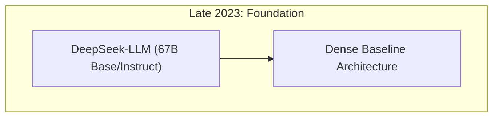
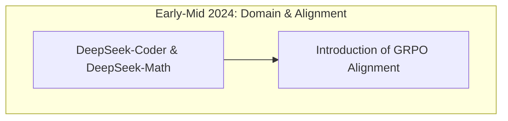
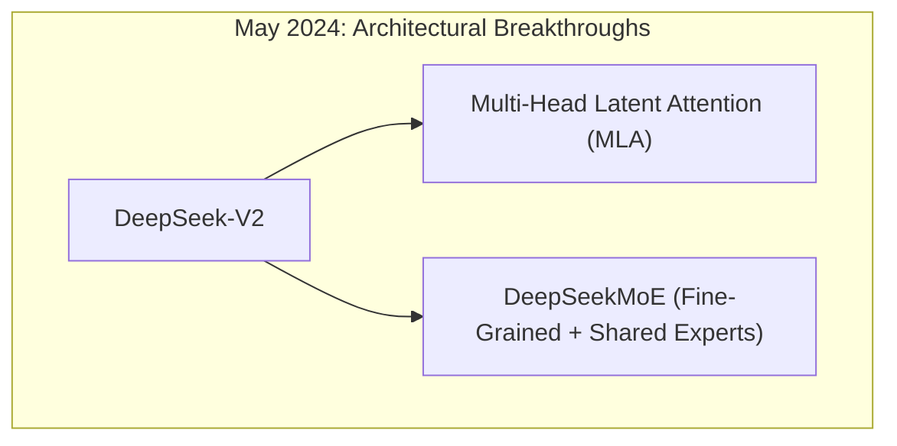
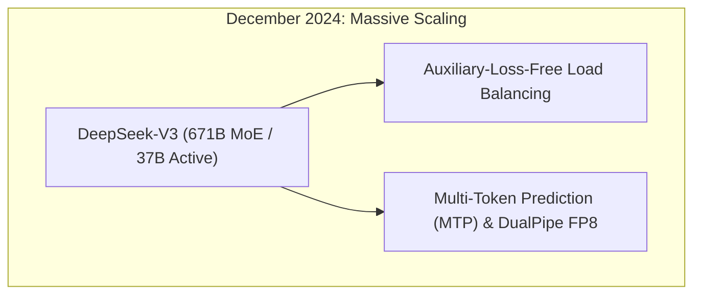
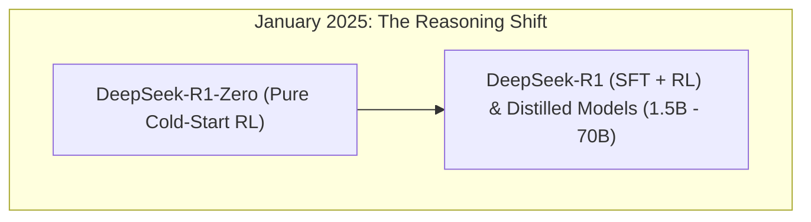
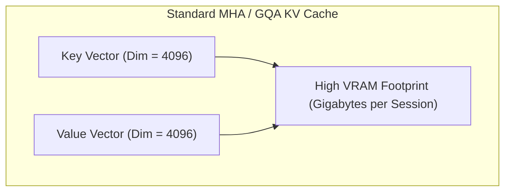
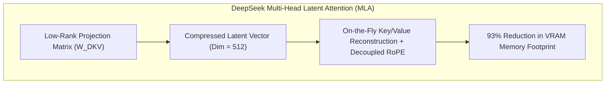

*Series: &larr; [Scale and Performance: Serving LLMs with vLLM and llm-d](/blog/serving-llms-with-vllm-and-llm-d/) (Previous)*

### Prior Reading Material
Before exploring DeepSeek's architectural innovations, review our prerequisite deep-dives into distributed serving, KV cache memory bottlenecks, and Mixture-of-Experts (MoE) scaling:
*   [Scale and Performance: Serving LLMs with vLLM and llm-d](/blog/serving-llms-with-vllm-and-llm-d/) — PagedAttention, continuous batching, and distributed disaggregated inference.
*   [Thinking Machines' Inkling: Under the Hood of the 975B Parameter Open Multimodal MoE](/blog/thinking-machines-inkling-open-multimodal-moe/) — Exploring sparse Mixture-of-Experts routing parameters and open weights.
*   [Under the Hood of Moonshot AI's Kimi K3](/blog/moonshot-ai-kimi-k3-thinking-models/) — 3-trillion parameter MoE models, linear attention compression, and Preserved Thinking.

---

In late 2024 and early 2025, the artificial intelligence landscape experienced a permanent inflection point. For years, the prevailing scaling narrative asserted that frontier-class intelligence required closed-source architectures trained on massive $100M+ GPU superclusters.

[DeepSeek](https://www.deepseek.com/) shattered this assumption. By training a 671-billion parameter flagship model (**DeepSeek-V3**) for approximately **$6 million in compute cost** and releasing its full weights open-source under the MIT license, DeepSeek forced a fundamental shift across both open-weights and proprietary AI engineering.

What made DeepSeek an inflection point was not merely its disruptive cost efficiency, but a series of radical architectural breakthroughs: **Multi-Head Latent Attention (MLA)**, **DeepSeekMoE** fine-grained routing, **Auxiliary-Loss-Free Load Balancing**, **Multi-Token Prediction (MTP)**, and pure **Cold-Start Reinforcement Learning (R1-Zero)**.

In this deep-dive, we trace DeepSeek's evolutionary lineage, analyze its core architectural innovations, build an MLA memory simulation in Python, and compare its impact on contemporary mid-2026 models.

---

### Evolutionary Lineage: From Base Models to Emergent Reasoning











#### Detailed Model Generation Matrix

| Model Generation | Release Date | Key Innovations & Architectural Milestones | Context Window | Licensing |
| :--- | :--- | :--- | :--- | :--- |
| **DeepSeek-LLM** | Late 2023 | 67B dense base and instruct models establishing baseline evaluation. | 4,096 tokens | Open Weights |
| **DeepSeek-Coder / Math** | Early-Mid 2024 | Introduced **Group Relative Policy Optimization (GRPO)**, removing critic model memory overhead. | 16,384 tokens | Open Weights |
| **DeepSeek-V2** | May 2024 | Debuted **Multi-Head Latent Attention (MLA)** & **DeepSeekMoE** fine-grained routing. | 128,000 tokens | Open Weights |
| **DeepSeek-V3** | Dec 2024 | 671B MoE (37B active), **Auxiliary-Loss-Free Load Balancing**, MTP, DualPipe FP8 training. | 128,000 tokens | **MIT License** |
| **DeepSeek-R1 / R1-Zero** | Jan 2025 | Pure cold-start RL proving emergent self-correction/CoT reasoning without SFT; distilled to 1.5B–70B. | 128,000 tokens | **MIT License** |

---

### Core Architectural Breakthroughs

#### 1. Multi-Head Latent Attention (MLA): Low-Rank KV Compression
In standard Multi-Head Attention (MHA) or Grouped-Query Attention (GQA), the Key-Value (KV) cache grows linearly with context length and batch size, consuming up to 80% of GPU VRAM during inference.

MLA solves this by projecting the Key and Value matrices into a compressed **512-dimensional latent vector** ($c_t^{KV}$):

$$c_t^{KV} = W^{DKV} h_t$$

During generation, the model only stores the compressed latent vector $c_t^{KV}$ in VRAM. Keys and Values are reconstructed on-the-fly via decoupled Rotary Position Embeddings (RoPE), achieving a **93% reduction in KV cache memory footprint** compared to MHA.





#### 2. DeepSeekMoE: Fine-Grained & Shared Experts
Traditional Mixture-of-Experts architectures (e.g., 8 large experts with 2 active) suffer from coarse specialization. DeepSeekMoE split experts into **160/256 small, fine-grained experts** while pinning fixed **shared experts**:
*   **Shared Experts**: Process universal language syntax and common background tokens.
*   **Fine-Grained Routing**: Allows tokens to select from a larger pool of specialized micro-experts, improving representation quality.

#### 3. Auxiliary-Loss-Free Load Balancing
Standard MoE routers use auxiliary loss penalties to enforce even GPU workload distribution. However, forced balance degrades model capacity when certain experts are naturally better suited for specific prompt domains.

DeepSeek introduced **dynamic router bias adjustment**: the router dynamically adjusts bias terms per expert during training without modifying the loss function, achieving perfect GPU load balance with **zero capacity penalty**.

#### 4. Pure Cold-Start RL (DeepSeek-R1-Zero)
DeepSeek-R1-Zero proved a monumental thesis: applying pure Reinforcement Learning (via GRPO) directly to a base model—without human-curated Supervised Fine-Tuning (SFT)—causes the model to naturally develop self-correction, verification loops, and long Chain-of-Thought (CoT) reasoning behaviors.

---

### Hands-On Simulation: Multi-Head Latent Attention (MLA) Memory Profiler

Below is a Python script (`scripts/deepseek_mla_simulator.py`) simulating and profiling the memory footprint of standard Multi-Head Attention (MHA), Grouped-Query Attention (GQA), and DeepSeek's Multi-Head Latent Attention (MLA).

```python
#!/usr/bin/env python3
"""
scripts/deepseek_mla_simulator.py
---------------------------------
Memory allocation profiler comparing standard Multi-Head Attention (MHA),
Grouped-Query Attention (GQA), and DeepSeek Multi-Head Latent Attention (MLA).
"""

import numpy as np

def calculate_kv_cache_bytes(seq_len: int, num_layers: int, num_heads: int, head_dim: int, precision_bytes: int = 2):
    """
    Calculates KV cache memory in Megabytes for standard MHA.
    """
    # 2 for Key and Value matrices
    total_elements = 2 * num_layers * seq_len * num_heads * head_dim
    return (total_elements * precision_bytes) / (1024 * 1024)

def calculate_mla_cache_bytes(seq_len: int, num_layers: int, latent_dim: int = 512, rope_dim: int = 64, precision_bytes: int = 2):
    """
    Calculates KV cache memory in Megabytes for DeepSeek MLA.
    MLA stores compressed latent vector (512-dim) + decoupled RoPE key (64-dim).
    """
    elements_per_token = (latent_dim + rope_dim) * num_layers
    total_elements = seq_len * elements_per_token
    return (total_elements * precision_bytes) / (1024 * 1024)

def run_memory_profile():
    seq_length = 128000  # 128k context window
    num_layers = 61      # DeepSeek-V3 layer count
    num_heads = 128      # Standard attention heads
    head_dim = 128       # Dimension per head

    mha_mb = calculate_kv_cache_bytes(seq_length, num_layers, num_heads, head_dim)
    gqa_mb = calculate_kv_cache_bytes(seq_length, num_layers, num_heads // 8, head_dim)
    mla_mb = calculate_mla_cache_bytes(seq_length, num_layers, latent_dim=512, rope_dim=64)

    print(f"=== DeepSeek MLA Memory Footprint Profile ===")
    print(f"Context Length: {seq_length:,} tokens | Layers: {num_layers}")
    print(f"Standard MHA KV Cache Size : {mha_mb:.2f} MB ({mha_mb / 1024:.2f} GB)")
    print(f"Grouped Query (GQA-8) Size: {gqa_mb:.2f} MB ({gqa_mb / 1024:.2f} GB)")
    print(f"DeepSeek MLA KV Cache Size: {mla_mb:.2f} MB ({mla_mb / 1024:.2f} GB)")
    print(f"Memory Reduction vs MHA   : {(1.0 - mla_mb / mha_mb) * 100:.1f}%")
    print(f"Memory Reduction vs GQA-8 : {(1.0 - mla_mb / gqa_mb) * 100:.1f}%")
    print("==============================================\n")

if __name__ == "__main__":
    run_memory_profile()
```

Run the profiler locally:
```bash
python3 scripts/deepseek_mla_simulator.py
```

---

### Contemporary Model Comparison (Mid-2026 Landscape)

How DeepSeek's architectural innovations influence today's frontier open-weight and proprietary models:

| Model | Provider | Parameter Scale | Architecture / Routing | Attention / KV Optimization | Licensing |
| :--- | :--- | :--- | :--- | :--- | :--- |
| **DeepSeek-V3 / R1** | DeepSeek | 671B MoE (37B Active) | 8 / 256 Fine-Grained Experts | Multi-Head Latent Attention (MLA) | **MIT License** |
| **Inkling 975B** | Thinking Machines | 975B MoE | 8 / 128 Active Experts | Dynamic Paging + MoE Routing | **Apache-2.0** |
| **Kimi K3** | Moonshot AI | 2.8T MoE | 16 / 896 Active Experts | Kimi Delta Attention (KDA) | Open Weights / API |
| **Qwen 3.8-Max** | Alibaba | 2.4T MoE | Sparse Dynamic Expert Routing | GQA + Latent KV Compression | Open Preview |
| **Claude Opus 5** | Anthropic | Undisclosed | Dynamic Extended Thinking | Managed Extended Thinking | Proprietary API |
| **Gemini 3 Flash** | Google | Undisclosed | Dense Multimodal | Linearized KV Cache | Proprietary API |

---

### Key Takeaways

1.  **Cost & Memory Shift**: DeepSeek proved that architectural innovations (MLA, dynamic router bias) produce greater performance gains than brute-force GPU scaling.
2.  **Open-Weights Democratization**: By releasing DeepSeek-V3 and R1 under the MIT license, high-level reasoning and multi-token prediction became accessible to private cloud deployments worldwide.
3.  **Emergent RL Reasoning**: R1-Zero proved that cold-start Reinforcement Learning without human SFT generates robust self-correcting reasoning loops, inspiring current frontier reasoning models.
