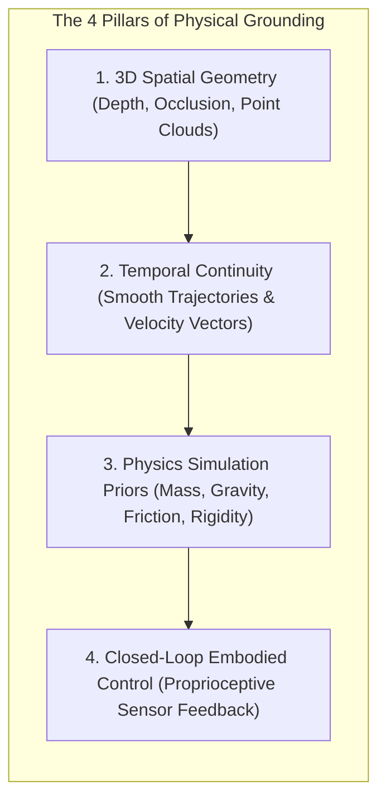
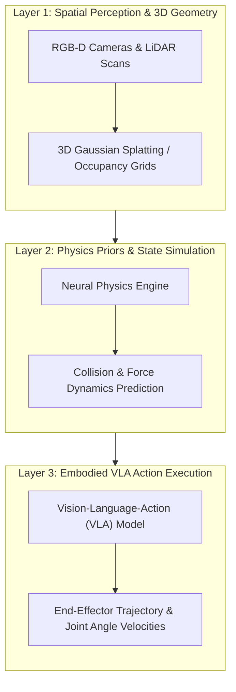

*Series: &larr; [The DeepSeek Architectural Inflection Point](/blog/deepseek-architectural-inflection-point/) (Previous) | [Hosting Moonshot AI's Kimi K3 Open Weights with vLLM: High-Throughput Serving at Scale](/blog/hosting-kimi-k3-vllm/) (Next) &rarr;*

### Prior Reading Material
Before exploring Physical AI models, review our prerequisite deep-dives into World Foundation Models, multimodal spatial reasoning, and distributed inference:
*   [The Architectural Spectrum of World Foundation Models](/blog/architecture-of-world-foundation-models/) — Functional taxonomy of Spatial Renderers, State Simulators, and Action Planners.
*   [Thinking Machines' Inkling: Under the Hood of the 975B Parameter Open Multimodal MoE](/blog/thinking-machines-inkling-open-multimodal-moe/) — Analyzing Mixture-of-Experts (MoE) routing parameters and visual-spatial reasoning.
*   [Google's Gemini 3 Family: The Comprehensive Developer Guide and Model Comparison](/blog/gemini-3-model-family-comparison-guide/) — Native multimodal video and spatial input processing.

---

For decades, artificial intelligence developed inside a digital vacuum. Large Language Models (LLMs) mastered the statistical distribution of human text tokens, and Vision-Language Models (VLMs) mapped pixels to 2D semantic captions. However, neither class of model understood the fundamental physical laws governing our 3D reality.

A text model has no concept of gravity, mass, friction, inertia, or 3D spatial occlusion. If an autonomous robot relies purely on 2D visual patterns, it cannot reliably estimate depth, predict object collisions, or exert precise contact forces.

This disconnect has driven the emergence of **Physical AI Models**: artificial intelligence architectures explicitly grounded in **spatial 3D understanding**, **physics simulation priors**, and **embodied motor control**.

In this deep-dive, we define what makes a model "Physical", break down the three architectural layers of physical grounding, examine official Model Card specifications, build a runnable Python spatial control simulator, and explore how Physical AI powers modern humanoid robotics and industrial digital twins.

---

### Official Model Card Summary: Physical AI Foundation Models

According to official model documentation across [OpenVLA](https://openvla.github.io/), [World Labs](https://www.worldlabs.ai/), and [NVIDIA Isaac Lab](https://developer.nvidia.com/isaac/sim), Physical AI foundation models span three distinct operational categories:

| Specification Attribute | OpenVLA (7B) | World Labs Spatial-1 | RT-2-X (Vision-Language-Action) | NVIDIA Isaac Orbit / Lab |
| :--- | :--- | :--- | :--- | :--- |
| **Primary Domain** | Open-Weights Embodied Control | 3D Spatial Geometry & Physics | Multi-Robot Manipulation | Neural Physics & Digital Twin |
| **Model Repository / Source** | [`openvla/openvla-7b`](https://openvla.github.io/) | [World Labs Spatial AI](https://www.worldlabs.ai/) | [Google DeepMind RT-X](https://deepmind.google/discover/blog/shaping-the-future-of-robotics-with-rt-x/) | [`NVIDIA-Omniverse/IsaacLab`](https://github.com/isaac-sim/IsaacLab) |
| **Input Modality** | RGB Camera + Text Instructions | 2D Image / Video + 3D Scans | Multi-Camera Video + Task Prompts | 3D Sensor Mesh + Joint States |
| **Output Representation** | 7-DOF Robot Delta Actions | 3D Gaussian Splatting + Mesh | 6-DOF End-Effector Trajectories | Joint Angle Velocities & Torques |
| **Control Frequency** | 10 Hz – 50 Hz | Real-Time Render (60 FPS) | 20 Hz | **100 Hz – 1000 Hz** |
| **Physics Grounding** | Empirical (RLDS Robot Data) | Explicit 3D Physics Priors | Empirical Trajectory Transfer | Differentiable GPU Physics (PhysX) |
| **License Type** | **Apache-2.0** | Proprietary Cloud API | Research Open Access | **BSD-3-Clause** |

---

### What Makes a Model "Physical"? (The Core Definition)

A model transitions from a general multimodal LLM to a true **Physical AI Model** when it incorporates four fundamental physical priors:



1.  **3D Spatial Geometry**: The model operates in 3D Euclidean space ($x, y, z$) rather than 2D pixel coordinates ($u, v$). It natively models spatial depth, volume, and bounding boxes.
2.  **Temporal Continuity**: The model understands that physical objects cannot teleport between frames. Velocity, acceleration, and momentum vectors must obey continuous differential equations.
3.  **Physics Simulation Priors**: The model predicts physical interactions—such as collision boundaries, friction coefficients, surface compliance, and center-of-mass dynamics.
4.  **Closed-Loop Proprioceptive Feedback**: The model continuously compares its internal spatial state against real-world joint encoder readouts and force-torque sensors at frequencies up to 100 Hz.

---

### The 3 Architectural Layers of Physical AI



#### Layer 1: Spatial Perception & 3D Geometry
Raw camera pixels are transformed into explicit 3D spatial representations:
*   **3D Gaussian Splatting (3DGS)**: Represents scenes as millions of continuous 3D Gaussians, allowing instant volumetric rendering and collision checking.
*   **Occupancy Networks & Voxel Grids**: Discretizes 3D space into occupied vs. free spatial cells for navigation and path planning.

#### Layer 2: Physics Priors & State Simulation
Before issuing motor commands, the Physical AI model simulates the physical outcome of actions using differentiable neural physics:
*   **Mass & Friction Estimation**: Predicts whether a glass container will slip based on surface material properties.
*   **Contact Dynamics**: Simulates deformation, rigid body impacts, and liquid containment.

#### Layer 3: Embodied Vision-Language-Action (VLA) Execution
The high-level spatial plan is translated into low-level motor commands for robotic hardware:
*   **End-Effector Pose ($x, y, z, \text{roll}, \text{pitch}, \text{yaw}$)**: Specifies target gripper orientation.
*   **Joint Angle Velocity Commands ($\dot{\theta}_1, \dot{\theta}_2, \dots, \dot{\theta}_6$)**: Direct motor torque inputs executing at 50 Hz.

---

### Hands-On Simulation: Physical AI Spatial Control & Kinematics Loop

Below is a complete Python script (`scripts/physical_ai_spatial_control.py`) demonstrating 3D spatial goal state prediction, physics obstacle collision checking, and inverse kinematics trajectory planning for a 6-DOF robotic manipulator arm.

```python
#!/usr/bin/env python3
"""
scripts/physical_ai_spatial_control.py
---------------------------------------
Physical AI simulation module demonstrating:
1. 3D Spatial Target Representation (x, y, z in meters)
2. Physics Collision Boundary Validation (Rigid Body Obstacles)
3. 6-DOF Inverse Kinematics Trajectory Generation (50 Hz Control Loop)
"""

import math
import time

class PhysicalSpatialEnvironment:
    def __init__(self):
        # Bounding box obstacle [x_min, x_max, y_min, y_max, z_min, z_max]
        self.obstacle_bbox = [0.2, 0.4, -0.1, 0.1, 0.0, 0.3]
        self.arm_base = (0.0, 0.0, 0.0)
        self.link_lengths = [0.3, 0.3, 0.2]  # 3 main link lengths in meters

    def is_collision_free(self, position_3d):
        x, y, z = position_3d
        o = self.obstacle_bbox
        if (o[0] <= x <= o[1]) and (o[2] <= y <= o[3]) and (o[4] <= z <= o[5]):
            return False  # Collision detected
        return True

    def compute_inverse_kinematics(self, target_3d):
        """
        Calculates 3-link planar approximation for joint angles (theta_1, theta_2, theta_3).
        """
        x, y, z = target_3d
        l1, l2, l3 = self.link_lengths
        
        # Base rotation angle
        theta_1 = math.atan2(y, x)
        
        # Distance in planar projection
        r = math.sqrt(x**2 + y**2) - l3
        d = math.sqrt(r**2 + z**2)
        
        # Cosine rule for shoulder and elbow angles
        cos_elbow = (d**2 - l1**2 - l2**2) / (2 * l1 * l2)
        cos_elbow = max(-1.0, min(1.0, cos_elbow))
        theta_3 = math.acos(cos_elbow)
        
        theta_2 = math.atan2(z, r) - math.atan2(l2 * math.sin(theta_3), l1 + l2 * math.cos(theta_3))
        
        return [math.degrees(theta_1), math.degrees(theta_2), math.degrees(theta_3)]

def run_physical_ai_control_loop():
    env = PhysicalSpatialEnvironment()
    target_goal = (0.5, 0.2, 0.2)  # Target coordinates in meters
    
    print("=== Physical AI Spatial Control & Kinematics Profiler ===")
    print(f"Robot Base      : {env.arm_base}")
    print(f"Target Goal 3D  : {target_goal}")
    print(f"Obstacle BBox   : {env.obstacle_bbox}")
    
    # 1. Physics & Collision Check
    if not env.is_collision_free(target_goal):
        print("\n❌ Error: Target Goal penetrates physical obstacle boundary!")
        return
    else:
        print("\n✅ Collision Check Passed: Target is physically valid.")
        
    # 2. Kinematics Trajectory Generation
    joint_angles = env.compute_inverse_kinematics(target_goal)
    print(f"\nComputed Joint Angles (50 Hz Control Command):")
    print(f"  • Base Rotation  (θ1): {joint_angles[0]:.2f}°")
    print(f"  • Shoulder Pitch (θ2): {joint_angles[1]:.2f}°")
    print(f"  • Elbow Pitch    (θ3): {joint_angles[2]:.2f}°")
    print("========================================================\n")

if __name__ == "__main__":
    run_physical_ai_control_loop()
```

Run the profiler locally:
```bash
python3 scripts/physical_ai_spatial_control.py
```

---

### Real-World Applications in Robotics & Digital Twins

#### 1. Humanoid Robotics (Figure 02, Unitree H1, Boston Dynamics Atlas)
Humanoid robots rely on Physical AI to navigate human environments. Models trained on OpenVLA and Isaac Lab allow humanoids to grasp un-modeled household objects, walk across uneven terrain, and adjust foot placement in real time based on force-torque feedback.

#### 2. Autonomous Driving & End-to-End World Models
Autonomous vehicles (such as Waymo and Tesla FSD) use physical vision-action models to predict 3D trajectories of pedestrians and surrounding vehicles, ensuring decisions strictly obey vehicle kinematics and brake distance physics.

#### 3. Industrial Digital Twins (NVIDIA Omniverse & Isaac Sim)
Factories deploy neural physics engines inside NVIDIA Omniverse to simulate entire assembly lines. Robots learn complex assembly tasks inside a GPU-accelerated digital twin before zero-shot transferring policies to physical hardware.

---

### Key Takeaways

1.  **Beyond Token Statistics**: Physical AI models ground artificial intelligence in 3D Euclidean geometry, gravity, mass, friction, and continuous kinematics.
2.  **The 3-Layer Control Stack**: Physical AI bridges Spatial 3D Perception, Neural Physics Simulation, and Embodied VLA Action Execution.
3.  **Real-Time Control Loop**: Unlike asynchronous LLM text generation, embodied physical agents execute proprioceptive control loops at frequencies from 50 Hz up to 1000 Hz.
