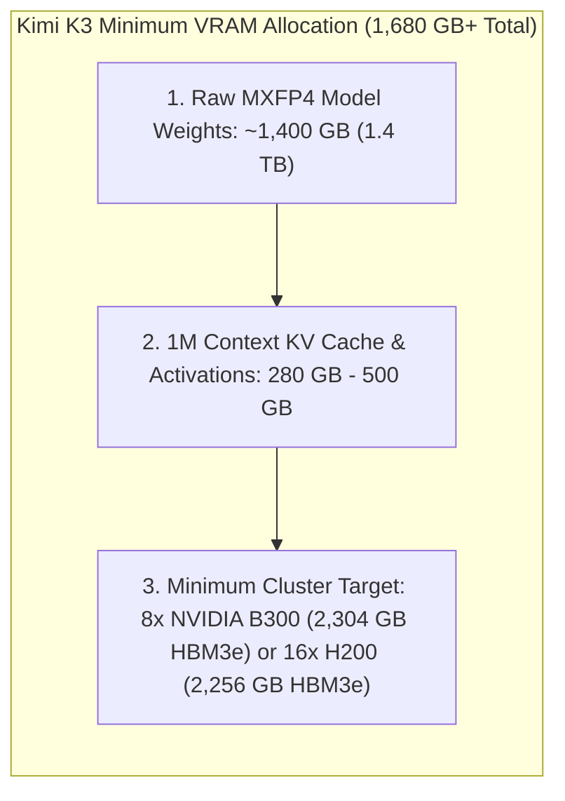
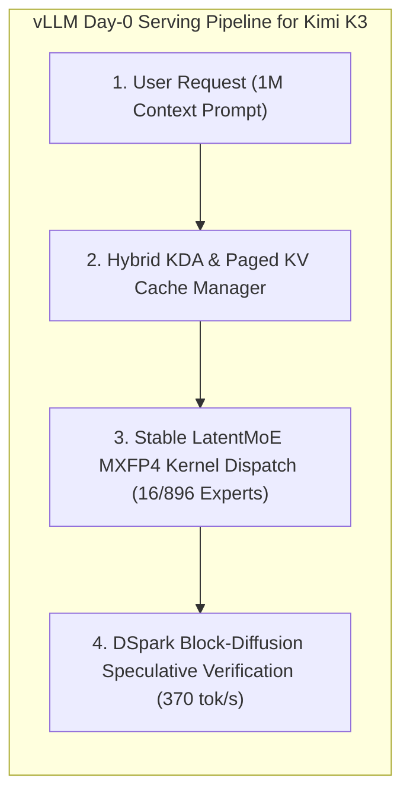
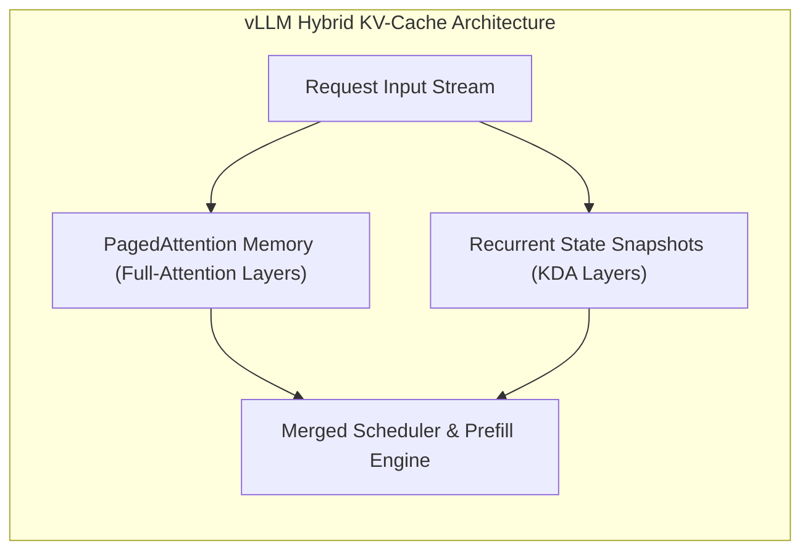
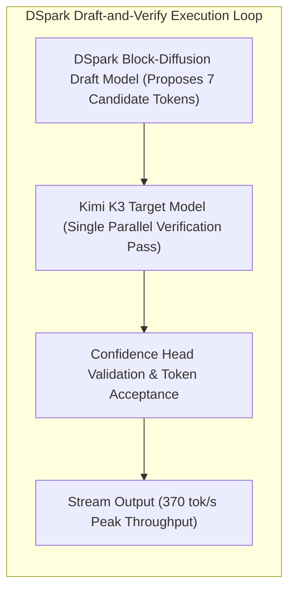

*Series: &larr; [Physical AI Models: Grounding Intelligence in Space, Physics, and Robotics](/blog/physical-ai-models-grounding-in-space-and-robotics/) (Previous)*

### Prior Reading Material
Before exploring self-hosted Kimi K3 inference, review our prerequisite deep-dives into model architecture, serving runtimes, and distributed disaggregation:
*   [Under the Hood of Moonshot AI's Kimi K3: The Architecture of 3-Trillion Parameter Thinking Models](/blog/moonshot-ai-kimi-k3-thinking-models/) — Comprehensive architectural breakdown of Kimi K3's 2.8T MoE, KDA linear attention, and 1M context window.
*   [Scale and Performance: Serving LLMs with vLLM and llm-d](/blog/serving-llms-with-vllm-and-llm-d/) — PagedAttention virtual memory paging and distributed prefill/decode disaggregation.
*   [Physical AI Models: Grounding Intelligence in Space, Physics, and Robotics](/blog/physical-ai-models-grounding-in-space-and-robotics/) — Spatial 3D geometry priors, neural physics simulators, and embodied VLA control loops.

---

The landscape of frontier artificial intelligence reached a historic turning point when Moonshot AI officially open-sourced the full model weights for **Kimi K3** under open access licenses ([Hugging Face Model Repository](https://huggingface.co/moonshotai/Kimi-K3)).

With 2.8 trillion total parameters (activating 37B across 16 of 896 routing experts per token) and a native 1-million-token context window, Kimi K3 delivers reasoning capabilities that rival closed API flagships like OpenAI GPT-5 and Anthropic Claude Opus 5. As highlighted in [Tom's Hardware's Coverage](https://www.tomshardware.com/tech-industry/artificial-intelligence/moonshot-ai-releases-weights-for-kimi-k3-firing-a-shot-across-the-bow-of-openai-and-anthropic-open-weight-model-performs-almost-as-well-as-frontier-models-while-being-2-3x-easier-to-run), self-hosting open-weight frontier models allows enterprises to achieve up to **10x cost savings on cached prompt workloads** while maintaining absolute data sovereignty.

Simultaneously, the vLLM core engineering team and Inferact announced **Day-0 production serving support for Kimi K3** ([vLLM Kimi K3 Release Announcement](https://vllm.ai/blog/2026-07-27-k3)). By integrating hybrid Kimi Delta Attention (KDA) prefix caching, native MXFP4 4-bit quantization kernels, and open-source **DSpark speculative decoding**, vLLM accelerates Kimi K3 single-user streaming throughput from 118 tokens/sec up to **370 tokens/sec** (a 3.14x speedup).

In this technical guide, we examine the open-weights paradigm shift, break down vLLM's day-0 Kimi K3 serving architecture, inspect official Hugging Face specifications, deploy vLLM container recipes on NVIDIA and AMD hardware, and execute a runnable Python streaming benchmark script.

---

### Official Model Card Summary: Moonshot AI Kimi K3

| Attribute Specification | Official Model Card Details |
| :--- | :--- |
| **Model Repository** | [`moonshotai/Kimi-K3`](https://huggingface.co/moonshotai/Kimi-K3) |
| **Total Parameter Count** | **2.8 Trillion Parameters (2,800B)** |
| **Active Routing Parameters** | **37 Billion Active Parameters** (16 of 896 experts routed per token) |
| **Context Window Size** | **1,048,576 Tokens (1M Native Context)** |
| **Weight Quantization** | Native Micro-Scaling FP4 (**MXFP4 4-bit**) |
| **Attention Mechanism** | Kimi Delta Attention (**KDA**) + Periodic Full-Attention Layers |
| **Residual Architecture** | Block Attention Residuals (**AttnRes**) |
| **Serving Throughput (vLLM)** | **118 tok/s** (Baseline) &rarr; **370 tok/s** (with DSpark Speculator) |
| **Hardware Requirements** | 8x NVIDIA B300 / GB300 NVL72 or 8x AMD MI355X GPUs |
| **License Type** | **Modified Apache-2.0 / Open Access** |

---

### The Open-Weights Paradigm Shift & Jensen Huang's Declaration

The release of Kimi K3's weights coincided with a historic declaration by NVIDIA CEO **Jensen Huang**, who published an industry manifesto titled *"Open Weights and American AI Leadership"*:

> *"The world needs both frontier closed models and frontier open models. Open-weight models ensure that enterprises do not suffer single-vendor lock-in, preserve strict data control, and allow researchers worldwide to audit safety mechanisms directly."*  
> — **Jensen Huang, CEO of NVIDIA**

By deploying open-weight foundation models locally or within private cloud VPCs, organizations retain control over proprietary fine-tuning, system prompts, and sensitive customer records without transmitting telemetry to third-party managed API endpoints.

---

### The Self-Hosting Reality: Hardware Costs, VRAM Calculations & The "Open-Weights Illusion"

While the release of Kimi K3's weights under open licenses is a monumental achievement, developer community discussions (e.g. [Reddit r/AI_Agents Discussion](https://reddit.com/r/AI_Agents)) highlight a stark hardware reality: **Kimi K3 is open-weights, but it is not easily self-hostable by individual developers or small labs.**



#### 1. The 1.4 TB Memory Weight Floor
Even when utilizing native Micro-Scaling FP4 (**MXFP4 4-bit**) quantization, Kimi K3's 2.8 trillion parameters require **~1,400 GB to 1,560 GB of VRAM** just to load the model parameters into GPU memory before processing a single input token.

When factoring in runtime workspace overhead, intermediate activations, and KV cache memory for 1M-token context streams across concurrent user sessions, total serving requirements reach **1,680 GB+ to 2,300 GB+ of High-Bandwidth Memory (HBM3e)**.

#### 2. GPU Cluster Configurations & Financial Capital Expenditure

| GPU Architecture | VRAM per GPU | Minimum GPUs Required | Node Count & Interconnect | Estimated Hardware / Cloud Cost |
| :--- | :--- | :--- | :--- | :--- |
| **NVIDIA B300 (Blackwell Ultra)** | **288 GB HBM3e** | **8 GPUs** (2,304 GB Total) | 1 HGX B300 Node (NVLink) | ~$300,000+ per node / ~$25/hr Cloud |
| **NVIDIA H200 (Hopper)** | **141 GB HBM3e** | **16 GPUs** (2,256 GB Total) | 2 HGX H200 Nodes (NVSwitch) | ~$350,000+ total / ~$35/hr Cloud |
| **NVIDIA H100 (Hopper)** | **80 GB HBM3e** | **24 GPUs** (1,920 GB Total) | 3 HGX H100 Nodes (NVSwitch) | ~$450,000+ total / ~$45/hr Cloud |
| **AMD MI355X** | **288 GB HBM3e** | **8 GPUs** (2,304 GB Total) | 1 MI355X Node (Infinity Fabric) | Enterprise Data Center |

#### 3. The Developer Accessibility Gap & Data Sovereignty Paradox
*   **Consumer Hardware Impossibility**: No consumer workstation (e.g. dual RTX 4090s with 48GB VRAM or Apple M3/M4 Max Mac Studio with 192GB Unified Memory) can load 1.4TB of model weights. CPU RAM offloading reduces inference speeds to $<0.1$ tokens/sec, rendering local execution unusable.
*   **API Fallback Tension**: Because self-hosting requires a $300k+ enterprise GPU cluster, over 95% of developers building autonomous agent workflows end up defaulting to Moonshot's hosted API endpoints. This creates an ongoing debate in the open-source community: *open weights grant code transparency and auditability, but hardware barriers force reliance on centralized infrastructure.*

---

### vLLM's Day-0 Kimi K3 Serving Architecture

According to the official [vLLM Engineering Deep-Dive](https://vllm.ai/blog/2026-07-27-k3), serving a 2.8T hybrid MoE model requires overcoming three major computational bottlenecks:



#### 1. Hybrid KDA & Paged KV Cache Manager
Kimi K3 replaces quadratic multi-head attention across most sublayers with **Kimi Delta Attention (KDA)**—a linear attention mechanism maintaining a compact fixed-size recurrent state—interleaved with periodic full-attention layers.

vLLM's scheduler manages two distinct memory pools side-by-side:
*   **Paged KV Blocks**: Allocates standard PagedAttention virtual memory pages for full-attention layers.
*   **Recurrent State Snapshots**: Manages compact recurrent-state blocks for KDA layers. When a shared prompt prefix matches in cache, vLLM copies recurrent state snapshots in $O(1)$ time, eliminating prefill compute for long system prompts.



#### 2. DSpark Speculative Decoding (370 Tokens/sec)
To reach single-stream speeds of 370 tokens/sec, vLLM supports **DSpark**—a block-diffusion speculative decoding algorithm open-sourced by Inferact ([`Inferact/Kimi-K3-DSpark`](https://huggingface.co/Inferact/Kimi-K3-DSpark)).



*   **Block-Diffusion Drafting**: A lightweight draft model generates 7 candidate tokens in a single parallel pass.
*   **High Acceptance Rates**: On low-entropy tasks (e.g. coding and mathematics), DSpark achieves **4.73 accepted tokens per verification step**, yielding a 3.14x speedup over standard single-token decoding.

---

### Production Deployment Commands & Container Recipes

You can launch a production-ready OpenAI-compatible Kimi K3 inference server using vLLM's official Docker recipes ([vLLM Recipes Repository](https://recipes.vllm.ai/moonshotai/Kimi-K3)):

```bash
# Production Docker Serve Command for Kimi K3 on 8x GPUs
docker run --gpus all --ipc=host --net=host \
  vllm/vllm-openai:latest \
  vllm serve moonshotai/Kimi-K3 \
  --tensor-parallel-size 8 \
  --trust-remote-code \
  --load-format fastsafetensors \
  --enable-prefix-caching \
  --enable-auto-tool-choice \
  --tool-call-parser kimi_k3 \
  --reasoning-parser kimi_k3 \
  --speculative-config '{"model":"Inferact/Kimi-K3-DSpark","method":"dspark","num_speculative_tokens":7,"attention_backend":"FLASHINFER_MLA","draft_sample_method":"probabilistic","rejection_sample_method":"block"}'
```

---

### Runnable Benchmark: vLLM Kimi K3 Client & Profiler

Below is a runnable Python benchmark script (`scripts/kimi_k3_vllm_host.py`) using the OpenAI client SDK to connect to a local or remote vLLM Kimi K3 instance, measuring Time-to-First-Token (TTFT), Inter-Token Latency (ITL), and streaming generation speed.

```python
#!/usr/bin/env python3
"""
scripts/kimi_k3_vllm_host.py
----------------------------
Async Python benchmark client for vLLM self-hosted Kimi K3 open weights.
Measures Time-to-First-Token (TTFT), Inter-Token Latency (ITL), and Tok/s throughput.
"""

import asyncio
import time
from openai import AsyncOpenAI

# Initialize OpenAI-compatible client pointing to local vLLM server
client = AsyncOpenAI(
    base_url="http://localhost:8000/v1",
    api_key="EMPTY"  # vLLM local dev key
)

async def benchmark_kimi_k3_stream():
    prompt = "Explain the architectural differences between Kimi Delta Attention (KDA) and standard Multi-Head Attention."
    print("=== vLLM Kimi K3 Open Weights Streaming Benchmark ===")
    print(f"Target Server : http://localhost:8000/v1")
    print(f"Prompt        : '{prompt}'\n")

    start_time = time.perf_counter()
    first_token_time = None
    token_timestamps = []

    try:
        response = await client.chat.completions.create(
            model="moonshotai/Kimi-K3",
            messages=[{"role": "user", "content": prompt}],
            temperature=0.6,
            extra_body={
                "reasoning_effort": "high"
            },
            stream=True
        )

        output_text = ""
        async for chunk in response:
            if chunk.choices and chunk.choices[0].delta.content:
                now = time.perf_counter()
                if first_token_time is None:
                    first_token_time = now
                token_timestamps.append(now)
                output_text += chunk.choices[0].delta.content

        end_time = time.perf_counter()
        total_tokens = len(token_timestamps)
        
        if total_tokens > 0:
            ttft_ms = (first_token_time - start_time) * 1000
            total_duration = end_time - start_time
            decode_duration = end_time - first_token_time
            tps = total_tokens / decode_duration if decode_duration > 0 else 0
            
            print("--- Benchmark Results ---")
            print(f"  • Total Tokens Generated : {total_tokens}")
            print(f"  • Time-to-First-Token (TTFT): {ttft_ms:.2f} ms")
            print(f"  • Generation Throughput   : {tps:.1f} tokens/sec")
            print(f"  • Total Latency           : {total_duration:.2f} s")
            print("-------------------------\n")
            print(f"Response Preview:\n{output_text[:200]}...\n")
    
    except Exception as e:
        print(f"⚠️ Could not connect to vLLM endpoint: {e}")
        print("Note: Ensure vLLM server is running locally on port 8000.")

if __name__ == "__main__":
    asyncio.run(benchmark_kimi_k3_stream())
```

Run the client script:
```bash
python3 scripts/kimi_k3_vllm_host.py
```

---

### Key Takeaways

1.  **Open-Weights Frontier Equality**: Moonshot AI's release of Kimi K3 open weights enables self-hosted inference matching closed-source flagships.
2.  **vLLM Day-0 Optimization**: vLLM's hybrid KDA cache manager and native MXFP4 kernels eliminate memory bottlenecks across 1M token contexts.
3.  **DSpark Speculative Acceleration**: Deploying Inferact's open-source DSpark speculator boosts single-user streaming throughput up to 370 tokens/sec on NVIDIA B300 and AMD MI355X hardware.
