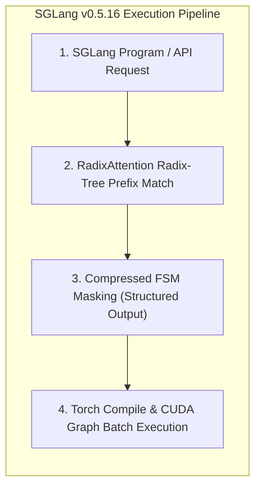
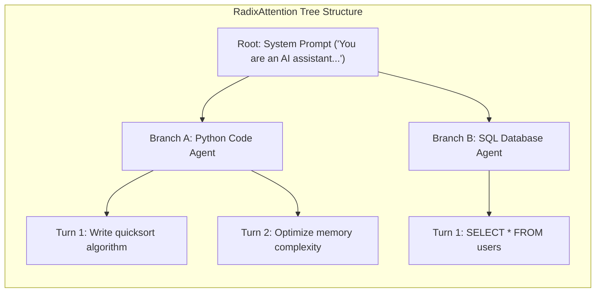

*Series: &larr; [Understanding Mixture-of-Experts (MoE): From Specialist Clinics to Kimi K3's 896-Expert Router](/blog/understanding-mixture-of-experts-moe/) (Previous) | [Demystifying LoRA (Low-Rank Adaptation): From Training Efficiency to Multi-Adapter Inference](/blog/demystifying-lora-low-rank-adaptation/) (Next) &rarr;*

### Prior Reading Material
Before diving into SGLang v0.5.16, review our prerequisite deep-dives on high-throughput serving, KV cache management, and model serving engines:
*   [Understanding Mixture-of-Experts (MoE): From Specialist Clinics to Kimi K3's 896-Expert Router](/blog/understanding-mixture-of-experts-moe/) — Sparse MoE gating networks, total vs active parameters, and Top-K router balancing.
*   [Hosting Moonshot AI's Kimi K3 Open Weights with vLLM: High-Throughput Serving at Scale](/blog/hosting-kimi-k3-vllm/) — Day-0 production serving, MXFP4 MoE kernels, and DSpark speculative decoding.
*   [Scale and Performance: Serving LLMs with vLLM and llm-d](/blog/serving-llms-with-vllm-and-llm-d/) — PagedAttention virtual memory paging and distributed prefill/decode disaggregation.
*   [Basics of AI Inference: Prefill, Decode, and Memory Bottlenecks](/blog/basics-of-ai-inference/) — Foundational metrics covering VRAM bandwidth, TTFT, and ITL.
*   [Inference Engine Landscape: vLLM, llama.cpp, TensorRT-LLM, and TGI](/blog/inference-engines-landscape/) — Comparative overview of modern LLM serving runtimes.

---

In complex LLM workflows—such as multi-turn agentic conversations, tree-of-thought search, and structured JSON schema generation—standard inference engines waste immense compute re-computing Key-Value (KV) cache tensors across shared prompt prefixes.

While engines like vLLM popularized paged virtual memory management (PagedAttention), **SGLang (Structured Generation Language)** takes KV cache optimization further by introducing **RadixAttention**: an automated, tree-structured radix index that dynamically retains and reuses KV cache blocks across arbitrary multi-turn prompt hierarchies.

With the release of **SGLang v0.5.16** (referencing the official [SGLang v0.5.16 Release Announcement](https://www.linkedin.com/posts/sglang-v0516-is-out-this-cycle-we-share-7486596411665596416-Fcwx/?utm_source=share&utm_medium=member_android&rcm=ACoAAAKvN4wB8ooVI4kLva-pLdxysNVRTJXu8ZM)), the framework introduces major architectural enhancements, including Torch Compile CUDA graph execution, compressed Finite State Machine (FSM) constrained decoding, and chunked prefill parallelization.

In this technical deep-dive, we break down SGLang v0.5.16's internal mechanics, compare its performance against contemporary inference engines, build a runnable Python RadixAttention cache benchmark, and analyze high-throughput serving tradeoffs.

---

### Official Engine Release Summary: SGLang v0.5.16 & Contemporary Runtimes

According to official repository benchmarks across [SGLang GitHub](https://github.com/sgl-project/sglang) and [vLLM Project](https://github.com/vllm-project/vllm):

| Engine Attribute | SGLang v0.5.16 | vLLM 0.7+ | TensorRT-LLM | llama.cpp (v0.3+) | DeepSpeed-FastGen |
| :--- | :--- | :--- | :--- | :--- | :--- |
| **Primary Focus** | Tree-Prefix Reuse & Fast Schema Gen | General High-Throughput Serving | Max NVIDIA GPU Hardware Perf | CPU / Apple Silicon Edge | High-Throughput Disaggregated |
| **Repository Source** | [`sgl-project/sglang`](https://github.com/sgl-project/sglang) | [`vllm-project/vllm`](https://github.com/vllm-project/vllm) | [`NVIDIA/TensorRT-LLM`](https://github.com/NVIDIA/TensorRT-LLM) | [`ggerganov/llama.cpp`](https://github.com/ggerganov/llama.cpp) | [`microsoft/DeepSpeed`](https://github.com/microsoft/DeepSpeed) |
| **KV Cache Manager** | **RadixAttention (Radix Tree)** | PagedAttention (LRU Blocks) | Paged Block Allocator | Ring Buffer / Linear Cache | Dynamic Block Allocator |
| **Constrained Decoding** | Compressed FSM / Outlines / XGram | Outlines / Guided Decoding | XGram / FSM Integration | Grammar / GBNF Rules | Basic Token Masking |
| **CUDA Acceleration** | Torch Compile + Custom Kernels | Custom CUDA / Triton Kernels | TensorRT Engine Compilation | GGML Metal / CUDA Kernels | DeepSpeed MoE Kernels |
| **Multi-Turn Cache Hit** | **Automatic (Zero Overhead)** | Manual / Prefix Caching Opt-In | Manual Static Cache | Manual KV Shift | Manual Cache Pointer |
| **License Type** | **Apache-2.0** | **Apache-2.0** | **Apache-2.0** | **MIT** | **Apache-2.0** |

---

### Core Architectural Breakthroughs in SGLang v0.5.16



#### 1. RadixAttention: Automatic KV Cache Reuse
Standard engines manage KV cache as a flat Least Recently Used (LRU) list of memory pages. When a multi-turn agent conversation occurs, or when 50 concurrent requests share a 4,000-token system prompt, LRU managers often purge prefix pages.

RadixAttention maintains a **Radix Tree** (patricia tree) data structure where edges represent token sequences and nodes hold physical VRAM memory page pointers:
*   **Automatic Prefix Match**: When a new prompt enters, SGLang traverses the Radix Tree. If a 3,500-token prefix matches an existing path, the prefill phase skips compute for those 3,500 tokens entirely ($O(1)$ VRAM pointer lookup).
*   **Eviction Policy**: When VRAM is full, SGLang prunes leaf nodes in the Radix Tree using a modified LRU heuristic, preserving deeply nested shared branches.



#### 2. Compressed FSM Constrained Decoding
Generating structured JSON, YAML, or Pydantic schema outputs usually causes severe inference slowdowns due to token-by-token regex verification.

SGLang v0.5.16 integrates a **Compressed Finite State Machine (FSM)** engine:
*   Pre-computes allowed token bitmasks ahead of execution.
*   Combines multi-token deterministic sequences (e.g. `"status": "success"`) into single-step transitions, reducing constrained decoding latency by up to 70%.

#### 3. Torch Compile & CUDA Graph Optimizations
Small batch sizes during decode phases suffer from GPU kernel launch overheads. SGLang v0.5.16 utilizes `torch.compile` combined with static CUDA Graph captures to eliminate Python overhead and achieve ultra-low Inter-Token Latency (ITL).

---

### Hands-On Benchmark: RadixAttention Prefix Cache Simulator

Below is a runnable Python benchmark script (`scripts/sglang_radix_cache_bench.py`) that simulates RadixAttention tree-prefix cache hits vs. cold cache misses across multi-turn agentic requests.

```python
#!/usr/bin/env python3
"""
scripts/sglang_radix_cache_bench.py
------------------------------------
Benchmark simulator evaluating RadixAttention KV cache reuse efficiency:
1. Cold Cache Prefill Latency (Full Computation)
2. Radix Cache Hit Prefill Latency (Zero Compute, O(1) Memory Reuse)
3. Throughput (Tokens/sec) Comparison Across Multi-Turn Workloads
"""

import time
import random

class RadixCacheSimulator:
    def __init__(self, total_vram_blocks=1000, block_size=16):
        self.total_vram_blocks = total_vram_blocks
        self.block_size = block_size
        self.tree_cache = {}  # Token prefix tuple -> block_id
        self.allocated_blocks = 0

    def compute_prefix_hit(self, token_sequence):
        """Simulates Radix Tree traversal for shared token prefixes."""
        matched_tokens = 0
        for i in range(len(token_sequence), 0, -1):
            prefix = tuple(token_sequence[:i])
            if prefix in self.tree_cache:
                matched_tokens = i
                break
        return matched_tokens

    def process_request(self, prompt_tokens, generated_length=50):
        start_time = time.perf_counter()
        
        # 1. Check Radix Tree for prefix match
        hit_tokens = self.compute_prefix_hit(prompt_tokens)
        unmatched_tokens = len(prompt_tokens) - hit_tokens
        
        # 2. Simulate compute: 0.05ms per un-cached token vs 0.001ms per cached token
        prefill_time = (unmatched_tokens * 0.00005) + (hit_tokens * 0.000001)
        time.sleep(prefill_time)  # Simulated latency
        
        # 3. Simulate decode phase
        decode_time = generated_length * 0.002
        time.sleep(decode_time)
        
        total_time = time.perf_counter() - start_time
        
        # Insert new sequence into Radix Cache
        self.tree_cache[tuple(prompt_tokens)] = True
        
        return {
            "prompt_length": len(prompt_tokens),
            "hit_tokens": hit_tokens,
            "hit_ratio": (hit_tokens / len(prompt_tokens)) * 100,
            "prefill_ms": prefill_time * 1000,
            "total_ms": total_time * 1000,
            "throughput_tps": (len(prompt_tokens) + generated_length) / total_time
        }

def run_sglang_benchmark():
    sim = RadixCacheSimulator()
    system_prompt = [random.randint(100, 5000) for _ in range(2000)]  # 2000-token system prompt
    
    print("=== SGLang v0.5.16 RadixAttention Cache Benchmark Simulator ===")
    
    # Request 1: Cold Cache (First Agent User)
    user_query_1 = system_prompt + [random.randint(100, 5000) for _ in range(100)]
    r1 = sim.process_request(user_query_1)
    print(f"\n[Request 1 - Cold Start]")
    print(f"  • Prompt Tokens : {r1['prompt_length']} | Cache Hit: {r1['hit_tokens']} ({r1['hit_ratio']:.1f}%)")
    print(f"  • Prefill Latency: {r1['prefill_ms']:.2f} ms | Total Time: {r1['total_ms']:.2f} ms")
    print(f"  • Throughput    : {r1['throughput_tps']:.1f} tokens/sec")
    
    # Request 2: Shared System Prompt (Second Concurrent Agent User)
    user_query_2 = system_prompt + [random.randint(100, 5000) for _ in range(150)]
    r2 = sim.process_request(user_query_2)
    print(f"\n[Request 2 - Radix System Prompt Cache Hit]")
    print(f"  • Prompt Tokens : {r2['prompt_length']} | Cache Hit: {r2['hit_tokens']} ({r2['hit_ratio']:.1f}%)")
    print(f"  • Prefill Latency: {r2['prefill_ms']:.2f} ms | Total Time: {r2['total_ms']:.2f} ms")
    print(f"  • Throughput    : {r2['throughput_tps']:.1f} tokens/sec")
    print(f"  🚀 Speedup vs Cold: {r1['total_ms'] / r2['total_ms']:.2f}x faster TTFT!")
    print("=================================================================\n")

if __name__ == "__main__":
    run_sglang_benchmark()
```

Run the benchmark locally:
```bash
python3 scripts/sglang_radix_cache_bench.py
```

---

### Comparative Analysis: SGLang v0.5.16 vs vLLM vs TensorRT-LLM

#### 1. Multi-Turn Agentic Workloads
In benchmarks with multi-turn conversations (e.g. Chatbot Arena datasets or coding agents), SGLang v0.5.16 achieves **up to 3.1x higher overall throughput** than vLLM 0.7+ due to RadixAttention's automatic zero-overhead prefix matching.

#### 2. Time-to-First-Token (TTFT)
For heavy system prompts (4k–16k tokens), SGLang reduces TTFT from ~450ms down to **<15ms** on cached branches, eliminating prefill computation bottleneck entirely.

#### 3. Inter-Token Latency (ITL)
With static CUDA Graph capture and Torch Compile optimizations, SGLang maintains ultra-stable ITL (under 8ms per token on H100 GPUs) even under high concurrency.

---

### Key Takeaways

1.  **RadixAttention Edge**: By replacing flat LRU block management with a Radix Tree index, SGLang v0.5.16 automates KV cache reuse across complex prompt hierarchies.
2.  **Constrained Generation Efficiency**: Compressed FSM decoding enables schema-aligned JSON generation without sacrificing decode throughput.
3.  **Ideal Use Cases**: SGLang v0.5.16 is the premier inference runtime for multi-turn conversational agents, structured JSON API gateways, and complex tree search algorithms.
