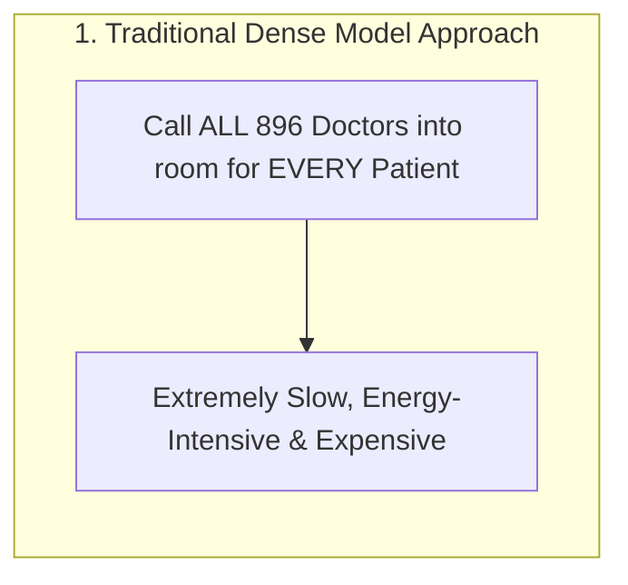
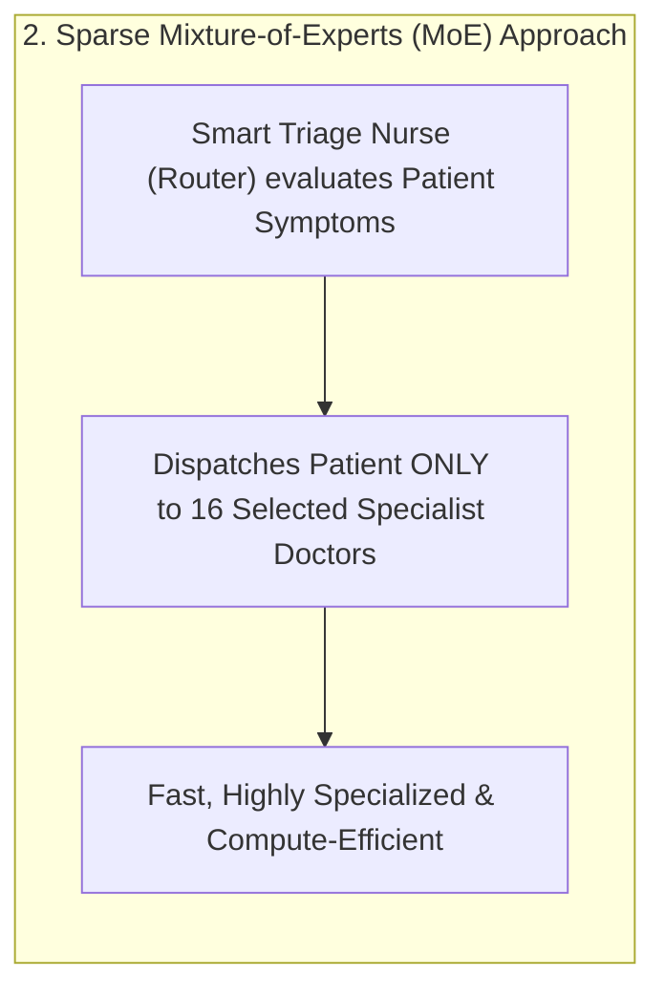
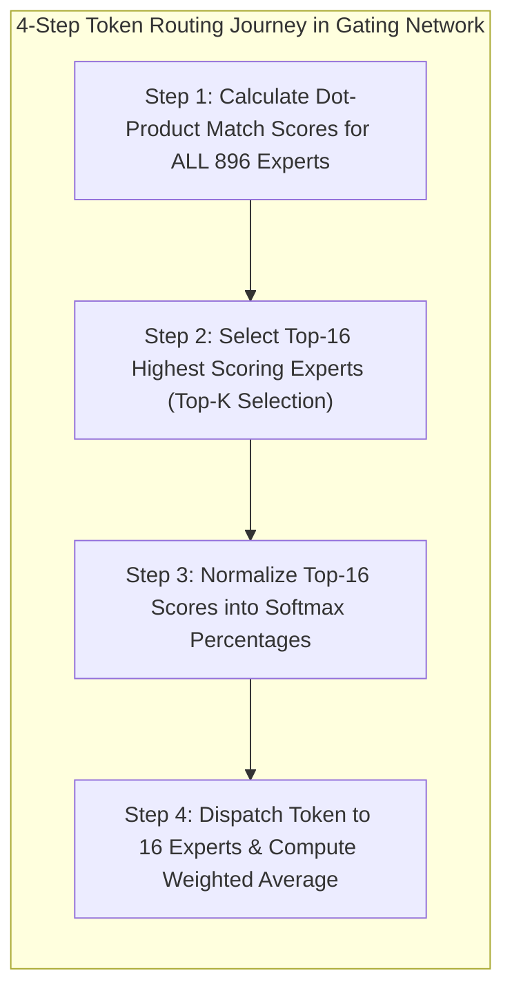

*Series: &larr; [Deep-Dive: SGLang v0.5.16 Architecture and High-Throughput Inference Comparison](/blog/sglang-v0-5-16-architecture-and-inference-comparison/) (Previous)*

### Prior Reading Material
Before diving into Mixture-of-Experts routing mechanics, review our prerequisite deep-dives on model architectures and serving infrastructure:
*   [Under the Hood of Moonshot AI's Kimi K3: The Architecture of 3-Trillion Parameter Thinking Models](/blog/moonshot-ai-kimi-k3-thinking-models/) — Architectural breakdown of 2.8T MoE, KDA linear attention, and 1M context window.
*   [Hosting Moonshot AI's Kimi K3 Open Weights with vLLM: High-Throughput Serving at Scale](/blog/hosting-kimi-k3-vllm/) — Day-0 production serving, MXFP4 MoE kernels, DSpark speculative decoding (370 tok/s), and hardware VRAM calculations.
*   [Scale and Performance: Serving LLMs with vLLM and llm-d](/blog/serving-llms-with-vllm-and-llm-d/) — PagedAttention virtual memory paging and distributed prefill/decode disaggregation.

---

Modern artificial intelligence is undergoing a fundamental architectural shift. For years, scaling AI intelligence meant building larger **Dense models**—where every single parameter in the neural network calculates math for every single word generated. 

However, as frontier models scaled beyond hundreds of billions of parameters, computing dense matrix multiplications for every token became computationally unsustainable and prohibitively expensive.

Enter **Mixture-of-Experts (MoE)**: an architectural design pattern that decouples a model's total memory capacity from its per-token compute cost. By replacing dense sublayers with sparse expert networks managed by a high-speed **Router (Gating Network)**, MoE models achieve frontier intelligence at a fraction of the serving cost.

In this guide, we use intuitive mental models, trace the evolution of MoE architectures from Google's GShard to Moonshot AI's **Kimi K3** (2.8T parameters with 16/896 active routing), inspect the 4-step mathematical token journey, break down routing traps like *Expert Collapse*, and run a Python simulation script.

---

### The Intuitive Mental Model: The Specialist Hospital

To understand Mixture-of-Experts without getting lost in tensor calculus, consider a mental model of a **Giant Specialist Hospital**. Imagine a hospital staffed by **896 specialist doctors** (a cardiologist, a neurologist, a Python programming expert, a legal scholar, a Japanese linguist, etc.):

#### 1. The Traditional (Dense) Approach
Every time a patient (a word or token) walks through the front door, **all 896 doctors** are called into the room to examine the patient simultaneously.

* *The Problem*: Calling 896 doctors to diagnose a basic skin rash or grammar check is energy-intensive, slow, and wasteful.



#### 2. The Sparse MoE Approach
Instead of waking up every doctor, you position a **Smart Triage Nurse (The Router / Gating Network)** at the front door.

* When a patient walks in with a heart condition, the Nurse evaluates the symptoms and says: *"You don't need all 896 doctors today. You only need these 16 specific cardiology and vascular specialists."*
* The patient consults **only those 16 selected doctors**, blends their advice, and moves on.



---

### Total vs. Active Parameters: Decoupling Capacity from Compute

The hospital analogy explains the core distinction between **Total Parameters** and **Active Parameters**:

* **Total Parameters (Memory Capacity)**: The sum of knowledge stored across all experts on disk. For Kimi K3, this is **2.8 Trillion parameters (2,800B)**.
* **Active Parameters (Compute Cost)**: The actual parameters that calculate math for any single token. For Kimi K3, activating 16 out of 896 experts requires only **37 Billion active parameters** (~1.3% of the total model).

> **The MoE Breakthrough**: You get the intelligence and capacity of a **2.8 Trillion parameter brain**, but you only pay the serving cost and latency of a **37 Billion parameter model** per token!

---

### Evolutionary Spectrum of MoE Architectures

MoE architecture has evolved rapidly from early coarse-grained models to ultra-fine-grained micro-expert systems:

| Model Architecture | Organization & Year | Total Parameters | Active Parameters | Total Experts | Active Experts ($K$) | Routing Strategy |
| :--- | :--- | :--- | :--- | :--- | :--- | :--- |
| **Switch Transformer** | Google (2021) | 1.6T | ~20B | 64 - 128 | **1 Expert** (Top-1) | Coarse Expert Routing |
| **GShard** | Google (2021) | 600B | ~136B | 64 | **2 Experts** (Top-2) | Random / Top-2 Gating |
| **Mixtral 8x7B** | Mistral AI (2023) | 47B | 13B | 8 Experts | **2 Experts** (Top-2) | Standard Top-2 Gating |
| **DeepSeek-V3** | DeepSeek (2024) | 671B | 37B | 256 Experts | **8 Experts** (Top-8) | Fine-Grained + Shared Experts |
| **Thinking Machines Inkling**| Thinking Machines (2026)| 975B | 54B | 128 Experts | **8 Experts** (Top-8) | Multimodal Sparse MoE |
| **Moonshot AI Kimi K3** | Moonshot AI (2026) | **2,800B (2.8T)** | **37B** | **896 Micro-Experts** | **16 Experts** (Top-16) | Stable LatentMoE + Quantile Balancing |

---

### Under the Hood of the Router: The 4-Step Token Journey

The **Router (Gating Network)** is a lightweight neural network layer sitting at the entrance of each MoE layer. Let's trace how it routes a token—such as `"mitochondria"`—in 4 mathematical steps:



#### Step 1: Calculate Raw Relevance Scores

**What is a Relevance Score? (The Job Matchmaking Analogy)**  
Before looking at the math, imagine a job seeker stepping up to a career fair with 896 different job desks. The job seeker's resume lists skills like `[Biology, Cell Anatomy, Energy Production]`. 

Each of the 896 desks represents a specialized job (e.g. Desk #42 is "Cell Biology Specialist", Desk #108 is "French Translator", Desk #500 is "Python Developer"). A **Relevance Score** is simply a **Match Rating** from 0 to 100 measuring how well the candidate's skills align with each desk's job description:
* **Desk #42 (Cell Biology)**: **95 / 100 Match Rating** (High Relevance!)
* **Desk #108 (French Translator)**: **2 / 100 Match Rating** (Irrelevant)

In AI terms, the candidate's resume is the incoming **Token Vector** ($x$) representing the word `"mitochondria"`, and each desk's job description is an **Expert Weight Vector** ($W_g$). The router calculates this Match Rating across all 896 experts by performing a fast dot-product multiplication:
$$S(x) = x \cdot W_g$$
This generates **896 raw relevance scores**, scoring how strongly each of the 896 experts matches the meaning of `"mitochondria"`.

#### Step 2: Select Top-$K$ Experts ($K=16$)
The router identifies the 16 experts with the highest raw scores:
$$\text{Indices} = \text{TopK}(S(x), K=16)$$
The remaining 880 experts are completely ignored for this token, skipping matrix computation.

#### Step 3: Compute Softmax Weights
The router normalizes the 16 selected scores into percentage weights that sum to 1.0 (100%):
$$g_i(x) = \frac{\exp(S_i(x))}{\sum_{j \in \text{TopK}} \exp(S_j(x))}$$
* Example Weights: Expert #42 (Biology): **40%**, Expert #108 (Cell Anatomy): **35%**, Expert #512 (Science Definitions): **15%**, remaining 13 experts: **10% combined**.

#### Step 4: Dispatch & Blend Outputs
The token vector $x$ is dispatched to the 16 selected expert sub-networks $E_i(x)$. The final output is the weighted sum of their outputs:
$$y = \sum_{i \in \text{TopK}} g_i(x) \cdot E_i(x)$$

---

### Routing Traps & Failure Modes

#### 1. The Overworked Doctor Problem (Expert Collapse)
If a router discovers early in training that Expert #1 is slightly better at English grammar, it may route 95% of all tokens to Expert #1. 

Over time, Expert #1 receives all training gradient updates while the other 895 experts receive zero updates and sit idle. The model collapses into a tiny, overworked single-expert network.

#### 2. Auxiliary Loss Penalties vs. Kimi K3's Quantile Balancing
* **Older Approach (Auxiliary Loss Penalty)**: Early models (Switch Transformer, Mixtral) added a mathematical penalty term ($\mathcal{L}_{\text{aux}}$) to the loss function that punished the model whenever traffic became unbalanced. However, forcing the router to send biology tokens to a music expert just to keep doctors busy degraded overall model accuracy!
* **Kimi K3's Solution (Auxiliary-Loss-Free Quantile Balancing)**: Kimi K3 removes accuracy-degrading loss penalties. Instead, it dynamically adjusts a small background **bias offset** ($b_i$) for each expert:
$$S_i(x) = x \cdot W_g + b_i$$
If Expert #1 becomes over-utilized, $b_1$ decreases slightly; if Expert #250 is under-utilized, $b_{250}$ increases slightly. This keeps traffic perfectly balanced across 896 experts without compromising model reasoning.

---

### Runnable Python Simulation: MoE Top-$K$ Router with Bias Balancing

Below is a runnable Python script (`scripts/moe_router_sim.py`) demonstrating a Top-$K$ gating router with dynamic bias load balancing:

```python
#!/usr/bin/env python3
"""
scripts/moe_router_sim.py
-------------------------
A standalone Python simulation of a Mixture-of-Experts (MoE) Top-K Router
with Auxiliary-Loss-Free Dynamic Bias Load Balancing (as used in Kimi K3).
"""

import numpy as np

class MoERouterSimulation:
    def __init__(self, num_experts=896, top_k=16, hidden_dim=64):
        self.num_experts = num_experts
        self.top_k = top_k
        self.hidden_dim = hidden_dim
        
        # Initialize random routing weights matrix
        np.random.seed(42)
        self.W_g = np.random.randn(hidden_dim, num_experts) * 0.1
        self.bias_offsets = np.zeros(num_experts)  # Dynamic load balancing bias
        self.expert_counts = np.zeros(num_experts)

    def route_token(self, token_vector):
        """Routes a single token vector to Top-K experts."""
        # Step 1: Calculate raw similarity scores + dynamic bias
        raw_scores = np.dot(token_vector, self.W_g) + self.bias_offsets
        
        # Step 2: Select Top-K expert indices
        top_k_indices = np.argsort(raw_scores)[-self.top_k:]
        top_k_scores = raw_scores[top_k_indices]
        
        # Step 3: Compute Softmax weights across Top-K
        exp_scores = np.exp(top_k_scores - np.max(top_k_scores))
        softmax_weights = exp_scores / np.sum(exp_scores)
        
        # Track expert utilization
        for idx in top_k_indices:
            self.expert_counts[idx] += 1
            
        # Step 4: Update dynamic bias offsets (Aux-Loss-Free Load Balancing)
        target_count = np.mean(self.expert_counts)
        for i in range(self.num_experts):
            if self.expert_counts[i] > target_count * 1.2:
                self.bias_offsets[i] -= 0.01  # Cool down overworked experts
            elif self.expert_counts[i] < target_count * 0.8:
                self.bias_offsets[i] += 0.01  # Boost underutilized experts
                
        return top_k_indices, softmax_weights

def run_simulation():
    print("=== MoE Top-K Router Load Balancing Simulation ===")
    sim = MoERouterSimulation(num_experts=896, top_k=16, hidden_dim=64)
    
    num_tokens = 500
    print(f"Simulating routing for {num_tokens} tokens across 896 experts (Top-16 active)...\n")
    
    for i in range(num_tokens):
        token_vec = np.random.randn(64)
        indices, weights = sim.route_token(token_vec)
        if i == 0:
            print(f"Token #1 Selected Experts (Top 5 of 16): {indices[-5:]}")
            print(f"Token #1 Softmax Weights  (Top 5 of 16): {np.round(weights[-5:], 3)}\n")

    active_experts_count = np.count_nonzero(sim.expert_counts)
    std_dev = np.std(sim.expert_counts)
    
    print("--- Simulation Results ---")
    print(f"  • Total Tokens Processed     : {num_tokens}")
    print(f"  • Active Experts Utilized    : {active_experts_count} / 896 Experts")
    print(f"  • Traffic Distribution StdDev: {std_dev:.2f} (Low StdDev = Balanced)")
    print("--------------------------")

if __name__ == "__main__":
    run_simulation()
```

Run the simulation:
```bash
python3 scripts/moe_router_sim.py
```

---

### Key Takeaways

1.  **Capacity Without Compute**: Sparse MoE decouples total parameter capacity (2.8T) from active compute (37B), achieving frontier intelligence at high serving throughput.
2.  **Fine-Grained Micro-Experts**: Scaling to 896 micro-experts allows Kimi K3 to achieve deeper specialization than older 8-expert or 16-expert designs.
3.  **Auxiliary-Loss-Free Balance**: Replacing loss penalties with dynamic router bias offsets prevents expert collapse while preserving model reasoning accuracy.
