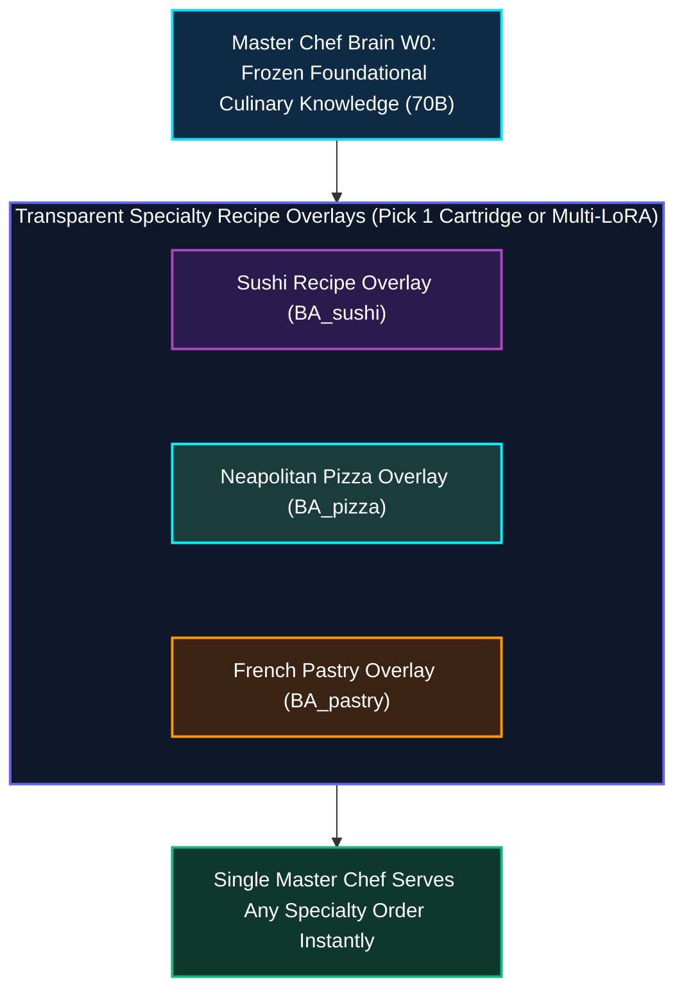
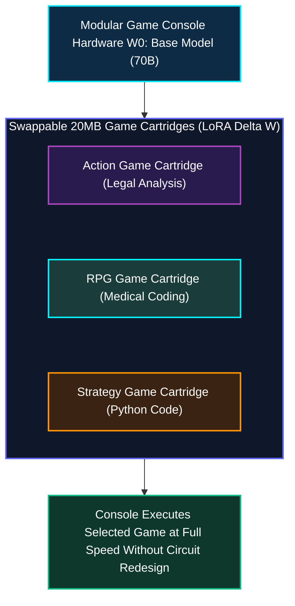
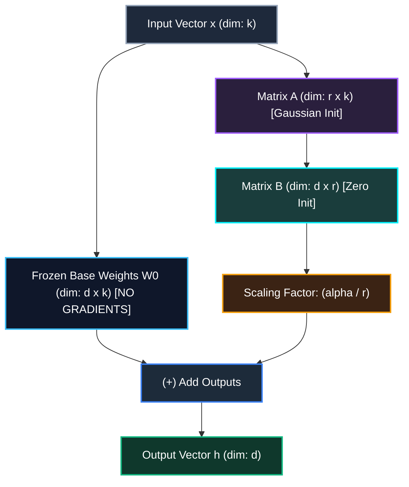
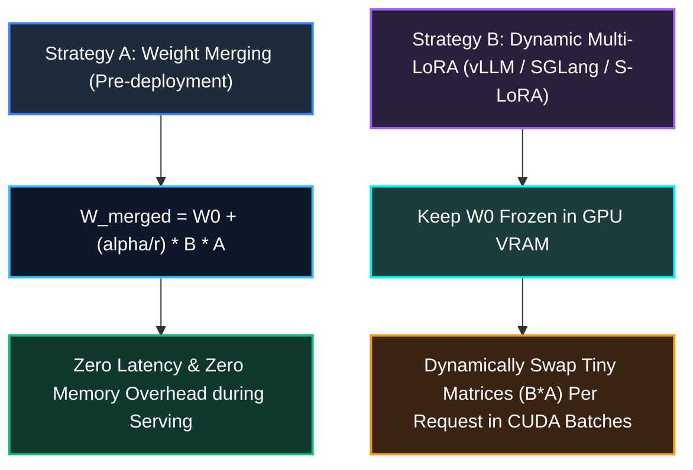

*Series: &larr; [Deep-Dive: SGLang v0.5.16 Architecture and High-Throughput Inference Comparison](/blog/sglang-v0-5-16-architecture-and-inference-comparison/) (Previous)*

### Prior Reading Material
Before exploring Low-Rank Adaptation (LoRA), review our prerequisite deep-dives on model weights, inference memory bottlenecks, and architecture scaling:
*   [Understanding Mixture-of-Experts (MoE): From Specialist Clinics to Kimi K3's 896-Expert Router](/blog/understanding-mixture-of-experts-moe/) — Sparse MoE gating networks, total vs active parameters, and Top-K router balancing.
*   [Basics of AI Inference: Prefill, Decode, and Memory Bottlenecks](/blog/basics-of-ai-inference/) — VRAM bandwidth, memory footprint calculations, and hardware bottlenecks.
*   [What is a Model Weight? Demystifying Tensors, Matrices, and File Formats](/blog/model-weights-demystified/) — Tensor structures, matrix multiplications, FP16/BF16/FP8 quantizations.

---

Fine-tuning modern foundation models (such as Llama 3 70B, Qwen 2.5 72B, or DeepSeek R1) is one of the most effective ways to adapt AI to enterprise domains like legal analysis, medical coding, or specialized software engineering. 

However, **full-parameter fine-tuning**—updating every single weight in a 70-billion-parameter network—requires astronomical compute infrastructure. Training a 70B model with full backpropagation requires over **1,400 GB (1.4 TB) of GPU VRAM** just to store model weights, gradients, and optimizer states!

Enter **Low-Rank Adaptation (LoRA)** (introduced by Edward Hu et al. at Microsoft in 2021): a breakthrough Parameter-Efficient Fine-Tuning (PEFT) methodology. LoRA reduces trainable parameters by up to **99.6%** and optimizer memory footprint by **99%**, allowing developers to fine-tune 70B models on a single workstation node.

In this deep-dive, we explore the core motivations behind LoRA, break down its mathematical foundations ($W_0 + \frac{\alpha}{r} B A$), trace its role during training vs. inference, compare weight merging against dynamic multi-adapter serving, evaluate variants like **QLoRA** and **DoRA**, and run a Python simulation.

---

### The Intuitive Mental Model: The Master Chef & Transparent Overlays

To understand why LoRA works without getting lost in linear algebra, consider an analogy of a **World-Class Master Chef**:

Imagine a Master Chef ($W_0$) who has spent 30 years mastering fundamental culinary techniques—knife skills, heat control, seasoning, and baking. The Chef's core culinary knowledge represents the pre-trained foundation model.

#### The Traditional (Full Fine-Tuning) Approach
Suppose a restaurant wants the Master Chef to specialize in **Authentic Japanese Sushi**.
* **The Method**: You perform brain surgery on the Chef to re-wire every single neuron in their brain ($W_{\text{new}} = W_0 + \Delta W$).
* **The Problem**: Brain surgery is ridiculously expensive (1.4 TB VRAM), risks ruining the Chef's core culinary instincts (*catastrophic forgetting*), and if you want the Chef to make **Neapolitan Pizza** tomorrow, you have to perform brain surgery all over again!

#### The LoRA Approach: Transparent Recipe Overlays
Instead of altering the Chef's brain:
1. **The Core Mind Remains Frozen**: The Master Chef's brain ($W_0$) stays 100% frozen and untouched.
2. **Transparent Recipe Overlays ($B \times A$)**: You hand the Chef a tiny **transparent plastic recipe overlay** containing only the 3 specific delta adjustments needed for Sushi (e.g., precise rice vinegar ratios and knife angles).
3. **Instant Task Swapping**: When a customer orders Sushi, the Chef places the Sushi overlay over their recipe book. When the next customer orders Pizza, the Chef swaps the Sushi overlay for the Pizza overlay in 1 second!



Imagine buying a powerful game console (the **Base Model $W_0$**). Instead of rebuilding or re-engineering the entire console circuitry every time you want to play a new game:

1. **The Base Model Remains Frozen**: The underlying hardware console ($W_0$) stays completely unchanged and read-only.
2. **Pluggable Adapter Cartridges**: You plug in a small, lightweight game cartridge (the **LoRA Adapter $\Delta W$**). The cartridge contains only the specific delta adjustments needed for that game.
3. **Instant Swapping**: When you switch tasks (e.g. from Legal Analysis to Medical Coding), you don't buy a new console—you simply slot in a different 20 MB cartridge onto the exact same base model!



---

### The Problem: Why Full-Parameter Fine-Tuning Explodes VRAM

When you train a neural network layer with weight matrix $W_0 \in \mathbb{R}^{d \times k}$, standard fine-tuning updates $W_0$ directly by computing a dense gradient matrix $\Delta W$:
$$W_{\text{new}} = W_0 + \Delta W$$

For a 70B parameter model operating in 16-bit precision (BF16/FP16), let's calculate the VRAM required for full fine-tuning:

| Memory Component | Memory Per Parameter | 70B Model VRAM Requirement |
| :--- | :--- | :--- |
| **Model Weights ($W_0$)** | 2 bytes (FP16/BF16) | **140 GB** |
| **Gradient Tensors ($\nabla W$)** | 2 bytes (FP16/BF16) | **140 GB** |
| **Adam Optimizer State 1 (Momentum $m_t$)** | 4 bytes (FP32) | **280 GB** |
| **Adam Optimizer State 2 (Variance $v_t$)** | 4 bytes (FP32) | **280 GB** |
| **Master Weights (FP32 Copy)** | 4 bytes (FP32) | **280 GB** |
| **Activation Memory & KV Buffers** | Variable | **~300 GB+** |
| **TOTAL VRAM REQUIRED** | — | **~1,440 GB (1.44 TB)** |

> **The Problem**: Full fine-tuning requires a cluster of **16x NVIDIA H100 GPUs (80GB)** just to fine-tune one model! Furthermore, saving 10 fine-tuned variants produces ten separate 140GB checkpoint files (1.4 TB of disk space).

---

### The Mathematical Foundation of LoRA

LoRA is built on a key empirical discovery in deep learning known as the **Intrinsic Rank Hypothesis** (Aghajanyan et al., 2020):

> *Although weight matrices in Large Language Models have full rank ($d \times k$), the weight updates ($\Delta W$) during fine-tuning lie on a subspace with a very low intrinsic rank ($r \ll \min(d, k)$).*

Instead of updating the full $d \times k$ matrix directly, LoRA decomposes $\Delta W$ into the product of two low-rank matrices, $A$ and $B$:

$$\Delta W = \frac{\alpha}{r} (B \times A)$$

Where:
* $W_0 \in \mathbb{R}^{d \times k}$ is the frozen base model weight matrix.
* $A \in \mathbb{R}^{r \times k}$ is the down-projection matrix.
* $B \in \mathbb{R}^{d \times r}$ is the up-projection matrix.
* $r$ is the **Rank hyperparameter** (typically $r \in \{4, 8, 16, 32, 64\}$).
* $\alpha$ is a constant scaling hyperparameter (typically $\alpha = 2 \cdot r$).



#### Why Matrix Decomposition Drastically Cuts Parameters
Suppose a Transformer layer matrix has dimensions $d = 4096$ and $k = 4096$:
* **Full Parameter Matrix $\Delta W$**: $4096 \times 4096 = \mathbf{16,777,216\text{ parameters}}$.
* **LoRA Low-Rank Decomposition ($r = 8$)**: 
  * Matrix $A$: $8 \times 4096 = 32,768$
  * Matrix $B$: $4096 \times 8 = 32,768$
  * **Total LoRA Parameters**: $32,768 + 32,768 = \mathbf{65,536\text{ parameters}}$.

> **Result**: Parameter reduction of **99.6%** ($65,536 / 16,777,216 = 0.0039$).

---

### The Role of LoRA During Training

During the training phase, LoRA alters the optimization pipeline in three critical ways:

#### 1. Freezing Base Model Weights ($W_0$)
The base model parameters $W_0$ are set to `requires_grad = False`. No gradients or optimizer states are computed or stored for $W_0$.

#### 2. VRAM Reduction Math During Training
Because gradients and Adam optimizer states are stored **only for matrices $A$ and $B$**, the optimizer memory drops from 560 GB down to **under 200 MB** for a 70B model! 
* Training VRAM requirement drops from **1,440 GB down to ~24 GB - 48 GB**, making fine-tuning possible on consumer/single-node GPUs.

#### 3. Matrix Initialization & Zero-Delta Step 0
* **Matrix $A$** is initialized with a Gaussian distribution: $A \sim \mathcal{N}\left(0, \frac{1}{r}\right)$.
* **Matrix $B$** is initialized to **all zeros**: $B = 0$.

> **Why zero-initialize $B$?** Because $B \times A = 0 \times A = 0$, the initial adapter update $\Delta W$ is exactly zero at step 0! The model starts training with its exact pre-trained capabilities, avoiding destructive initial perturbation.

---

### The Role of LoRA During Inference: Serving Strategies

During inference, LoRA offers two distinct serving strategies depending on production goals:



#### Strategy A: Weight Merging (Zero Latency Overhead)
If you are deploying a single fine-tuned model to production, you can permanently fold the LoRA adapter weights directly into the base model weights before serving:

$$W_{\text{merged}} = W_0 + \frac{\alpha}{r} (B \times A)$$

* **Benefit**: The adapter matrices $A$ and $B$ are eliminated. The serving engine executes a standard single matrix multiplication ($W_{\text{merged}} \cdot x$) with **zero extra latency and zero extra memory overhead** during inference.

#### Strategy B: Dynamic Multi-LoRA Serving (vLLM / SGLang / S-LoRA)
In enterprise platforms, serving separate 70B model instances for 50 different customers is financially unviable.

With engines like **vLLM**, **SGLang**, and **S-LoRA (Punica)**:
1. **Single Base Model**: A single base model ($W_0$) is loaded once into GPU VRAM.
2. **Dynamic CUDA Batching**: When Request #1 (Customer: Legal) arrives, the CUDA kernel multiplies $W_0 x + \frac{\alpha}{r} B_{\text{legal}} A_{\text{legal}} x$. When Request #2 (Customer: Code) arrives in the same batch, it applies $B_{\text{code}} A_{\text{code}}$.
3. **Multi-Tenant Serving**: You can serve **100+ fine-tuned domain adapters simultaneously** on a single GPU server with 99% lower infrastructure cost!

---

### LoRA Variations & Advanced Optimizations

| Variant | Key Innovation | Primary Benefit |
| :--- | :--- | :--- |
| **Standard LoRA** (Hu et al., 2021) | Low-rank decomposition $\Delta W = B \times A$ | 99.6% parameter reduction; zero inference overhead when merged. |
| **QLoRA** (Dettmers et al., 2023) | 4-bit NormalFloat (NF4) base weights + Double Quantization + Paged Optimizers | Fine-tunes 70B models on a **single 24GB consumer GPU** (e.g. RTX 4090). |
| **DoRA** (Liu et al., 2024) | Weight-Decomposed LoRA: Separates weight vector into **Magnitude** ($m$) and **Direction** ($V$) | Matches full-parameter fine-tuning accuracy on complex reasoning tasks. |
| **LoRA+** (Hayou et al., 2024) | Sets asymmetric learning rates: $\eta_B = \gamma \cdot \eta_A$ (where $\gamma > 1$) | Speeds up training convergence by 1.5x-2x. |
| **AdaLoRA** (Zhang et al., 2023) | Dynamic rank allocation across Transformer layers using singular value decomposition | Allocates higher rank $r$ to important layers and lower rank to unimportant layers. |

### Runnable Python Simulation: LoRA Decomposition & Weight Merging

Below is a runnable Python script (`scripts/lora_math_sim.py`) demonstrating LoRA low-rank matrix decomposition, parameter reduction calculations, and weight merging:

<details>
<summary><b>Click to expand runnable Python simulation script</b></summary>

```python
#!/usr/bin/env python3
"""
scripts/lora_math_sim.py
------------------------
A standalone Python simulation demonstrating Low-Rank Adaptation (LoRA)
matrix decomposition, parameter reduction, and weight merging.
"""

import numpy as np

def run_lora_simulation():
    print("=== Low-Rank Adaptation (LoRA) Mathematical Simulation ===\n")
    
    # 1. Define dimensions
    d_in = 4096   # Input dimension
    d_out = 4096  # Output dimension
    r = 8         # LoRA rank
    alpha = 16    # Scaling factor
    scaling = alpha / r
    
    # 2. Initialize Base Model Weights W0 (Frozen)
    np.random.seed(42)
    W0 = np.random.randn(d_out, d_in) * 0.02
    
    # 3. Initialize LoRA Matrices A and B
    # Matrix A: Gaussian initialization
    A = np.random.randn(r, d_in) * (1.0 / np.sqrt(r))
    # Matrix B: Zero initialization (so Delta W = 0 at step 0)
    B = np.zeros((d_out, r))
    
    # Calculate parameter counts
    full_params = d_out * d_in
    lora_params = (r * d_in) + (d_out * r)
    reduction = (1 - (lora_params / full_params)) * 100
    
    print(f"1. Matrix Dimensions & Parameter Counts:")
    print(f"   • Base Weight Matrix W0  : ({d_out} x {d_in}) = {full_params:,} parameters")
    print(f"   • LoRA Matrix A (r={r})   : ({r} x {d_in})   = {r * d_in:,} parameters")
    print(f"   • LoRA Matrix B (r={r})   : ({d_out} x {r})   = {d_out * r:,} parameters")
    print(f"   • Total LoRA Parameters   : {lora_params:,} parameters")
    print(f"   • Parameter Reduction     : {reduction:.2f}%\n")
    
    # 4. Simulate Training Step (Updating B)
    B_trained = np.random.randn(d_out, r) * 0.01
    
    # 5. Forward Pass Simulation
    x = np.random.randn(d_in)
    
    # Method A: Unmerged Forward Pass (h = W0*x + scaling * B*A*x)
    h_base = np.dot(W0, x)
    h_lora = scaling * np.dot(B_trained, np.dot(A, x))
    h_unmerged = h_base + h_lora
    
    # Method B: Merged Forward Pass (W_merged = W0 + scaling * B*A)
    Delta_W = scaling * np.dot(B_trained, A)
    W_merged = W0 + Delta_W
    h_merged = np.dot(W_merged, x)
    
    # 6. Verify Exact Equivalence
    max_diff = np.max(np.abs(h_unmerged - h_merged))
    
    print(f"2. Forward Pass Equivalence Verification:")
    print(f"   • Unmerged Output Sample (first 3): {np.round(h_unmerged[:3], 4)}")
    print(f"   • Merged Output Sample   (first 3): {np.round(h_merged[:3], 4)}")
    print(f"   • Max Difference (Unmerged vs Merged): {max_diff:.10f}")
    print(f"   • Mathematical Equivalence: {'SUCCESS ✅' if max_diff < 1e-7 else 'FAILED ❌'}\n")

if __name__ == "__main__":
    run_lora_simulation()
```

</details>

---

### Key Takeaways

1.  **Massive Compute Efficiency**: LoRA freezes base weights ($W_0$) and trains low-rank matrices $A$ and $B$, cutting trainable parameters by 99.6% and optimizer VRAM by 99%.
2.  **Zero-Latency Weight Merging**: For single-task serving, folding $W_{\text{merged}} = W_0 + \frac{\alpha}{r} (B A)$ eliminates adapter overhead during inference.
3.  **Multi-Tenant Serving**: Runtimes like vLLM and SGLang leverage LoRA to serve hundreds of domain-specific fine-tuned adapters on a single base model instance.
