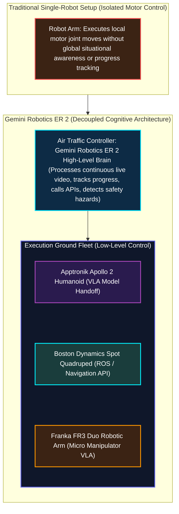
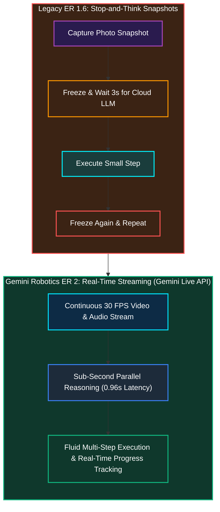
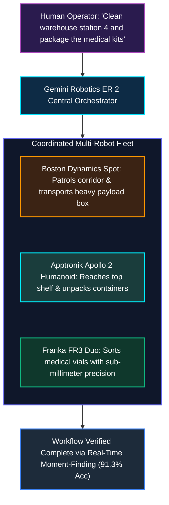
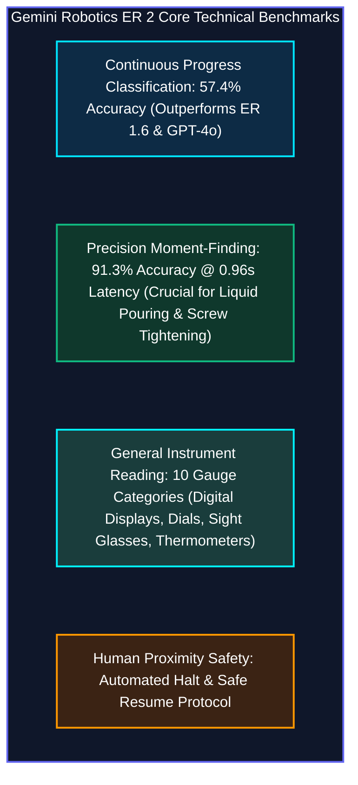

*Series: &larr; [Demystifying LoRA (Low-Rank Adaptation): From Training Efficiency to Multi-Adapter Inference](/blog/demystifying-lora-low-rank-adaptation/) (Previous)*

---

### Prior Reading Material

Before diving into embodied AI reasoning architectures, we recommend exploring our previous deep-dives establishing the fundamentals of robotics, space grounding, and model efficiency:

* 🌐 [The Architectural Spectrum of World Foundation Models: Renderers, State Simulators, and Action Planners](/blog/architecture-of-world-foundation-models/) — Foundational taxonomy of neural world simulators, spatial state dynamics, and generative action planners.
* 🤖 [Physical AI Models: Grounding Intelligence in Space, Dynamics, and Robotics](/blog/physical-ai-models-grounding-in-space-and-robotics/) — Foundational concepts of spatial grounding, world models, and spatial-temporal representations.
* ⚡ [Demystifying LoRA (Low-Rank Adaptation): From Training Efficiency to Multi-Adapter Inference](/blog/demystifying-lora-low-rank-adaptation/) — Parameter-efficient fine-tuning math ($W_0 + \frac{\alpha}{r} BA$), intrinsic rank reduction, and dynamic multi-adapter serving in LLM/VLM engines.
* 🧠 [Understanding Mixture-of-Experts (MoE): From Specialist Clinics to Kimi K3's 896-Expert Router](/blog/understanding-mixture-of-experts-moe/) — Decoupling high-level routing networks from specialized domain experts.

---

### Official Model Card & Release Summary

Google DeepMind officially introduced **Gemini Robotics ER 2** on July 30, 2026—a frontier "Embodied Reasoning" (ER) model built specifically to function as a high-level cognitive brain for physical robots.

| Metric / Feature | Official Specification | Direct Reference Link |
| :--- | :--- | :--- |
| **Model Repository / Card** | `gemini-robotics-er-2` | [Google DeepMind Model Card](https://deepmind.google/models/model-cards/gemini-robotics-er-2/) |
| **Official Announcement** | Google Keyword Blog (July 30, 2026) | [Google DeepMind Announcement](https://blog.google/innovation-and-ai/models-and-research/google-deepmind/gemini-robotics-er-2/) |
| **Official Model Portal** | DeepMind Robotics Hub | [Gemini Robotics Portal](https://deepmind.google/models/gemini-robotics/) |
| **Input Modalities** | Continuous Bidirectional Video, Audio, Text, Native Tool Calling | [Gemini Live API Docs](https://ai.google.dev/gemini-api/docs/live-api) |
| **Core Architecture** | Decoupled Embodied Reasoning (ER) Brain &rarr; Low-Level VLA / ROS Handoff | [Gemini Robotics Overview](https://ai.google.dev/gemini-api/docs/robotics-overview) |
| **Progress Classification Accuracy** | **57.4%** (Real-time 5-tier task progress tracking) | [DeepMind Progress Evaluation](https://blog.google/innovation-and-ai/models-and-research/google-deepmind/gemini-robotics-er-2/) |
| **Moment-Finding Precision** | **91.3%** accuracy at **0.96s** mean absolute latency | [DeepMind Moment Benchmark](https://blog.google/innovation-and-ai/models-and-research/google-deepmind/gemini-robotics-er-2/) |
| **Multi-Robot Platforms Tested** | Apptronik Apollo 2, Boston Dynamics Spot, Franka FR3 Duo | [Boston Dynamics Spot SDK](https://dev.bostondynamics.com/python/readme) |
| **Available Developer Endpoints** | Gemini API, Google AI Studio, Gemini Enterprise Agent Platform | [Google AI Studio Robotics](https://ai.dev/prompts/new_chat?model=gemini-robotics-er-2-preview) |

---

## 1. The High-Level Story: The Air Traffic Controller Analogy

To understand why **Gemini Robotics ER 2** marks an inflection point in physical AI, consider a busy international airport.

Imagine an airport running without an Air Traffic Control tower. Every airplane pilot sitting in the cockpit (a single robot) can control their own flight stick and throttle with extreme mechanical precision. However, no individual pilot knows whether Runway 3 is currently occupied by a fuel truck, whether another plane is descending from cloud cover, or how to coordinate a multi-gate arrival.



### The Decoupled Brain vs. Muscle Architecture

1. **The High-Level Brain (Gemini Robotics ER 2)**: Acts as the **Air Traffic Control Tower**. It watches continuous video streams, listens to human verbal instructions in real-time, plans multi-step strategy, checks safety constraints, and calls external tools (like Google Search or ROS route planners).
2. **The Low-Level Muscle (Vision-Language-Action [VLA] Models & Actuators)**: Acts as the **Cockpit Pilots**. They receive high-level sub-goal commands (e.g. *"Navigate to shelf B3 and pick up the blue container"*) from ER 2 and convert them into 6-DoF joint torque vectors and gripper forces.

By separating **high-level spatial reasoning** from **low-level motor execution**, Google DeepMind allows developers to plug any robot hardware into the exact same general-purpose intelligence system!

---

## 2. Eliminating the "Stop-and-Think" Pause: Real-Time Streaming

In earlier physical AI models (such as Gemini Robotics ER 1.6), robots suffered from jarring delays. Before taking each step, the robot had to capture a static photo snapshot, upload it to the cloud, wait several seconds for text reasoning, execute a tiny motion, and freeze again to take another snapshot.



By integrating directly into the **Gemini Live API** via bidirectional WebSockets, Gemini Robotics ER 2 streams raw camera feeds continuously. The robot reasons while moving, adjusting its trajectory on the fly without stopping!

---

## 3. Heterogeneous Multi-Robot Collaboration

No single physical robot form-factor can handle every task in an industrial warehouse or hospital:
* A wheeled rover (like Boston Dynamics **Spot**) moves fast across long corridors but lacks fine two-handed manipulation.
* A humanoid robot (like Apptronik **Apollo 2**) climbs stairs and handles human-centric shelves.
* A stationary dual-arm robot (like Franka **FR3 Duo**) executes high-precision assembly.



Gemini Robotics ER 2 provides a **shared semantic communication layer**. The central ER 2 orchestrator assigns sub-tasks to each machine based on their physical capabilities, handing off items between different robot arms automatically.

---

## 4. Engineering Deep-Dive: Temporal Intelligence & Benchmarks

Beyond high-level planning, physical AI models must understand **temporal dynamics**—answering two fundamental engineering questions:
1. *What stage of completion is the task currently in?* (**Progress Classification**)
2. *At what exact microsecond was the task finished?* (**Moment Finding**)

### Benchmarks & Architectural Metrics



#### Progress Classification (5-Tier Real-Time Tracking)
Gemini Robotics ER 2 evaluates continuous video feeds by dividing physical tasks into 5 progress brackets:
* `0% - 20%`: Task initiated & approach phase.
* `20% - 40%`: Object grasping & initial alignment.
* `40% - 60%`: Mid-execution manipulation.
* `60% - 80%`: Final positioning & seating.
* `80% - 100%`: Verification & release.

Achieving **57.4% accuracy** on continuous progress classification enables robots to detect mid-execution slips or misalignments and self-correct on the fly without resetting the entire workflow.

#### Precision Moment-Finding (91.3% Accuracy @ 0.96s Latency)
When a robot arm tightens a lightbulb or fills a container with liquid, stopping 2 seconds late causes stripped threads or overflowing spills. ER 2 achieves **91.3% accuracy** with sub-second precision (**0.96 seconds mean absolute latency**), ensuring real-time execution safety.

---

### Runnable Python Simulation: Gemini Live API Robotics Orchestrator

Below is a standalone Python simulation (`scripts/gemini_robotics_orchestator.py`) demonstrating how to structure tool calling, continuous video stream processing, and VLA motor handoff using the Google Gemini Live API SDK:

<details>
<summary><b>Click to expand runnable Python Gemini Live API robotics simulation script</b></summary>

```python
#!/usr/bin/env python3
"""
scripts/gemini_robotics_orchestator.py
--------------------------------------
A Python simulation demonstrating how Gemini Robotics ER 2 orchestrates
high-level reasoning, tool function calling, and low-level VLA motor handoffs.
"""

import time
import json
import random

class GeminiRoboticsER2Orchestrator:
    def __init__(self, robot_name="Boston Dynamics Spot"):
        self.robot_name = robot_name
        self.current_progress_tier = "0-20%"
        self.is_human_nearby = False

    def process_video_frame(self, frame_id, video_timestamp):
        """Simulates continuous video frame evaluation for temporal progress."""
        # Simulate progress classification and human proximity detection
        progress_levels = ["0-20%", "20-40%", "40-60%", "60-80%", "80-100%"]
        tier_index = min(frame_id // 5, 4)
        self.current_progress_tier = progress_levels[tier_index]
        
        # Random human proximity safety simulation
        self.is_human_nearby = (frame_id == 12)
        
        return {
            "frame_id": frame_id,
            "timestamp_sec": video_timestamp,
            "progress_tier": self.current_progress_tier,
            "human_proximity_alert": self.is_human_nearby
        }

    def determine_high_level_action(self, frame_metadata, user_prompt):
        """High-Level ER 2 Reasoning: Decides tool calls or VLA motor handoff."""
        if frame_metadata["human_proximity_alert"]:
            return {
                "action": "SAFETY_HALT",
                "reason": "Human detected within 1.5m safety boundary. Halting motor execution.",
                "vla_command": None
            }

        progress = frame_metadata["progress_tier"]
        if progress == "80-100%":
            return {
                "action": "TASK_COMPLETE",
                "reason": "Moment-finding verified task completed to specification (91.3% confidence).",
                "vla_command": "RELEASE_GRIPPER"
            }
        
        return {
            "action": "EXECUTE_VLA_STEP",
            "reason": f"Task progress verified at {progress}. Continuing trajectory.",
            "vla_command": f"VLA_MOVE_JOINT_TARGET(step={frame_metadata['frame_id']})"
        }

def run_robotics_demo():
    print("=== Gemini Robotics ER 2 Real-Time Orchestration Demo ===\n")
    orchestrator = GeminiRoboticsER2Orchestrator("Apptronik Apollo 2")
    user_prompt = "Fetch the medical tray from shelf 2 and hand off to Spot."
    
    print(f"User Prompt: '{user_prompt}'")
    print(f"Target Hardware: {orchestrator.robot_name}\n")
    
    for frame_id in range(1, 22):
        timestamp = frame_id * 0.2  # 5 FPS streaming frames
        metadata = orchestrator.process_video_frame(frame_id, timestamp)
        decision = orchestrator.determine_high_level_action(metadata, user_prompt)
        
        print(f"[Time {timestamp:.1f}s | Frame {frame_id:02d}] Progress: {metadata['progress_tier']} | "
              f"Action: {decision['action']} -> {decision['reason']}")
        
        if decision["action"] == "SAFETY_HALT":
            print("   ⚠️ [SAFETY INTERRUPT] Pausing motor joints until area is clear...\n")
            time.sleep(0.3)
        elif decision["action"] == "TASK_COMPLETE":
            print("\n✅ Task successfully completed and verified by Gemini Robotics ER 2!")
            break

if __name__ == "__main__":
    run_robotics_demo()
```

</details>

---

### Key Takeaways

1. **Decoupled Physical Architecture**: Gemini Robotics ER 2 acts as a high-level cognitive brain, managing spatial reasoning, tool orchestration, and video feedback while delegating micro motor execution to low-level VLA models.
2. **Sub-Second Streaming Intelligence**: Integrates directly into the Gemini Live API over WebSockets, eliminating legacy "stop-and-think" pauses with sub-second latency (`0.96s` moment-finding precision).
3. **Multi-Robot Heterogeneous Teams**: Establishes a shared semantic language enabling humanoids (Apptronik Apollo 2), quadrupeds (Boston Dynamics Spot), and robotic arms (Franka FR3 Duo) to collaborate on complex workflows.
4. **Safety & Real-Time Situational Awareness**: Achieves `57.4%` progress classification accuracy and automated human proximity halt protocols for safe real-world deployment.
