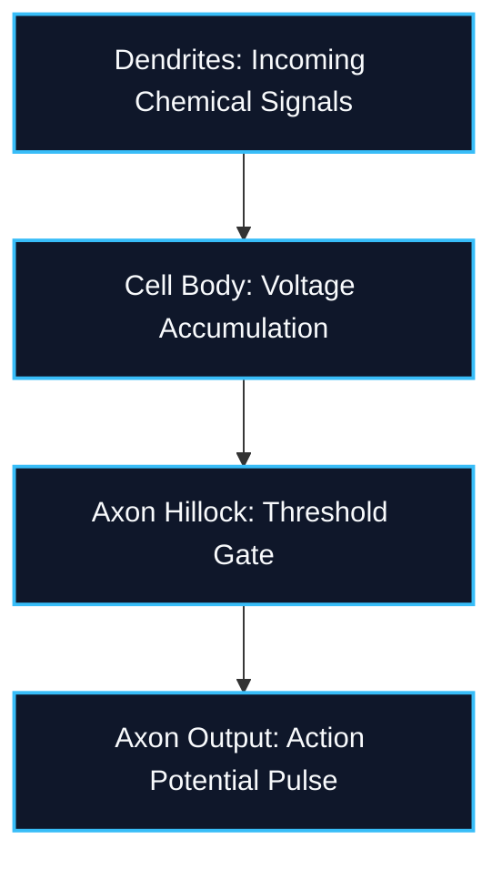
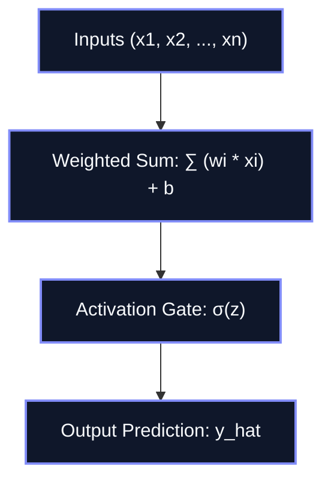
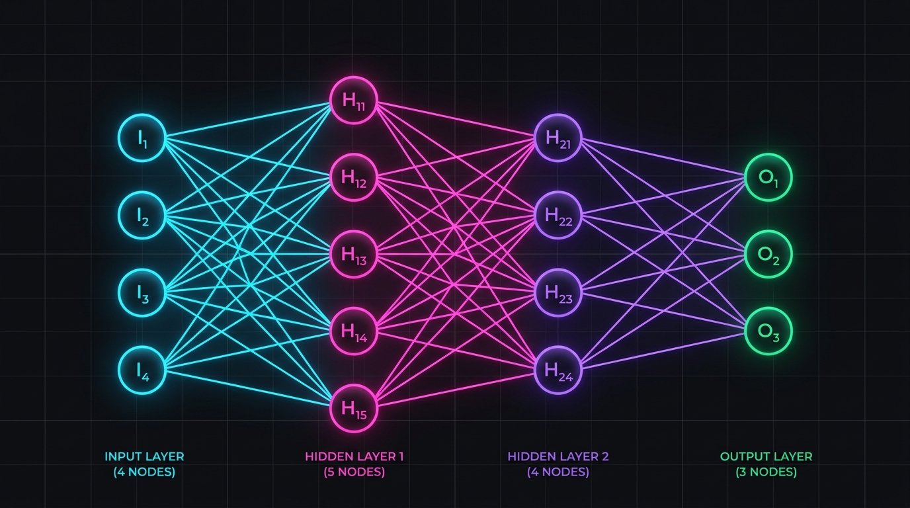
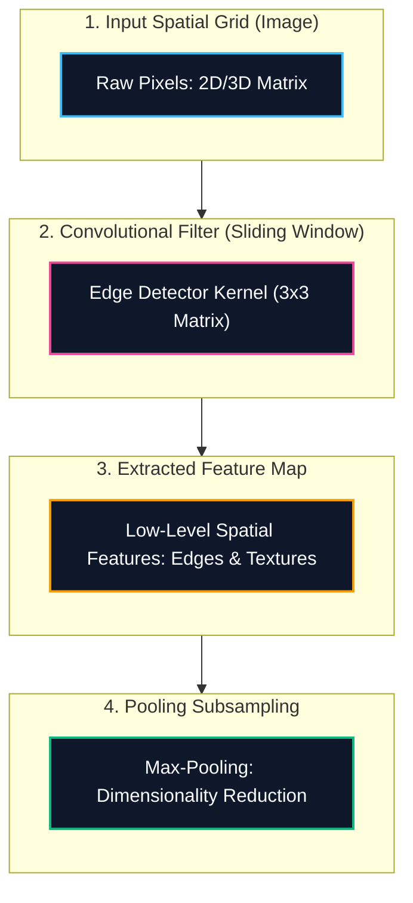
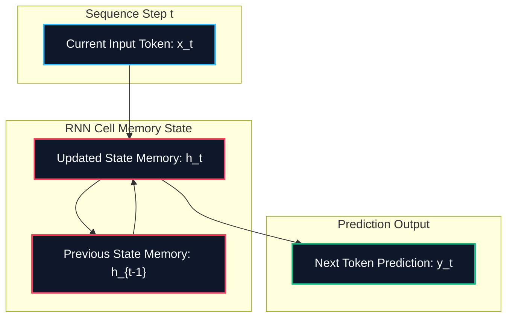
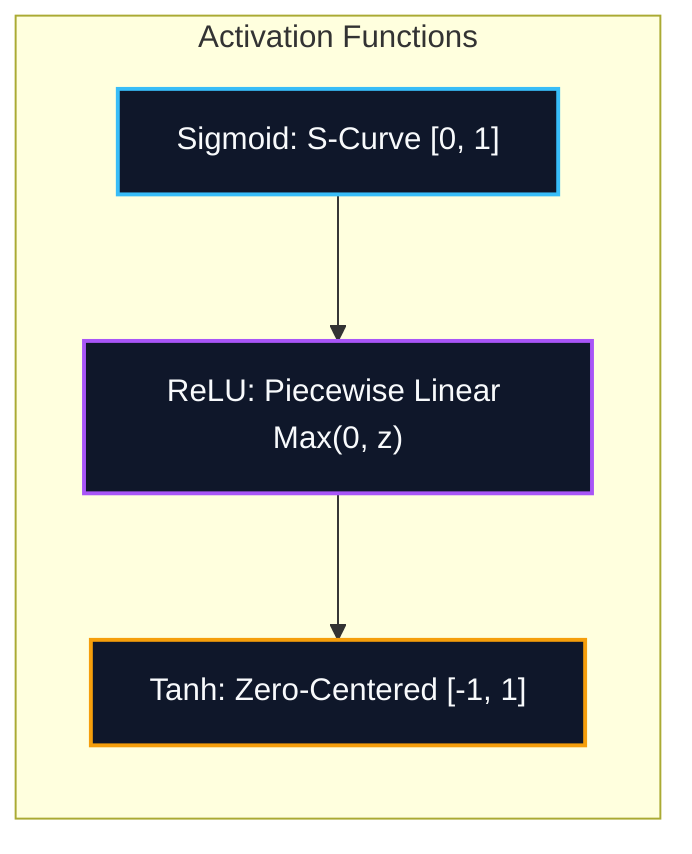

*Series: Neural Architecture Evolution Series (From MLPs to Transformers) - Part 1*

### Prior Reading Material

Before diving into how biological intuition evolved into artificial neural networks, explore these foundational deep-dives across our blog:

* [Google DeepMind's Gemini Robotics ER 2](/blog/0070-google-deepmind-gemini-robotics-er-2/) — High-level spatial and physical reasoning in modern multi-modal foundation models.
* [Demystifying LoRA (Low-Rank Adaptation)](/blog/0069-demystifying-lora-low-rank-adaptation/) — Understanding weight matrices, intrinsic rank, and parameter-efficient fine-tuning.
* [What is a Model Weight? Demystifying Tensors, Matrices, and File Formats](/blog/0058-what-is-a-model-weight/) — The fundamental linear algebra primitives behind neural network layers.
* [Training vs. Inference Lifecycle](/blog/0059-training-vs-inference-lifecycle/) — How forward passes, backpropagation, and loss surfaces shape artificial intelligence models.

---

## 1. The Story of Neural Architecture Evolution

Long before modern foundation models like [PyTorch](https://pytorch.org/) or [TensorFlow](https://www.tensorflow.org/) began parameterizing trillion-token datasets, artificial intelligence faced a fundamental question: **How can a machine learn from data without human programmers writing every explicit rule?**

The answer came from observing biological brains. In human neuroscience, a neuron receives incoming chemical pulses through its dendrites, accumulates electrical voltage across its cell body, and fires an action potential down its axon once a critical threshold is crossed.



Mathematically, computer scientists abstracted this biological signal threshold into an artificial perceptron node:



### The Light Switch Analogy: The Single Perceptron
Imagine a simple light switch attached to a sensor. In 1958, Frank Rosenblatt created the **Perceptron**. 

Think of a single perceptron as an automated decision-maker trying to draw a straight line on a piece of paper to divide apples from oranges. It takes numbers as inputs, multiplies each input by an adjustable weight (representing the importance of that feature), adds a baseline preference (bias), and flips a switch:
* If the total voltage is positive, the switch turns **ON** (Output = 1).
* If the voltage is negative, the switch remains **OFF** (Output = 0).

For simple decisions—such as deciding whether to approve a loan based on income and credit score—a single straight line works well. But when faced with real-world complexities, the single perceptron hit a mathematical wall known as the **XOR (Exclusive OR) Problem**. 

If you ask a single line to separate points where *either* option A *or* option B is true, but *not both*, it is physically impossible to draw a single straight line through a 2D plane without misclassifying data points.

---

### The Assembly Line Analogy: Multi-Layer Perceptrons (MLPs) & Deep Neural Networks (DNNs)
To solve the XOR problem, computer scientists stacked multiple perceptrons together into layers, giving birth to the **Multi-Layer Perceptron (MLP)** and **Deep Neural Networks (DNNs)**.



Think of a Deep Neural Network as a multi-stage factory assembly line:
1. **Raw Materials (Input Layer)**: Raw pixel values or numerical signals enter the factory.
2. **Specialized Craftsmen (Hidden Layers)**: Instead of drawing one straight line, each hidden node draws its own line. By combining multiple lines with non-linear activation functions (like bending or curving paper), the network warps space to isolate complex patterns.
3. **Executive Decision (Output Layer)**: The final layer combines all intermediate insights into a definitive prediction.

However, when computer vision and sequence tasks emerged, standard MLPs faced massive efficiency bottlenecks. Feeding a high-resolution 1024x1024 image into a fully connected MLP requires over 1 million input nodes, resulting in billions of connections that quickly exhaust GPU memory.

---

### The Sliding Magnifying Glass: Convolutional Neural Networks (CNNs)
To process spatial data like images, researchers designed **Convolutional Neural Networks (CNNs)**.

Instead of looking at an entire image at once, a CNN acts like a detective with a sliding magnifying glass (called a **kernel** or **filter**).



How CNNs view the world:
* **Translation Invariance**: An edge, eye, or wheel looks identical whether it appears in the top-left or bottom-right corner of a photo.
* **Hierarchical Feature Learning**: Early layers detect basic edges and lines; middle layers assemble edges into shapes and textures; deep layers combine shapes into full objects (faces, cars, trees).
* **Parameter Sharing**: Instead of giving every pixel its own weight, the same small 3x3 filter slides across the entire image, drastically reducing required parameters.

---

### The Memory Diary with Feedback Loops: Recurrent Neural Networks (RNNs)
While CNNs revolutionized spatial computer vision, they struggled with sequential data where order and time matter—such as spoken audio, stock prices, or written text.

A standard MLP or CNN treats every input independently, forgetting previous events. Enter **Recurrent Neural Networks (RNNs)**.



An RNN works like reading a book with a running diary:
1. As you read word $t$ ("The capital of France is..."), you write a summary in your memory diary ($h_t$).
2. When the next word $t+1$ arrives ("Paris"), the network evaluates the new word alongside the previous memory state ($h_{t-1}$).
3. This feedback loop allows context to persist over time.

---

## 2. Engineering Deep-Dive & Mathematical Foundations

Having established the mental models and architectural workflows, let us derive the exact equations governing forward propagation, backpropagation, convolutions, and temporal state updates.

### 2.1 The Perceptron & Activation Functions
A single artificial perceptron computes a linear combination of input features $x \in \mathbb{R}^n$ parameterized by weight vector $w \in \mathbb{R}^n$ and scalar bias $b \in \mathbb{R}$:

$$z = \sum_{i=1}^n w_i x_i + b = w^T x + b$$

The pre-activation scalar $z$ is passed through a non-linear activation function $\sigma(z)$:

$$\hat{y} = \sigma(z)$$

#### Common Non-Linear Activation Functions
Without non-linear activation functions, stacking multiple neural network layers collapses into a single linear transformation $W_2(W_1 x + b_1) + b_2 = W_{new} x + b_{new}$. Non-linearities enable universal function approximation.

$$\text{Sigmoid: } \sigma(z) = \frac{1}{1 + e^{-z}}, \quad \sigma'(z) = \sigma(z)(1 - \sigma(z))$$

$$\text{ReLU: } f(z) = \max(0, z), \quad f'(z) = \begin{cases} 1 & \text{if } z > 0 \\ 0 & \text{if } z \le 0 \end{cases}$$

$$\text{Hyperbolic Tangent: } \tanh(z) = \frac{e^z - e^{-z}}{e^z + e^{-z}}, \quad \tanh'(z) = 1 - \tanh^2(z)$$



---

### 2.2 Forward & Backward Propagation in Multi-Layer Perceptrons (MLPs)
For a two-layer feedforward network with input $x \in \mathbb{R}^{d_in}$, hidden weights $W^{(1)} \in \mathbb{R}^{d_in \times d_{hidden}}$, hidden bias $b^{(1)} \in \mathbb{R}^{d_{hidden}}$, output weights $W^{(2)} \in \mathbb{R}^{d_{hidden} \times d_{out}}$, and output bias $b^{(2)} \in \mathbb{R}^{d_{out}}$:

#### Forward Pass Equations:
$$z^{(1)} = W^{(1)T} x + b^{(1)}$$

$$h^{(1)} = \sigma(z^{(1)})$$

$$z^{(2)} = W^{(2)T} h^{(1)} + b^{(2)}$$

$$\hat{y} = \sigma(z^{(2)})$$

#### Backpropagation Chain Rule Derivation:
Given Mean Squared Error (MSE) loss for a single target $y$:

$$\mathcal{L} = \frac{1}{2} \|\hat{y} - y\|^2$$

Using the multivariate chain rule to compute gradients with respect to weights:

$$\delta^{(2)} = \frac{\partial \mathcal{L}}{\partial z^{(2)}} = \frac{\partial \mathcal{L}}{\partial \hat{y}} \odot \sigma'(z^{(2)}) = (\hat{y} - y) \odot \hat{y} (1 - \hat{y})$$

$$\frac{\partial \mathcal{L}}{\partial W^{(2)}} = h^{(1)} (\delta^{(2)})^T, \quad \frac{\partial \mathcal{L}}{\partial b^{(2)}} = \delta^{(2)}$$

Propagating the error backward to the hidden layer:

$$\delta^{(1)} = \frac{\partial \mathcal{L}}{\partial z^{(1)}} = \left( W^{(2)} \delta^{(2)} \right) \odot \sigma'(z^{(1)}) = \left( W^{(2)} \delta^{(2)} \right) \odot h^{(1)} (1 - h^{(1)})$$

$$\frac{\partial \mathcal{L}}{\partial W^{(1)}} = x (\delta^{(1)})^T, \quad \frac{\partial \mathcal{L}}{\partial b^{(1)}} = \delta^{(1)}$$

Parameters are updated via Gradient Descent with learning rate $\eta$:

$$W^{(l)} \leftarrow W^{(l)} - \eta \frac{\partial \mathcal{L}}{\partial W^{(l)}}, \quad b^{(l)} \leftarrow b^{(l)} - \eta \frac{\partial \mathcal{L}}{\partial b^{(l)}}$$

---

### 2.3 Mathematical Operation of 2D Convolutions
In a Convolutional Layer, a 2D image matrix $I$ is convolved with a learnable kernel $K$ of size $k_h \times k_w$:

$$S(i, j) = (I * K)(i, j) = \sum_{m=0}^{k_h-1} \sum_{n=0}^{k_w-1} I(i + m, j + n) K(m, n)$$

Given input spatial dimension $H \times W$, kernel size $K$, padding $P$, and stride $S$, the output feature map dimension $H_{out} \times W_{out}$ is:

$$H_{out} = \left\lfloor \frac{H - K + 2P}{S} \right\rfloor + 1, \quad W_{out} = \left\lfloor \frac{W - K + 2P}{S} \right\rfloor + 1$$

---

### 2.4 Recurrent Equations & The Vanishing Gradient Problem
For a standard Recurrent Neural Network at time step $t$, with input sequence vector $x_t$, hidden state memory $h_t$, input weights $W_{xh}$, recurrent state weights $W_{hh}$, and bias $b_h$:

$$h_t = \tanh(W_{hh} h_{t-1} + W_{xh} x_t + b_h)$$

$$\hat{y}_t = \text{softmax}(W_{hy} h_t + b_y)$$

#### Backpropagation Through Time (BPTT) & Gradient Decay:
To calculate the gradient of total loss $\mathcal{L}$ with respect to recurrent weight matrix $W_{hh}$ over $T$ time steps:

$$\frac{\partial \mathcal{L}}{\partial W_{hh}} = \sum_{t=1}^T \sum_{k=1}^t \frac{\partial \mathcal{L}_t}{\partial h_t} \frac{\partial h_t}{\partial h_k} \frac{\partial h_k}{\partial W_{hh}}$$

Expanding the temporal chain Jacobian $\frac{\partial h_t}{\partial h_k}$:

$$\frac{\partial h_t}{\partial h_k} = \prod_{j=k+1}^t \frac{\partial h_j}{\partial h_{j-1}} = \prod_{j=k+1}^t \text{diag}\left(1 - \tanh^2(z_j)\right) W_{hh}^T$$

If the largest eigenvalue of $W_{hh}^T$ is less than 1 ($\lambda_{max} < 1$), multiplying many small numbers across long sequence lengths $T$ causes the gradient to decay exponentially toward zero ($\lim_{T \to \infty} \frac{\partial h_t}{\partial h_k} = 0$). This is the **Vanishing Gradient Problem**, which prevents traditional RNNs from remembering long-term temporal dependencies.

---

## 3. Zero-Dependency Python Simulation Script

To verify how backpropagation and multi-layer non-linear transformations work without black-box framework abstractions, we have authored a pure Python 3 script. 

The script implements a 2-layer MLP from scratch using standard library `math` and `random` primitives, training on the non-linearly separable XOR dataset.

<details><summary><b>Click to expand runnable Python simulation script</b></summary>

```python
#!/usr/bin/env python3
"""
Zero-Dependency Python Implementation of a Multi-Layer Perceptron (MLP) from Scratch.

File Location: scripts/nn_from_scratch.py
Execution Mode: Headless script (Python 3.x standard library)

This script demonstrates forward propagation, backpropagation using the chain rule,
and gradient descent updates on the non-linearly separable XOR dataset without external libraries.
"""

import math
import random

def sigmoid(x):
    return 1.0 / (1.0 + math.exp(-x))

def sigmoid_derivative(output):
    # Derivation: d/dx sigmoid(x) = sigmoid(x) * (1 - sigmoid(x))
    return output * (1.0 - output)

class NeuralNetworkFromScratch:
    def __init__(self, input_dim=2, hidden_dim=4, output_dim=1, seed=42):
        random.seed(seed)
        self.input_dim = input_dim
        self.hidden_dim = hidden_dim
        self.output_dim = output_dim
        
        # Initialize weights with small random values
        bound_h = math.sqrt(6.0 / (input_dim + hidden_dim))
        self.W1 = [[random.uniform(-bound_h, bound_h) for _ in range(hidden_dim)] for _ in range(input_dim)]
        self.b1 = [0.0 for _ in range(hidden_dim)]
        
        bound_o = math.sqrt(6.0 / (hidden_dim + output_dim))
        self.W2 = [[random.uniform(-bound_o, bound_o) for _ in range(output_dim)] for _ in range(hidden_dim)]
        self.b2 = [0.0 for _ in range(output_dim)]

    def forward(self, x):
        # Hidden layer forward pass: h = sigmoid(x @ W1 + b1)
        self.hidden_input = [0.0] * self.hidden_dim
        self.hidden_output = [0.0] * self.hidden_dim
        
        for j in range(self.hidden_dim):
            z1 = sum(x[i] * self.W1[i][j] for i in range(self.input_dim)) + self.b1[j]
            self.hidden_input[j] = z1
            self.hidden_output[j] = sigmoid(z1)
            
        # Output layer forward pass: y_hat = sigmoid(hidden_output @ W2 + b2)
        self.final_input = [0.0] * self.output_dim
        self.final_output = [0.0] * self.output_dim
        
        for k in range(self.output_dim):
            z2 = sum(self.hidden_output[j] * self.W2[j][k] for j in range(self.hidden_dim)) + self.b2[k]
            self.final_input[k] = z2
            self.final_output[k] = sigmoid(z2)
            
        return self.final_output

    def backward(self, x, target, lr=0.5):
        # 1. Output layer error gradient delta_k = (y_hat - target) * sigmoid_derivative(y_hat)
        output_deltas = [0.0] * self.output_dim
        for k in range(self.output_dim):
            error = self.final_output[k] - target[k]
            output_deltas[k] = error * sigmoid_derivative(self.final_output[k])

        # 2. Hidden layer error gradient delta_j = sum(delta_k * W2[j][k]) * sigmoid_derivative(h_j)
        hidden_deltas = [0.0] * self.hidden_dim
        for j in range(self.hidden_dim):
            error_sum = sum(output_deltas[k] * self.W2[j][k] for k in range(self.output_dim))
            hidden_deltas[j] = error_sum * sigmoid_derivative(self.hidden_output[j])

        # 3. Update W2 and b2 (hidden-to-output weights)
        for j in range(self.hidden_dim):
            for k in range(self.output_dim):
                self.W2[j][k] -= lr * output_deltas[k] * self.hidden_output[j]
        for k in range(self.output_dim):
            self.b2[k] -= lr * output_deltas[k]

        # 4. Update W1 and b1 (input-to-hidden weights)
        for i in range(self.input_dim):
            for j in range(self.hidden_dim):
                self.W1[i][j] -= lr * hidden_deltas[j] * x[i]
        for j in range(self.hidden_dim):
            self.b1[j] -= lr * hidden_deltas[j]

def run_simulation():
    # XOR Dataset: Non-linearly separable truth table
    dataset = [
        ([0.0, 0.0], [0.0]),
        ([0.0, 1.0], [1.0]),
        ([1.0, 0.0], [1.0]),
        ([1.0, 1.0], [0.0]),
    ]

    nn = NeuralNetworkFromScratch(input_dim=2, hidden_dim=4, output_dim=1, seed=123)
    epochs = 10000
    learning_rate = 0.5

    print("=========================================================")
    print(" Training 2-Layer Neural Network on XOR Problem (Scratch) ")
    print("=========================================================")

    for epoch in range(1, epochs + 1):
        total_loss = 0.0
        for x, target in dataset:
            prediction = nn.forward(x)
            total_loss += sum((target[k] - prediction[k]) ** 2 for k in range(len(target)))
            nn.backward(x, target, lr=learning_rate)
        
        mse_loss = total_loss / len(dataset)
        if epoch == 1 or epoch % 2000 == 0 or epoch == epochs:
            print(f"Epoch {epoch:5d} / {epochs} | Mean Squared Error Loss: {mse_loss:.6f}")

    print("\n---------------------------------------------------------")
    print(" Verification & Final Predictions on Test Set: ")
    print("---------------------------------------------------------")
    print(" Input (x1, x2) | Target | Model Output (y_hat) | Rounded Class ")
    print("---------------------------------------------------------")
    all_correct = True
    for x, target in dataset:
        pred = nn.forward(x)[0]
        binary_pred = 1.0 if pred >= 0.5 else 0.0
        is_match = (binary_pred == target[0])
        if not is_match:
            all_correct = False
        print(f"   ({int(x[0])}, {int(x[1])})     |   {int(target[0])}    |        {pred:.6f}       |       {int(binary_pred)} ")

    print("---------------------------------------------------------")
    if all_correct:
        print(" SUCCESS: MLP successfully learned the non-linear XOR function!")
    else:
        print(" FAILED: Model did not converge.")

if __name__ == "__main__":
    run_simulation()
```

</details>

---

## 4. Architectural Comparison Summary

| Architecture Type | Dominant Modality | Core Spatial / Temporal Mechanism | Key Strength | Primary Bottleneck |
| :--- | :--- | :--- | :--- | :--- |
| **Single Perceptron** | Tabular Binary Classification | Single Hyperplane Decision Boundary | Ultra-lightweight linear thresholding | Cannot solve non-linear problems (XOR) |
| **Multi-Layer Perceptron (MLP)** | Dense Tabular Data | Stacked Fully Connected Layers + Non-Linearity | Universal function approximation | Parameter explosion on high-res images |
| **Convolutional Network (CNN)** | 2D / 3D Spatial Images | Sliding Kernel Filters & Max Pooling | Spatial translation invariance & weight sharing | Inefficient for long sequential dependencies |
| **Recurrent Network (RNN)** | 1D Sequential Text / Audio | Hidden State Temporal Feedback Loops ($h_t$) | Preserves variable-length sequential memory | Vanishing / Exploding gradient during BPTT |

---

## 5. What's Next in the Series?

While MLPs, CNNs, and RNNs expanded artificial intelligence capabilities across tabular, visual, and sequential domains, standard RNNs reached a hard limitation: **RNN amnesia caused by vanishing gradients across long time steps**.

In **Part 2 of the Neural Architecture Evolution Series**, we will explore:
* How Long Short-Term Memory networks (**LSTMs**) and Gated Recurrent Units (**GRUs**) introduced memory conveyor belts and gated doors (Forget, Input, and Output gates).
* Mathematical derivations of cell state updates ($C_t$) and gate activation vectors.
* A zero-dependency Python simulation of an LSTM cell resolving long-range dependency decay.
