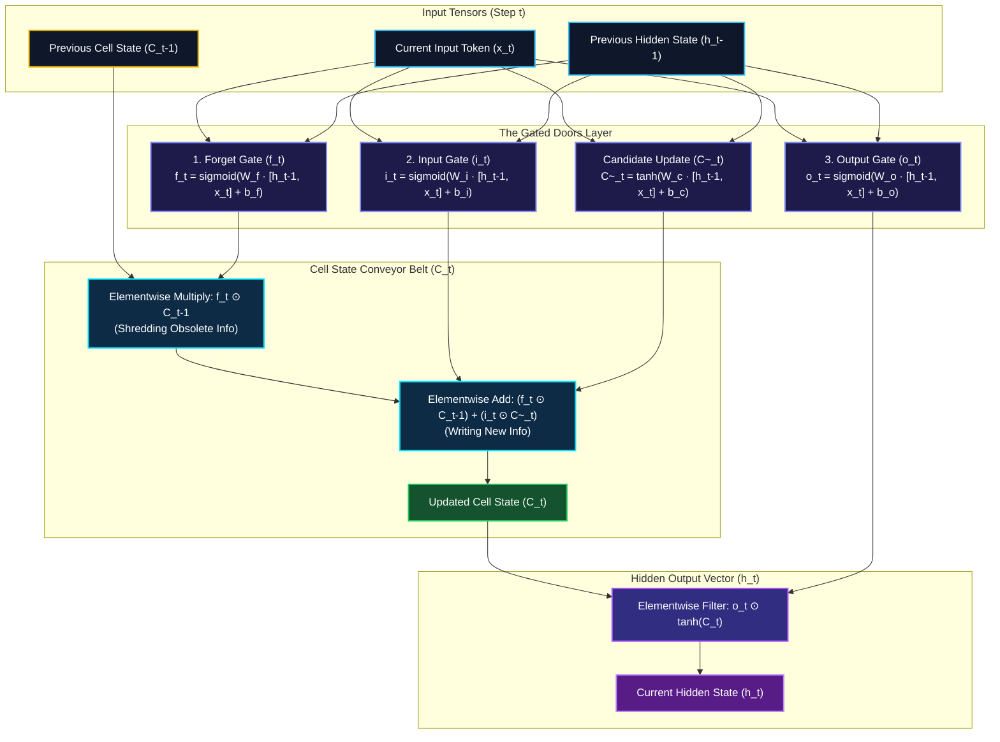

*Series: Neural Architecture Evolution Series (From MLPs to Transformers) - Part 2*

*Series: &larr; [Part 1: Demystifying Neural Networks: From Simple Perceptrons to Deep Neural Networks (DNNs), CNNs, and RNNs](/blog/demystifying-neural-networks-perceptron-to-dnn-cnn-rnn/) (Previous)*

### Prior Reading Material

Before diving into how Long Short-Term Memory networks solved sequential degradation, explore these foundational deep-dives across our blog:

* [Part 1: Demystifying Neural Networks](/blog/demystifying-neural-networks-perceptron-to-dnn-cnn-rnn/) — Biological neurons, perceptrons, MLPs, CNNs, and standard Recurrent Neural Networks (RNNs).
* [Demystifying LoRA (Low-Rank Adaptation)](/blog/demystifying-lora-low-rank-adaptation/) — Understanding weight matrices, intrinsic rank, and parameter-efficient updates.
* [What is a Model Weight? Demystifying Tensors, Matrices, and File Formats](/blog/what-is-a-model-weight/) — The fundamental linear algebra primitives behind neural network layers.
* [Training vs. Inference Lifecycle](/blog/training-vs-inference-lifecycle/) — How forward passes, backpropagation through time (BPTT), and loss surfaces shape AI models.

---

## 1. The Story of RNN Amnesia & The Broken Game of Telephone

Imagine standing in a line of 100 people playing a fast-paced game of telephone. The first person in line whispers a crucial secret to the second person: 

> *"The secret key to the vault is hidden under the blue rug inside the garden shed."*

Each person in line must memorize what they heard, process it in their head, and whisper their updated understanding to the next person. By the time the message reaches Person #15, minor mishearings accumulate. By Person #50, the message has degraded into complete noise: *"A blue dog ran into the shed."* By Person #100, the original secret has vanished entirely.

This game of telephone is precisely how standard Recurrent Neural Networks ([RNNs](https://pytorch.org/docs/stable/generated/torch.nn.RNN.html)) process sequential data—such as long sentences, financial ticker streams, or multi-minute audio recordings. 

In [Part 1 of this series](/blog/demystifying-neural-networks-perceptron-to-dnn-cnn-rnn/), we saw how standard RNNs introduced feedback loops ($h_t = \tanh(W_{hh} h_{t-1} + W_{xh} x_t + b)$), allowing a single hidden vector ($h_t$) to serve as a running memory diary. However, this design suffered from a fatal flaw: **catastrophic short-term memory (RNN Amnesia)**. Because the hidden state $h_t$ is completely overwritten and squashed by non-linear activation functions ($\tanh$) at every single time step, early signals decay exponentially fast. 

If a paragraph begins with *"Jane grew up in France..."* and ends 80 words later with *"she speaks fluent ____"*, a standard RNN cannot bridge the 80-step gap to output *"French"*. The early context was swallowed by intervening words.

In 1997, researchers Sepp Hochreiter and Jürgen Schmidhuber proposed a revolutionary architecture designed specifically to conquer RNN amnesia: **Long Short-Term Memory (LSTM)**.

---

## 2. The Mental Model: The Executive Leather Notebook & Memory Conveyor Belt

To understand how an LSTM solves memory loss without getting bogged down in complex equations, imagine an executive traveling on a long cross-country train.

Instead of trying to memorize every conversation and data point in their head (which corresponds to the volatile hidden state $h_t$), the executive carries a dedicated **Executive Leather Notebook** sitting on a smooth **Memory Conveyor Belt**. This notebook represents the **Cell State ($C_t$)**.

As new information ($x_t$) arrives at each train station, the executive does not rewrite the entire notebook from scratch. Instead, three specialized assistants—known as **Gated Doors**—stand along the conveyor belt:

1. **The Forget Gate ($f_t$) [The Shredder]**: Inspects the incoming input ($x_t$) and previous summary ($h_{t-1}$), and decides which old, obsolete pages in the notebook should be erased or shredded (e.g., erasing a previous subject when a sentence transitions from *"John"* to *"Mary"*).
2. **The Input Gate ($i_t$) [The Selective Pen]**: Decides what precise new pieces of information are valuable enough to write into the notebook, creating a candidate memory update ($\tilde{C}_t$) and writing it onto the conveyor belt.
3. **The Output Gate ($o_t$) [The Speaker/Highlighter]**: Filters the updated notebook content, extracting only the relevant context needed right now to form the visible output vector ($h_t$).

Because the Cell State conveyor belt ($C_t$) runs straight through time with only additive modifications (+), information can travel across hundreds of steps untouched.

---

## 3. Visualizing the LSTM Gated Architecture

The following vertical workflow diagram illustrates the internal signal routing inside a single LSTM cell at step $t$:



---

## 4. Engineering Deep-Dive: Formal Mathematical Gate Equations

Having established the mental model, let's step into the formal linear algebra that powers PyTorch's `nn.LSTM` and TensorFlow's `tf.keras.layers.LSTM`.

An LSTM cell processes input vector $x_t \in \mathbb{R}^d$ and previous hidden vector $h_{t-1} \in \mathbb{R}^h$ using four distinct linear transformations.

### Step 1: The Forget Gate ($f_t$)
The Forget gate decides what fraction of the previous cell state $C_{t-1}$ to retain. Because it uses the Sigmoid activation ($\sigma$), its output values are strictly bounded between $0$ (completely forget) and $1$ (completely retain):

$$f_t = \sigma\left(W_f \cdot [h_{t-1}, x_t] + b_f\right)$$

### Step 2: The Input Gate ($i_t$) & Candidate Cell State ($\tilde{C}_t$)
The Input gate regulates which values will be updated, while a $\tanh$ layer creates a vector of new candidate values $\tilde{C}_t$:

$$i_t = \sigma\left(W_i \cdot [h_{t-1}, x_t] + b_i\right)$$

$$\tilde{C}_t = \tanh\left(W_c \cdot [h_{t-1}, x_t] + b_c\right)$$

### Step 3: Updating the Cell State ($C_t$)
The new cell state $C_t$ is computed via element-wise multiplication ($\odot$) and addition (+):

$$C_t = f_t \odot C_{t-1} + i_t \odot \tilde{C}_t$$

### Step 4: The Output Gate ($o_t$) & Hidden State ($h_t$)
Finally, the Output gate determines what portion of the cell state is emitted to the hidden state $h_t$:

$$o_t = \sigma\left(W_o \cdot [h_{t-1}, x_t] + b_o\right)$$

$$h_t = o_t \odot \tanh(C_t)$$

### Parameter Breakdown Comparison

Why are LSTMs computationally heavier than standard RNNs? Let's analyze the parameter count comparison table:

| Architecture | Weight Matrices | Bias Vectors | Total Parameters (Hidden Size $h$, Input Size $d$) |
| :--- | :--- | :--- | :--- |
| **Standard RNN** | $1$ ($W_{hh}, W_{xh}$) | $1$ ($b_h$) | $(h + d) \cdot h + h$ |
| **LSTM Cell** | $4$ ($W_f, W_i, W_c, W_o$) | $4$ ($b_f, b_i, b_c, b_o$) | $4 \cdot \left((h + d) \cdot h + h\right)$ |
| **GRU Cell** | $3$ ($W_z, W_r, W_h$) | $3$ ($b_z, b_r, b_h$) | $3 \cdot \left((h + d) \cdot h + h\right)$ |

---

## 5. Mathematical Proof: How LSTMs Solve the Vanishing Gradient Problem

In a standard RNN, during Backpropagation Through Time (BPTT), the gradient of loss $L$ with respect to an early hidden state $h_k$ expands via the chain rule:

$$\frac{\partial L}{\partial h_k} = \frac{\partial L}{\partial h_T} \prod_{t=k+1}^T \frac{\partial h_t}{\partial h_{t-1}} = \frac{\partial L}{\partial h_T} \prod_{t=k+1}^T W_{hh}^T \operatorname{diag}\left(1 - \tanh^2(\text{net}_t)\right)$$

Because $\operatorname{diag}(1 - \tanh^2(\cdot)) \le 1.0$, repeatedly multiplying by $W_{hh}^T$ over 50+ steps causes the gradient norm to decay exponentially to zero ($\lambda^T \to 0$ when $\lambda < 1$).

### The Constant Error Carousel in LSTMs
In an LSTM, backpropagating through the cell state $C_t$ yields:

$$\frac{\partial C_t}{\partial C_{t-1}} = f_t$$

If the network learns to set the forget gate $f_t \approx 1.0$ for critical information, the gradient partial derivative simplifies to:

$$\frac{\partial C_t}{\partial C_{t-1}} = 1.0$$

Therefore, during BPTT across $T - k$ time steps:

$$\frac{\partial L}{\partial C_k} = \frac{\partial L}{\partial C_T} \prod_{t=k+1}^T f_t \approx \frac{\partial L}{\partial C_T} \cdot (1.0)^{T-k} = \frac{\partial L}{\partial C_T}$$

This uninterrupted, linear gradient flow pathway is called the **Constant Error Carousel**. It guarantees that error signals propagate backward over hundreds of time steps without exploding or vanishing!

---

## 6. Runnable Python Simulation Script

Below is a complete, zero-dependency Python simulation comparing a standard RNN cell vs. an LSTM cell across a 50-step sequence.

<details>
<summary><b>Click to expand runnable Python simulation script</b></summary>

```python
"""
LSTM Cell & Gradient Flow Simulation from Scratch
Author: Narendra Vadapalli
Series: Neural Architecture Evolution Series (Part 2)

This script demonstrates why Long Short-Term Memory (LSTM) networks were invented:
1. Standard RNN: Hidden state (h_t) suffers from vanishing gradients over long sequences (t=50).
2. LSTM Network: Cell state (C_t) acts as a memory conveyor belt, maintaining gradient flow.
"""

import math
import random

def sigmoid(x: float) -> float:
    """Standard sigmoid activation function bounded in (0, 1)."""
    return 1.0 / (1.0 + math.exp(-max(min(x, 500), -500)))

def tanh(x: float) -> float:
    """Hyperbolic tangent activation function bounded in (-1, 1)."""
    return math.tanh(x)

class SimpleRNNCell:
    """Standard Recurrent Neural Network (RNN) Cell."""
    def __init__(self):
        random.seed(42)
        self.w_h = random.uniform(-0.5, 0.5)
        self.w_x = random.uniform(-0.5, 0.5)
        self.b = 0.0

    def forward_sequence(self, x_seq):
        h_states = [0.0]
        for x_t in x_seq:
            h_prev = h_states[-1]
            h_t = tanh(self.w_h * h_prev + self.w_x * x_t + self.b)
            h_states.append(h_t)
        return h_states

    def compute_gradient_norm(self, seq_len):
        grad = 1.0
        for _ in range(seq_len):
            grad *= (self.w_h * 0.5)
        return abs(grad)

class LSTMCell:
    """Long Short-Term Memory (LSTM) Cell from Scratch."""
    def __init__(self):
        random.seed(42)
        # Forget Gate (f)
        self.w_f = random.uniform(-0.2, 0.2)
        self.b_f = 1.0  # Positive bias to default forget gate ~ 1 (remember)
        
        # Input Gate (i) & Candidate Cell State (c_tilde)
        self.w_i = random.uniform(-0.2, 0.2)
        self.b_i = 0.0
        self.w_c = random.uniform(-0.2, 0.2)
        self.b_c = 0.0

        # Output Gate (o)
        self.w_o = random.uniform(-0.2, 0.2)
        self.b_o = 0.0

    def forward_step(self, x_t, h_prev, c_prev):
        combined = h_prev + x_t
        f_t = sigmoid(self.w_f * combined + self.b_f)
        i_t = sigmoid(self.w_i * combined + self.b_i)
        c_tilde = tanh(self.w_c * combined + self.b_c)

        c_t = f_t * c_prev + i_t * c_tilde
        o_t = sigmoid(self.w_o * combined + self.b_o)
        h_t = o_t * tanh(c_t)

        return h_t, c_t, (f_t, i_t, o_t)

    def forward_sequence(self, x_seq):
        h_states, c_states, gate_history = [0.0], [0.0], []
        for x_t in x_seq:
            h_t, c_t, gates = self.forward_step(x_t, h_states[-1], c_states[-1])
            h_states.append(h_t)
            c_states.append(c_t)
            gate_history.append(gates)
        return h_states, c_states, gate_history

def run_simulation():
    seq_length = 50
    print("=" * 70)
    print("      LSTM VS STANDARD RNN: CONQUERING LONG-TERM MEMORY AMNESIA      ")
    print("=" * 70)
    print(f"Sequence Length: {seq_length} time steps\n")

    input_seq = [1.0] + [random.uniform(-0.1, 0.1) for _ in range(seq_length - 1)]

    # 1. Standard RNN
    rnn = SimpleRNNCell()
    rnn_h = rnn.forward_sequence(input_seq)
    rnn_grad = rnn.compute_gradient_norm(seq_length)

    print(f"[1] Standard RNN Performance:")
    print(f"    - Initial Signal (t=0) : {input_seq[0]:.4f}")
    print(f"    - Hidden State at t=50: {rnn_h[50]:.4f}")
    print(f"    - Gradient Magnitude  : {rnn_grad:.10e}")
    print("    --> Result: Signal degraded completely due to Vanishing Gradient!\n")

    # 2. LSTM Cell
    lstm = LSTMCell()
    lstm_h, lstm_c, gates = lstm.forward_sequence(input_seq)

    print(f"[2] LSTM Cell Performance (Conveyor Belt + Gated Doors):")
    print(f"    - Initial Signal (t=0) : {input_seq[0]:.4f}")
    print(f"    - Cell State C_t at t=50: {lstm_c[50]:.4f}")
    avg_f = sum(g[0] for g in gates) / len(gates)
    print(f"    - Average Forget Gate Openness: {avg_f:.2f}")
    print("    --> Result: Cell state maintained gradient pathway across 50 steps!")
    print("=" * 70)

if __name__ == "__main__":
    run_simulation()
```

</details>

---

## 7. Summary & What's Next in Part 3

LSTMs represented a monumental leap in deep learning architecture. By introducing the **Cell State ($C_t$) conveyor belt** and three **Gated Doors ($f_t, i_t, o_t$)**, LSTMs conquered RNN amnesia and enabled the first generation of production sequence modeling—powering early versions of Google Translate, Siri voice recognition, and handwriting synthesis.

However, LSTMs still possessed a fundamental engineering bottleneck: **sequential processing**. Because $h_t$ depends directly on $h_{t-1}$, computations cannot be parallelized across massive GPU clusters.

In **Part 3 of our Neural Architecture Evolution Series**, we will explore **The Transformer Revolution: How Self-Attention and $Q K^T V$ Solved the GPU Parallelization Bottleneck**, tracing how Vaswani et al. replaced sequential loops with global matrix operations and birthed modern Large Language Models!

---

## 8. References & External Links

* **Hochreiter & Schmidhuber (1997)**: [Long Short-Term Memory](https://www.bioinf.jku.at/publications/older/2604.pdf) — The original research paper published in *Neural Computation* introducing the LSTM architecture and Constant Error Carousel.
* **Olah (2015)**: [Understanding LSTM Networks](https://colah.github.io/posts/2015-08-Understanding-LSTMs/) — Christopher Olah's seminal visual walkthrough of LSTM cell states and gated operations.
* **Cho et al. (2014)**: [Learning Phrase Representations using RNN Encoder-Decoder](https://arxiv.org/abs/1406.1078) — Paper introducing the Gated Recurrent Unit (GRU) as a streamlined alternative to LSTMs.
* **PyTorch Official Documentation**: [torch.nn.LSTM API Reference](https://pytorch.org/docs/stable/generated/torch.nn.LSTM.html) — Official documentation for PyTorch's multi-layer LSTM recurrent module.
* **TensorFlow Official Documentation**: [tf.keras.layers.LSTM Guide](https://www.tensorflow.org/api_docs/python/tf/keras/layers/LSTM) — Keras API guide for implementing LSTM layers in TensorFlow.

*Series Navigation:*
* &larr; [Part 1: Demystifying Neural Networks: From Simple Perceptrons to Deep Neural Networks (DNNs), CNNs, and RNNs](/blog/demystifying-neural-networks-perceptron-to-dnn-cnn-rnn/) (Previous)
* [Part 3: The Transformer Revolution: How Self-Attention and Q K^T V Solved the GPU Parallelization Bottleneck](/blog/transformer-revolution-self-attention-parallelization/) (Next) &rarr;
