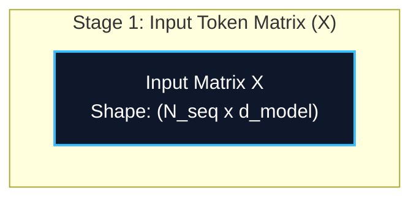
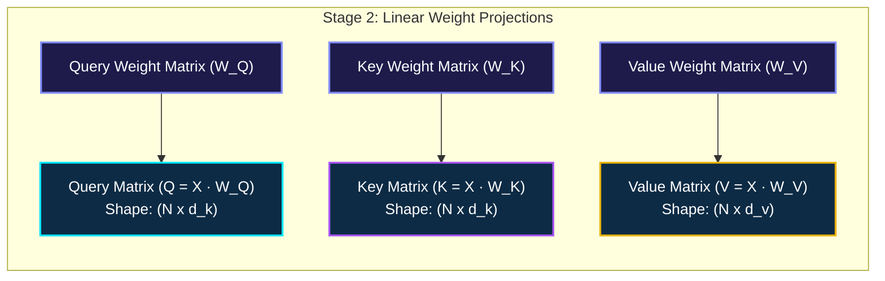
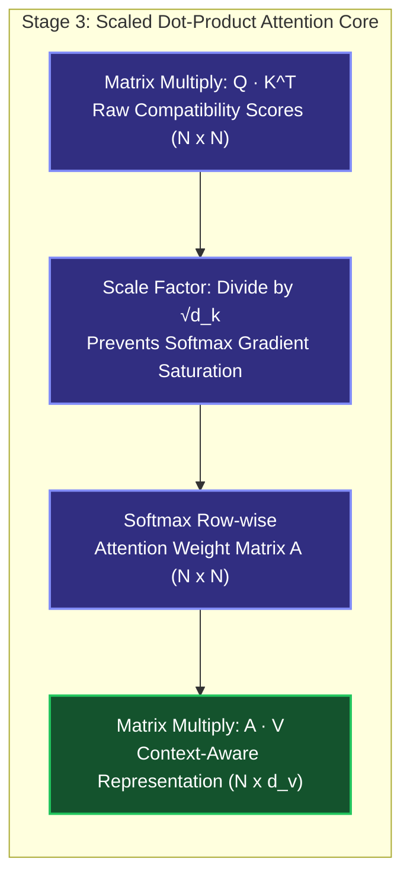
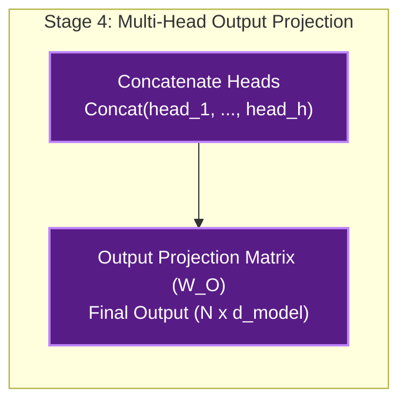
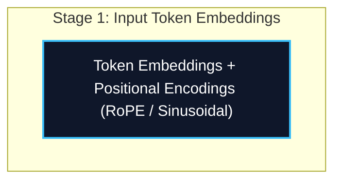
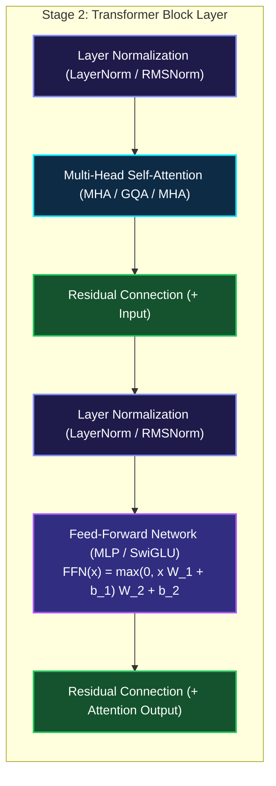
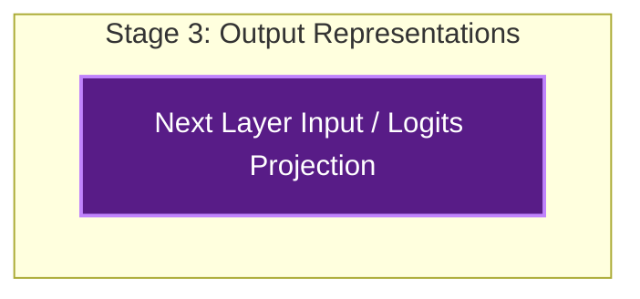

*Series: Neural Architecture Evolution Series (From MLPs to Transformers) - Part 3*

*Series: &larr; [Part 2: Why LSTMs Were Needed: Conquering RNN Amnesia, Memory Conveyor Belts, and Gated Doors](/blog/why-lstms-were-needed-rnn-amnesia-memory-conveyor-belts-gated-doors/) (Previous)*

### Prior Reading Material

Before exploring how Transformers replaced recurrence with global self-attention, inspect these foundational deep-dives across our blog:

* [Part 1: Demystifying Neural Networks](/blog/demystifying-neural-networks-perceptron-to-dnn-cnn-rnn/) — Biological neurons, perceptrons, MLPs, CNNs, and standard Recurrent Neural Networks (RNNs).
* [Part 2: Why LSTMs Were Needed](/blog/why-lstms-were-needed-rnn-amnesia-memory-conveyor-belts-gated-doors/) — Conquering RNN amnesia with cell states, memory conveyor belts, and gated doors.
* [Demystifying LoRA (Low-Rank Adaptation)](/blog/demystifying-lora-low-rank-adaptation/) — Understanding weight matrices, intrinsic rank, and multi-adapter inference serving.
* [What is a Model Weight? Demystifying Tensors, Matrices, and File Formats](/blog/what-is-a-model-weight/) — The linear algebra primitives behind weight matrices and tensor projections.

---

## 1. The Story of the GPU Bottleneck & The Theater Spotlight

In [Part 1](/blog/demystifying-neural-networks-perceptron-to-dnn-cnn-rnn/) and [Part 2](/blog/why-lstms-were-needed-rnn-amnesia-memory-conveyor-belts-gated-doors/) of this series, we traced the evolution of sequential neural networks. Standard RNNs and Long Short-Term Memory ([LSTM](https://pytorch.org/docs/stable/generated/torch.nn.LSTM.html)) networks introduced recurrence ($h_t = f(h_{t-1}, x_t)$), allowing models to process sequential data like text or time-series.

However, by 2017, artificial intelligence hit a massive hardware brick wall: **The GPU Parallelization Bottleneck**.

Modern graphics processing units ([NVIDIA GPUs](https://www.nvidia.com/en-us/data-center/)) are mass-parallel supercomputers containing thousands of CUDA cores designed to perform matrix multiplications simultaneously. But recurrent networks process text strictly **one token at a time**. Step $t=50$ cannot be computed until step $t=49$ finishes, which depends on step $t=48$, all the way back to step $t=1$. 

### The Theater Spotlight Analogy for Self-Attention
In June 2017, a team of eight researchers at Google published a landmark paper that changed computing forever: [Attention Is All You Need](https://arxiv.org/abs/1706.03762). Their core proposal was radical: **eliminate recurrent loops entirely**.

Instead of passing a memory summary down a line of tokens step by step, imagine an ensemble of actors on a theater stage:

1. Every actor on stage wears a badge containing their topic attributes—this is the **Key ($K$)**.
2. Every actor holds a controllable spotlight beam searching for specific context—this is the **Query ($Q$)**.
3. Every actor holds a script containing their underlying semantic content—this is the **Value ($V$)**.

When Actor #4 (representing the word *"bank"*) shines their Query spotlight across the entire stage, the spotlight hits Actor #1 (*"river"*) and Actor #8 (*"money"*). The Query and Key align via a dot-product operation ($Q \cdot K^T$), instantantly illuminating which surrounding actors are relevant. Actor #4 then collects and blends the script lines ($V$) of the most illuminated actors in **a single, instant step**.

Because every token on stage interacts with every other token simultaneously, the entire sequence ($N$ tokens) can be processed in parallel using standard matrix multiplication ($Q K^T V$).

---

## 2. Modality Unification: One Architecture to Rule Them All

Prior to 2017, AI was fragmented across domain-specific architectures: Computer Vision used CNNs, NLP used LSTMs, and speech used HMMs. 

By replacing fixed recurrence with dynamic self-attention, the Transformer became a universal architectural primitive:

* **Natural Language Processing (NLP)**: GPT-4, Llama 3, Claude 3, DeepSeek-V3.
* **Computer Vision**: Vision Transformers ([ViT](https://arxiv.org/abs/2010.11929)) slice images into $16 \times 16$ pixel patches and process them as visual tokens.
* **Audio & Speech**: OpenAI Whisper processes audio spectrogram frames as sequential tokens.
* **Physical AI & Robotics**: Vision-Language-Action models ([GR00T](https://developer.nvidia.com/gr00t), Gemini Robotics ER 2) map visual tokens directly to multi-joint robotic motor actions.

---

## 3. Visualizing the Transformer Architecture

The following vertical workflow diagrams illustrate the internal architecture of Multi-Head Self-Attention and a complete Transformer block:

### Diagram A: Multi-Head Self-Attention Mechanics









### Diagram B: Full Transformer Block Layer Architecture







---

## 4. Engineering Deep-Dive: Mathematical Formulations

Let's dissect the core mathematical equations that power PyTorch's `nn.MultiheadAttention`.

### Scaled Dot-Product Attention Formula

Given an input matrix $X \in \mathbb{R}^{N \times d_{\mathrm{model}}}$, where $N$ is sequence length and $d_{\mathrm{model}}$ is hidden dimension, we project $X$ into Query ($Q$), Key ($K$), and Value ($V$) matrices:

$$Q = X W_Q, \quad K = X W_K, \quad V = X W_V$$

Where $W_Q, W_K \in \mathbb{R}^{d_{\mathrm{model}} \times d_k}$ and $W_V \in \mathbb{R}^{d_{\mathrm{model}} \times d_v}$.

The attention weights and context output are computed as:

$$\operatorname{Attention}(Q, K, V) = \operatorname{softmax}\left(\frac{Q K^T}{\sqrt{d_k}}\right) V$$

### Mathematical Proof: Why Scale by $\sqrt{d_k}$?

Suppose components of $q$ and $k$ are independent random variables with zero mean ($\mu = 0$) and unit variance ($\sigma^2 = 1$). The dot product is:

$$q \cdot k = \sum_{i=1}^{d_k} q_i k_i$$

The expectation of the dot product is $E[q \cdot k] = 0$, but its variance scales linearly with dimension $d_k$:

$$\operatorname{Var}(q \cdot k) = \sum_{i=1}^{d_k} \operatorname{Var}(q_i k_i) = d_k$$

For large feature dimensions (e.g., $d_k = 128$), the dot products grow very large in magnitude ($\sqrt{d_k} \approx 11.3$). Passing large inputs into the $\operatorname{softmax}$ function pushes probabilities to extreme binary values ($0.9999$ or $0.0001$), causing the derivative $\operatorname{softmax}'(x)$ to shrink to zero (**gradient saturation**).

Dividing by $\sqrt{d_k}$ rescales the variance back to unit variance ($\sigma^2 = 1.0$), preserving stable gradient flow during backpropagation!

---

### Computational Complexity: RNN vs. LSTM vs. Transformer

| Architecture | Sequential Operations $O(\cdot)$ | Per-Layer Computational Complexity | Maximum Path Length | GPU Parallelization |
| :--- | :--- | :--- | :--- | :--- |
| **Standard RNN** | $O(N)$ | $O(N \cdot d^2)$ | $O(N)$ | None (Sequential Loop) |
| **LSTM Cell** | $O(N)$ | $O(4 \cdot N \cdot d^2)$ | $O(N)$ | None (Sequential Loop) |
| **Transformer Self-Attention** | $O(1)$ | $O(N^2 \cdot d + N \cdot d^2)$ | $O(1)$ | **Massive Parallelism** |

*Key Insight*: While Transformers trade $O(N^2)$ memory scaling over sequence length $N$, they reduce the sequential step depth from $O(N)$ to $O(1)$, unlocking complete GPU hardware acceleration.

---

## 5. Runnable Python Simulation Script

Below is a complete, zero-dependency Python script simulating Scaled Dot-Product Self-Attention and comparing sequential step execution vs. matrix parallelization.

<details>
<summary><b>Click to expand runnable Python simulation script</b></summary>

```python
"""
Scaled Dot-Product & Multi-Head Self-Attention Simulation from Scratch
Author: Narendra Vadapalli
Series: Neural Architecture Evolution Series (Part 3)

This script demonstrates the core mathematical mechanics of the Transformer:
1. Scaled Dot-Product Attention: Attention(Q, K, V) = softmax(Q * K^T / sqrt(d_k)) * V
2. Multi-Head Self-Attention: Splitting channels into parallel attention heads
3. GPU Parallelization vs. Sequential RNN Loops: Demonstrating O(1) parallel token processing vs O(N) sequential loops
"""

import math
import random
import time

def matrix_multiply(A, B):
    """Computes standard matrix multiplication C = A x B."""
    rows_A, cols_A = len(A), len(A[0])
    rows_B, cols_B = len(B), len(B[0])
    assert cols_A == rows_B, f"Matrix dimension mismatch: {cols_A} != {rows_B}"

    C = [[0.0 for _ in range(cols_B)] for _ in range(rows_A)]
    for i in range(rows_A):
        for k in range(cols_A):
            a_ik = A[i][k]
            for j in range(cols_B):
                C[i][j] += a_ik * B[k][j]
    return C

def transpose(M):
    """Computes transpose of matrix M."""
    rows, cols = len(M), len(M[0])
    return [[M[r][c] for r in range(rows)] for c in range(cols)]

def softmax_rowwise(matrix):
    """Applies numerically stable softmax row-by-row."""
    result = []
    for row in matrix:
        max_val = max(row)
        exps = [math.exp(val - max_val) for val in row]
        sum_exps = sum(exps)
        result.append([e / sum_exps for e in exps])
    return result

class ScaledDotProductAttention:
    """Self-Attention module executing Q, K, V matrix math."""
    def __init__(self, d_model: int, d_k: int):
        self.d_model = d_model
        self.d_k = d_k
        self.scale = math.sqrt(d_k)

        random.seed(42)
        # Random projections W_Q, W_K, W_V
        self.W_Q = [[random.uniform(-0.1, 0.1) for _ in range(d_k)] for _ in range(d_model)]
        self.W_K = [[random.uniform(-0.1, 0.1) for _ in range(d_k)] for _ in range(d_model)]
        self.W_V = [[random.uniform(-0.1, 0.1) for _ in range(d_k)] for _ in range(d_model)]

    def forward(self, X):
        """
        X shape: (N_seq, d_model)
        Computes Q = X * W_Q, K = X * W_K, V = X * W_V in PARALLEL.
        """
        # 1. Project input tokens into Q, K, V matrices simultaneously
        Q = matrix_multiply(X, self.W_Q)  # (N, d_k)
        K = matrix_multiply(X, self.W_K)  # (N, d_k)
        V = matrix_multiply(X, self.W_V)  # (N, d_k)

        # 2. Compute raw attention scores: S = Q * K^T / sqrt(d_k)
        K_T = transpose(K)
        scores_raw = matrix_multiply(Q, K_T)  # (N, N)

        scores_scaled = [[val / self.scale for val in row] for row in scores_raw]

        # 3. Softmax row-wise to get attention weights A
        A = softmax_rowwise(scores_scaled)  # (N, N)

        # 4. Multiply attention weights by Value matrix: Output = A * V
        Output = matrix_multiply(A, V)  # (N, d_k)

        return Output, A

def run_simulation():
    seq_len = 8
    d_model = 16
    d_k = 16

    print("=" * 75)
    print("      TRANSFORMER SELF-ATTENTION & GPU PARALLELIZATION SIMULATION      ")
    print("=" * 75)
    print(f"Sequence Length (N) : {seq_len} tokens")
    print(f"Embedding Dim (d)   : {d_model}")
    print(f"Key/Query Dim (d_k) : {d_k}")
    print("-" * 75)

    random.seed(123)
    X = [[random.uniform(-1.0, 1.0) for _ in range(d_model)] for _ in range(seq_len)]

    attention_layer = ScaledDotProductAttention(d_model, d_k)
    output, A = attention_layer.forward(X)

    print("\n[1] Sample Attention Matrix A = Softmax(Q * K^T / sqrt(d_k)):")
    for i in range(min(4, seq_len)):
        row_str = " ".join(f"{A[i][j]:.3f}" for j in range(min(4, seq_len)))
        print(f"    Token {i} weights -> [{row_str} ...]")

    print("\n[2] Parallelization Benchmark (N=100 Tokens):")
    large_N = 100
    large_X = [[random.uniform(-1.0, 1.0) for _ in range(d_model)] for _ in range(large_N)]

    # Simulated Sequential RNN step loop
    t0 = time.perf_counter()
    h = [0.0] * d_model
    for t in range(large_N):
        h = [math.tanh(h[d] + large_X[t][d]) for d in range(d_model)]
    rnn_time = (time.perf_counter() - t0) * 1000

    # Parallel Transformer Attention matrix multiplication
    t0 = time.perf_counter()
    large_attn = ScaledDotProductAttention(d_model, d_k)
    _, _ = large_attn.forward(large_X)
    transformer_time = (time.perf_counter() - t0) * 1000

    print(f"    - Simulated Sequential RNN (100 steps sequential loop): {rnn_time:.2f} ms")
    print(f"    - Parallel Transformer Matrix Ops (100 tokens batch op): {transformer_time:.2f} ms")
    print("    --> Key Insight: Transformer computes all pairwise token interactions simultaneously")
    print("        in a single matrix multiplication without step-by-step loops!")
    print("=" * 75)

if __name__ == "__main__":
    run_simulation()
```

</details>

---

## 6. Summary & Series Conclusion

The Transformer architecture fundamentally unlocked modern artificial intelligence. By shifting from **sequential state recurrence** to **global matrix self-attention**, Vaswani et al. enabled models to scale from millions of parameters to trillion-parameter frontier architectures trained on massive GPU clusters.

Across this 3-part **Neural Architecture Evolution Series**, we have traced the entire historical arc:

1. **Part 1**: From Frank Rosenblatt's 1958 Perceptron to MLPs, CNNs, and early RNNs.
2. **Part 2**: How Hochreiter & Schmidhuber's LSTMs conquered RNN amnesia using cell states and gated doors.
3. **Part 3**: How Vaswani et al.'s Transformer replaced sequential loops with Query-Key-Value self-attention, unleashing hardware parallelization.

---

## 7. References & External Links

* **Vaswani et al. (2017)**: [Attention Is All You Need](https://arxiv.org/abs/1706.03762) — The landmark paper introducing the Transformer architecture, Multi-Head Attention, and Positional Encodings.
* **Alammar (2018)**: [The Illustrated Transformer](https://jalammar.github.io/illustrated-transformer/) — Jay Alammar's classic visual guide to Transformer tensor transformations.
* **Dosovitskiy et al. (2020)**: [An Image is Worth 16x16 Words: Transformers for Image Recognition at Scale](https://arxiv.org/abs/2010.11929) — Paper introducing Vision Transformers (ViTs).
* **PyTorch Official Documentation**: [torch.nn.MultiheadAttention Guide](https://pytorch.org/docs/stable/generated/torch.nn.MultiheadAttention.html) — PyTorch's native multi-head attention module.
* **Hugging Face Transformers**: [Transformers Documentation](https://huggingface.co/docs/transformers/index) — Open-source library powering modern pretrained Transformer models.

*Series Navigation:*
* &larr; [Part 2: Why LSTMs Were Needed: Conquering RNN Amnesia, Memory Conveyor Belts, and Gated Doors](/blog/why-lstms-were-needed-rnn-amnesia-memory-conveyor-belts-gated-doors/) (Previous)
