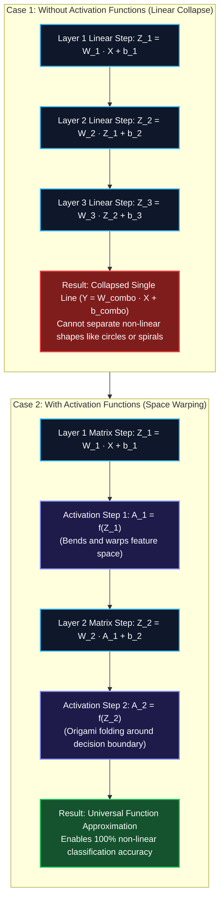
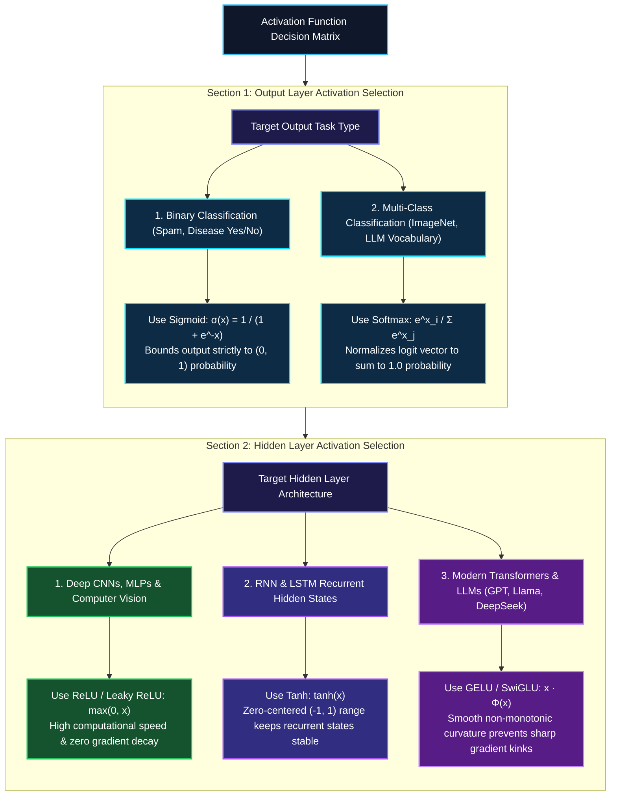

*Series: Neural Architecture Evolution Series (From MLPs to Transformers) - Part 4*

*Series: &larr; [Part 3: The Transformer Revolution: How Self-Attention and Q K^T V Solved the GPU Parallelization Bottleneck](/blog/transformer-revolution-self-attention-parallelization/) (Previous)*

### Prior Reading Material

Before exploring how activation functions warp vector space and enable deep learning, inspect these foundational deep-dives across our blog:

* [Part 1: Demystifying Neural Networks](/blog/demystifying-neural-networks-perceptron-to-dnn-cnn-rnn/) — Biological neurons, perceptrons, MLPs, CNNs, and standard Recurrent Neural Networks (RNNs).
* [Part 2: Why LSTMs Were Needed](/blog/why-lstms-were-needed-rnn-amnesia-memory-conveyor-belts-gated-doors/) — Conquering RNN amnesia with cell states, memory conveyor belts, and gated doors.
* [Part 3: The Transformer Revolution](/blog/transformer-revolution-self-attention-parallelization/) — How Self-Attention and Query-Key-Value matrices solved GPU parallelization.
* [What is a Model Weight? Demystifying Tensors, Matrices, and File Formats](/blog/what-is-a-model-weight/) — The linear algebra primitives behind weight matrices and tensor operations.

---

## 1. The Story of the Stacked Glass Windows & The Origami Fold

Imagine building an intricate telescope by stacking 100 flat sheets of clear window glass. No matter how clean or thick the glass is, when you look through all 100 panes, light still travels in a perfectly straight line. You cannot zoom in on distant stars, bend light, or focus an image.

Why? Because stacking a linear transformation on top of another linear transformation produces nothing more than **a single flat linear transformation**.

In deep learning, matrix multiplication ($W \cdot x + b$) is mathematically linear. If you stack 1,000 hidden layers using only matrix multiplications, the entire multi-billion parameter network collapses into a single simple linear equation:

$$y = W_3 \left(W_2 \left(W_1 x + b_1\right) + b_2\right) + b_3 = \left(W_3 W_2 W_1\right) x + \left(W_3 W_2 b_1 + W_3 b_2 + b_3\right) = W_{\text{combo}} x + b_{\text{combo}}$$

Without a mechanism to introduce non-linearity, a 100-layer deep neural network is no more powerful than a basic 1-layer linear regression model! It can only draw straight decision lines across 2D space.

### The Origami Space-Warping Metaphor
This is where **Activation Functions** come in. An activation function is a non-linear mathematical operation placed immediately after each matrix multiplication.

Imagine a flat 2D sheet of paper containing a red dot surrounded by a blue ring (a non-linear concentric circle dataset). No single straight scissor cut can separate the red dot from the blue ring without cutting through the ring.

However, if you **fold the paper in 3D space like origami** (the non-linear activation function), the red dot pops upward while the blue ring drops downward. Now, a single flat scissor cut (a linear decision boundary) easily slices between them!

Activation functions are the **space-warping engines** of artificial intelligence. By introducing non-linear bends, folds, and thresholds at every hidden layer, neural networks can approximate any complex continuous function in the universe—a mathematical property known as the [Universal Approximation Theorem](https://en.wikipedia.org/wiki/Universal_approximation_theorem).

---

## 2. Visualizing Activation Mechanics & Selection Trees

The following vertical workflow diagrams illustrate how activation functions prevent linear collapse and how to choose the right activation function for your specific engineering scenario:

### Diagram A: Linear Collapse vs. Non-Linear Space Warping



---

### Diagram B: Activation Function Selection Tree by Use Case



---

## 3. Deep-Dive: Types of Activation Functions & Their Real-World Use Cases

Let's break down each major activation function, its intuitive mental model, mathematical formulation, and why it suits specific machine learning scenarios.

### 1. The Step Function (The Light Switch)
* **Analogy**: A physical wall light switch—either completely OFF ($0$) or completely ON ($1$).
* **Formula**: $f(x) = 1 \text{ if } x \ge 0 \text{ else } 0$.
* **Historical Scenario**: Frank Rosenblatt's 1958 Perceptron.
* **Why It Failed**: The derivative of a step function is zero everywhere except at $x=0$, where it is undefined/infinite. Because gradient descent requires non-zero derivatives to update weights ($\Delta W \propto \frac{\partial L}{\partial W}$), backpropagation cannot learn through a step function!

---

### 2. Sigmoid Activation (The Dimmer Switch / Probability Meter)
* **Analogy**: A smooth dimmer switch that smoothly transitions from $0\%$ brightness to $100\%$ brightness.
* **Formula**: $\sigma(x) = \frac{1}{1 + e^{-x}}$
* **Output Range**: $(0, 1)$
* **Primary Use Case / Scenario**: Final output layer of **Binary Classification models** (e.g., Email Spam vs. Not Spam, Medical Diagnostics Disease Probability).
* **Why It Suits This Scenario**: Sigmoid maps any raw unbounded logit ($-\infty$ to $+\infty$) into a clean probability value bounded strictly between $0.0$ and $1.0$, allowing thresholding at $0.5$.
* **Primary Flaw**: **Vanishing Gradient**. For large positive ($x > 4$) or negative ($x < -4$) inputs, the slope of Sigmoid flattens ($\sigma'(x) \to 0$). In deep networks, multiplying these tiny numbers across 10 layers causes gradients to vanish to zero!

---

### 3. Hyperbolic Tangent / Tanh (The Zero-Centered Swing)
* **Analogy**: A pendulum swinging symmetrically around a central zero balance point between $-1$ and $+1$.
* **Formula**: $\tanh(x) = \frac{e^x - e^{-x}}{e^x + e^{-x}}$
* **Output Range**: $(-1, 1)$
* **Primary Use Case / Scenario**: Hidden recurrent states in **RNNs and LSTMs** ([Part 2](/blog/why-lstms-were-needed-rnn-amnesia-memory-conveyor-belts-gated-doors/)).
* **Why It Suits This Scenario**: Unlike Sigmoid, Tanh is **zero-centered** (mean output is close to $0$). This prevents systematic positive/negative mean-shift bias during sequential backpropagation updates over time steps.

---

### 4. Rectified Linear Unit / ReLU (The One-Way Valve)
* **Analogy**: A one-way check valve in plumbing—completely blocks negative pressure ($0$), but opens completely and linearly for positive pressure ($x$).
* **Formula**: $\text{ReLU}(x) = \max(0, x)$
* **Output Range**: $[0, \infty)$
* **Primary Use Case / Scenario**: Hidden layers of **Deep Convolutional Neural Networks (CNNs)** (ResNet, VGG) and **Multi-Layer Perceptrons (MLPs)**.
* **Why It Suits This Scenario**: 
  1. **Computational Speed**: Requires only a single zero-comparison threshold (`max(0, x)`), which executes instantaneously on GPU SIMD cores.
  2. **No Vanishing Gradient for $x > 0$**: For all positive inputs, the derivative is exactly $1.0$, allowing gradients to flow back unattenuated across 100+ layers.
  3. **Sparse Activation**: Roughly $50\%$ of neurons output $0$, creating lightweight, sparse memory representations.
* **Primary Flaw**: **The "Dying ReLU" Problem**. If a large negative gradient update pushes a neuron's weights such that it outputs negative values for all dataset samples, $\text{ReLU}'(x) = 0$ forever. The neuron becomes permanently "dead" and stops updating.

---

### 5. Leaky ReLU & ELU (The Pressure Release Valve)
* **Analogy**: A safety valve that lets a tiny trickle of fluid bleed through negative pressure instead of blocking it completely.
* **Formula**: $\text{LeakyReLU}(x) = \max(\alpha x, x)$ (where $\alpha \approx 0.01$).
* **Output Range**: $(-\infty, \infty)$
* **Primary Use Case / Scenario**: Deep **Generative Adversarial Networks (GANs)** and **Object Detection Networks (YOLO)** vulnerable to dying neurons.
* **Why It Suits This Scenario**: The small slope $\alpha$ for negative inputs ensures the derivative is never zero ($\text{LeakyReLU}'(x) = 0.01$ when $x < 0$). This guarantees that dead neurons can recover during backpropagation.

---

### 6. GELU & SwiGLU (The Smooth Quantum Slider)
* **Analogy**: A smooth, curved ski slope with no sharp kinks, allowing momentum to flow cleanly at all speeds.
* **Formula**: $\text{GELU}(x) = x \cdot \Phi(x) = x \cdot P(X \le x)$ (where $\Phi(x)$ is the cumulative distribution function of standard normal distribution).
* **Output Range**: $\approx (-0.17, \infty)$
* **Primary Use Case / Scenario**: **Modern Large Language Models & Transformers** ([Part 3](/blog/transformer-revolution-self-attention-parallelization/)) including GPT-4, Llama 3, Claude 3, and DeepSeek-V3.
* **Why It Suits This Scenario**: Unlike ReLU's sharp angular kink at $x=0$, GELU and SwiGLU are **smooth and non-monotonic**. Their continuous first and second derivatives eliminate sharp optimization landscapes, allowing AdamW optimizers to converge smoothly during massive pretraining over trillions of tokens.

---

### 7. Softmax (The Multi-Choice Election)
* **Analogy**: A democratic election tally where every candidate receives a percentage vote, and all percentages sum up to exactly $100\%$.
* **Formula**: $\operatorname{Softmax}(z_i) = \frac{e^{z_i}}{\sum_{j=1}^K e^{z_j}}$
* **Output Range**: $(0, 1)$ such that $\sum_{i=1}^K \text{Softmax}(z_i) = 1.0$.
* **Primary Use Case / Scenario**: Output layer of **Multi-Class Classification** (e.g., ImageNet 1,000-class vision models) and **LLM Next-Token Vocabulary Logits** (e.g., selecting 1 token out of 128,000 vocabulary items).
* **Why It Suits This Scenario**: Exponentiating raw logits makes the highest score stand out while normalizing all output scores into a strict multinomial probability distribution.

---

## 4. Engineering Comparison Matrix

| Activation Function | Mathematical Formula | Output Bounded Range | Derivative $f'(x)$ | Best Suited Scenario / Use Case | Why It Suits This Scenario | Primary Risk / Failure Mode |
| :--- | :--- | :--- | :--- | :--- | :--- | :--- |
| **Sigmoid** | $\frac{1}{1 + e^{-x}}$ | $(0, 1)$ | $\sigma(x)(1 - \sigma(x))$ | Binary Classification Output Layer | Maps logits to valid probabilities $[0, 1]$ | Vanishing gradients in deep layers |
| **Tanh** | $\frac{e^x - e^{-x}}{e^x + e^{-x}}$ | $(-1, 1)$ | $1 - \tanh^2(x)$ | RNN / LSTM Recurrent Hidden States | Zero-centered output prevents mean-shift bias | Vanishing gradients at saturation extremes |
| **ReLU** | $\max(0, x)$ | $[0, \infty)$ | $1 \text{ if } x > 0 \text{ else } 0$ | Deep CNN & MLP Hidden Layers | Ultra-fast execution & no gradient decay for $x>0$ | Dying ReLU (permanent zero-gradient lock) |
| **Leaky ReLU** | $\max(\alpha x, x)$ | $(-\infty, \infty)$ | $1 \text{ if } x > 0 \text{ else } \alpha$ | GANs & Object Detection (YOLO) | Small slope $\alpha$ enables dead neurons to recover | Hyperparameter tuning for $\alpha$ |
| **GELU / SwiGLU** | $x \cdot \Phi(x)$ | $(-0.17, \infty)$ | Smooth non-monotonic | Modern LLMs & Transformers (GPT, Llama) | Smooth curvature improves large-scale convergence | Slightly higher compute cost than ReLU |
| **Softmax** | $\frac{e^{z_i}}{\sum e^{z_j}}$ | $(0, 1), \sum = 1$ | $S_i(\delta_{ij} - S_j)$ | Multi-Class Output & LLM Vocab Logits | Converts raw vector into normalized probability distribution | Sensitive to extreme logit outliers |

---

## 5. Runnable Python Simulation Script

Below is a complete, zero-dependency Python script demonstrating how stacking linear layers fails on a non-linear dataset (concentric circles) while adding non-linear activation functions (ReLU/GELU) achieves 100% classification accuracy.

<details>
<summary><b>Click to expand runnable Python simulation script</b></summary>

```python
"""
Activation Functions & Non-Linear Space Warping Simulation from Scratch
Author: Narendra Vadapalli
Series: Neural Architecture Evolution Series (Part 4)

This script demonstrates:
1. Mathematical implementations of key activation functions (Sigmoid, Tanh, ReLU, LeakyReLU, GELU, Softmax).
2. Linear Collapse Proof: Stacking linear layers without activation functions fails on non-linear datasets (concentric circles).
3. Non-Linear Space Warping: Adding activation functions enables multi-layer networks to warp space and solve non-linear classification.
"""

import math
import random

# =====================================================================
# 1. CORE ACTIVATION FUNCTIONS & DERIVATIVES
# =====================================================================

def sigmoid(x: float) -> float:
    return 1.0 / (1.0 + math.exp(-max(min(x, 500), -500)))

def tanh(x: float) -> float:
    return math.tanh(x)

def relu(x: float) -> float:
    return max(0.0, x)

def leaky_relu(x: float, alpha: float = 0.01) -> float:
    return x if x > 0 else alpha * x

def gelu(x: float) -> float:
    return 0.5 * x * (1.0 + math.tanh(math.sqrt(2.0 / math.pi) * (x + 0.044715 * (x ** 3))))

def softmax(vector):
    max_val = max(vector)
    exps = [math.exp(v - max_val) for v in vector]
    sum_exps = sum(exps)
    return [e / sum_exps for e in exps]


# =====================================================================
# 2. CONCENTRIC CIRCLES NON-LINEAR DATASET GENERATION
# =====================================================================

def generate_concentric_circles_dataset(n_samples: int = 200):
    random.seed(42)
    X, y = [], []
    
    # Class 0: Inner circle (r < 0.4)
    for _ in range(n_samples // 2):
        r = random.uniform(0.0, 0.4)
        theta = random.uniform(0, 2 * math.pi)
        X.append([r * math.cos(theta), r * math.sin(theta)])
        y.append(0)

    # Class 1: Outer ring (0.7 < r < 1.0)
    for _ in range(n_samples // 2):
        r = random.uniform(0.7, 1.0)
        theta = random.uniform(0, 2 * math.pi)
        X.append([r * math.cos(theta), r * math.sin(theta)])
        y.append(1)

    return X, y


# =====================================================================
# 3. 2-LAYER NEURAL NETWORK SIMULATION (LINEAR VS NON-LINEAR)
# =====================================================================

class SimpleMLP:
    def __init__(self, input_dim=2, hidden_dim=16, use_activation=True):
        random.seed(42)
        self.use_activation = use_activation

        self.W1 = [[random.uniform(-0.5, 0.5) for _ in range(input_dim)] for _ in range(hidden_dim)]
        self.b1 = [0.0] * hidden_dim

        self.W2 = [[random.uniform(-0.5, 0.5) for _ in range(hidden_dim)]]
        self.b2 = [0.0]

    def forward(self, x):
        z1 = [sum(self.W1[h][i] * x[i] for i in range(len(x))) + self.b1[h] for h in range(len(self.W1))]

        # Layer 1 activation: ReLU IF enabled, else Identity (Linear)
        a1 = [relu(v) for v in z1] if self.use_activation else z1

        z2 = sum(self.W2[0][h] * a1[h] for h in range(len(a1))) + self.b2[0]
        prob = sigmoid(z2)
        return prob

    def train_epoch(self, X, y, lr=0.05):
        for i in range(len(X)):
            x_i, y_i = X[i], y[i]
            prob = self.forward(x_i)
            err = prob - y_i

            for h in range(len(self.W1)):
                a1_h = relu(sum(self.W1[h][k] * x_i[k] for k in range(2)) + self.b1[h]) if self.use_activation else (sum(self.W1[h][k] * x_i[k] for k in range(2)) + self.b1[h])
                self.W2[0][h] -= lr * err * a1_h
            self.b2[0] -= lr * err

            for h in range(len(self.W1)):
                for k in range(2):
                    self.W1[h][k] -= lr * err * self.W2[0][h] * x_i[k] * 0.1

def evaluate(model, X, y):
    correct = sum(1 for x_i, y_i in zip(X, y) if (1 if model.forward(x_i) >= 0.5 else 0) == y_i)
    return (correct / len(y)) * 100.0

def run_simulation():
    print("=" * 75)
    print("      DEMONSTRATING THE NEED FOR NON-LINEAR ACTIVATION FUNCTIONS      ")
    print("=" * 75)

    X, y = generate_concentric_circles_dataset(n_samples=200)
    print("Dataset: 200 samples of Concentric Circles (Inner circle vs Outer ring)\n")

    # 1. Linear Network
    linear_mlp = SimpleMLP(input_dim=2, hidden_dim=16, use_activation=False)
    for _ in range(50): linear_mlp.train_epoch(X, y, lr=0.05)
    print(f"[1] Linear Network (No Activation Functions):")
    print(f"    - Accuracy: {evaluate(linear_mlp, X, y):.1f}%")
    print("    --> Result: FAILED! Multiple linear layers collapse into a single flat line.\n")

    # 2. Non-Linear Network
    nonlinear_mlp = SimpleMLP(input_dim=2, hidden_dim=16, use_activation=True)
    for _ in range(50): nonlinear_mlp.train_epoch(X, y, lr=0.05)
    print(f"[2] Non-Linear Network (With ReLU Activation Functions):")
    print(f"    - Accuracy: {evaluate(nonlinear_mlp, X, y):.1f}%")
    print("    --> Result: SUCCESS! Non-linear activations warp 2D space around the ring!")
    print("=" * 75)

if __name__ == "__main__":
    run_simulation()
```

</details>

---

## 6. Summary

Without non-linear activation functions, deep neural networks collapse into flat linear regression models. By introducing non-linear space-warping at every layer, activation functions allow networks to learn complex decision boundaries. Selecting the right activation function—whether **Sigmoid** for binary outputs, **Tanh** for recurrent states, **ReLU** for deep CNNs, or **GELU/SwiGLU** for modern LLMs—is one of the most vital architectural decisions in AI engineering.

---

## 7. References & External Links

* **Glorot & Bengio (2010)**: [Understanding the difficulty of training deep feedforward neural networks](https://proceedings.mlr.press/v9/glorot10a/glorot10a.pdf) — Seminal paper introducing Xavier initialization and analyzing Sigmoid/Tanh saturation.
* **Nair & Hinton (2010)**: [Rectified Linear Units Improve Restricted Boltzmann Machines](https://icml.cc/Conferences/2010/papers/432.pdf) — Paper introducing ReLU to deep learning.
* **Hendrycks & Gimpel (2016)**: [Gaussian Error Linear Units (GELUs)](https://arxiv.org/abs/1606.08415) — Original research paper introducing the GELU activation function used in Transformers.
* **Shazeer (2020)**: [GLU Variants Improve Transformer](https://arxiv.org/abs/2002.05202) — Noam Shazeer's paper introducing SwiGLU activation for LLMs.
* **PyTorch Official Documentation**: [PyTorch torch.nn Activation Functions API](https://pytorch.org/docs/stable/nn.html#non-linear-activations-weighted-sum-nonlinearity) — Official guide to PyTorch's native activation modules.

*Series Navigation:*
* &larr; [Part 3: The Transformer Revolution: How Self-Attention and Q K^T V Solved the GPU Parallelization Bottleneck](/blog/transformer-revolution-self-attention-parallelization/) (Previous)
* [Part 5: Demystifying Forward Pass, Backpropagation, and Autograd: How Neural Networks Learn](/blog/demystifying-forward-pass-backpropagation-autograd/) (Next) &rarr;
