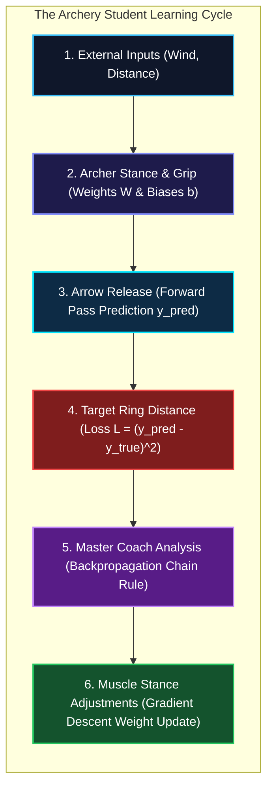
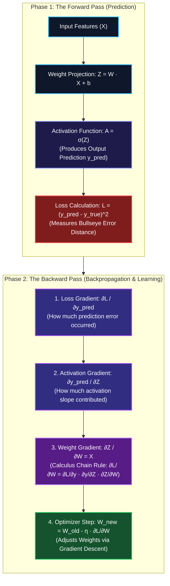
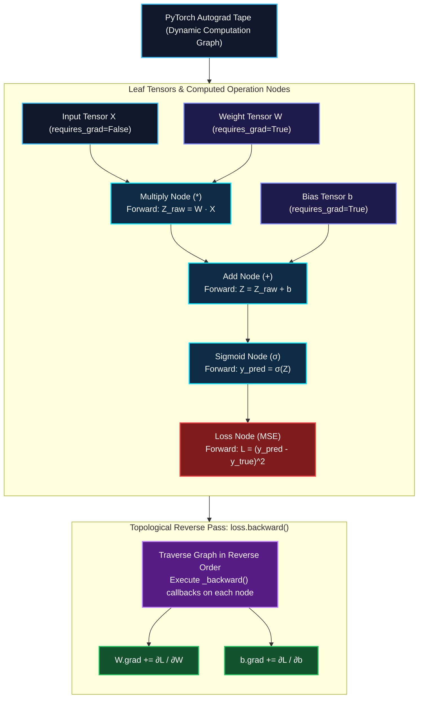

*Series: Neural Architecture Evolution Series (From MLPs to Transformers) - Part 5*

*Series: &larr; [Part 4: Demystifying Activation Functions: Why Neural Networks Need Non-Linearity, Types, and Real-World Use Cases](/blog/demystifying-activation-functions-non-linearity-types-use-cases/) (Previous)*

### Prior Reading Material

Before exploring how neural networks compute gradients and learn from data, inspect these foundational deep-dives across our blog:

* [Part 1: Demystifying Neural Networks](/blog/demystifying-neural-networks-perceptron-to-dnn-cnn-rnn/) — Biological neurons, perceptrons, MLPs, CNNs, and standard Recurrent Neural Networks (RNNs).
* [Part 2: Why LSTMs Were Needed](/blog/why-lstms-were-needed-rnn-amnesia-memory-conveyor-belts-gated-doors/) — Conquering RNN amnesia with cell states, memory conveyor belts, and gated doors.
* [Part 3: The Transformer Revolution](/blog/transformer-revolution-self-attention-parallelization/) — How Self-Attention and Query-Key-Value matrices solved GPU parallelization.
* [Part 4: Demystifying Activation Functions](/blog/demystifying-activation-functions-non-linearity-types-use-cases/) — Why neural networks require non-linear space warping (Sigmoid, ReLU, GELU).
* [What is a Model Weight? Demystifying Tensors, Matrices, and File Formats](/blog/what-is-a-model-weight/) — The linear algebra primitives behind weight matrices and tensor projections.

---

## 1. The Story of the Archery Student & The Master Coach

Imagine a beginner archery student stepping up to a target range for the very first time.

The student stands at the firing line, looks at the target 50 yards away, adjusts their posture, grips the bowstring, and releases an arrow. The arrow flies through the air and lands **6 inches to the left of the bullseye**.

How does the student learn to hit the center on their next attempt?



This single shot contains the entire core cycle of machine learning:

1. **The Arrow Shot (The Forward Pass)**: The student takes external inputs (distance, wind speed $x$), processes them through their current muscle memory and technique (the network's **Weights $W$ and Biases $b$**), and produces an arrow landing position (the predicted output $y_{\text{pred}}$).
2. **Measuring the Miss (The Loss Function)**: The target rings measure the exact mathematical distance between where the arrow landed ($y_{\text{pred}}$) and the center bullseye ($y_{\text{true}}$). This distance is the **Loss ($L$)**.
3. **The Master Coach's Feedback (Backpropagation & The Chain Rule)**: A master coach doesn't just yell *"You missed!"* Instead, the coach walks **backward** from the target to the archer, breaking down the mistake step by step:
   > *"Your arrow landed left because your release hand twitched by 10%, which happened because your elbow angle was off by 20%, which was caused by your foot stance leaning 70% too far back."*
   
   By isolating exactly how much each individual muscle adjustment contributed to the total miss, the coach calculates the exact correction needed for every single joint.
4. **Adjusting the Stance (Gradient Descent)**: The archer adjusts their feet, elbow, and grip by small micro-amounts in the opposite direction of the mistake ($W_{\text{new}} = W_{\text{old}} - \eta \cdot \nabla L$).
5. **The Instant Replay Camera (Dynamic Autograd DAG)**: In modern frameworks like [PyTorch](https://pytorch.org/), every arithmetic operation executed during the forward pass is recorded by an automated "instant replay camera." When you call `loss.backward()`, PyTorch rewinds this recording in reverse order, using the **Calculus Chain Rule** to calculate exact gradients for millions of parameters automatically.

### What is Autograd? (Automatic Differentiation)

> **The Tape Recorder Metaphor for Autograd:**
> Imagine trying to compute calculus derivatives by hand for a 100-layer neural network with 10 million parameters. If you change one line of code or add a new layer, you would have to spend days re-deriving thousands of calculus equations from scratch!
>
> **Autograd** (short for **Automatic Differentiation**) is the background tape recorder built into modern frameworks like PyTorch and TensorFlow:
> 1. **Forward Tape Recording**: As tensors flow forward through your model, Autograd silently records every mathematical operation (`+`, `*`, `matrix multiply`, `ReLU`) into a Directed Acyclic Graph (DAG).
> 2. **Automatic Reverse Replay**: When you execute `loss.backward()`, Autograd presses "rewind" on the tape recorder—automatically applying the calculus Chain Rule backwards step-by-step through every recorded operation to calculate exact gradients for millions of parameters in milliseconds.

---

## 2. Visualizing Learning Mechanics & Autograd Execution Graphs

The following vertical workflow diagrams illustrate how information flows forward during prediction and backward during learning:

### Diagram A: Forward Pass vs. Backpropagation Reverse Flow



---

### Diagram B: Dynamic Autograd Computation Graph (PyTorch DAG)



---

## 3. Engineering Deep-Dive: The Calculus of Backpropagation

Let's dissect the exact mathematical mechanics behind backpropagation for a single neuron with weight vector $W$, bias $b$, Sigmoid activation $\sigma(z)$, and Mean Squared Error loss $L$.

> **Math in 1 Sentence:** *The calculus of backpropagation simply asks three questions in a chain: How far off was the final prediction? How steep was the activation curve when it fired? And how strong was the input signal that passed through that weight?*

### Step 1: The Forward Equations
Given input vector $x$ and true target $y$:

1. Linear Combination:
   $$z = \sum_{i=1}^d W_i x_i + b = W^T x + b$$
2. Non-Linear Activation ([Part 4](/blog/demystifying-activation-functions-non-linearity-types-use-cases/)):
   $$\hat{y} = \sigma(z) = \frac{1}{1 + e^{-z}}$$
3. Loss Function (Mean Squared Error):
   $$L = \frac{1}{2} (\hat{y} - y)^2$$

---

### Step 2: Applying the Chain Rule
To adjust weight $W_i$ using gradient descent, we must compute the partial derivative $\frac{\partial L}{\partial W_i}$. According to the **Calculus Chain Rule**, the sensitivity of the loss with respect to $W_i$ is the product of three local gradients:

$$\frac{\partial L}{\partial W_i} = \left( \frac{\partial L}{\partial \hat{y}} \right) \cdot \left( \frac{\partial \hat{y}}{\partial z} \right) \cdot \left( \frac{\partial z}{\partial W_i} \right)$$

Where each component represents:
- $\frac{\partial L}{\partial \hat{y}}$ = **1. Output Error** (How far the arrow missed the target)
- $\frac{\partial \hat{y}}{\partial z}$ = **2. Activation Slope** (Steepness of the Sigmoid curve at point $z$)
- $\frac{\partial z}{\partial W_i}$ = **3. Input Strength** (Value of input $x_i$ feeding into weight $W_i$)

Let's compute each local gradient individually:

1. **How Loss changes with respect to Prediction ($\frac{\partial L}{\partial \hat{y}}$)**:
   $$\frac{\partial L}{\partial \hat{y}} = \frac{\partial}{\partial \hat{y}} \left[ \frac{1}{2}(\hat{y} - y)^2 \right] = (\hat{y} - y)$$
2. **How Prediction changes with respect to Linear Sum ($\frac{\partial \hat{y}}{\partial z}$)**:
   $$\frac{\partial \hat{y}}{\partial z} = \frac{\partial}{\partial z} [\sigma(z)] = \sigma(z)(1 - \sigma(z)) = \hat{y}(1 - \hat{y})$$
3. **How Linear Sum changes with respect to Weight $W_i$ ($\frac{\partial z}{\partial W_i}$)**:
   $$\frac{\partial z}{\partial W_i} = \frac{\partial}{\partial W_i} [W_1 x_1 + W_2 x_2 + \dots + b] = x_i$$

---

### Step 3: Combining into the Full Weight Gradient
Multiplying all three terms yields the final backpropagation equation for weight $W_i$:

$$\frac{\partial L}{\partial W_i} = (\hat{y} - y) \cdot \hat{y}(1 - \hat{y}) \cdot x_i$$

$$\text{Weight Gradient} = (\text{Prediction Miss}) \cdot (\text{Sigmoid Slope}) \cdot (\text{Input Value})$$

Similarly, for the bias scalar $b$:

$$\frac{\partial L}{\partial b} = (\hat{y} - y) \cdot \hat{y}(1 - \hat{y}) \cdot 1$$

### Step 4: Parameter Update via Gradient Descent
Once gradients are computed across the dataset, weights are updated using learning rate $\eta$:

$$W_i^{(\text{new})} = W_i^{(\text{old})} - \eta \cdot \frac{\partial L}{\partial W_i}$$

$$b^{(\text{new})} = b^{(\text{old})} - \eta \cdot \frac{\partial L}{\partial b}$$

---

## 4. Engineering Comparison: Manual Derivatives vs. Autograd Engines

| Feature | Manual Analytic Derivatives | Symbolic Differentiation | Reverse-Mode Autograd (PyTorch) |
| :--- | :--- | :--- | :--- |
| **Mechanism** | Hand-derived calculus equations | Computer algebra expression tree | Dynamic DAG execution recording (`_backward()`) |
| **Flexibility** | Breaks when architecture changes | Memory explosion on complex loops | **Supports dynamic loops, `if` branches, & custom ops** |
| **Speed** | Maximum runtime efficiency | Extremely slow compilation | **High-speed C++ / CUDA Tensor Core execution** |
| **Maintenance** | Error-prone for 100+ layers | Rigid computational graphs | **Automatic gradient computation via `loss.backward()`** |

---

## 5. Runnable Python Simulation Script

Below is a complete, zero-dependency Python script implementing a Micro-Autograd Engine (a lightweight version of PyTorch's `autograd`) that builds a dynamic computation DAG and optimizes weights automatically.

<details>
<summary><b>Click to expand runnable Python simulation script</b></summary>

```python
"""
Forward Pass, Backpropagation Chain Rule & Autograd Engine from Scratch
Author: Narendra Vadapalli
Series: Neural Architecture Evolution Series (Part 5)

This script demonstrates:
1. Step-by-step Forward Pass and Loss computation.
2. Manual Backpropagation via Calculus Chain Rule derivatives.
3. Micro-Autograd Computation Engine: Building a PyTorch-like dynamic DAG with automatic reverse-mode differentiation.
4. Training loop demonstrating loss reduction over 100 epochs.
"""

import math
import random

class Value:
    """A scalar value that tracks its computation history for reverse-mode automatic differentiation."""
    def __init__(self, data, _children=(), _op=''):
        self.data = float(data)
        self.grad = 0.0
        self._backward = lambda: None
        self._prev = set(_children)
        self._op = _op

    def __add__(self, other):
        other = other if isinstance(other, Value) else Value(other)
        out = Value(self.data + other.data, (self, other), '+')

        def _backward():
            self.grad += 1.0 * out.grad
            other.grad += 1.0 * out.grad
        out._backward = _backward
        return out

    def __mul__(self, other):
        other = other if isinstance(other, Value) else Value(other)
        out = Value(self.data * other.data, (self, other), '*')

        def _backward():
            self.grad += other.data * out.grad
            other.grad += self.data * out.grad
        out._backward = _backward
        return out

    def __pow__(self, other):
        assert isinstance(other, (int, float)), "only supporting int/float powers"
        out = Value(self.data ** other, (self,), f'**{other}')

        def _backward():
            self.grad += (other * (self.data ** (other - 1))) * out.grad
        out._backward = _backward
        return out

    def sigmoid(self):
        x = self.data
        s = 1.0 / (1.0 + math.exp(-max(min(x, 500), -500)))
        out = Value(s, (self,), 'sigmoid')

        def _backward():
            self.grad += (s * (1.0 - s)) * out.grad
        out._backward = _backward
        return out

    def backward(self):
        topo = []
        visited = set()
        def build_topo(v):
            if v not in visited:
                visited.add(v)
                for child in v._prev:
                    build_topo(child)
                topo.append(v)
        build_topo(self)

        self.grad = 1.0
        for node in reversed(topo):
            node._backward()

    def __sub__(self, other): return self + (-other)
    def __neg__(self): return self * -1

class Neuron:
    def __init__(self, nin):
        random.seed(42)
        self.w = [Value(random.uniform(-0.5, 0.5)) for _ in range(nin)]
        self.b = Value(0.0)

    def __call__(self, x):
        act = sum((wi * xi for wi, xi in zip(self.w, x)), self.b)
        return act.sigmoid()

    def parameters(self):
        return self.w + [self.b]

def run_simulation():
    print("=" * 75)
    print("      DEMONSTRATING FORWARD PASS, BACKPROPAGATION & AUTOGRAD ENGINE      ")
    print("=" * 75)

    dataset = [
        ([0.1, 0.2], 0.0),
        ([0.8, 0.9], 1.0),
        ([0.2, 0.1], 0.0),
        ([0.9, 0.7], 1.0),
    ]

    neuron = Neuron(2)
    print("Neuron initialized with 2 inputs (x1, x2) and Sigmoid activation.")
    print("-" * 75)

    print("\n[1] Forward Pass Before Training:")
    for x, y_true in dataset:
        x_val = [Value(v) for v in x]
        y_pred = neuron(x_val)
        print(f"    Input {x} -> Predicted: {y_pred.data:.4f} | Target: {y_true}")

    print("\n[2] Executing Backpropagation Training (100 Epochs):")
    for epoch in range(1, 101):
        total_loss = Value(0.0)
        for x, y_true in dataset:
            x_val = [Value(v) for v in x]
            y_pred = neuron(x_val)
            diff = y_pred - Value(y_true)
            loss = diff ** 2
            total_loss = total_loss + loss

        for p in neuron.parameters(): p.grad = 0.0
        total_loss.backward()
        for p in neuron.parameters(): p.data -= 1.0 * p.grad

        if epoch in [1, 20, 50, 100]:
            print(f"    Epoch {epoch:3d} | Total Loss: {total_loss.data:.6f} | w1_grad={neuron.w[0].grad:.4f}, w2_grad={neuron.w[1].grad:.4f}")

    print("\n[3] Forward Pass After Training:")
    for x, y_true in dataset:
        x_val = [Value(v) for v in x]
        y_pred = neuron(x_val)
        binary_pred = 1.0 if y_pred.data >= 0.5 else 0.0
        status = "PASSED" if binary_pred == y_true else "FAILED"
        print(f"    Input {x} -> Predicted: {y_pred.data:.4f} (Class {int(binary_pred)}) | Target: {int(y_true)} [{status}]")

    print("\n" + "=" * 75)

if __name__ == "__main__":
    run_simulation()
```

</details>

---

## 6. Summary & What's Next in Part 6

Learning in neural networks is not magic—it is an elegant cycle of taking a prediction shot (**Forward Pass**), measuring the distance to the target (**Loss**), stepping backward through calculus derivatives (**Backpropagation Chain Rule**), and updating weights via **Gradient Descent**. Frameworks like PyTorch automate this process via dynamic **Autograd DAGs**.

However, as networks grow from 2 layers to 100+ layers, backpropagation faces severe numerical instability. In **Part 6 of our Neural Architecture Evolution Series**, we will explore **Why Deep Networks Die: Weight Initialization (He/Xavier), LayerNorm, and Residual Connections**, examining how modern AI architectures prevent exploding/vanishing gradients and train models with hundreds of layers!

*Series Navigation:*
* &larr; [Part 4: Demystifying Activation Functions: Why Neural Networks Need Non-Linearity, Types, and Real-World Use Cases](/blog/demystifying-activation-functions-non-linearity-types-use-cases/) (Previous)
* [Part 6: Why Deep Networks Die: Weight Initialization (He/Xavier), LayerNorm, and Residual Connections](/blog/why-deep-networks-die-initialization-layernorm-residual-connections/) (Next) &rarr;

---

## 7. References & External Links

* **Rumelhart, Hinton, & Williams (1986)**: [Learning representations by back-propagating errors](https://www.nature.com/articles/323533a0) — The foundational *Nature* paper establishing backpropagation for multi-layer neural networks.
* **PyTorch Official Documentation**: [PyTorch Autograd Engine Mechanics](https://pytorch.org/docs/stable/notes/autograd.html) — Technical guide to PyTorch's dynamic reverse-mode automatic differentiation.
* **Karpathy (2022)**: [micrograd: A tiny scalar-valued autograd engine](https://github.com/karpathy/micrograd) — Andrej Karpathy's minimal scalar autograd engine reference implementation.
* **Baydin et al. (2018)**: [Automatic Differentiation in Machine Learning: A Survey](https://arxiv.org/abs/1502.05767) — Comprehensive academic survey on forward and reverse-mode automatic differentiation.
* **TensorFlow Official Documentation**: [tf.GradientTape Guide](https://www.tensorflow.org/api_docs/python/tf/GradientTape) — TensorFlow's automatic differentiation API guide.
