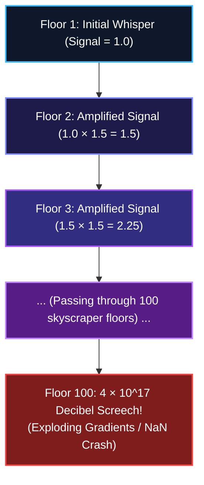
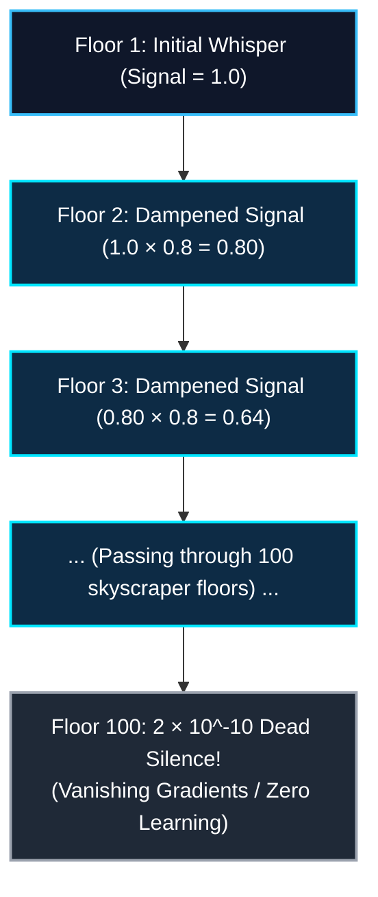
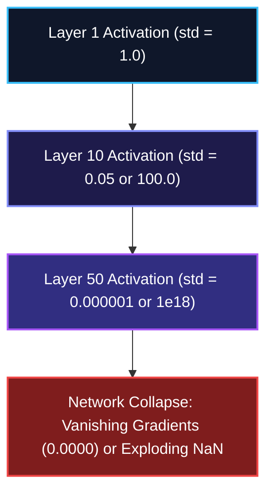
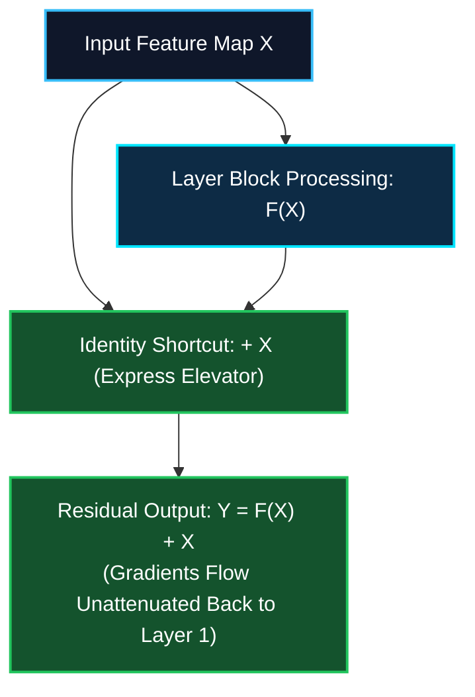
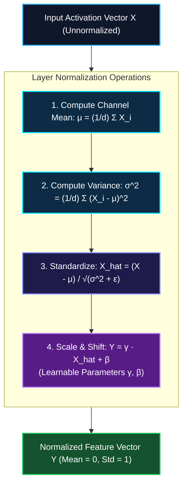

*Series: Neural Architecture Evolution Series (From MLPs to Transformers) - Part 6*

*Series: &larr; [Part 5: Demystifying Forward Pass, Backpropagation, and Autograd: How Neural Networks Learn](/blog/demystifying-forward-pass-backpropagation-autograd/) (Previous)*

### Prior Reading Material

Before exploring numerical stability and deep network initialization, inspect these foundational deep-dives across our blog:

* [Part 1: Demystifying Neural Networks](/blog/demystifying-neural-networks-perceptron-to-dnn-cnn-rnn/) — Biological neurons, perceptrons, MLPs, CNNs, and standard Recurrent Neural Networks (RNNs).
* [Part 2: Why LSTMs Were Needed](/blog/why-lstms-were-needed-rnn-amnesia-memory-conveyor-belts-gated-doors/) — Conquering RNN amnesia with cell states, memory conveyor belts, and gated doors.
* [Part 3: The Transformer Revolution](/blog/transformer-revolution-self-attention-parallelization/) — How Self-Attention and Query-Key-Value matrices solved GPU parallelization.
* [Part 4: Demystifying Activation Functions](/blog/demystifying-activation-functions-non-linearity-types-use-cases/) — Why neural networks require non-linear space warping (Sigmoid, ReLU, GELU).
* [Part 5: Demystifying Forward Pass, Backpropagation, and Autograd](/blog/demystifying-forward-pass-backpropagation-autograd/) — How neural networks learn via loss functions, the calculus chain rule, and dynamic autograd DAGs.
* [What is a Model Weight? Demystifying Tensors, Matrices, and File Formats](/blog/what-is-a-model-weight/) — The linear algebra primitives behind weight matrices and tensor projections.

---

## 1. The Story of the 100-Story Tower & The Whispering Game

Imagine a 100-story skyscraper with one person standing on every floor. The person on Floor 1 whispers a secret message to Floor 2, who passes it to Floor 3, all the way up to Floor 100.

What happens to that message by the time it reaches the top?



#### Scenario 2: Vanishing Signal (Dampening factor = 0.8x per floor)



If every person amplifies the message volume by just **$1.5\times$**, by Floor 100 the sound becomes an ear-splitting **$1.5^{100} \approx 4 \times 10^{17}$ decibel screech** (Exploding Gradients / `NaN` crashes).

If every person dampens the message by just **$0.8\times$**, by Floor 100 the sound decays into **$0.8^{100} \approx 2 \times 10^{-10}$**—absolute dead silence (Vanishing Gradients / zero learning).

Before 2015, neural networks deeper than 20 layers routinely died during training due to these numerical extremes. To build 100+ layer architectures (like [ResNet](https://arxiv.org/abs/1512.03385) or 100-layer Transformers), AI engineers created three foundational innovations:

### 1. Tuning Guitar Strings (Weight Initialization: Xavier & He)
Before playing a concert, a musician must tune guitar strings to exact tension. If strings are too loose (weights initialized too small), no sound comes out. If strings are pulled too tight (weights initialized too large), they snap.

**Xavier (Glorot)** and **Kaiming (He)** weight initializations scale the random variance of initial weights according to the number of input connections ($n_{\text{in}}$), ensuring activation variance stays constant ($\text{Var}(y) = \text{Var}(x)$) as signals pass through deep layers.

### 2. The Soundboard Equalizer (Layer Normalization & RMSNorm)
As audio signals travel through 100 rooms, an automated soundboard equalizer measures output volume at every room transition and normalizes it to standard studio decibels ($\mu=0, \sigma=1$). 

**Layer Normalization (LayerNorm)** normalizes activations across feature channels for every sample, preventing activation drift in ultra-deep Transformers like GPT-4 and Llama 3.

### 3. The Express Elevator (ResNet Residual Skip Connections)
Instead of forcing every message to climb 100 flights of stairs step-by-step, ResNet installs an **Express Elevator** ($y = F(x) + x$). The original input signal $x$ hitches a free ride directly around the layer block. During backpropagation, gradients travel straight down the elevator shaft without decaying!

---

## 2. Visualizing Numerical Stability & Layer Architecture

The following vertical workflow diagrams compare dying networks with stable residual architectures:

### Case 1: Standard Deep Network (Signal Decay / Explosion)



### Case 2: Residual Skip Connections (ResNet Express Highway)



---

### Diagram B: Layer Normalization (LayerNorm) Execution Block



---

## 3. Engineering Deep-Dive: Mathematical Formulations

> [!NOTE]
> **Math in 1 Sentence:** *To keep deep networks alive, we use variance scaling to balance initial weight random noise ($\text{Var}(W) = \frac{2}{n_{\text{in}}}$), normalize output volume across feature channels ($\mu=0, \sigma=1$), and add a $+1$ identity shortcut so gradients never vanish during backpropagation.*

### 1. Kaiming (He) vs. Xavier (Glorot) Weight Initialization
For a linear layer $z = W x + b$, we want the variance of the outputs to equal the variance of the inputs ($\text{Var}(z) = \text{Var}(x)$).

Assuming $W$ and $x$ are zero-mean independent random variables:

$$\text{Var}(z) = n_{\text{in}} \cdot \text{Var}(W) \cdot \text{Var}(x)$$

To enforce $\text{Var}(z) = \text{Var}(x)$, we set $n_{\text{in}} \cdot \text{Var}(W) = 1$, which gives:

$$\text{Var}(W) = \frac{1}{n_{\text{in}}}$$

- **Xavier (Glorot) Initialization** (for Sigmoid/Tanh):
  $$W \sim \mathcal{N}\left(0, \frac{2}{n_{\text{in}} + n_{\text{out}}}\right)$$
- **Kaiming (He) Initialization** (for [ReLU / GELU](/blog/demystifying-activation-functions-non-linearity-types-use-cases/)): Because ReLU zeroes out negative inputs ($\text{Var}(\text{ReLU}(x)) = \frac{1}{2}\text{Var}(x)$), we multiply by 2:
  $$W \sim \mathcal{N}\left(0, \sqrt{\frac{2}{n_{\text{in}}}}\right)$$

---

### 2. Layer Normalization (LayerNorm) Formula
Given a feature vector $x \in \mathbb{R}^d$ for a single sample:

$$\mu = \frac{1}{d} \sum_{i=1}^d x_i, \quad \sigma^2 = \frac{1}{d} \sum_{i=1}^d (x_i - \mu)^2$$

$$y_i = \underbrace{\gamma_i \left( \frac{x_i - \mu}{\sqrt{\sigma^2 + \epsilon}} \right)}_{\text{Standardized Channel Value}} + \underbrace{\beta_i}_{\text{Learnable Shift}}$$

*(where $\gamma$ and $\beta$ are learnable scale and shift parameters).*

### RMSNorm (Root Mean Square Normalization)
Modern LLMs (Llama 3, DeepSeek-V3) simplify LayerNorm by skipping mean tracking ($\mu=0$), achieving a 10–50% speedup:

$$y_i = \frac{x_i}{\text{RMS}(x)} \cdot \gamma_i = \underbrace{\frac{x_i}{\sqrt{\frac{1}{d} \sum_{j=1}^d x_j^2 + \epsilon}}}_{\text{RMS Scaling factor}} \cdot \gamma_i$$

---

### 3. Mathematical Proof of ResNet Gradient Preservation
Consider a residual block mapping $x_l$ to $x_{l+1}$:

$$x_{l+1} = x_l + F(x_l, W_l)$$

Recursively unrolling from layer $l$ to deeper layer $L$:

$$x_L = x_l + \sum_{i=l}^{L-1} F(x_i, W_i)$$

When computing the backpropagation gradient of Loss $\mathcal{E}$ with respect to layer $x_l$:

$$\frac{\partial \mathcal{E}}{\partial x_l} = \frac{\partial \mathcal{E}}{\partial x_L} \cdot \frac{\partial x_L}{\partial x_l} = \frac{\partial \mathcal{E}}{\partial x_L} \left( \underbrace{1}_{\text{Unattenuated Direct Shortcut}} + \underbrace{\frac{\partial}{\partial x_l} \sum_{i=l}^{L-1} F(x_i, W_i)}_{\text{Layer Transformations}} \right)$$

> [!TIP]
> **Key Mathematical Insight:** *Notice the $\mathbf{1}$ inside the parenthesis! Even if every single layer transformation derivative $\frac{\partial}{\partial x_l} \sum F_i$ decays to absolute zero, the incoming loss gradient $\frac{\partial \mathcal{E}}{\partial x_L}$ is multiplied by $\mathbf{1}$—guaranteeing that gradient signals flow straight back to Layer 1 without vanishing!*

---

## 4. Engineering Comparison: Stability Techniques

| Method | Problem Solved | Formula / Concept | Primary Target Architecture |
| :--- | :--- | :--- | :--- |
| **Kaiming (He) Init** | Variance decay/explosion at start | $W \sim \mathcal{N}\left(0, \sqrt{\frac{2}{n_{\text{in}}}}\right)$ | Deep MLPs, CNNs, & ReLU networks |
| **LayerNorm** | Internal covariate shift during training | Normalizes across channels per sample | [Transformers](/blog/transformer-revolution-self-attention-parallelization/) & LLMs |
| **RMSNorm** | LayerNorm computational overhead | Normalizes by root-mean-square only | Llama 3, DeepSeek-V3, Mistral |
| **Residual Connections** | Vanishing gradient in 100+ layers | $y = F(x) + x$ (Identity shortcut) | ResNet, ConvNeXt, Transformer blocks |

---

## 5. Runnable Python Simulation Script

Below is a complete, zero-dependency Python script simulating a 30-layer deep network and demonstrating how Kaiming Initialization, LayerNorm, and Residual Connections conquer vanishing/exploding gradients.

<details>
<summary><b>Click to expand runnable Python simulation script</b></summary>

```python
"""
Deep Network Numerical Stability: Initialization, LayerNorm, and Residual Connections
Author: Narendra Vadapalli
Series: Neural Architecture Evolution Series (Part 6)

This script demonstrates:
1. Vanishing and Exploding Gradient collapse in a 30-layer un-initialized network.
2. Variance preservation via Kaiming (He) and Xavier (Glorot) Initialization.
3. Layer Normalization (LayerNorm) signal stabilization.
4. Residual Skip Connections (ResNet y = F(x) + x) gradient flow across 30 layers.
"""

import math
import random

def relu(x): return max(0.0, x)
def relu_grad(x): return 1.0 if x > 0.0 else 0.0

def mean(vals): return sum(vals) / len(vals)
def std_dev(vals):
    m = mean(vals)
    var = sum((x - m) ** 2 for x in vals) / len(vals)
    return math.sqrt(var + 1e-8)

class LinearLayer:
    def __init__(self, in_features, out_features, init_mode='he'):
        self.in_features = in_features
        self.out_features = out_features
        random.seed(42)

        if init_mode == 'naive_large': scale = 2.5
        elif init_mode == 'naive_small': scale = 0.05
        elif init_mode == 'he': scale = math.sqrt(2.0 / in_features)
        else: scale = 1.0

        self.W = [[random.gauss(0, scale) for _ in range(in_features)] for _ in range(out_features)]
        self.b = [0.0] * out_features

    def forward(self, x):
        return [sum(self.W[i][j] * x[j] for j in range(self.in_features)) + self.b[i] for i in range(self.out_features)]

def layer_norm(x, eps=1e-5):
    m = mean(x)
    std = std_dev(x)
    return [(val - m) / (std + eps) for val in x]

def simulate_deep_network(depth=30, dim=64, mode='he', use_norm=False, use_residual=False):
    random.seed(42)
    layers = [LinearLayer(dim, dim, init_mode=mode) for _ in range(depth)]
    x = [random.gauss(0, 1.0) for _ in range(dim)]
    
    activations = [x]
    curr = x
    for l in range(depth):
        out = layers[l].forward(curr)
        out_act = [relu(v) for v in out]
        if use_norm: out_act = layer_norm(out_act)
        if use_residual: out_act = [a + c for a, c in zip(out_act, curr)]
        curr = out_act
        activations.append(curr)

    grad = [1.0] * dim
    layer_grads = [std_dev(grad)]
    for l in reversed(range(depth)):
        next_grad = [0.0] * dim
        for i in range(dim):
            d_relu = relu_grad(activations[l+1][i])
            g_i = grad[i] * d_relu
            for j in range(dim):
                next_grad[j] += layers[l].W[i][j] * g_i
        if use_residual: next_grad = [ng + g for ng, g in zip(next_grad, grad)]
        grad = next_grad
        layer_grads.append(std_dev(grad))

    layer_grads.reverse()
    return std_dev(activations[0]), std_dev(activations[-1]), layer_grads[0], layer_grads[-1]

def run_simulation():
    print("=" * 80)
    print("        SIMULATING DEEP NETWORK STABILITY ACROSS 30 LAYERS        ")
    print("=" * 80)

    configs = [
        ("1. Naive Small Init (W ~ N(0, 0.05))", "naive_small", False, False),
        ("2. Naive Large Init (W ~ N(0, 2.5))", "naive_large", False, False),
        ("3. Kaiming (He) Init (W ~ N(0, sqrt(2/N)))", "he", False, False),
        ("4. He Init + LayerNorm", "he", True, False),
        ("5. He Init + LayerNorm + Residual Skips (ResNet)", "he", True, True),
    ]

    for title, mode, norm, res in configs:
        print(f"\n{title}:")
        in_std, out_std, g_in, g_out = simulate_deep_network(depth=30, dim=64, mode=mode, use_norm=norm, use_residual=res)
        print(f"    Input Activation StdDev  : {in_std:.4f}")
        print(f"    Layer 30 Activation StdDev: {out_std:.4f}")
        print(f"    Layer 30 Gradient Magnitude: {g_in:.4e}")
        print(f"    Layer 1 Gradient Magnitude : {g_out:.4e}")

    print("\n" + "=" * 80)

if __name__ == "__main__":
    run_simulation()
```

</details>

---

## 6. Summary & What's Next in Part 7

Deep neural networks die when weight initialization and layer operations cause signals to explode to infinity or vanish to zero. By combining **Kaiming (He) Initialization** (variance scaling), **LayerNorm / RMSNorm** (channel equalizer), and **Residual Skip Connections** ($y = F(x) + x$ express elevator), modern AI architectures train stable 100+ layer networks.

In **Part 7 of our Neural Architecture Evolution Series**, we will explore **The Attention Memory Bottleneck: From Self-Attention Basics to MHA, GQA, and DeepSeek's MLA**, examining how LLMs serve multi-billion parameter models efficiently without running out of GPU VRAM!

*Series Navigation:*
* &larr; [Part 5: Demystifying Forward Pass, Backpropagation, and Autograd: How Neural Networks Learn](/blog/demystifying-forward-pass-backpropagation-autograd/) (Previous)

---

## 7. References & External Links

* **Glorot & Bengio (2010)**: [Understanding the difficulty of training deep feedforward neural networks](https://proceedings.mlr.press/v9/glorot10a/glorot10a.pdf) — Seminal research paper introducing Xavier initialization.
* **He et al. (2015)**: [Delving Deep into Rectifiers: Surpassing Human-Level Performance on ImageNet Classification](https://arxiv.org/abs/1502.01852) — Kaiming He's paper introducing He initialization for ReLU networks.
* **He et al. (2015)**: [Deep Residual Learning for Image Recognition](https://arxiv.org/abs/1512.03385) — ResNet landmark paper introducing residual skip connections ($y = F(x) + x$).
* **Ba, Kiros, & Hinton (2016)**: [Layer Normalization](https://arxiv.org/abs/1607.06450) — Research paper introducing LayerNorm for neural network feature standardization.
* **Zhang & Sennrich (2019)**: [Root Mean Square Layer Normalization (RMSNorm)](https://arxiv.org/abs/1910.07467) — Research paper introducing RMSNorm for efficient Transformer inference.
