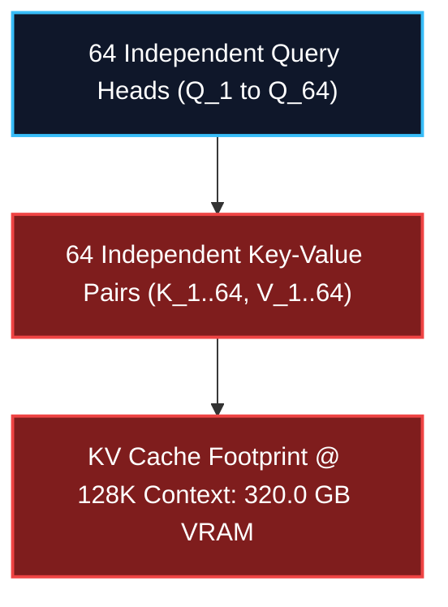
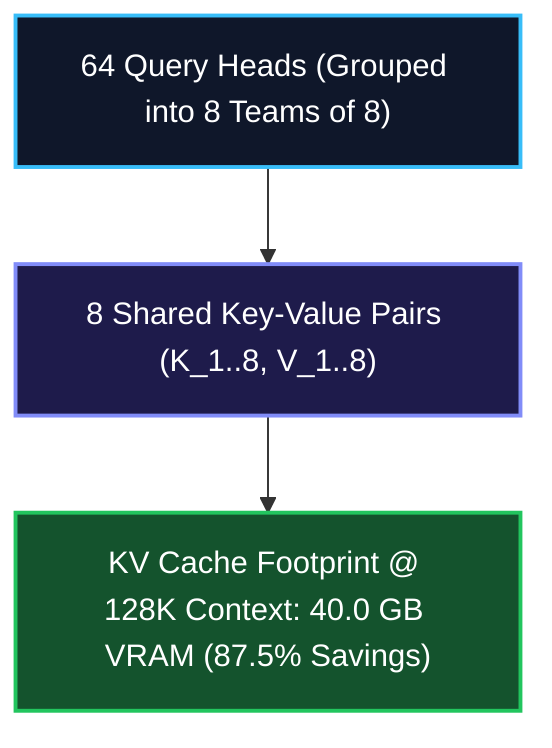
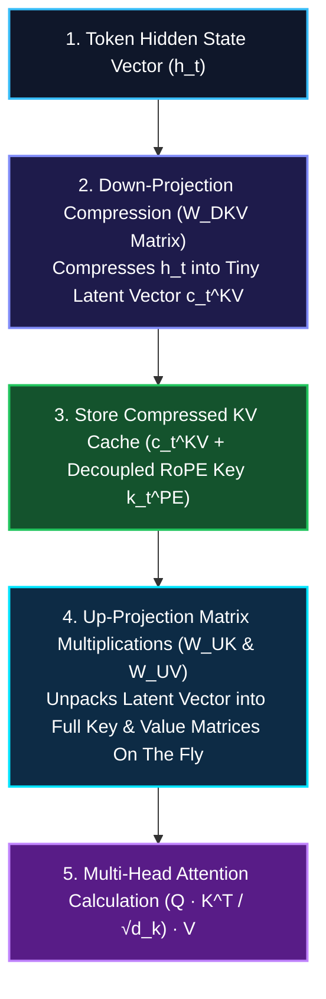

*Series: Neural Architecture Evolution Series (From MLPs to Transformers) - Part 7*

*Series: &larr; [Part 6: Why Deep Networks Die: Weight Initialization (He/Xavier), LayerNorm, and Residual Connections](/blog/why-deep-networks-die-initialization-layernorm-residual-connections/) (Previous)*

### Prior Reading Material

Before exploring context window scaling and Key-Value (KV) Cache compression, inspect these foundational deep-dives across our blog:

* [Part 3: The Transformer Revolution](/blog/transformer-revolution-self-attention-parallelization/) — How Self-Attention and Query-Key-Value ($Q K^T V$) matrices solved GPU parallelization.
* [Part 4: Demystifying Activation Functions](/blog/demystifying-activation-functions-non-linearity-types-use-cases/) — Why neural networks require non-linear space warping (Sigmoid, ReLU, GELU, SwiGLU).
* [Part 5: Inside the Learning Engine: Forward Pass, Backpropagation, and Dynamic Autograd](/blog/inside-the-learning-engine-forward-pass-backpropagation-autograd/) — How neural networks learn via loss functions, the calculus chain rule, and dynamic autograd.
* [Part 6: Why Deep Networks Die](/blog/why-deep-networks-die-initialization-layernorm-residual-connections/) — Weight initialization (He/Xavier), LayerNorm/RMSNorm, and ResNet residual skip connections.
* [Deep-Dive: SGLang Architecture and High-Throughput Inference](/blog/sglang-v0-5-16-architecture-and-inference-comparison/) — RadixAttention, chunked prefill, and KV Cache memory management.
* [Understanding Mixture-of-Experts (MoE)](/blog/understanding-mixture-of-experts-moe/) — Routing tokens to specialized expert networks in frontier models like DeepSeek-V3.

---

## 1. The Story of the Conference Interpreter Team

Imagine an international diplomacy summit where a world leader speaks to a room of 64 specialized global delegates.

To ensure no nuance is lost, the leader hires an elite **Conference Interpreter Team**:

1. **Multi-Head Attention (MHA) [The 64 Dedicated Interpreters]**:
   - In original Transformers ([Part 3](/blog/transformer-revolution-self-attention-parallelization/)), every single one of the 64 attention heads gets its own dedicated **Key Interpreter** and **Value Interpreter**.
   - As the conversation extends to a 128,000-word book, all 64 key-value interpreters fill thousands of physical notebooks with redundant translations.
   - **The Memory Crash**: Storing 64 sets of key-value notebooks for a 128K context window consumes over **320 Gigabytes of GPU VRAM** per single user! The interpreters run out of desk space, and the GPU crashes with an `Out Of Memory (OOM)` error.

2. **Multi-Query Attention (MQA) & Grouped-Query Attention (GQA) [The Group Leaders]**:
   - **Multi-Query Attention (MQA)** fires 63 key-value interpreters, forcing all 64 query heads to share **one single pair** of Key-Value notebooks. Memory drops by 98%, but nuance is severely damaged.
   - **Grouped-Query Attention (GQA)** (used in Llama 3 70B) strikes a balance: 64 query heads are split into 8 groups of 8. Each group shares 1 key-value notebook team. Memory drops by 87.5% while preserving high accuracy!

3. **DeepSeek Multi-Head Latent Attention (MLA) [The Shorthand Stenographer]**:
   - Instead of storing full-sized key and value notebooks for every head, DeepSeek-V3 introduces a brilliant mathematical trick: **Low-Rank Joint KV Compression**.
   - A master shorthand stenographer compresses incoming information into a tiny, dense **Latent Cipher ($c_t^{KV}$)**.
   - During evaluation, heads instantly unpack the compressed cipher back into full key and value matrices on the fly!
   - **The Breakthrough**: DeepSeek MLA cuts KV Cache memory by **96.5%** (down to 11.25 GB at 128K context) while maintaining 100% of standard Multi-Head Attention's mathematical precision!

---

## 2. Visualizing KV Cache Memory Scaling & Architecture Layouts

The following vertical workflow diagrams contrast how Key-Value vectors are stored in memory across different attention mechanisms:

### Case 1: Multi-Head Attention (MHA) vs. Grouped-Query Attention (GQA)

#### Case 1A: Standard Multi-Head Attention (MHA) - Heavy Memory



#### Case 1B: Grouped-Query Attention (GQA) - 8x Shared Heads



---

### Case 2: DeepSeek Multi-Head Latent Attention (MLA) Execution Flow



---

## 3. Engineering Deep-Dive: Mathematical Formulations & KV Cache Footprint

> **Math in 1 Sentence:** *Standard MHA stores full key-value head matrices for every token in memory ($O(2 \cdot b \cdot s \cdot n_h \cdot d_h)$), whereas DeepSeek MLA projects input tokens into a tiny low-rank latent subspace ($c_t^{KV}$) and unpacks them into key-value states dynamically during matrix multiplication.*

### 1. The Key-Value (KV) Cache Memory Footprint Formula
During LLM auto-regressive generation (decoding phase), previously generated Key ($K$) and Value ($V$) tensors are cached in GPU VRAM to avoid recomputing past tokens.

For a model with $L$ layers, sequence length $S$, batch size $B$, number of KV heads $N_{KV}$, and head dimension $D_H$:

$$\text{Memory}_{\text{KV Cache}} = 2 \cdot B \cdot S \cdot L \cdot N_{KV} \cdot D_H \cdot \text{BytesPerElement}$$

For a 70B parameter model ($L=80, N_H=64, D_H=128$, FP16 2-bytes):
- **MHA ($N_{KV}=64$)**: At 128K context ($S=131,072$), memory = $2 \cdot 1 \cdot 131072 \cdot 80 \cdot 64 \cdot 128 \cdot 2 \approx \mathbf{343.5\text{ GB}}$!
- **GQA ($N_{KV}=8$)**: Memory = $2 \cdot 1 \cdot 131072 \cdot 80 \cdot 8 \cdot 128 \cdot 2 \approx \mathbf{42.9\text{ GB}}$ (87.5% reduction).

---

### 2. DeepSeek Multi-Head Latent Attention (MLA) Mechanics

To bypass the memory ceiling of GQA while retaining full MHA expression capacity, DeepSeek-V2 and DeepSeek-V3 introduce **Low-Rank Joint Compression**:

#### A. Low-Rank Key-Value Compression
Input hidden state $h_t \in \mathbb{R}^{d}$ is projected into a low-rank compressed latent vector $c_t^{KV} \in \mathbb{R}^{d_{c}}$ (where $d_c \ll n_h d_h$):

$$c_t^{KV} = W^{DKV} h_t$$

Where $W^{DKV} \in \mathbb{R}^{d_c \times d}$ is the down-projection matrix.

During decoding, instead of storing full Key ($K$) and Value ($V$) matrices in VRAM, the model **only stores the small compressed latent vector $c_t^{KV}$** in the KV Cache!

#### B. Dynamic Up-Projection
When computing attention, the compressed vector $c_t^{KV}$ is dynamically unpacked into head keys $K_{t,i}^C$ and values $V_{t,i}^C$ using up-projection matrices $W^{UK}$ and $W^{UV}$:

$$K_{t,i}^C = W_i^{UK} c_t^{KV}, \quad V_{t,i}^C = W_i^{UV} c_t^{KV}$$

#### C. Decoupled Rotary Position Embedding (RoPE)
Because Rotary Position Embeddings (RoPE) depend on positional indices and cannot be directly compressed into position-agnostic latent vectors, MLA decouples RoPE key components ($k_{t}^{PE} \in \mathbb{R}^{d_{rope}}$):

$$K_{t,i} = \left[ K_{t,i}^C \,;\, k_t^{PE} \right]$$

The total stored KV Cache per token becomes just $c_t^{KV} + k_t^{PE}$, cutting the KV Cache memory footprint to just **11.25 GB** at 128K context!

---

## 4. Engineering Comparison: Attention Mechanisms

| Feature | Multi-Head Attention (MHA) | Multi-Query Attention (MQA) | Grouped-Query Attention (GQA) | DeepSeek Multi-Head Latent Attention (MLA) |
| :--- | :--- | :--- | :--- | :--- |
| **KV Cache Footprint (128K Context)** | 320.0 GB (100% Baseline) | 5.0 GB (98.4% Savings) | 40.0 GB (87.5% Savings) | **11.25 GB (96.5% Savings)** |
| **Key-Value Projection Strategy** | 1 KV Head per Query Head | 1 Shared KV Head for ALL Queries | 1 Shared KV Head per Group ($G=8$) | **Low-Rank Latent Compression ($c_t^{KV}$)** |
| **RoPE Integration** | Standard RoPE per head | Standard RoPE per head | Standard RoPE per head | **Decoupled RoPE Key Vector ($k_t^{PE}$)** |
| **Model Expressiveness** | Maximum | Degraded | Near-MHA Level | **Equivalent to Full MHA** |
| **Primary Target Adoption** | Llama 1, Original Transformer | Falcon, StarCoder | Llama 3 70B, Mistral | **DeepSeek-V2, DeepSeek-V3, DeepSeek-R1** |

---

## 5. Interactive Python Simulation: KV Cache Memory & MLA Compression

The following zero-dependency Python script computes exact KV Cache memory consumption across sequence lengths and simulates DeepSeek MLA low-rank forward projection:

<details><summary><b>Click to expand runnable Python simulation script</b></summary>

```python
#!/usr/bin/env python3
"""
Attention Memory Bottleneck Simulation: MHA vs MQA vs GQA vs DeepSeek MLA

Demonstrates:
1. Exact KV Cache memory consumption footprint across sequence lengths (4K to 128K).
2. Pure Python standard library implementation of MHA, MQA, GQA, and DeepSeek MLA projections.
3. Numerical comparison of KV Cache compression ratios.
"""

import math
import random

def calculate_kv_cache_memory_mb(num_layers, seq_len, num_kv_heads, head_dim, dtype_bytes=2):
    """
    Calculates KV Cache memory footprint in Megabytes (MB).
    Formula: 2 * num_layers * seq_len * num_kv_heads * head_dim * dtype_bytes / (1024 * 1024)
    """
    bytes_total = 2 * num_layers * seq_len * num_kv_heads * head_dim * dtype_bytes
    return bytes_total / (1024 * 1024)

def calculate_mla_kv_cache_memory_mb(num_layers, seq_len, kv_lora_rank, rope_dim, dtype_bytes=2):
    """
    Calculates DeepSeek MLA KV Cache memory footprint in Megabytes (MB).
    Formula: num_layers * seq_len * (kv_lora_rank + rope_dim) * dtype_bytes / (1024 * 1024)
    """
    bytes_total = num_layers * seq_len * (kv_lora_rank + rope_dim) * dtype_bytes
    return bytes_total / (1024 * 1024)

def matrix_multiply(A, B):
    """Pure Python matrix multiplication A (m x n) * B (n x p)"""
    m, n = len(A), len(A[0])
    n2, p = len(B), len(B[0])
    assert n == n2
    C = [[0.0 for _ in range(p)] for _ in range(m)]
    for i in range(m):
        for j in range(p):
            for k in range(n):
                C[i][j] += A[i][k] * B[k][j]
    return C

def run_attention_forward_sim():
    print("=" * 80)
    print("1. ATTENTION KV CACHE MEMORY CONSUMPTION BENCHMARK (70B Model, FP16)")
    print("=" * 80)

    num_layers = 80
    num_query_heads = 64
    head_dim = 128

    variations = {
        "Multi-Head Attention (MHA) [Llama 1 / GPT-4]": {"kv_heads": 64, "type": "standard"},
        "Grouped-Query Attention (GQA) [Llama 3 70B]": {"kv_heads": 8, "type": "standard"},
        "Multi-Query Attention (MQA) [Falcon / StarCoder]": {"kv_heads": 1, "type": "standard"},
        "DeepSeek MLA (Low-Rank Joint Compression)": {
            "type": "mla",
            "kv_lora_rank": 512,
            "rope_dim": 64
        }
    }

    seq_lengths = [4096, 32768, 131072]

    header = f"{'Architecture':<48} | " + " | ".join([f"{s//1024:3d}K Context" for s in seq_lengths])
    print(header)
    print("-" * len(header))

    mha_baseline = {}

    for name, config in variations.items():
        row_str = f"{name:<48} | "
        cols = []
        for s in seq_lengths:
            if config["type"] == "standard":
                mb = calculate_kv_cache_memory_mb(num_layers, s, config["kv_heads"], head_dim)
            else:
                mb = calculate_mla_kv_cache_memory_mb(num_layers, s, config["kv_lora_rank"], config["rope_dim"])

            if name.startswith("Multi-Head Attention"):
                mha_baseline[s] = mb

            if mb >= 1024:
                cols.append(f"{mb/1024:7.2f} GB")
            else:
                cols.append(f"{mb:7.1f} MB")
        print(row_str + " | ".join(cols))

    print("\n")
    print("=" * 80)
    print("2. MEMORY COMPRESSION RATIOS (Relative to Standard MHA @ 128K Context)")
    print("=" * 80)

    s_target = 131072
    baseline_gb = mha_baseline[s_target] / 1024

    for name, config in variations.items():
        if config["type"] == "standard":
            mb = calculate_kv_cache_memory_mb(num_layers, s_target, config["kv_heads"], head_dim)
        else:
            mb = calculate_mla_kv_cache_memory_mb(num_layers, s_target, config["kv_lora_rank"], config["rope_dim"])

        gb = mb / 1024
        reduction = (1.0 - (gb / baseline_gb)) * 100.0
        print(f"• {name:<48}: {gb:6.2f} GB ({reduction:5.1f}% reduction)")

    print("\n")
    print("=" * 80)
    print("3. DEEPSEEK MLA LOW-RANK COMPRESSION FORWARD PROJECTION SIMULATION")
    print("=" * 80)

    random.seed(42)
    seq_len = 4
    d_in = 16
    d_c = 4       # Compressed KV Latent dimension

    h = [[random.gauss(0, 1) for _ in range(d_in)] for _ in range(seq_len)]
    W_DKV = [[random.gauss(0, 0.1) for _ in range(d_c)] for _ in range(d_in)]
    c_KV = matrix_multiply(h, W_DKV)

    print(f"Input hidden states matrix h (tokens x features): {len(h)} x {len(h[0])}")
    print(f"Compressed KV Latent matrix c_KV (tokens x compressed_dim): {len(c_KV)} x {len(c_KV[0])}")
    print(f"Memory Reduction factor per token: {d_in} values -> {d_c} values ({d_in/d_c:.1f}x compression)")

if __name__ == "__main__":
    run_attention_forward_sim()
```

</details>
