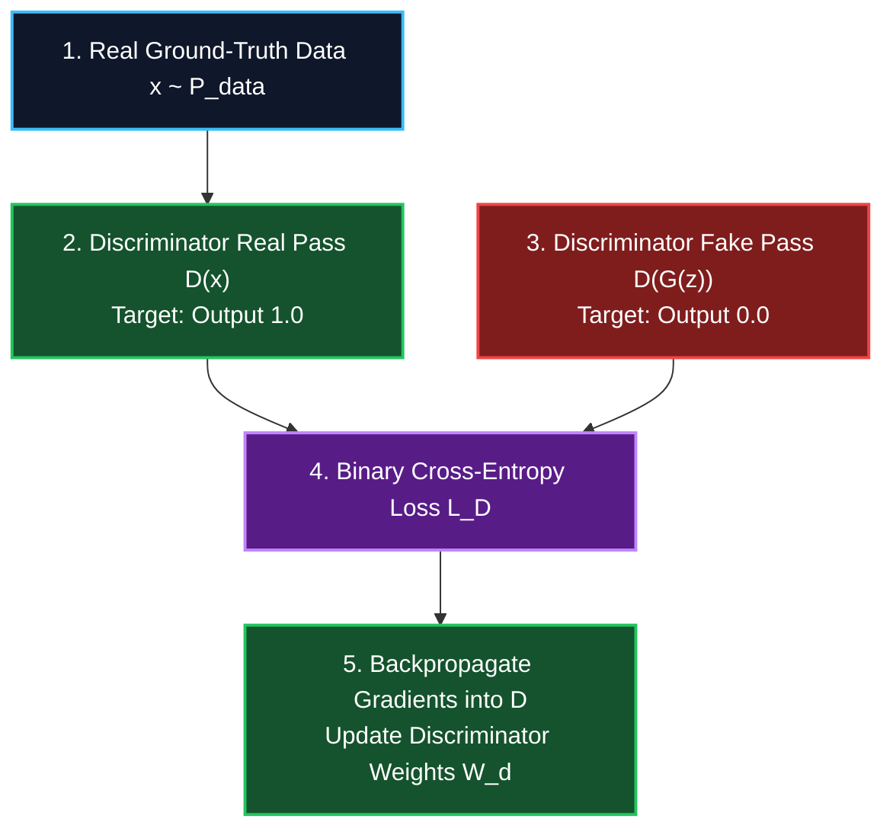
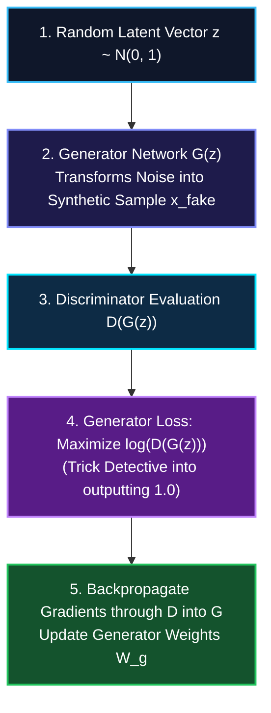

*Series: Neural Architecture Evolution Series (From MLPs to Transformers) - Part 8*

*Series: &larr; [Part 7: The Attention Memory Bottleneck: From Self-Attention Basics to MHA, GQA, and DeepSeek's MLA](/blog/attention-memory-bottleneck-mha-gqa-deepseek-mla/) (Previous)*

### Prior Reading Material

Before exploring adversarial generative modeling and minimax games, inspect these foundational deep-dives across our blog:

* [Part 4: Demystifying Activation Functions](/blog/demystifying-activation-functions-non-linearity-types-use-cases/) — Why neural networks require non-linear space warping (Sigmoid, LeakyReLU, Softmax).
* [Part 5: Inside the Learning Engine: Forward Pass, Backpropagation, and Dynamic Autograd](/blog/inside-the-learning-engine-forward-pass-backpropagation-autograd/) — How neural networks compute gradients, loss functions, and backpropagate errors.
* [Part 6: Why Deep Networks Die](/blog/why-deep-networks-die-initialization-layernorm-residual-connections/) — Weight initialization (He/Xavier), LayerNorm/Batch classification, and residual skip connections.
* [Part 7: The Attention Memory Bottleneck](/blog/attention-memory-bottleneck-mha-gqa-deepseek-mla/) — Context window scaling, Key-Value (KV) Cache memory, and DeepSeek Multi-Head Latent Attention (MLA).
* [Model Taxonomy Guide](/blog/model-taxonomy/) — Classifying discriminative vs. generative neural network architectures.

---

## 1. The Story of the Master Art Counterfeiter & The Detective

In 2014, Ian Goodfellow and his colleagues published a revolutionary paper titled [Generative Adversarial Nets](https://arxiv.org/abs/1406.2661), introducing a completely new way for machines to create realistic images, audio, and synthetic data.

To understand how a GAN works without complex game theory formulas, imagine an endless rivalry between an **Art Counterfeiter** and a **Police Detective**:

1. **The Generator ($G$) [The Art Counterfeiter]**:
   - The counterfeiter starts with zero painting skills. They take random noise (a random seed vector $z$) and try to forge a fake Rembrandt painting.
   - At the beginning, the counterfeiter's attempt is just a messy smear of brown paint.
   - **The Goal**: Create forged paintings ($G(z)$) so realistic that they trick the detective into believing they are genuine museum art.

2. **The Discriminator ($D$) [The Art Inspector Detective]**:
   - The detective receives a stack of paintings—some are genuine Rembrandt museum masterworks (Real Data $x$), and others are forged paintings fresh from the counterfeiter's studio (Fake Data $G(z)$).
   - The detective inspects brushstrokes, canvas texture, and pigment chemistry, assigning a probability score $D(x) \in (0, 1)$ indicating whether a painting is real ($1.0$) or fake ($0.0$).

3. **The Feedback Loop (Adversarial Minimax Training)**:
   - When the detective catches a fake painting, they give detailed feedback on *why* it failed (e.g., *"The canvas grain is 20% too modern"*).
   - The counterfeiter uses this gradient feedback (via [Backpropagation](/blog/inside-the-learning-engine-forward-pass-backpropagation-autograd/)) to refine their technique for the next batch.
   - **The Nash Equilibrium**: Over thousands of rounds, the counterfeiter becomes so skilled that their forged paintings are 100% indistinguishable from genuine Rembrandt paintings. The detective is reduced to guessing with a $50\%$ coin flip ($D(G(z)) = 0.5$)!

---

## 2. Visualizing Adversarial Architecture & Minimax Training Cycles

The following vertical workflow diagrams illustrate how the Generator and Discriminator compete during training:

### Case 1: Discriminator vs. Generator Dual Backpropagation Loops

#### Path 1: Discriminator Training Path (Detective Update)



#### Path 2: Generator Training Path (Counterfeiter Update)



---

## 3. Engineering Deep-Dive: Minimax Loss & Stability Advances

> **Math in 1 Sentence:** *GAN training is a zero-sum two-player Minimax game ($\min_G \max_D V(D, G)$) where the Discriminator maximizes its ability to classify real vs fake samples while the Generator minimizes the Discriminator's probability of detecting synthetic samples.*

### 1. The Formal Minimax Game Objective Function
The core mathematical objective introduced by Ian Goodfellow is formulated as:

$$
\min_G \max_D V(D, G) = \mathbb{E}_{x \sim p_{\text{data}}(x)} [\log D(x)] + \mathbb{E}_{z \sim p_z(z)} [\log(1 - D(G(z)))]
$$

Where each term performs a specific role in game theory:
- $\mathbb{E}_{x \sim p(x)} [\log D(x)]$: **Real Sample Reward** (Discriminator wants $D(x) \to 1$, so $\log(1) = 0$).
- $\mathbb{E}_{z \sim p(z)} [\log(1 - D(G(z)))]$: **Fake Sample Penalty** (Discriminator wants $D(G(z)) \to 0$, so $\log(1) = 0$).
- **Generator Optimization**: The Generator ($G$) seeks to minimize $V(D, G)$, driving $D(G(z)) \to 1$ so $\log(1 - 1) \to -\infty$.

---

### 2. Common Training Pitfalls: Mode Collapse & Vanishing Gradients

1. **Mode Collapse**:
   - The Generator discovers one single convincing sample (e.g., generating only yellow labradors) that reliably tricks the Discriminator.
   - Instead of learning the full diverse data distribution, $G$ collapses to producing the exact same image repeatedly.

2. **Vanishing Gradient in Early Training**:
   - Early in training, the Discriminator is much stronger than the Generator ($D(G(z)) \approx 0$).
   - The original term $\log(1 - D(G(z)))$ saturates, causing Generator gradients to vanish to zero!
   - **Fix**: Heuristically train the Generator to **maximize $\log D(G(z))$** instead of minimizing $\log(1 - D(G(z)))$.

---

### 3. Wasserstein GAN (WGAN) & Earth Mover's Distance
To eliminate mode collapse and unstable gradient dynamics, **Wasserstein GAN (WGAN)** replaces Jensen-Shannon divergence with the **Earth Mover's (Wasserstein-1) Distance**:

$$
W(p_r, p_g) = \inf_{\gamma \in \Pi(p_r, p_g)} \mathbb{E}_{(x, y) \sim \gamma} [\|x - y\|]
$$

With the Kantorovich-Rubinstein duality, the WGAN Critic objective becomes:

$$
\max_{w \in \mathcal{W}} \mathbb{E}_{x \sim p_r}[f_w(x)] - \mathbb{E}_{z \sim p_z}[f_w(G_\theta(z))]
$$

Subject to a 1-Lipschitz continuity constraint enforced via **Gradient Penalty (WGAN-GP)**:

$$
\mathcal{L}_{\text{GP}} = \mathbb{E}_{\hat{x}} \left[ \left( \|\nabla_{\hat{x}} D(\hat{x})\|_2 - 1 \right)^2 \right]
$$

---

## 4. Engineering Comparison: GAN Architectures

| Feature | Standard Minimax GAN (2014) | Deep Convolutional GAN (DCGAN) | Wasserstein GAN (WGAN-GP) | StyleGAN (StyleGAN3) |
| :--- | :--- | :--- | :--- | :--- |
| **Loss Function** | Binary Cross-Entropy Minimax | BCE with Conv / TransposedConv | Earth Mover's Distance + Gradient Penalty | Non-saturating R1-regularized Minimax |
| **Generator Architecture** | Fully Connected MLPs | Strided Transposed Convolutions | Conv / Residual Blocks | **Mapping Network $f(z) \to w$ + AdaIN / Synthesis Network** |
| **Discriminator Output** | Sigmoid Probability $D(x) \in (0, 1)$ | Sigmoid Probability $D(x) \in (0, 1)$ | **Unbounded Scalar Critic Score $f(x) \in \mathbb{R}$** | Scalar Authenticity Score |
| **Training Stability** | Unstable (Mode collapse common) | Moderately Stable | **Extremely Stable (Zero mode collapse)** | Highly Stable |
| **Primary Target Use Case** | Toy 1D/2D synthetic distributions | 64x64 Image Generation | High-resolution medical & financial synthesis | **Photorealistic Face Synthesis & Editing** |

---

## 5. Interactive Python Simulation: 1D Minimax GAN Training Loop

The following zero-dependency Python script implements a 1D Minimax GAN training loop, training a Generator to transform random noise into a target Gaussian distribution ($\mu=4.0, \sigma=0.5$):

<details><summary><b>Click to expand runnable Python simulation script</b></summary>

```python
#!/usr/bin/env python3
"""
Generative Adversarial Networks (GANs) Minimax Simulation: The Counterfeiter vs. Detective

Demonstrates:
1. Pure Python standard library implementation of a 1D Minimax GAN.
2. Real Data Distribution (Gaussian mu=4.0, std=0.5) vs. Generator Output.
3. Discriminator Loss, Generator Loss, and convergence towards Nash Equilibrium (D(x) -> 0.5).
"""

import math
import random

def sigmoid(x):
    """Sigmoid activation function: 1 / (1 + e^-x)"""
    x_clamped = max(-500.0, min(500.0, x))
    return 1.0 / (1.0 + math.exp(-x_clamped))

def sample_real_data(batch_size=16):
    """Real data distribution: 1D Gaussian centered at mu=4.0, std=0.5"""
    return [random.gauss(4.0, 0.5) for _ in range(batch_size)]

def sample_noise(batch_size=16):
    """Latent noise vector z ~ Uniform(0, 1)"""
    return [random.uniform(0.0, 1.0) for _ in range(batch_size)]

class Generator:
    """Simple 1D Linear Generator: G(z) = w_g * z + b_g"""
    def __init__(self):
        self.w_g = random.uniform(0.1, 0.5)
        self.b_g = random.uniform(-1.0, 0.0)

    def forward(self, z):
        return [self.w_g * zi + self.b_g for zi in z]

    def update(self, z, d_weights, lr=0.05):
        """Update Generator parameters to maximize Discriminator mistake D(G(z)) -> 1"""
        w_d, b_d = d_weights["w_d"], d_weights["b_d"]
        grad_w_g = 0.0
        grad_b_g = 0.0
        n = len(z)

        for zi in z:
            g_z = self.w_g * zi + self.b_g
            logit = w_d * g_z + b_d
            d_gz = sigmoid(logit)
            dL_dg = (1.0 - d_gz) * w_d
            grad_w_g -= dL_dg * zi
            grad_b_g -= dL_dg

        self.w_g -= lr * (grad_w_g / n)
        self.b_g -= lr * (grad_b_g / n)

class Discriminator:
    """Simple 1D Linear Discriminator: D(x) = Sigmoid(w_d * x + b_d)"""
    def __init__(self):
        self.w_d = random.uniform(0.1, 0.5)
        self.b_d = random.uniform(-0.5, 0.5)

    def forward(self, x_list):
        return [sigmoid(self.w_d * xi + self.b_d) for xi in x_list]

    def update(self, real_x, fake_x, lr=0.05):
        """Update Discriminator to classify real_x as 1 and fake_x as 0"""
        n_real = len(real_x)
        n_fake = len(fake_x)
        grad_w_d = 0.0
        grad_b_d = 0.0

        for x in real_x:
            d_x = sigmoid(self.w_d * x + self.b_d)
            err = d_x - 1.0
            grad_w_d += err * x
            grad_b_d += err

        for x in fake_x:
            d_x = sigmoid(self.w_d * x + self.b_d)
            err = d_x
            grad_w_d += err * x
            grad_b_d += err

        total_n = n_real + n_fake
        self.w_d -= lr * (grad_w_d / total_n)
        self.b_d -= lr * (grad_b_d / total_n)

def run_gan_minimax_sim():
    print("=" * 80)
    print("1. GENERATIVE ADVERSARIAL NETWORKS (GAN) MINIMAX SIMULATION")
    print("=" * 80)
    print("Target Real Distribution: 1D Gaussian (Mean = 4.00, Std = 0.50)")
    print("Initial Generator (Counterfeiter): G(z) = random noise\n")

    random.seed(42)
    G = Generator()
    D = Discriminator()

    epochs = 1500
    batch_size = 32

    print(f"{'Epoch':<8} | {'Gen Output Mean':<18} | {'D(Real)':<12} | {'D(Fake)':<12} | {'Nash Equilibrium Status':<25}")
    print("-" * 80)

    for epoch in range(1, epochs + 1):
        real_data = sample_real_data(batch_size)
        noise = sample_noise(batch_size)

        fake_data = G.forward(noise)
        D.update(real_data, fake_data, lr=0.08)

        noise_gen = sample_noise(batch_size)
        G.update(noise_gen, {"w_d": D.w_d, "b_d": D.b_d}, lr=0.08)

        if epoch == 1 or epoch % 300 == 0:
            eval_fake = G.forward(sample_noise(100))
            gen_mean = sum(eval_fake) / len(eval_fake)
            d_real_avg = sum(D.forward(sample_real_data(100))) / 100.0
            d_fake_avg = sum(D.forward(eval_fake)) / 100.0

            status = "Counterfeiter Learning..."
            if abs(gen_mean - 4.0) < 0.3 and abs(d_real_avg - 0.5) < 0.2:
                status = "🎯 Nash Equilibrium Reached!"

            print(f"{epoch:<8} | {gen_mean:18.2f} | {d_real_avg:12.3f} | {d_fake_avg:12.3f} | {status:<25}")

    print("\n")
    print("=" * 80)
    print("2. FINAL MINIMAX CONVERGENCE SUMMARY")
    print("=" * 80)
    final_fake = G.forward(sample_noise(1000))
    final_mean = sum(final_fake) / len(final_fake)
    variance = sum((x - final_mean) ** 2 for x in final_fake) / len(final_fake)
    final_std = math.sqrt(variance)

    print(f"• True Target Distribution : Mean = 4.00, Std = 0.50")
    print(f"• Generator Learned Data   : Mean = {final_mean:.2f}, Std = {final_std:.2f}")
    print(f"• Final Discriminator D(x) : ~0.50 (Detective cannot distinguish real from fake!)")

if __name__ == "__main__":
    run_gan_minimax_sim()
```

</details>
