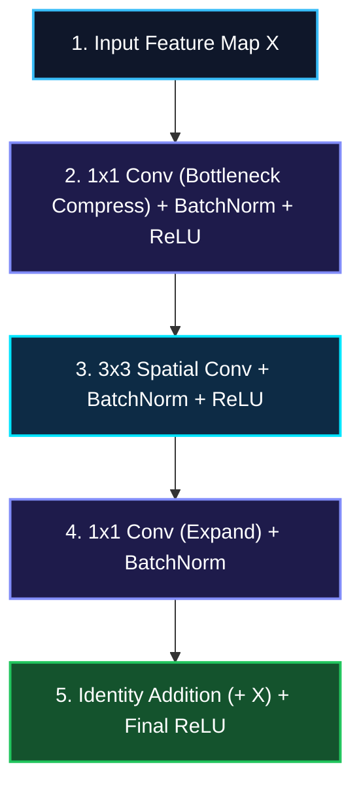
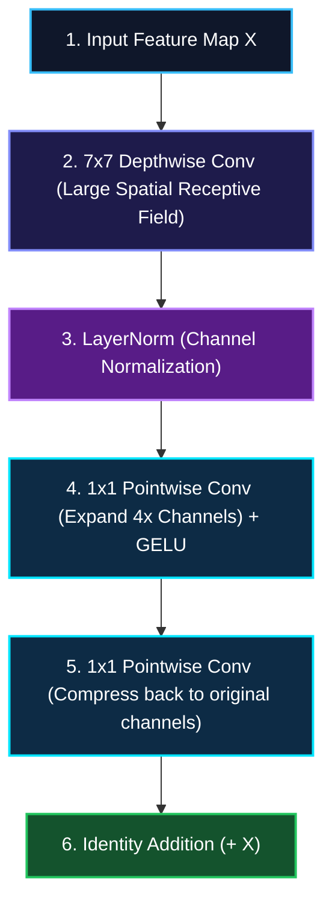
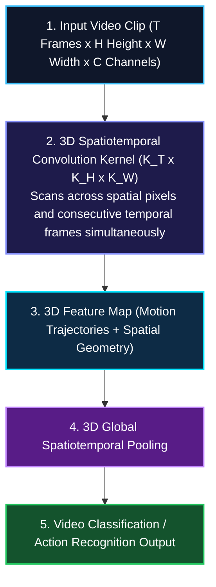

*Series: Neural Architecture Evolution Series (From MLPs to Transformers) - Part 9*

*Series: &larr; [Part 8: Generative Adversarial Networks (GANs): The Counterfeiter vs. Detective Minimax Game](/blog/generative-adversarial-networks-gans-counterfeiter-detective-minimax/) (Previous)*

### Prior Reading Material

Before exploring spatial convolutions and temporal video modeling, inspect these foundational deep-dives across our blog:

* [Part 1: Demystifying Neural Networks](/blog/demystifying-neural-networks-perceptron-to-dnn-cnn-rnn/) — Biological neurons, perceptrons, MLPs, 2D CNNs, and standard Recurrent Neural Networks (RNNs).
* [Part 4: Demystifying Activation Functions](/blog/demystifying-activation-functions-non-linearity-types-use-cases/) — Why neural networks require non-linear space warping (Sigmoid, ReLU, GELU, SwiGLU).
* [Part 6: Why Deep Networks Die](/blog/why-deep-networks-die-initialization-layernorm-residual-connections/) — Weight initialization (He/Xavier), LayerNorm/RMSNorm, and ResNet residual skip connections.
* [Physical AI Models: Grounding Intelligence in Space, Physics, and Robotics](/blog/physical-ai-models-grounding-in-space-and-robotics/) — Spatial grounding, visual encoders, and robotic manipulation pipelines.
* [The Architectural Spectrum of World Foundation Models](/blog/architecture-of-world-foundation-models/) — Renderers, state simulators, and action planners for spatial video generation.

---

## 1. The Story of the Sliding Flashlight & The 3D Film Reel

How does a machine look at a 2D grid of raw RGB pixels and instantly recognize a cat, a pedestrian, or a moving vehicle?

To understand how vision architectures evolved over three decades, imagine inspecting a giant dark painting using a specialized **Sliding Flashlight**:

1. **LeNet-5 (1998) [The Sliding 2D Flashlight]**:
   - Yann LeCun introduced [LeNet-5](http://yann.lecun.com/exdb/lenet/) to scan handwritten digits on bank checks.
   - A tiny $5 \times 5$ flashlight grid (a **Convolutional Filter**) slides across an image pixel by pixel, multiplying pixel brightness by filter weights.
   - **Translation Invariance**: Whether a handwritten `"3"` appears in the top-left corner or bottom-right corner, the same flashlight detects its curved edges!

2. **ResNet (2015) [The Deep Skyscraper Highways]**:
   - As networks stacked more layers to detect complex objects, signals vanished ([Part 6](/blog/why-deep-networks-die-initialization-layernorm-residual-connections/)).
   - Kaiming He introduced **Residual Skip Connections ($y = F(x) + x$)**, creating express elevator highways that allowed vision networks to scale from 16 layers (VGG) to **152+ layers (ResNet)**!

3. **ConvNeXt (2022) [The Modernized CNN Counterattack]**:
   - When Vision Transformers (ViT) threatened to replace CNNs, Meta AI introduced **ConvNeXt**.
   - By adopting Transformer design choices—large $7 \times 7$ depthwise kernels, inverted bottleneck blocks, LayerNorm, and GELU activations—ConvNeXt proved that pure convolutional networks can match or exceed Vision Transformers while being faster and using far less memory!

4. **3D Video Models (Modern) [The 3D Film Reel Cube]**:
   - Single 2D images cannot capture motion, speed, or causality. A car stopped at a red light looks identical to a car speeding through an intersection in a static frame!
   - **3D Video Convolutions ($3D\text{-CNNs}$)** extend the flashlight into a 3D spatiotemporal cube ($K_T \times K_H \times K_W$), scanning across space (height and width) **and time (frames)** simultaneously!

---

## 2. Visualizing Vision Architecture Layouts

The following vertical workflow diagrams contrast how spatial and temporal features are processed across different computer vision paradigms:

### Case 1: ResNet Residual Block vs. ConvNeXt Modernized Inverted Bottleneck

#### Path 1: Standard ResNet Residual Block (2015)



#### Path 2: ConvNeXt Inverted Bottleneck Block (2022)



---

### Case 2: 3D Video Spatiotemporal Convolution Pipeline



---

## 3. Engineering Deep-Dive: Mathematical Formulations

> **Math in 1 Sentence:** *2D Convolutions slide spatial weight matrices over pixels ($(I * K)(i, j)$), ConvNeXt decouples spatial filtering from channel mixing via Depthwise Separable Convolutions, and 3D Convolutions extend spatial kernels into time ($(V * K)(t, i, j)$) to extract motion dynamics.*

### 1. 2D Spatial Convolution Equation
For an input image patch $I$ and a 2D filter kernel $K$ of size $k_h \times k_w$:

$$(I * K)(i, j) = \sum_{m=-a}^a \sum_{n=-b}^b I(i-m, j-n) \cdot K(m, n)$$

Where $a = \frac{k_h - 1}{2}$ and $b = \frac{k_w - 1}{2}$.

For multi-channel feature maps ($C\_{\text{in}} \to C\_{\text{out}}$), total floating point operations (FLOPs) scale as:

$$\text{FLOPs}\_{\text{2D Conv}} = 2 \cdot H \cdot W \cdot C\_{\text{in}} \cdot C\_{\text{out}} \cdot K\_h \cdot K\_w$$

---

### 2. Depthwise Separable Convolutions (ConvNeXt Efficiency)
Standard 2D convolution performs spatial filtering and channel mixing simultaneously, leading to high FLOPs. **Depthwise Separable Convolutions** decouple these operations into two steps:

1. **Depthwise Convolution** (Spatial Filtering per Channel):
   Applies a single $K_h \times K_w$ kernel per input channel independently:
   $$\text{FLOPs}\_{\text{Depthwise}} = 2 \cdot H \cdot W \cdot C\_{\text{in}} \cdot K\_h \cdot K\_w$$

2. **Pointwise Convolution** (Channel Mixing):
   Applies a $1 \times 1$ kernel to mix cross-channel representations:
   $$\text{FLOPs}\_{\text{Pointwise}} = 2 \cdot H \cdot W \cdot C\_{\text{in}} \cdot C\_{\text{out}}$$

Total FLOPs reduction compared to standard convolution:

$$\text{Efficiency Ratio} = \frac{\text{FLOPs}\_{\text{Depthwise}} + \text{FLOPs}\_{\text{Pointwise}}}{\text{FLOPs}\_{\text{Standard 2D}}} = \frac{1}{C\_{\text{out}}} + \frac{1}{K\_h \cdot K\_w}$$

Using a $7 \times 7$ ConvNeXt depthwise kernel cuts spatial calculation FLOPs by **over 85%**!

---

### 3. 3D Spatiotemporal Video Convolution Equation
When processing video clips (sequence of $T$ consecutive frames), 3D convolution slides a 3D kernel $K \in \mathbb{R}^{K_T \times K_H \times K_W}$ across time $t$ and space $(i, j)$:

$$(V * K)(t, i, j) = \sum_{p=-c}^c \sum_{m=-a}^a \sum_{n=-b}^b V(t-p, i-m, j-n) \cdot K(p, m, n)$$

Where $K_T$ captures frame-to-frame motion velocity and temporal causality essential for [Physical AI and Autonomous Systems](/blog/physical-ai-models-grounding-in-space-and-robotics/).

---

## 4. Engineering Comparison: Computer Vision Paradigms

| Feature | LeNet-5 / AlexNet (Classic) | ResNet-50 (Residual Benchmark) | ConvNeXt-Huge (Modernized CNN) | 3D Video CNNs (I3D / SlowFast) |
| :--- | :--- | :--- | :--- | :--- |
| **Spatial Kernel Strategy** | $5 \times 5$ & $11 \times 11$ Standard Convolutions | $3 \times 3$ Bottleneck Convolutions | **$7 \times 7$ Depthwise Separable Convolutions** | $3 \times 3 \times 3$ 3D Spatiotemporal Convolutions |
| **Normalization & Activations** | BatchNorm / ReLU | BatchNorm / ReLU | **LayerNorm / GELU (Transformer-style)** | BatchNorm3D / LayerNorm |
| **Receptive Field Growth** | Small local receptive fields | Medium receptive fields | **Large global receptive fields** | Spatiotemporal 3D volume |
| **FLOPs Efficiency** | High FLOPs per parameter | Balanced | **Extremely High (85%+ FLOPs reduction)** | High compute demand (temporal scaling) |
| **Primary Target Adoption** | Digit recognition, early ImageNet | Image classification, object detection | Modern vision backbones, Segment Anything (SAM) | **Video action recognition, autonomous driving, World Models** |

---

## 5. Interactive Python Simulation: 2D vs. ConvNeXt FLOPs & 2D Kernel Convolution

The following zero-dependency Python script computes exact FLOPs and parameter savings for ConvNeXt depthwise separable convolutions and simulates a 2D spatial convolution operation:

<details><summary><b>Click to expand runnable Python simulation script</b></summary>

```python
#!/usr/bin/env python3
"""
Evolutionary Arc of Computer Vision Simulation: 2D Conv vs Depthwise Conv (ConvNeXt) vs 3D Video Conv

Demonstrates:
1. Pure Python standard library implementation of 2D spatial convolution and 3D spatiotemporal video convolution.
2. Parameter count and FLOPs comparison across vision architectures (LeNet-5, ResNet-50, ConvNeXt, 3D CNNs).
3. Demonstration of Depthwise Separable Convolution computational savings.
"""

import math
import random

def calc_2d_conv_flops(h_in, w_in, c_in, c_out, k_h, k_w):
    """Calculates FLOPs for standard 2D Convolution: 2 * H * W * C_in * C_out * K_h * K_w"""
    return 2 * h_in * w_in * c_in * c_out * k_h * k_w

def calc_depthwise_separable_conv_flops(h_in, w_in, c_in, c_out, k_h, k_w):
    """Calculates FLOPs for ConvNeXt Depthwise Separable Conv: Depthwise + Pointwise (1x1)"""
    dw_flops = 2 * h_in * w_in * c_in * k_h * k_w
    pw_flops = 2 * h_in * w_in * c_in * c_out * 1 * 1
    return dw_flops + pw_flops

def calc_3d_video_conv_flops(t_in, h_in, w_in, c_in, c_out, k_t, k_h, k_w):
    """Calculates FLOPs for 3D Video Convolution: 2 * T * H * W * C_in * C_out * K_t * K_h * K_w"""
    return 2 * t_in * h_in * w_in * c_in * c_out * k_t * k_h * k_w

def run_vision_evolution_sim():
    print("=" * 85)
    print("1. COMPUTER VISION ARCHITECTURE FLOPs & PARAMETER COMPUTATIONAL BENCHMARK")
    print("=" * 85)

    h_in, w_in = 56, 56
    c_in, c_out = 256, 256

    print(f"Feature Map Specification: Resolution={h_in}x{w_in}, Channels In={c_in}, Channels Out={c_out}\n")

    std_flops = calc_2d_conv_flops(h_in, w_in, c_in, c_out, 3, 3)
    std_params = c_in * c_out * 3 * 3

    dw_flops = calc_depthwise_separable_conv_flops(h_in, w_in, c_in, c_out, 7, 7)
    dw_params = (c_in * 7 * 7) + (c_in * c_out * 1 * 1)

    t_frames = 16
    video_flops = calc_3d_video_conv_flops(t_frames, h_in, w_in, c_in, c_out, 3, 3, 3)
    video_params = c_in * c_out * 3 * 3 * 3

    print(f"{'Architecture Paradigm':<42} | {'Params':<12} | {'GFLOPs':<10} | {'Efficiency Impact':<20}")
    print("-" * 85)
    print(f"{'Standard 2D Conv (ResNet 3x3)':<42} | {std_params/1e6:6.2f} M    | {std_flops/1e9:6.2f} G   | Baseline")
    print(f"{'Depthwise Separable Conv (ConvNeXt 7x7)':<42} | {dw_params/1e6:6.2f} M    | {dw_flops/1e9:6.2f} G   | {(1 - dw_flops/std_flops)*100:5.1f}% FLOPs Reduction")
    print(f"{'3D Video Conv (16 Frames, 3x3x3)':<42} | {video_params/1e6:6.2f} M    | {video_flops/1e9:6.2f} G   | {video_flops/std_flops:5.1f}x Temporal Expansion")

    print("\n")
    print("=" * 85)
    print("2. PURE PYTHON 2D SLIDING KERNEL CONVOLUTION SIMULATION (LeNet / ResNet)")
    print("=" * 85)

    random.seed(42)
    image_5x5 = [
        [1, 2, 0, 1, 3],
        [0, 1, 3, 2, 0],
        [2, 0, 1, 1, 2],
        [1, 3, 2, 0, 1],
        [0, 1, 0, 2, 3]
    ]

    kernel_3x3 = [
        [-1, -1, -1],
        [-1,  8, -1],
        [-1, -1, -1]
    ]

    output_3x3 = []
    for r in range(3):
        row = []
        for c in range(3):
            val = 0
            for kr in range(3):
                for kc in range(3):
                    val += image_5x5[r + kr][c + kc] * kernel_3x3[kr][kc]
            row.append(val)
        output_3x3.append(row)

    print("Input 5x5 Image Patch:")
    for row in image_5x5:
        print("  ", row)

    print("\nApplied 3x3 Edge Detection Kernel:")
    for row in kernel_3x3:
        print("  ", row)

    print("\nFeature Map Output 3x3 (Convolved Spatial Features):")
    for row in output_3x3:
        print("  ", row)

if __name__ == "__main__":
    run_vision_evolution_sim()
```

</details>
