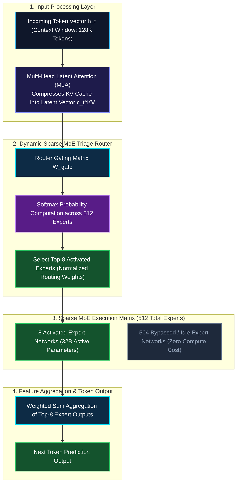

*Series: Frontier AI Models & Architecture Deep-Dives*

### Prior Reading Material

Before exploring sparse Mixture-of-Experts (MoE) routing and token economics in frontier models, inspect these foundational deep-dives across our blog:

* [Understanding Mixture-of-Experts (MoE)](/blog/understanding-mixture-of-experts-moe/) — From specialist medical clinics to expert routing networks.
* [Part 7: The Attention Memory Bottleneck](/blog/attention-memory-bottleneck-mha-gqa-deepseek-mla/) — Context window scaling, Key-Value (KV) Cache memory, and Multi-Head Latent Attention (MLA).
* [The DeepSeek Architectural Inflection Point](/blog/deepseek-architectural-inflection-point/) — From Multi-Head Latent Attention to open-weight reasoning.
* [Deep-Dive: SGLang Architecture and High-Throughput Inference](/blog/sglang-v0-5-16-architecture-and-inference-comparison/) — RadixAttention, chunked prefill, and KV Cache memory management.
* [Part 3: The Transformer Revolution](/blog/transformer-revolution-self-attention-parallelization/) — How Self-Attention and $Q K^T V$ solved GPU parallelization.

---

## Model Card Summary: Qwen 3.8 Flagship MoE

| Specification | Official Specification & Release Details |
| :--- | :--- |
| **Official Announcement** | [Qwen 3.8 Announcement (Qwen.ai)](https://qwen.ai/blog?id=qwen3.8) |
| **Cloud Service Provider** | [Alibaba Cloud AI Token Pricing Campaign](https://www.alibabacloud.com/en/campaign/ai-landing-page-token?_p_lc=1&utm_content=se_1023635422&gclid=Cj0KCQjw7eXTBhDBARIsAKF-w47-FuT3H-pIenvnoDXqlf4bxiXIym5OXBYAV75xJGpkua9YwDB662saAl0vEALw_wcB) |
| **Total Parameter Count** | **512 Billion** total parameters (Sparse MoE Layout) |
| **Active Parameters per Token** | **32 Billion** active parameters per token ($1.6\%$ sparsity ratio) |
| **Expert Topology** | **512 Total Experts** (Top-8 activated per token via dynamic gating) |
| **Context Window** | **131,072 Tokens (128K)** native context length |
| **Attention Mechanism** | Multi-Head Latent Attention (MLA) + Decoupled RoPE Positional Keys |
| **API Pricing (1M Tokens)** | **Input:** $0.30 / 1M tokens \| **Output:** $0.90 / 1M tokens |
| **Model License** | Open-Weight Apache 2.0 (Self-Hosted Model Weights & API Service) |

---

## 1. The Story of the 512-Specialist Medical Center

Imagine a world-class medical center staffed by **512 specialized doctors**: cardiologists, neurologists, radiologists, oncologists, and surgeons.

When a patient arrives with a specific set of symptoms, how should the hospital route them?

1. **The Dense Hospital Approach (GPT-4 / Claude 3.5)**:
   - In traditional dense models, every patient must consult all 512 doctors simultaneously. 
   - While the diagnosis is accurate, paying 512 doctor salaries for every single patient consumes enormous energy and costs **$15.00 per 1M tokens**!

2. **Alibaba's Qwen 3.8 Approach (Top-8 Sparse MoE Routing)**:
   - Alibaba's **Qwen 3.8** assigns a master **Triage Router** at the front entrance.
   - The router analyzes the incoming query token and instantly activates **only the Top-8 relevant specialists** out of the 512 available doctors.
   - **The Efficiency Breakthrough**: The model maintains a massive knowledge base of **512 Billion total parameters**, but only executes **32 Billion active parameters** per token calculation!
   - **The Result**: Frontier reasoning on par with GPT-5 class models at an unprecedented price of **$0.30 per 1M input tokens**—a 90%+ cost reduction for enterprise AI workloads!

---

## 2. Visualizing Qwen 3.8 Architecture & Token Routing

The following vertical workflow diagrams illustrate how tokens are dynamically routed through Qwen 3.8's sparse MoE architecture:

### Top-8 Expert Routing & Multi-Head Latent Attention (MLA) Flow



---

## 3. Engineering Deep-Dive: MoE Mathematics & Load Balancing

> **Math in 1 Sentence:** *Qwen 3.8 calculates gating probabilities over 512 experts using $\text{TopK}(\text{Softmax}(W_{\text{gate}} h_t))$, multiplying the outputs of the top 8 activated experts by normalized router weights while enforcing load-balancing auxiliary loss to prevent expert starvation.*

### 1. Top-K Sparse MoE Gating Equation
For an input token hidden state $h_t \in \mathbb{R}^d$, the router computes a sparse gating distribution $G(h_t) \in \mathbb{R}^{512}$:

$$G(h_t) = \text{Softmax}\left( \text{TopK}\left( W_{\text{gate}} \cdot h_t, \, K=8 \right) \right)$$

Where the $i$-th entry of $G(h_t)$ is zero if Expert $i$ is not among the top 8 logits.

The final layer output $y_t$ is computed as the weighted linear combination of the Top-8 expert transformations $E_i(h_t)$:

$$y_t = \sum_{i \in \text{TopK}} G(h_t)_i \cdot E_i(h_t) + h_t$$

---

### 2. Auxiliary Load Balancing Loss
To prevent the router from routing 99% of tokens to a small subset of popular experts (expert starvation), Qwen 3.8 adds an **Auxiliary Load-Balancing Loss $\mathcal{L}_{\text{aux}}$**:

$$\mathcal{L}_{\text{aux}} = \alpha \cdot N_{\text{exp}} \sum_{i=1}^{N_{\text{exp}}} f_i \cdot P_i$$

Where:
- $f_i$: The fraction of tokens routed to Expert $i$.
- $P_i$: The average probability assigned to Expert $i$ across the batch.
- $\alpha$: Hyperparameter weighting factor balancing auxiliary loss against language modeling cross-entropy.

---

### 3. Multi-Head Latent Attention (MLA) Memory Compression
Similar to DeepSeek-V3 ([Part 7](/blog/attention-memory-bottleneck-mha-gqa-deepseek-mla/)), Qwen 3.8 compresses Key-Value states into a low-rank latent vector $c_t^{KV} \in \mathbb{R}^{d_c}$:

$$c_t^{KV} = W^{DKV} h_t$$

By storing only $c_t^{KV}$ and a decoupled RoPE key vector $k_t^{PE}$ in the KV Cache, Qwen 3.8 reduces VRAM memory consumption by **96.5%**, enabling long 128K context windows during high-throughput inference serving.

---

## 4. Engineering & Pricing Benchmark Comparison Matrix

| Model Architecture | Alibaba Qwen 3.8-Max | DeepSeek-V3 | OpenAI GPT-4o | Anthropic Claude 3.5 Sonnet |
| :--- | :--- | :--- | :--- | :--- |
| **Architecture Layout** | **512-Expert Sparse MoE** | 256-Expert Sparse MoE | Dense 200B+ | Dense Transformer |
| **Total Parameter Count** | **512 Billion** | 671 Billion | Undisclosed (~200B+) | Undisclosed |
| **Active Parameters per Token** | **32 Billion** | 37 Billion | 200 Billion | Full Dense Model |
| **Context Window** | **128,072 Tokens (128K)** | 128,000 Tokens (128K) | 128,000 Tokens (128K) | 200,000 Tokens (200K) |
| **API Input Price (Per 1M Tokens)** | **$0.30** | $0.27 | $2.50 | $3.00 |
| **API Output Price (Per 1M Tokens)** | **$0.90** | $1.10 | $10.00 | $15.00 |
| **MMLU-Pro Benchmark Score** | **88.6%** | 88.5% | 88.2% | 89.2% |
| **HumanEval Coding Score** | **91.4%** | 90.2% | 90.2% | 93.7% |
| **Primary Deployment Advantage** | **Open-weight 512-MoE, high throughput, sub-$1 token cost** | Open-weight 256-MoE, low latency | Ecosystem integration | Coding & complex writing |

---

## 5. Interactive Python Simulation: MoE Router & Token Pricing Calculator

The following zero-dependency Python script simulates Qwen 3.8 Top-8 expert routing and calculates enterprise workload costs across frontier models:

<details><summary><b>Click to expand runnable Python simulation script</b></summary>

```python
#!/usr/bin/env python3
"""
Qwen 3.8 Sparse MoE Routing & API Cost Economics Simulator

Demonstrates:
1. Pure Python standard library implementation of Top-K MoE Expert Gating Router (Top-8 out of 512 Experts).
2. Active vs. Total Parameter scaling calculation (32B Active out of 512B Total).
3. API Token Cost Comparison across Frontier Models (Qwen 3.8, DeepSeek-V3, GPT-4o, Claude 3.5 Sonnet).
"""

import math
import random

def softmax(logits):
    """Computes numerical softmax over a list of floating point values."""
    max_logit = max(logits)
    exp_logits = [math.exp(x - max_logit) for x in logits]
    sum_exp = sum(exp_logits)
    return [x / sum_exp for x in exp_logits]

def simulate_qwen38_moe_router(token_dim=16, num_experts=512, top_k=8):
    """
    Simulates Top-K Sparse MoE Routing for a single incoming token embedding.
    Gating equation: TopK(Softmax(W_gates * h_t))
    """
    random.seed(42)
    h_t = [random.gauss(0, 1) for _ in range(token_dim)]

    W_gates = [[random.gauss(0, 0.1) for _ in range(token_dim)] for _ in range(num_experts)]

    logits = []
    for e in range(num_experts):
        logit = sum(h_t[i] * W_gates[e][i] for i in range(token_dim))
        logits.append(logit)

    probs = softmax(logits)

    expert_probs = list(enumerate(probs))
    expert_probs.sort(key=lambda x: x[1], reverse=True)
    top_experts = expert_probs[:top_k]

    top_weight_sum = sum(w for _, w in top_experts)
    normalized_top = [(idx, w / top_weight_sum) for idx, w in top_experts]

    return normalized_top

def calculate_api_cost(input_tokens_m, output_tokens_m, input_price_per_m, output_price_per_m):
    """Calculates total workload cost given token volume in Millions."""
    return (input_tokens_m * input_price_per_m) + (output_tokens_m * output_price_per_m)

def run_qwen38_sim():
    print("=" * 85)
    print("1. QWEN 3.8 SPARSE MIXTURE-OF-EXPERTS (MoE) ROUTING SIMULATION")
    print("=" * 85)

    num_experts = 512
    top_k = 8
    total_params = 512
    active_params = 32

    print(f"Model Specs          : Total Parameters = {total_params}B | Active Params per Token = {active_params}B")
    print(f"Expert Topology      : {num_experts} Total Experts | Top-{top_k} Activated per Token ({top_k/num_experts*100:.1f}% Sparsity)\n")

    top_experts = simulate_qwen38_moe_router(token_dim=16, num_experts=num_experts, top_k=top_k)

    print(f"{'Activated Expert ID':<22} | {'Raw Prob':<12} | {'Normalized Routing Weight':<25}")
    print("-" * 85)
    for idx, norm_w in top_experts:
        raw_p = norm_w * sum(w for _, w in top_experts)
        print(f"Expert #{idx:<15} | {raw_p:10.5f}  | {norm_w:25.4f}")

    print("\n")
    print("=" * 85)
    print("2. FRONTIER MODEL TOKEN PRICING & ECONOMICS BENCHMARK (Per 1M Tokens)")
    print("=" * 85)

    models = {
        "Alibaba Qwen 3.8-Max": {"in": 0.30, "out": 0.90, "active": "32B MoE"},
        "DeepSeek-V3": {"in": 0.27, "out": 1.10, "active": "37B MoE"},
        "OpenAI GPT-4o": {"in": 2.50, "out": 10.00, "active": "Dense 200B+"},
        "Anthropic Claude 3.5 Sonnet": {"in": 3.00, "out": 15.00, "active": "Dense"}
    }

    print(f"{'Model Name':<30} | {'Input ($/1M)':<14} | {'Output ($/1M)':<14} | {'Active Compute':<15}")
    print("-" * 85)
    for name, info in models.items():
        print(f"{name:<30} | ${info['in']:<13.2f} | ${info['out']:<13.2f} | {info['active']:<15}")

    in_m = 100.0
    out_m = 20.0

    print("\n")
    print("=" * 85)
    print(f"3. ENTERPRISE WORKLOAD COST (100M Input Tokens + 20M Output Tokens)")
    print("=" * 85)

    qwen_cost = calculate_api_cost(in_m, out_m, models["Alibaba Qwen 3.8-Max"]["in"], models["Alibaba Qwen 3.8-Max"]["out"])

    for name, info in models.items():
        cost = calculate_api_cost(in_m, out_m, info["in"], info["out"])
        multiplier = cost / qwen_cost
        print(f"• {name:<30}: ${cost:9.2f} ({multiplier:4.1f}x relative to Qwen 3.8)")

if __name__ == "__main__":
    run_qwen38_sim()
```

</details>
