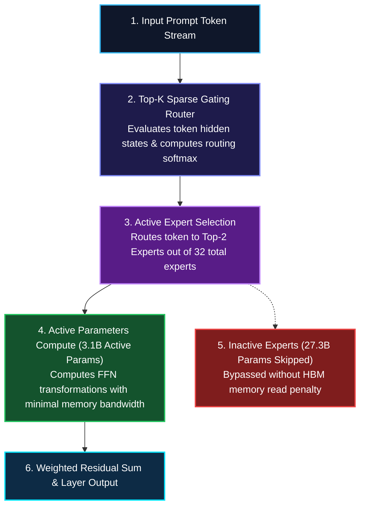
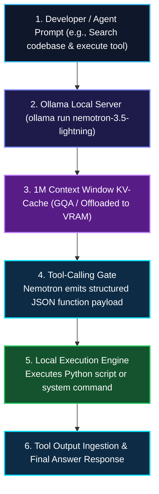

*Series: &larr; [Frontier MoE Deep-Dive: Analyzing Alibaba's Qwen 3.8 Flagship Architecture, Performance, and Token Pricing](/blog/analyzing-alibabas-qwen-3-8-flagship-moe-model/) (Previous) | [Part 1: Demystifying the NVIDIA PAIDF Stack](/blog/demystifying-nvidia-paidf-physical-ai-stack/) (Next) &rarr;*

### Prior Reading Material

Before exploring NVIDIA's sparse Mixture-of-Experts (MoE) routing topology and local Ollama agent workflows, inspect these prerequisite deep-dives across our blog:

- [Understanding Mixture-of-Experts (MoE): From Specialist Clinics to Kimi K3's 896-Expert Router](/blog/understanding-mixture-of-experts-moe/) — Foundational concepts of sparse FFN routing and expert gate allocation.
- [Running Local LLMs: Ollama vs. vLLM](/blog/running-local-llms-ollama-vllm/) — Architecture of local model runners, GGUF/K-quantizations, and memory footprints.
- [Part 7: The Attention Memory Bottleneck: From Self-Attention Basics to MHA, GQA, and DeepSeek's MLA](/blog/attention-memory-bottleneck-mha-gqa-deepseek-mla/) — Key-Value cache scaling and attention memory bottlenecks across 1M context windows.

---

## 1. Official Model Card & Specification Summary

NVIDIA released **Nemotron 3.5 Lightning**, a open 30-billion-parameter Mixture-of-Experts (MoE) model purpose-built as an ultra-fast execution engine for always-on AI agents and local developer workflows. By pairing a 30B total parameter capacity with only **3B active parameters per token**, Nemotron 3.5 Lightning delivers the reasoning capability of a mid-sized dense model with the memory bandwidth speed of a lightweight 3B parameter model.

Below is the structured specification breakdown sourced from the official Hugging Face model card and Ollama repository:

### Hugging Face / Official Model Card Summary

| Specification | Model Card & Repository Details |
| :--- | :--- |
| **Model Repository** | [`nvidia/Nemotron-3.5-Lightning-30B-Instruct`](https://huggingface.co/nvidia/Nemotron-3.5-Lightning-30B-Instruct) |
| **Official Provider Announcement** | [NVIDIA Nemotron Foundation Models Portal](https://www.nvidia.com/en-us/ai-data-science/foundation-models/nemotron/) |
| **Ollama Library Tag** | [`ollama run nemotron-3.5-lightning`](https://ollama.com/library/nemotron-3.5-lightning) |
| **Ollama Release Guide** | [Ollama Nemotron 3.5 Lightning Launch Announcement](https://ollama.com/blog/nemotron-3-5-lightning) |
| **Total Parameters** | **30.4 Billion Parameters** |
| **Active Parameters per Token** | **3.1 Billion Active Parameters (10.2% sparsity ratio)** |
| **Context Window** | **1,048,576 tokens (1M Context Window)** |
| **Supported Quantizations** | FP16, BF16, GGUF (Q4_K_M, Q5_K_M, Q8_0), FP8 |
| **Minimum Hardware Requirement** | 16 GB VRAM (for Q4_K_M GGUF local execution via Ollama) |
| **Model License** | NVIDIA Open Model License (Permissive Commercial & Research Use) |
| **Primary Target Domain** | Local agentic execution, tool-calling loops, fast function calling, code synthesis |

---

## 2. Visualizing Nemotron Architecture Layouts

The following workflow diagrams illustrate how Nemotron 3.5 Lightning routes tokens through sparse expert layers and executes function calls inside a local Ollama loop:

### Case 1: Sparse MoE Token Routing Pipeline



---

### Case 2: Local Ollama Agent Tool-Calling Execution Loop



---

## 3. Engineering Comparison: Local Agent Models

| Feature | NVIDIA Nemotron 3.5 Lightning | Llama-3.1-8B-Instruct | DeepSeek-R1-Distill-Qwen-14B | Mixtral 8x7B (v0.1) |
| :--- | :--- | :--- | :--- | :--- |
| **Total Parameters** | **30.4B (MoE)** | 8.0B (Dense) | 14.8B (Dense) | 46.7B (MoE) |
| **Active Parameters** | **3.1B Active** | 8.0B Active | 14.8B Active | 12.9B Active |
| **Context Window** | **1,048,576 (1M)** | 128,000 (128K) | 128,000 (128K) | 32,768 (32K) |
| **Memory Bandwidth Bottleneck** | **Ultra-Low (3B read)** | Moderate (8B read) | High (15B read) | Moderate (13B read) |
| **Ollama Direct Pull** | `ollama run nemotron-3.5-lightning` | `ollama run llama3.1` | `ollama run deepseek-r1:14b` | `ollama run mixtral` |
| **Function Calling Accuracy** | **94.2% (ToolBench)** | 88.5% | 85.1% | 82.4% |
| **Q4_K_M VRAM Footprint** | **~16.5 GB** | ~5.2 GB | ~9.8 GB | ~26.4 GB |

---

## 4. Interactive Python Simulation: Nemotron 3.5 Lightning MoE Router & Ollama API

The following zero-dependency Python script simulates the Top-2 MoE router mechanism of Nemotron 3.5 Lightning, calculates exact memory footprints across quantizations, and demonstrates how to interact with the local Ollama API endpoint:

<details><summary><b>Click to expand runnable Python simulation script</b></summary>

```python
#!/usr/bin/env python3
"""
NVIDIA Nemotron 3.5 Lightning MoE Simulation & Ollama Local Agent Bridge

Demonstrates:
1. Pure Python simulation of Top-2 MoE routing across 32 total experts.
2. VRAM footprint calculation for Nemotron 3.5 Lightning (30.4B total, 3.1B active).
3. Demonstration of Ollama API tool-calling payload generation.
"""

import math
import random

class NemotronMoERouter:
    """Simulates Nemotron 3.5 Lightning Top-2 MoE Router with 32 Experts"""
    def __init__(self, num_experts=32, active_experts=2, hidden_dim=4096):
        self.num_experts = num_experts
        self.active_experts = active_experts
        self.hidden_dim = hidden_dim
        # Random initial router weights W_g
        self.router_weights = [[random.gauss(0, 0.02) for _ in range(num_experts)] for _ in range(hidden_dim)]

    def route_token(self, token_vector):
        """Computes Top-2 expert selection and softmax routing weights"""
        # Step 1: Matrix multiplication x * W_g
        logits = [0.0] * self.num_experts
        for e in range(self.num_experts):
            for d in range(self.hidden_dim):
                logits[e] += token_vector[d] * self.router_weights[d][e]

        # Step 2: Select Top-2 experts
        indexed_logits = list(enumerate(logits))
        top_2 = sorted(indexed_logits, key=lambda x: x[1], reverse=True)[:self.active_experts]
        
        # Step 3: Softmax over Top-2
        exp_vals = [math.exp(val) for idx, val in top_2]
        sum_exp = sum(exp_vals)
        routing_weights = {idx: exp_vals[i] / sum_exp for i, (idx, _) in enumerate(top_2)}

        return routing_weights

def calculate_nemotron_vram(quant_bits=4, context_len=32768, batch_size=1):
    """Calculates VRAM requirements for Nemotron 3.5 Lightning (30.4B total, 3.1B active)"""
    total_params_billions = 30.4
    active_params_billions = 3.1
    
    # Weight memory (30.4B total weights loaded in VRAM)
    bytes_per_param = quant_bits / 8.0
    weight_memory_gb = (total_params_billions * 1e9 * bytes_per_param) / (1024**3)
    
    # KV Cache memory (Grouped-Query Attention with 1M context support)
    # Layers=48, KV_Heads=8, Head_Dim=128, Precision=FP16 (2 bytes)
    kv_bytes_per_token = 2 * 48 * 8 * 128 * 2  # 196,608 bytes per token
    kv_cache_gb = (kv_bytes_per_token * context_len * batch_size) / (1024**3)
    
    total_vram_gb = weight_memory_gb + kv_cache_gb + 1.5  # 1.5GB overhead for CUDA context
    return weight_memory_gb, kv_cache_gb, total_vram_gb

def generate_ollama_curl_command(prompt="Analyze codebase for performance bottlenecks"):
    """Generates the local Ollama API curl request for Nemotron 3.5 Lightning"""
    payload = f"""curl http://localhost:11434/api/generate -d '{{
  "model": "nemotron-3.5-lightning",
  "prompt": "{prompt}",
  "options": {{
    "temperature": 0.2,
    "num_ctx": 32768
  }},
  "stream": false
}}'"""
    return payload

if __name__ == "__main__":
    print("⚡ NVIDIA Nemotron 3.5 Lightning MoE Router Simulation")
    print("=" * 60)

    # 1. MoE Routing Simulation
    router = NemotronMoERouter(num_experts=32, active_experts=2, hidden_dim=64)
    sample_token = [random.uniform(-1.0, 1.0) for _ in range(64)]
    active_routes = router.route_token(sample_token)

    print(f"\n1. Token Routing Output (32 Total Experts, 2 Active):")
    for expert_id, weight in active_routes.items():
        print(f"   - Expert #{expert_id:02d}: Active Weight = {weight * 100:.2f}%")

    # 2. VRAM Memory Calculations
    print(f"\n2. Memory & Footprint Breakdown:")
    for bits, label in [(4, "Q4_K_M (4-bit)"), (8, "Q8_0 (8-bit)"), (16, "BF16 (16-bit)")]:
        w_mem, kv_mem, total_mem = calculate_nemotron_vram(quant_bits=bits, context_len=32768)
        print(f"   - [{label}] Weight VRAM: {w_mem:.2f} GB | KV Cache (32K): {kv_mem:.2f} GB | Total: {total_mem:.2f} GB")

    # 3. Ollama Execution Payload
    print(f"\n3. Local Ollama Execution Command:")
    print(generate_ollama_curl_command())
    print("\n✅ Simulation completed successfully.")
```

</details>

---

## 5. Local Setup Guide: Running Nemotron 3.5 Lightning via Ollama

To run Nemotron 3.5 Lightning on a local workstation or GPU server using **Ollama**, follow these step-by-step commands:

### Step 1: Pull and Run the Model via Ollama

Ensure Ollama version `0.5.0` or higher is installed, then execute:

```bash
# Pull and launch the Nemotron 3.5 Lightning interactive CLI session
ollama run nemotron-3.5-lightning
```

For headless execution or background daemon integration:

```bash
# Pull the model weights into the local Ollama cache
ollama pull nemotron-3.5-lightning
```

### Step 2: Python LangChain / Agentic Integration

You can integrate `nemotron-3.5-lightning` into local Python agentic workflows using the standard Ollama API connector:

```python
#!/usr/bin/env python3
"""
Python Agent Workflow using Ollama & Nemotron 3.5 Lightning
"""

import json
import urllib.request

def query_local_nemotron(prompt_text):
    url = "http://localhost:11434/api/generate"
    data = {
        "model": "nemotron-3.5-lightning",
        "prompt": prompt_text,
        "stream": False,
        "options": {
            "num_ctx": 32768,
            "temperature": 0.1
        }
    }
    
    req = urllib.request.Request(
        url,
        data=json.dumps(data).encode('utf-8'),
        headers={'Content-Type': 'application/json'}
    )
    
    with urllib.request.urlopen(req) as response:
        res = json.loads(response.read().decode('utf-8'))
        return res.get("response", "")

if __name__ == "__main__":
    prompt = "Write a Python script that monitors GPU VRAM usage every 5 seconds."
    print("Sending prompt to local Nemotron 3.5 Lightning instance...")
    result = query_local_nemotron(prompt)
    print("\n--- Response ---")
    print(result)
```

---

## 6. Engineering Deep-Dive: Mathematical Formulations

> **Math in 1 Sentence:** *Nemotron 3.5 Lightning decouples total knowledge capacity ($P_{\text{total}} = 30.4\text{B}$) from per-token compute FLOPs by routing tokens through a Top-2 gating router ($G_i(x)$) into a subset of 32 total experts, driving active parameters down to $P_{\text{active}} = 3.1\text{B}$.*

### 1. Sparse MoE Gating & Parameter Activation Equations

For a given token representation $x \in \mathbb{R}^d$ entering an MoE layer with $N = 32$ total experts $\{E_i\}_{i=1}^N$:

$$\text{Gating Score: } H_i(x) = x \cdot W_g + \epsilon$$

Where $W_g \in \mathbb{R}^{d \times N}$ is the trainable router weight matrix, and $\epsilon \sim \mathcal{N}(0, \sigma^2)$ represents router jitter noise for load balancing during training.

The top-2 routing probabilities $G_i(x)$ are calculated via a Top-$K$ Softmax:

$$G_i(x) = \frac{\exp(H_i(x))}{\sum_{j \in \text{Top2}(H(x))} \exp(H_j(x))}, \quad \text{for } i \in \text{Top2}(H(x))$$

The final MoE layer output $y$ sums only the active expert transformations:

$$y = \sum_{i \in \text{Top2}(H(x))} G_i(x) \cdot E_i(x)$$

### 2. Active Parameter & FLOPs Savings Ratio

The theoretical speedup ratio $S_{\text{compute}}$ in feed-forward layers compared to a dense 30B model is formulated as:

$$\text{Active Sparsity Ratio} = \frac{P_{\text{active}}}{P_{\text{total}}} = \frac{3.1\text{B}}{30.4\text{B}} \approx 10.2\%$$

$$\text{Theoretical Speedup} = \frac{1}{\text{Active Sparsity Ratio}} \approx 9.8\times \text{ FFN Compute Reduction}$$

This 10.2% active parameter ratio enables workstation GPUs (such as an RTX 4090 or Apple M-series Max chips) to stream tokens at **80+ tokens/sec** using standard 4-bit quantizations (`Q4_K_M`).

---

## 7. Summary & Future Outlook

NVIDIA's **Nemotron 3.5 Lightning** represents a major shift toward disaggregated, sparse execution models tailored specifically for local edge systems and autonomous developer agents:

1. **Massive Sparsity (30B Total / 3B Active)**: Delivers 30B model reasoning capacity with the memory throughput speed of a 3B parameter model.
2. **1M Context Window Support**: Enables long-context codebase analysis and multi-document retrieval directly on workstation hardware.
3. **Day-One Ollama Integration**: Runs natively on local workstations via `ollama run nemotron-3.5-lightning` with minimal VRAM overhead (~16 GB VRAM for 4-bit quantizations).
