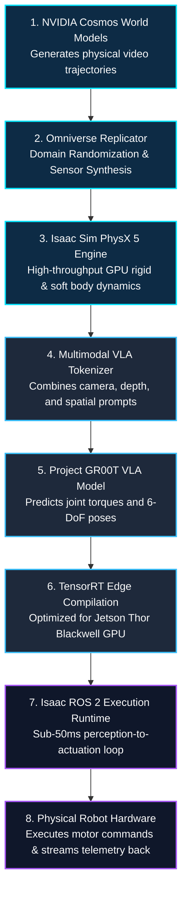
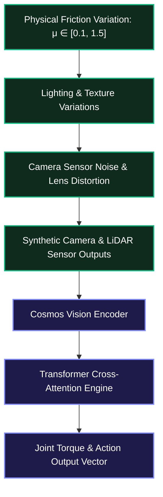

*Series: &larr; [NVIDIA Nemotron 3.5 Lightning Deep-Dive: 30B MoE Architecture, 3B Active Params, and Local Ollama Execution](/blog/nvidia-nemotron-3-5-lightning-architecture-ollama-guide/) (Previous) | [Part 2: Inside NVIDIA Cosmos: World Foundation Models for Physical Commonsense & Video Trajectories](/blog/inside-nvidia-cosmos-world-foundation-models/) (Next) &rarr;*

### Prior Reading Material

Before exploring NVIDIA's end-to-end framework for Physical AI and synthetic data generation pipelines, inspect these prerequisite deep-dives across our blog:

- [Google DeepMind's Gemini Robotics ER 2: The High-Level Brain for Physical AI and Multi-Robot Collaboration](/blog/google-deepmind-gemini-robotics-er-2/) — High-level reasoning engines, VLA action abstraction, and real-time robotic telemetry.
- [The Architectural Spectrum of World Foundation Models: Renderers, State Simulators, and Action Planners](/blog/architecture-of-world-foundation-models/) — World foundation model taxonomies, state representation, and predictive physics.
- [Part 9: The Evolutionary Arc of Computer Vision: From LeNet-5 and ResNet to ConvNeXt and 3D Video Models](/blog/evolutionary-arc-computer-vision-lenet-resnet-convnext-3d-video/) — 3D spatial perception, depthwise convolutions, and video spatiotemporal modeling for physical AI.

---

## 1. Official Framework & Ecosystem Summary

NVIDIA's overarching Physical AI architecture spans Jensen Huang's foundational **3-Computer Stack**:
1. **Computer 1 (AI Training & Upstream Data Generation)**: Accelerated computing clusters (DGX / HGX) generating and processing petabytes of physical trajectories.
2. **Computer 2 (Simulation & Digital Twin Testing)**: Omniverse-powered clusters (OVX / Isaac Sim) executing parallelized multi-agent physics simulations.
3. **Computer 3 (Edge Robotic Brain & Execution)**: Embedded edge SoCs (NVIDIA Jetson Thor) running sub-50ms closed-loop Vision-Language-Action (VLA) inference.

At the very core of this 3-computer system sits the **NVIDIA Physical AI Data Factory (PAIDF) Blueprint**—an open reference architecture announced by NVIDIA to overcome the fundamental bottleneck in robotics: the scarcity of high-quality, physical-world training data. While digital LLMs train on trillions of web tokens, physical robots operate in continuous 3D environments where teleoperated real-world demonstration data is slow, expensive, and unsafe to collect at scale.

PAIDF treats **compute as training data**, establishing a continuous **Digital Twin Flywheel**. It combines generative world foundation models (**NVIDIA Cosmos**), physics-driven spatial simulators (**NVIDIA Isaac Sim** & **Omniverse Replicator**), humanoid foundation models (**Project GR00T**), and edge real-time runtimes (**NVIDIA Jetson Thor** & **Isaac ROS**).

| Feature / Metric | Specification & Industrial Reference Link |
| :--- | :--- |
| **Architectural Blueprint** | [NVIDIA Physical AI Data Factory (PAIDF) Blueprint](https://developer.nvidia.com/physical-ai) |
| **Physical AI Architecture** | [NVIDIA 3-Computer Architecture for Physical AI](https://blogs.nvidia.com/blog/what-is-physical-ai/) |
| **World Foundation Models** | [NVIDIA Cosmos World Foundation Models](https://www.nvidia.com/en-us/ai/cosmos/) |
| **Physics & Sensor Simulation** | [NVIDIA Isaac Sim & Omniverse Replicator](https://developer.nvidia.com/isaac/sim) |
| **Humanoid Foundation Model** | [NVIDIA Project GR00T (VLA)](https://developer.nvidia.com/project-gr00t) |
| **Edge Compute Platform** | [NVIDIA Jetson Thor (Blackwell Architecture)](https://developer.nvidia.com/embedded/jetson-thor) |
| **Real-Time Edge ROS Runtimes** | [NVIDIA Isaac ROS Acceleration Libraries](https://developer.nvidia.com/isaac/ros) |

---

## 2. The Digital Twin Flywheel: Story & Visual Metaphors

To understand why NVIDIA built PAIDF, consider the **Flight Simulator Metaphor**. 

No commercial airline pilot earns their license by flying real passenger jets for thousands of hours through dangerous mid-air engine failures. Instead, pilots spend 99% of their training inside photorealistic, physics-calibrated flight simulators. The simulator exposes the pilot to millions of extreme edge cases—heavy turbulence, instrument failure, gale-force crosswinds—in a fraction of the time, with zero physical risk and zero hardware degradation.

Physical AI demands the exact same approach. A humanoid robot deployed in a factory cannot afford to drop expensive equipment or collide with human co-workers millions of times while learning how to grasp a fragile object. PAIDF functions as an automated industrial flight simulator and data factory operating across the **3-Computer Physical AI Stack**:

1. **Upstream Data Factory & World Generation (Computer 1 & 2 - DGX/OVX, Cosmos, Isaac Sim)**: Generating photorealistic 3D spatial scenes, multi-angle camera streams, depth maps, and synthetic trajectories with physics dynamics and domain randomization.
2. **Physical Foundation Model Training (Project GR00T & VLA Models)**: Tokenizing visual observations and spatial goal prompts into unified Vision-Language-Action (VLA) representations to train generalized robot policies.
3. **The Real-Time Edge Runtime (Computer 3 - Jetson Thor & Isaac ROS)**: Deploying compiled policies onto low-power edge silicon to execute sub-50ms closed-loop perception and motor control.



---

## 3. Comparative Architecture: Real-World Teleoperation vs. PAIDF Stack

Traditional robotics relies heavily on human teleoperation—operators wearing VR headsets or operating joystick rigs to collect physical trajectories. The table below illustrates why PAIDF disaggregates and scales this process into synthetic data pipelines:

| Dimension | Traditional Real-World Teleoperation | NVIDIA PAIDF Stack |
| :--- | :--- | :--- |
| **Data Collection Rate** | 1 robot hour = 1 trajectory hour (1x realtime) | 1 GPU node = 10,000+ simulated hours/day (10,000x) |
| **Data Diversity & Corner Cases** | Rare (hazardous conditions hard to test safely) | Automated domain randomization (lighting, friction, clutter) |
| **Sensor Ground-Truth** | Noisy (imperfect depth sensors and motion capture) | Perfect ground-truth (bounding boxes, segmentation, contact forces) |
| **Foundation Model Training** | Small task-specific policies (behavior cloning) | Multimodal VLA models (Project GR00T, Cosmos) |
| **Edge Hardware Integration** | Ad-hoc CPU/GPU microcontrollers | Dedicated Jetson Thor SoC with hardware ROS acceleration |

---

## 4. Engineering Deep-Dive: System Architecture & Mathematical Formulations

### 4.1 NVIDIA Cosmos & Physics-Driven Synthetic Generation

At the heart of PAIDF is **NVIDIA Cosmos**, a world foundation model designed specifically to model the laws of physical motion, light transport, and spatial dynamics. Unlike digital video models that only generate plausible pixels, Cosmos predicts photorealistic sensory trajectories conditioned on physical control inputs.

When coupled with **Isaac Sim** (built on Universal Scene Description / USD and PhysX 5), PAIDF generates synthetic data streams featuring **Domain Randomization (DR)**. By continuously varying surface friction coefficients ($\mu$), lighting vectors ($L$), object textures, and camera intrinsics during batch simulation, the model avoids overfitting to specific simulation environments.

$$\mathcal{L}_{\mathrm{sim2real}}(\theta) = \mathbb{E}_{(s, a) \sim \mathcal{D}_{\mathrm{sim}}(\xi)} \left[ \mathcal{L}_{\mathrm{task}}(\pi_\theta(s), a) \right] + \lambda \mathcal{L}_{\mathrm{DR}}(\theta, \xi)$$

Where:
- $\pi_\theta(s)$ is the policy parameterized by weights $\theta$ operating on state $s$.
- $\xi \sim P(\Xi)$ represents the domain randomization parameter distribution (friction, mass, camera noise).
- $\mathcal{L}_{\mathrm{task}}$ evaluates task completion (e.g. grasping accuracy or trajectory tracking error).
- $\mathcal{L}_{\mathrm{DR}}$ penalizes representations sensitive to synthetic distribution shifts.



### 4.2 Vision-Language-Action (VLA) Tokenization & Diffusion Action Heads

Project GR00T converts visual frames ($I_t \in \mathbb{R}^{H \times W \times C}$) and natural language goal instructions ($g$) into action sequences ($a_t \in \mathbb{R}^D$) representing 6-DoF end-effector trajectories and joint torques:

$$a_t = \pi_\theta(I_t, g)$$

To handle multi-modal action distributions (e.g. reaching for an object around the left vs. right side of an obstacle), GR00T uses a **Diffusion Action Head**. The policy generates actions by progressively denoising a Gaussian noise vector $a^{K} \sim \mathcal{N}(0, I)$ over $K$ reverse diffusion steps:

$$a^{k-1} = \frac{1}{\sqrt{\alpha_k}} \left( a^k - \frac{1 - \alpha_k}{\sqrt{1 - \bar{\alpha}_k}} \epsilon_\theta(a^k, k, I_t, g) \right) + \sigma_k z$$

Where $\epsilon_\theta$ is the neural network estimating score noise conditioned on the visual context frame $I_t$ and language goal $g$.

### 4.3 Real-Time Edge Latency Budget on Jetson Thor

When executing VLA policies on physical hardware, real-time stability demands strict latency bounds. The closed-loop perception-to-action delay ($T_{\mathrm{total}}$) must remain below $50\text{ ms}$ ($20\text{ Hz}$ control frequency):

$$T_{\mathrm{total}} = T_{\mathrm{capture}} + T_{\mathrm{vslam}} + T_{\mathrm{vla}} + T_{\mathrm{actuation}} \le 50\text{ ms}$$

| Processing Phase | Hardware Accelerator | Typical Latency Budget |
| :--- | :--- | :--- |
| **Sensor Capture & Pre-Processing** | Jetson Thor Image Signal Processor (ISP) | $5\text{ ms}$ |
| **Visual SLAM & Stereo Depth** | Isaac ROS Accelerators (NVDEC / CUDA) | $8\text{ ms}$ |
| **VLA Policy Inference (GR00T)** | TensorRT FP8 Engine (Blackwell Tensor Cores) | $25\text{ ms}$ |
| **ROS 2 Motor Control Execution** | CAN / EtherCAT Bus Controller | $4\text{ ms}$ |
| **Total Closed-Loop Delay** | **Jetson Thor Unified SoC** | **$42\text{ ms}$ (< 50ms Limit)** |

---

## 5. Interactive Python Simulation: PAIDF Synthetic Data Pipeline & Latency Profiler

The following zero-dependency Python script simulates the core components of the NVIDIA PAIDF pipeline:
1. Generating synthetic sensor trajectories with configurable domain randomization noise.
2. Calculating Sim-to-Real distribution gap error metrics under variable domain noise.
3. Profiling real-time closed-loop perception and policy latency across edge execution hardware.

<details><summary><b>Click to expand runnable Python simulation script</b></summary>

```python
#!/usr/bin/env python3
"""
NVIDIA Physical AI Data Factory (PAIDF) Pipeline Simulation
Demonstrates:
1. Synthetic data trajectory generation with domain randomization.
2. Sim-to-Real domain shift error calculations.
3. Closed-loop latency profiling for Jetson Thor edge inference.
"""

import math
import random
import time

class PAIDFDataFactorySim:
    """Simulates NVIDIA PAIDF Synthetic Generation and Edge Profiling."""
    
    def __init__(self, num_trajectories=100, domain_noise_level=0.15):
        self.num_trajectories = num_trajectories
        self.domain_noise_level = domain_noise_level
        self.hardware_profiles = {
            "Jetson_Orin_Nano": {"isp": 12.0, "vslam": 22.0, "vla": 85.0, "actuation": 8.0},
            "Jetson_AGX_Orin": {"isp": 8.0, "vslam": 14.0, "vla": 45.0, "actuation": 5.0},
            "Jetson_Thor_Blackwell": {"isp": 5.0, "vslam": 8.0, "vla": 25.0, "actuation": 4.0}
        }

    def generate_synthetic_trajectory(self, steps=50):
        """Generates a ground-truth trajectory and a domain-randomized synthetic observation."""
        gt_trajectory = []
        sim_trajectory = []
        
        # Initial position [x, y, z] in meters
        x, y, z = 0.0, 0.0, 0.5
        
        for step in range(steps):
            t = step * 0.1
            gt_x = x + 0.1 * t + 0.05 * math.sin(t)
            gt_y = y + 0.2 * t + 0.05 * math.cos(t)
            gt_z = z + 0.02 * t
            
            # Domain Randomization Noise (simulating surface friction & sensor noise)
            noise_x = random.gauss(0, self.domain_noise_level)
            noise_y = random.gauss(0, self.domain_noise_level)
            noise_z = random.gauss(0, self.domain_noise_level * 0.5)
            
            sim_x = gt_x + noise_x
            sim_y = gt_y + noise_y
            sim_z = gt_z + noise_z
            
            gt_trajectory.append((gt_x, gt_y, gt_z))
            sim_trajectory.append((sim_x, sim_y, sim_z))
            
        return gt_trajectory, sim_trajectory

    def calculate_sim2real_gap(self, gt_traj, sim_traj):
        """Calculates Mean Squared Error (MSE) trajectory divergence."""
        total_error = 0.0
        n = len(gt_traj)
        
        for (gx, gy, gz), (sx, sy, sz) in zip(gt_traj, sim_traj):
            dist_sq = (gx - sx)**2 + (gy - sy)**2 + (gz - sz)**2
            total_error += dist_sq
            
        mse = total_error / n
        rmse = math.sqrt(mse)
        return mse, rmse

    def profile_edge_latency(self, target_freq_hz=20.0):
        """Profiles closed-loop latency budgets across Jetson hardware tiers."""
        max_allowed_latency_ms = (1.0 / target_freq_hz) * 1000.0
        results = {}
        
        for hw_name, breakdown in self.hardware_profiles.items():
            total_latency = sum(breakdown.values())
            is_realtime_capable = total_latency <= max_allowed_latency_ms
            results[hw_name] = {
                "breakdown_ms": breakdown,
                "total_latency_ms": total_latency,
                "max_allowed_ms": max_allowed_latency_ms,
                "realtime_capable": is_realtime_capable,
                "achievable_freq_hz": 1000.0 / total_latency
            }
            
        return results

def run_paidf_simulation():
    print("========================================================================")
    print("⚡ NVIDIA Physical AI Data Factory (PAIDF) Pipeline Simulation")
    print("========================================================================\n")
    
    sim = PAIDFDataFactorySim(num_trajectories=50, domain_noise_level=0.12)
    
    # 1. Generate Synthetic Trajectory with Domain Randomization
    gt_traj, sim_traj = sim.generate_synthetic_trajectory(steps=50)
    mse, rmse = sim.calculate_sim2real_gap(gt_traj, sim_traj)
    
    print(f"📊 1. Synthetic Trajectory & Domain Randomization Metrics:")
    print(f"   • Total Trajectory Steps Generated : {len(gt_traj)}")
    print(f"   • Configured Domain Randomization Noise : σ = {sim.domain_noise_level}")
    print(f"   • Sim-to-Real Trajectory MSE Error  : {mse:.6f} m²")
    print(f"   • Sim-to-Real Trajectory RMSE Error : {rmse * 100:.2f} cm\n")
    
    # 2. Edge Hardware Latency Profiling
    print("⚡ 2. Jetson Edge Hardware Closed-Loop Latency Budget Profile (Target: 20 Hz / 50ms):")
    latency_results = sim.profile_edge_latency(target_freq_hz=20.0)
    
    print("-----------------------------------------------------------------------------------------")
    print(f"{'Hardware Tiers':<24} | {'Total Delay (ms)':<16} | {'Achievable Freq':<16} | {'Realtime Ready'}")
    print("-----------------------------------------------------------------------------------------")
    for hw_name, data in latency_results.items():
        ready_str = "✅ YES (<=50ms)" if data["realtime_capable"] else "❌ NO (>50ms)"
        print(f"{hw_name:<24} | {data['total_latency_ms']:<16.1f} | {data['achievable_freq_hz']:<16.1f} Hz | {ready_str}")
    print("-----------------------------------------------------------------------------------------\n")
    
    # Detailed breakdown for Jetson Thor
    thor_data = latency_results["Jetson_Thor_Blackwell"]
    print("🔬 Jetson Thor Blackwell Acceleration Breakdown:")
    for phase, ms in thor_data["breakdown_ms"].items():
        print(f"   • {phase.upper():<12} : {ms:4.1f} ms")
    print(f"   -------------------------------")
    print(f"   • TOTAL CLOSED-LOOP : {thor_data['total_latency_ms']:4.1f} ms (Control Loop Frequency: {thor_data['achievable_freq_hz']:.1f} Hz)")

if __name__ == "__main__":
    run_paidf_simulation()
```

</details>

---

## 6. Real-World Developer Setup: Launching Isaac Sim & Omniverse Replicator

To get started with NVIDIA's PAIDF stack on a local workstation equipped with NVIDIA RTX GPUs, developers can use the following Docker container setup to launch headless **Isaac Sim** and generate synthetic ground-truth dataset runs:

```bash
# Pull the official NVIDIA Isaac Sim Docker Container
docker pull container.nvidia.com/nvidia/isaac-sim:4.2.0

# Launch Isaac Sim in headless synthetic dataset generation mode
docker run --gpus all -e "ACCEPT_EULA=Y" --rm -it \
  --network=host \
  -v /usr/local/paidf_data:/workspace/data \
  container.nvidia.com/nvidia/isaac-sim:4.2.0 \
  ./python.sh standalone_examples/api/omni.isaac.synthetic_utils/offline_generation.py \
  --num_frames 5000 \
  --output_dir /workspace/data/synthetic_dataset
```

```python
# Python API Example: Omniverse Replicator Domain Randomization Script
import omni.replicator.core as rep

with rep.new_layer():
    # Define 3D Camera Rig
    camera = rep.create.camera(position=(0, 2, 3), look_at=(0, 0, 0))
    render_product = rep.create.render_product(camera, (1920, 1080))

    # Load 3D CAD Objects into Scene
    robot_arm = rep.create.from_usd("/workspace/assets/robotics/humanoid_groot.usd")
    table_clutter = rep.create.from_usd("/workspace/assets/industrial/parts_bin.usd")

    # Define Domain Randomization Triggers
    with rep.trigger.on_frame(num_frames=1000):
        # Randomize Lighting and Material Colors
        with rep.create.light(light_type="Dome"):
            rep.modify.pose(rotation=rep.distribution.uniform((0, 0, 0), (360, 360, 360)))
            rep.modify.attribute("intensity", rep.distribution.uniform(500, 2000))
        
        # Randomize Table Object Positions
        with table_clutter:
            rep.modify.pose(
                position=rep.distribution.uniform((-0.5, 0.8, -0.5), (0.5, 0.8, 0.5)),
                rotation=rep.distribution.uniform((0, 0, 0), (0, 360, 0))
            )

    # Attach Ground-Truth Annotators (Bounding Boxes, Depth, Instance Segmentation)
    writer = rep.WriterRegistry.get("BasicWriter")
    writer.initialize(output_dir="/workspace/data/synthetic_dataset", rgb=True, depth=True, bounding_box_3d=True)
    writer.attach([render_product])
```

> **Math in 1 Sentence:** *The NVIDIA PAIDF stack bridges the physical data scarcity gap by using generative world foundation models ($\text{Cosmos}$) and physics-driven spatial simulation ($\text{Isaac Sim}$) to synthesize domain-randomized training distributions ($\mathcal{D}_{\text{sim}}$), enabling multimodal VLA models ($\text{GR00T}$) to execute sub-50ms closed-loop control on edge silicon ($\text{Jetson Thor}$).*

---

## 7. Summary & Architectural Takeaways

NVIDIA's **Physical AI Data Factory (PAIDF)** provides the infrastructure blueprint for scaling physical AI beyond small-scale laboratory experiments into industrial deployment:

1. **Closed-Loop Data Flywheel**: Rather than relying exclusively on manual teleoperation, PAIDF uses generative world models (Cosmos) and physics simulation (Isaac Sim) to synthesize millions of domain-randomized trajectories per day.
2. **Unified Vision-Language-Action Models**: Project GR00T tokenizes multimodal visual inputs and natural language goal prompts into continuous action sequences, using diffusion action heads to model complex manipulation trajectories.
3. **Sub-50ms Edge Execution**: Through TensorRT compilation and Isaac ROS acceleration libraries, PAIDF models deploy directly onto Jetson Thor hardware, executing closed-loop perception and motor control under strict real-time control limits.

In **Part 2** of our NVIDIA Physical AI & Robotics Ecosystem Series, we will perform a deep-dive into **NVIDIA Cosmos**, dissecting its world foundation model architecture, physics-conditioned video generation, and continuous latent tokenizers.
