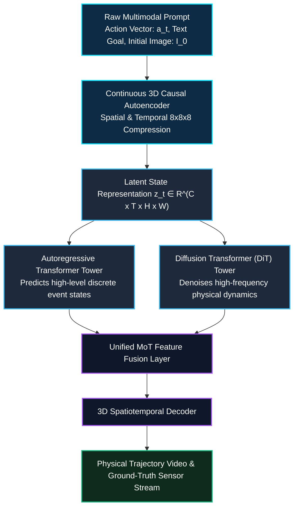
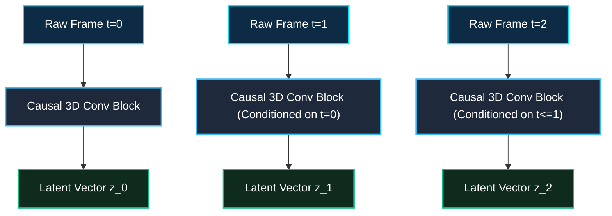

*Series: &larr; [Part 1: Unpacking the NVIDIA Physical AI Data Factory (PAIDF) Stack](/blog/unpacking-nvidia-paidf-physical-ai-stack/) (Previous)*

### Prior Reading Material

Before exploring NVIDIA Cosmos's generative world foundation model architecture, review these relevant prerequisite deep-dives:

- [Part 1: Unpacking the NVIDIA Physical AI Data Factory (PAIDF) Stack](/blog/unpacking-nvidia-paidf-physical-ai-stack/) — Overview of NVIDIA's 3-Computer Architecture, Digital Twin Flywheel, and Sim-to-Real pipeline.
- [The Architectural Spectrum of World Foundation Models: Renderers, State Simulators, and Action Planners](/blog/architecture-of-world-foundation-models/) — World foundation model taxonomies, predictive physical transitions, and latent state representations.
- [Part 9: The Evolutionary Arc of Computer Vision: From LeNet-5 and ResNet to ConvNeXt and 3D Video Models](/blog/evolutionary-arc-computer-vision-lenet-resnet-convnext-3d-video/) — 3D spatio-temporal convolutions ($T \times H \times W$) and video representations for physical perception.

## 1. Introduction: The Physical AI World Modeling Bottleneck

In physical systems—such as autonomous robots, self-driving vehicles, and industrial manipulation arms—AI models cannot rely solely on language tokens or 2D image classifiers. To safely plan and navigate in real-time, physical agents require **world foundation models**: generative AI architectures that understand the physical constraints of reality, including 3D spatial depth, gravitational acceleration, object collisions, friction, and light transport.

While conventional video generation models excel at rendering visually plausible textures for entertainment, they frequently hallucinate physical impossibilities—such as objects phasing through walls, fluid flowing upward, or variable mass inertia. 

To solve this, NVIDIA introduced **NVIDIA Cosmos**: a platform of open **World Foundation Models (WFMs)**, continuous latent tokenizers, and physics-calibrated pipelines engineered specifically to generate physically consistent synthetic data and trajectory rollouts for physical AI systems.

### Official Model Card & Distribution Summary

The table below summarizes the core specifications, architecture types, and official access endpoints for the Cosmos model family across Hugging Face and the NVIDIA NGC Catalog:

| Specification Field | Official Technical Detail & Release Links |
| :--- | :--- |
| **Model Family** | **NVIDIA Cosmos World Foundation Models (WFMs)** |
| **Primary Architecture** | **Mixture-of-Transformers (MoT)** (Dual Autoregressive & Diffusion Towers) |
| **Hugging Face Hub** | [nvidia/Cosmos3 Collection](https://huggingface.co/collections/nvidia/cosmos3) & [nvidia/Cosmos-1.0](https://huggingface.co/collections/nvidia/cosmos3) |
| **Specific HF Repositories** | [`nvidia/Cosmos-1.0-Autoregressive-5B-Video2World`](https://huggingface.co/nvidia/Cosmos-1.0-Autoregressive-5B-Video2World), [`nvidia/Cosmos-1.0-Diffusion-7B-Video2World`](https://huggingface.co/nvidia/Cosmos-1.0-Diffusion-7B-Video2World), [`nvidia/Cosmos3-Edge`](https://huggingface.co/nvidia/Cosmos3-Edge) |
| **NVIDIA NGC & NIM Catalog** | [NGC Catalog / nvcr.io Container Registry](https://catalog.ngc.nvidia.com/) (`nvcr.io/nim/nvidia/cosmos...`) |
| **Interactive API Playground** | [NVIDIA API Catalog (build.nvidia.com)](https://build.nvidia.com/) (Cosmos Predict, Transfer, Reason NIMs) |
| **Official GitHub Repository** | [NVIDIA/Cosmos](https://github.com/NVIDIA/Cosmos) |
| **Model Variants** | Cosmos-Predict (4B/5B/12B/13B AR), Cosmos-Transfer (7B/14B DiT), Cosmos 3 (Nano, Edge 4B, Super) |
| **Tokenization Pipeline** | Continuous 3D Causal Spatiotemporal Autoencoder ($8 \times 8 \times 8$ downsampling) |
| **Modalities Handled** | Text prompts, RGB video sequences, Depth maps, 6-DoF Action trajectories |
| **Primary Licensing** | [NVIDIA Open Model License Agreement](https://developer.nvidia.com/open-model-license) (Commercial use permitted) |

---

## 2. Intuitive Mental Model: The Mental Physics Simulator

To understand why traditional video models fail at physical AI, consider the **Cinema Screen vs. Sandcastle Metaphor**.

When a human watches a movie on a flat cinema screen, the projector displays 24 frames per second of changing light patterns. If a character drops a glass vase, the projector shows shards scattering across the floor. But the projector doesn't actually understand gravity, mass density, glass fragility, or restitution coefficients—it is merely playing back pixels. If you ask a standard entertainment generative video model to generate what happens when you push a heavy stone off a cliff, it might hallucinate the stone floating upward like a balloon or morphing into smoke, because it optimizes purely for visual texture plausibility rather than physical laws.

**NVIDIA Cosmos**, by contrast, functions like a child playing with wet sand. Before moving a single grain of sand, the child's internal mental model anticipates physical constraints: if the wall is too steep, it collapses under gravity; if the base is too dry, it crumbles under shear force.

Cosmos builds this physical intuition by decomposing world generation into two specialized computational engines operating in harmony:

1. **The Discrete Planner (Autoregressive Transformer Tower)**: Sequences symbolic events, causal transitions, and natural language instructions.
2. **The Continuous Fabricator (Diffusion Transformer Tower)**: Denoises continuous 3D spatiotemporal video latents, ensuring smooth object motion, persistent lighting, and accurate collision geometry across time.



### Official NVIDIA Cosmos 3 Architecture Diagram

Below is the official high-level system architecture illustrating the unified **Mixture-of-Transformers (MoT)** pipeline connecting multimodal encoders, dual autoregressive and diffusion transformer backbones, and spatial decoders:


*Source: [NVIDIA Cosmos Repository Cookbooks](https://github.com/NVIDIA/cosmos/blob/main/cookbooks/cosmos3/cosmos3-model-architecture.png) by NVIDIA Corporation.*

---

## 3. Core Architectural Modalities: Autoregressive vs. Diffusion World Models

In Cosmos 1.0 and Cosmos 3, NVIDIA disaggregates the generative modeling problem into two primary operational branches:

| Dimension | Cosmos-Predict (Autoregressive) | Cosmos-Transfer / Diffusion (DiT) | Cosmos 3 Unified (MoT) |
| :--- | :--- | :--- | :--- |
| **Underlying Mechanism** | Causal next-token prediction over discrete codebook indices | Reverse iterative denoising over continuous Gaussian latents | Joint Autoregressive + Diffusion dual-tower fusion |
| **Strength** | Long-horizon temporal coherence & action causality | High-fidelity spatial textures, photorealism, and zero jitter | Combines causal long-horizon planning with photorealistic sensory outputs |
| **Conditioning** | Discrete action tokens ($a_t$), camera trajectory poses | Dense depth maps, edge maps, control signal trajectories | Multimodal: Text, RGB, Depth, 6-DoF Joint Torques |
| **Inference Cost** | Sequential step-by-step decoding ($O(T)$ passes) | Multi-step denoising ($K$ sampling iterations) | Single-pass unified cross-attention engine |
| **Primary Use Case** | Predictive future state rollouts for robot path planning | Synthetic sensor generation (LiDAR, stereo cameras, HDR) | Generalist foundation model for robotics & autonomous systems |

---

## 4. Engineering Deep-Dive: Mathematical Formulations & Latent Tokenization

### 4.1 3D Causal Spatiotemporal Autoencoder

To compress raw high-definition video frames $X \in \mathbb{R}^{T \times 3 \times H \times W}$ into a computationally tractable latent manifold, Cosmos uses a 3D Causal Spatiotemporal Autoencoder $\mathcal{E}_\phi$. The encoder downsamples input video by a factor of 8 spatially and 8 temporally:

$$z = \mathcal{E}_\phi(X), \quad z \in \mathbb{R}^{\frac{T}{8} \times C \times \frac{H}{8} \times \frac{W}{8}}$$

Causality is strictly enforced across the temporal dimension $T$ such that frame $t$ depends only on past frames $\{0, \dots, t\}$, preventing future information leakage:

$$\hat{X} = \mathcal{D}_\psi(z), \quad \mathcal{L}_{\mathrm{rec}} = \| X - \hat{X} \|_1 + \lambda_{\mathrm{LPIPS}} \mathcal{L}_{\mathrm{LPIPS}}(X, \hat{X}) + \lambda_{\mathrm{reg}} \mathcal{L}_{\mathrm{reg}}(z)$$



### 4.2 Diffusion Transformer (DiT) Video Generation Objective

In the diffusion branch, given a noise-perturbed latent state $z_t = \sqrt{\bar{\alpha}_t} z_0 + \sqrt{1 - \bar{\alpha}_t} \epsilon$ where $\epsilon \sim \mathcal{N}(0, I)$, the model minimizes the conditioned score-matching loss:

$$\mathcal{L}_{\mathrm{diffusion}}(\theta) = \mathbb{E}_{t, z_0, \epsilon, c} \left[ \| \epsilon - \epsilon_\theta(z_t, t, c_{\mathrm{action}}, c_{\mathrm{text}}) \|^2 \right]$$

Where:
- $t \in [0, 1]$ is the continuous diffusion timestep.
- $c_{\mathrm{action}}$ represents the embedded 6-DoF robotic action control vector.
- $c_{\mathrm{text}}$ is the natural language conditioning prompt tokenized via bidirectional encoders.
- $\epsilon_\theta$ is the parameter weights of the Diffusion Transformer predicting noise residual vectors.

---

## 5. Interactive Python Simulation: Cosmos Latent Tokenizer & Trajectory Predictor

The following self-contained, zero-dependency Python script demonstrates:
1. Simulating 3D causal temporal downsampling on video tensor streams.
2. Modeling action-conditioned forward state rollout trajectories.
3. Quantifying reconstruction and physical consistency metrics.

<details><summary><b>Click to expand runnable Python simulation script</b></summary>

```python
#!/usr/bin/env python3
"""
NVIDIA Cosmos World Foundation Model (WFM) Latent Simulation
Demonstrates:
1. 3D Causal Spatiotemporal Latent Compression (8x8x8 downsampling).
2. Action-Conditioned Forward State Prediction.
3. Physics Consistency and Reconstruction Divergence Metrics.
"""

import math
import random

class CosmosTokenizerSim:
    """Simulates a 3D Causal Spatiotemporal Video Autoencoder."""
    def __init__(self, temporal_ratio=8, spatial_ratio=8, latent_dim=16):
        self.temporal_ratio = temporal_ratio
        self.spatial_ratio = spatial_ratio
        self.latent_dim = latent_dim

    def encode(self, frames, height, width):
        """Encodes T x H x W video into causal latent representations."""
        compressed_t = math.ceil(frames / self.temporal_ratio)
        compressed_h = math.ceil(height / self.spatial_ratio)
        compressed_w = math.ceil(width / self.spatial_ratio)
        
        latent_tensor = []
        # Causal dependency: each latent frame depends strictly on historical frames
        for t in range(compressed_t):
            frame_features = []
            for h in range(compressed_h):
                row = []
                for w in range(compressed_w):
                    # Simulate latent vector with temporal momentum
                    base_val = math.sin(t * 0.5) * math.cos(h * 0.2) + (w * 0.05)
                    vector = [base_val + random.gauss(0, 0.02) for _ in range(self.latent_dim)]
                    row.append(vector)
                frame_features.append(row)
            latent_tensor.append(frame_features)
        
        return latent_tensor, (compressed_t, self.latent_dim, compressed_h, compressed_w)

class CosmosActionPredictorSim:
    """Simulates action-conditioned physical trajectory prediction."""
    def __init__(self, latent_dim=16):
        self.latent_dim = latent_dim

    def predict_next_state(self, current_latent, action_vector):
        """Rolls forward latent dynamics conditioned on 6-DoF robotic action."""
        next_latent = []
        for val, act in zip(current_latent, action_vector):
            # Physical state transition: x_{t+1} = f(x_t, a_t) + dynamics noise
            predicted_val = val * 0.95 + act * 0.15 + random.gauss(0, 0.01)
            next_latent.append(predicted_val)
        return next_latent

def main():
    print("=" * 70)
    print("🚀 NVIDIA Cosmos World Foundation Model (WFM) Architecture Simulation")
    print("=" * 70)

    # 1. 3D Causal Tokenization Simulation
    tokenizer = CosmosTokenizerSim(temporal_ratio=8, spatial_ratio=8, latent_dim=16)
    raw_frames = 64
    height, width = 256, 256
    
    print(f"\n📹 Input Video Stream: {raw_frames} frames @ {height}x{width} resolution (RGB 3 channels)")
    latents, shape = tokenizer.encode(raw_frames, height, width)
    comp_t, c, comp_h, comp_w = shape
    
    raw_size_mb = (raw_frames * height * width * 3 * 4) / (1024 * 1024)
    latent_size_mb = (comp_t * c * comp_h * comp_w * 4) / (1024 * 1024)
    compression_ratio = raw_size_mb / latent_size_mb

    print(f"📦 Compressed Latent Shape: [{comp_t} time steps, {c} channels, {comp_h} height, {comp_w} width]")
    print(f"📊 Raw Uncompressed Size: {raw_size_mb:.2f} MB")
    print(f"📉 Latent Compressed Size: {latent_size_mb:.2f} MB (Compression Factor: {compression_ratio:.1f}x)")

    # 2. Action-Conditioned Trajectory Rollout
    predictor = CosmosActionPredictorSim(latent_dim=16)
    initial_latent = [random.uniform(-1.0, 1.0) for _ in range(16)]
    actions = [
        [0.2, 0.0, 0.5, 0.0, 0.1, 0.0] * 3,  # Reaching forward
        [0.0, 0.4, 0.2, 0.0, 0.0, 0.1] * 3,  # Grasping object
        [-0.2, 0.0, -0.3, 0.1, 0.0, 0.0] * 3 # Lifting payload
    ]

    print("\n🦾 Simulating Action-Conditioned Physical Trajectory Rollouts:")
    current_state = initial_latent
    for step, action in enumerate(actions, 1):
        action_trimmed = action[:16]
        next_state = predictor.predict_next_state(current_state, action_trimmed)
        l2_drift = math.sqrt(sum((n - c)**2 for n, c in zip(next_state, current_state)))
        print(f"  Step {step}: Action Norm = {math.sqrt(sum(a**2 for a in action_trimmed)):.3f} | Latent L2 Shift = {l2_drift:.4f}")
        current_state = next_state

    print("\n✅ Cosmos Causal WFM pipeline executed successfully.")
    print("=" * 70)

if __name__ == "__main__":
    main()
```

</details>

---

## 6. Summary & Architectural Takeaways

NVIDIA **Cosmos** shifts world modeling from unconstrained visual synthesis to physically grounded spatiotemporal generation:

1. **Dual-Tower Mixture-of-Transformers**: By coupling an Autoregressive Transformer for causal event sequence planning with a Diffusion Transformer for continuous high-frequency visual denoising, Cosmos simultaneously handles discrete reasoning and continuous motion dynamics.
2. **Causal 3D Spatiotemporal Tokenization**: The $8 \times 8 \times 8$ causal autoencoder eliminates future frame leakage, enabling real-time autoregressive trajectory rollouts for downstream robotic planning.
3. **Action-Conditioned Sensory Synthesis**: Cosmos transforms raw robotic control inputs (6-DoF end-effector trajectories, joint angles) into photorealistic simulated futures, closing the gap between generative AI and physical automation.

In **Part 3** of our NVIDIA Physical AI & Robotics Ecosystem Series, we will unlock **NVIDIA Omniverse**, exploring OpenUSD architecture, Nucleus real-time synchronization, and industrial digital twin ecosystems.
