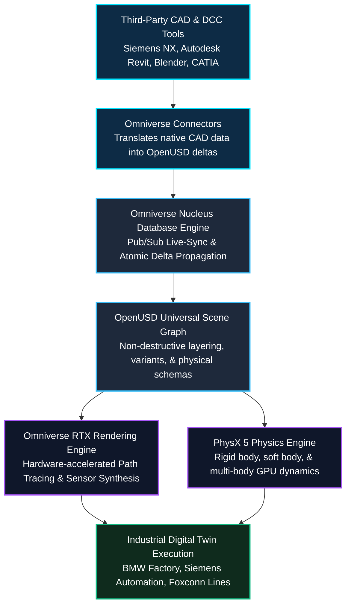
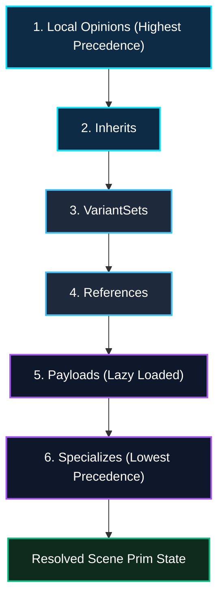

*Series: &larr; [Part 2: Inside NVIDIA Cosmos: World Foundation Models for Physical Commonsense & Video Trajectories](/blog/inside-nvidia-cosmos-world-foundation-models/) (Previous)*

### Prior Reading Material

Before exploring NVIDIA Omniverse's platform architecture, review these prerequisite posts across our series:

- [Part 1: Unpacking the NVIDIA Physical AI Data Factory (PAIDF) Stack](/blog/unpacking-nvidia-paidf-physical-ai-stack/) — Overview of NVIDIA's 3-Computer Architecture, Digital Twin Flywheel, and Sim-to-Real data generation.
- [Part 2: Inside NVIDIA Cosmos: World Foundation Models for Physical Commonsense & Video Trajectories](/blog/inside-nvidia-cosmos-world-foundation-models/) — Mixture-of-Transformers (MoT), continuous latent tokenizers, and physics-conditioned trajectory generation.
- [The Architectural Spectrum of World Foundation Models: Renderers, State Simulators, and Action Planners](/blog/architecture-of-world-foundation-models/) — World model taxonomies, spatial state graphs, and predictive physical simulation.

---

## 1. Introduction: The 3D Data Interoperability Crisis

In modern industrial engineering, architecture, and physical AI, digital assets do not live in a single unified format. A factory assembly line might have its mechanical robot arms designed in **Autodesk Inventor** or **Siemens NX**, its conveyor layouts drafted in **CATIA**, its factory architectural floor plan modeled in **Revit**, and its dynamic robotic behaviors scripted in **ROS 2** or **Blender**.

Historically, aggregating these multi-software assets into a synchronized simulation required exporting files into lossy intermediate formats (such as `.obj`, `.fbx`, or `.stl`). Whenever an engineer adjusted a screw on a robotic gripper in CAD, the entire assembly line had to be manually re-exported, re-textured, and re-imported—breaking physics parameters, material definitions, and animation hierarchies.

To eliminate this data silo, NVIDIA built **NVIDIA Omniverse**: an extensible computing platform designed for building custom 3D workflows, physics simulations, and industrial digital twins. Rather than attempting to replace third-party DCC (Digital Content Creation) and CAD tools, Omniverse serves as the **universal real-time synchronization hub** connecting diverse toolchains into a shared physical virtual world.

### Official Platform Summary & Ecosystem Links

| Platform Component | Technical Role & Official Developer Link |
| :--- | :--- |
| **Core Platform** | [NVIDIA Omniverse Developer Hub](https://developer.nvidia.com/omniverse) |
| **Data Standard** | [OpenUSD (Universal Scene Description)](https://openusd.org/) & [Alliance for OpenUSD (AOUSD)](https://aousd.org/) |
| **Collaboration Engine** | [Omniverse Nucleus Live Synchronization](https://docs.omniverse.nvidia.com/nucleus/latest/index.html) |
| **Graphics Engine** | [Omniverse RTX Real-Time Ray & Path Tracing Renderer](https://developer.nvidia.com/rtx) |
| **Ecosystem Connectors** | [Omniverse Connectors](https://docs.omniverse.nvidia.com/connectors/latest/index.html) (Siemens, Autodesk, Blender, Unreal Engine) |
| **Developer Framework** | [Omniverse Kit SDK & Python Extensions](https://docs.omniverse.nvidia.com/kit/docs/kit-manual/latest/index.html) |
| **Industrial Digital Twins** | [NVIDIA Omniverse for Industrial Manufacturing](https://www.nvidia.com/en-us/omniverse/solutions/manufacturing/) |

---

## 2. Intuitive Mental Model: The HTML of 3D & Google Docs for Physical Worlds

To understand why Omniverse is architected the way it is, consider two everyday digital metaphors:

### 1. OpenUSD as the "HTML of 3D"
When you open a web page in a browser, the browser parses an HTML document that references stylesheets (`.css`), images (`.webp`), scripts (`.js`), and embedded components from across the internet without copying them into one gigantic file. 

**OpenUSD (Universal Scene Description)**, originally developed by Pixar and standardized by NVIDIA, Apple, Adobe, Autodesk, and Pixar under the **Alliance for OpenUSD (AOUSD)**, functions as the HTML of the 3D physical world. An OpenUSD file doesn't just store static mesh polygons; it defines a hierarchical **Scene Graph** with non-destructive layering, references, variants, physics properties (mass, friction, elasticity), and material definitions (MDL).

### 2. Omniverse Nucleus as "Google Docs Live-Sync"
Imagine working on a joint engineering document where every collaborator had to email static `.docx` attachments back and forth versus editing a shared **Google Doc** simultaneously where character edits stream live. 

**Omniverse Nucleus** is the live-sync collaboration database for 3D worlds. When a CAD engineer in Germany modifies an engine bracket in Siemens NX, Nucleus transmits only the atomic delta change (the diff) across the network. A simulation engineer in California running a robotics test in Omniverse sees the physical bracket update immediately in real-time with zero file export delays.



---

## 3. Four Core Pillars of the Omniverse Architecture

The Omniverse technology stack is structured into four tightly integrated layers:

| Architectural Pillar | Core Technology | Primary Functionality |
| :--- | :--- | :--- |
| **1. Universal Interchange** | **OpenUSD & MDL** | Composes complex 3D scenes via non-destructive layers (SubLayers, References, Payloads, Variants) and physically accurate Material Definition Language (MDL). |
| **2. Live Sync Collaboration** | **Omniverse Nucleus** | A centralized publish/subscribe database managing real-time atomic delta updates across multi-user CAD and simulation sessions. |
| **3. Extensible Microservices** | **Omniverse Kit SDK** | A modular C++/Python runtime framework for assembling standalone applications, headless simulation containers, and custom UI tools. |
| **4. Photorealistic Compute** | **RTX Path Tracing & PhysX 5** | Real-time ray tracing utilizing dedicated RT Cores for photorealistic sensor rendering alongside GPU-parallelized rigid and soft body physics simulation. |

---

## 4. Engineering Deep-Dive: OpenUSD Composition & RTX Ray Tracing

### 4.1 OpenUSD Composition Arcs & Layer Stacking (LIVRPS)

OpenUSD achieves non-destructive collaborative editing through formal composition rules evaluated in a strict precedence order known as **LIVRPS**:

1. **L - Local Opinions**: Edits authored directly on the current active layer.
2. **I - Inherits**: Classes and properties inherited from abstract prim definitions.
3. **V - VariantSets**: Dynamic switchable states (e.g. toggling robotic gripper types or paint finishes).
4. **R - References**: Assets linked from external `.usd` files.
5. **P - Payload**: Lazily loaded heavy geometry or sub-assemblies.
6. **S - Specializes**: Specialized class overrides with fallback behaviors.



### 4.2 Real-Time RTX Rendering: The Rendering Equation

To synthesize physically authentic optical sensor data for robots and autonomous systems, the Omniverse RTX renderer solves the **Kajiya Rendering Equation** in real-time using hardware BVH (Bounding Volume Hierarchy) traversal:

$$L_o(p, \omega_o) = L_e(p, \omega_o) + \int_{\Omega} f_r(p, \omega_i, \omega_o) L_i(p, \omega_i) (\omega_i \cdot n) \, d\omega_i$$

Where:
- $L_o(p, \omega_o)$ is the total spectral radiance leaving surface point $p$ in direction $\omega_o$.
- $L_e(p, \omega_o)$ is the emitted spectral radiance (e.g. active light sources or heated objects).
- $f_r(p, \omega_i, \omega_o)$ is the Bidirectional Reflectance Distribution Function (BRDF) defined by NVIDIA MDL materials.
- $L_i(p, \omega_i)$ is the incoming radiance from direction $\omega_i$.
- $(\omega_i \cdot n)$ is the Lambertian cosine factor between the incoming ray and the surface normal $n$.

---

## 5. Interactive Python Simulation: OpenUSD Scene Graph & Live-Sync Nucleus Engine

The following standalone, zero-dependency Python script demonstrates:
1. Constructing an in-memory OpenUSD Scene Graph with hierarchical prims, transforms, and physical mass attributes.
2. Simulating Omniverse Nucleus atomic delta live-sync updates across collaborative engineering clients.
3. Evaluating non-destructive property composition.

<details><summary><b>Click to expand runnable Python simulation script</b></summary>

```python
#!/usr/bin/env python3
"""
NVIDIA Omniverse OpenUSD Scene Graph & Nucleus Live-Sync Simulation
Demonstrates:
1. Hierarchical OpenUSD Prim Scene Graph composition.
2. LIVRPS composition layering and property inheritance.
3. Omniverse Nucleus atomic delta pub/sub synchronization.
"""

import time
import json

class UsdPrim:
    """Represents an OpenUSD Primitive (Prim) in a Scene Graph."""
    def __init__(self, name, prim_type="Xform", parent=None):
        self.name = name
        self.prim_type = prim_type
        self.parent = parent
        self.children = {}
        self.attributes = {}
        if parent:
            parent.children[name] = self

    @property
    def path(self):
        """Returns the full OpenUSD scenegraph path."""
        if self.parent is None:
            return "/" + self.name if self.name else "/"
        return f"{self.parent.path.rstrip('/')}/{self.name}"

    def set_attribute(self, key, value):
        self.attributes[key] = value

    def get_attribute(self, key, default=None):
        return self.attributes.get(key, default)

class NucleusLiveSyncServer:
    """Simulates an Omniverse Nucleus Real-Time Delta Server."""
    def __init__(self):
        self.clients = []
        self.delta_log = []

    def register_client(self, client_name):
        self.clients.append(client_name)
        print(f"🔗 [Nucleus] Client '{client_name}' connected to live-sync session.")

    def broadcast_delta(self, sender, prim_path, attribute_name, new_val):
        """Propagates atomic delta diffs to all connected session clients."""
        delta = {
            "timestamp": time.time(),
            "sender": sender,
            "path": prim_path,
            "attr": attribute_name,
            "val": new_val
        }
        self.delta_log.append(delta)
        for client in self.clients:
            if client != sender:
                print(f"  ⚡ [Live-Sync -> {client}] Delta applied: {prim_path}.{attribute_name} = {new_val}")

def main():
    print("=" * 70)
    print("🌐 NVIDIA Omniverse OpenUSD Scene Graph & Nucleus Live-Sync Simulation")
    print("=" * 70)

    # 1. Build an OpenUSD Stage Hierarchy
    print("\n📂 1. Assembling OpenUSD Scene Graph Hierarchy (USD Stage):")
    stage_root = UsdPrim("Factory_World", "Stage")
    assembly_line = UsdPrim("Assembly_Line_01", "Xform", stage_root)
    robot_arm = UsdPrim("Kuka_KR16_Robot", "Robot", assembly_line)
    gripper = UsdPrim("Parallel_Gripper", "EndEffector", robot_arm)

    # Set Initial USD Attributes (Mass, Position, Materials)
    robot_arm.set_attribute("transform:translate", [10.0, 0.0, 0.0])
    robot_arm.set_attribute("physics:mass_kg", 250.0)
    gripper.set_attribute("gripper:aperture_mm", 45.0)
    gripper.set_attribute("material:mdl_type", "OmniPBR_Steel")

    prims = [stage_root, assembly_line, robot_arm, gripper]
    for p in prims:
        print(f"  📌 Prim: {p.path:<40} Type: {p.prim_type:<15} Attrs: {json.dumps(p.attributes)}")

    # 2. Simulate Omniverse Nucleus Live Multi-User Collaboration
    print("\n👥 2. Simulating Omniverse Nucleus Multi-User Live-Sync:")
    nucleus = NucleusLiveSyncServer()
    nucleus.register_client("Engineer_CAD_Germany")
    nucleus.register_client("Robotics_Sim_USA")
    nucleus.register_client("Floor_Manager_Japan")

    print("\n🛠️ Engineer in Germany updates Robot Position in Siemens NX (transmitting atomic delta):")
    robot_arm.set_attribute("transform:translate", [12.5, 1.2, 0.0])
    nucleus.broadcast_delta("Engineer_CAD_Germany", robot_arm.path, "transform:translate", [12.5, 1.2, 0.0])

    print("\n🤖 Simulation Engineer in USA updates Gripper Aperture in Isaac Sim:")
    gripper.set_attribute("gripper:aperture_mm", 80.0)
    nucleus.broadcast_delta("Robotics_Sim_USA", gripper.path, "gripper:aperture_mm", 80.0)

    print("\n📊 3. Final Evaluated Prim State on USD Stage:")
    print(f"  Robot Current Position: {robot_arm.get_attribute('transform:translate')}")
    print(f"  Gripper Current Aperture: {gripper.get_attribute('gripper:aperture_mm')} mm")
    print(f"  Total Deltas Logged in Nucleus: {len(nucleus.delta_log)}")

    print("\n✅ Omniverse OpenUSD & Nucleus simulation completed successfully.")
    print("=" * 70)

if __name__ == "__main__":
    main()
```

</details>

---

## 6. Real-World Industrial Metaverse Ecosystems

Omniverse powers factory-scale digital twins across leading global enterprises:

1. **BMW Group (Virtual Factory Operations)**: Real-time simulation of complete automotive assembly plants, allowing planners worldwide to collaborate in OpenUSD, optimize robot paths, and validate production tooling before pouring concrete.
2. **Siemens (Industrial Automation)**: Integrating Siemens Xcelerator CAD and PLM data directly into Omniverse to simulate factory-floor automation architectures and energy efficiency metrics.
3. **Foxconn (Robotic Electronics Manufacturing)**: Utilizing Omniverse to simulate robotic assembly cells and autonomous mobile robots (AMRs) in virtual electronics factories before physical deployment.

---

## 7. Summary & Architectural Takeaways

NVIDIA **Omniverse** serves as the foundational operating layer for the industrial metaverse and physical AI:

1. **OpenUSD Data Standardization**: By leveraging OpenUSD as the universal 3D scene representation, Omniverse eliminates file conversion bottlenecks, enabling non-destructive layering across multi-software engineering pipelines.
2. **Nucleus Real-Time Synchronization**: The Nucleus pub/sub delta engine enables synchronized multi-user collaboration across globally distributed teams with minimal network overhead.
3. **Physically Accurate Compute**: Combining hardware-accelerated RTX path tracing with GPU-parallelized PhysX 5 dynamics provides the exact physical ground-truth required for synthetic data generation.

In **Part 4** of our series, we will build directly on Omniverse to explore **NVIDIA Isaac Sim & Omniverse Replicator**, detailing GPU physics dynamics, synthetic sensor pipelines, and automated domain randomization.
