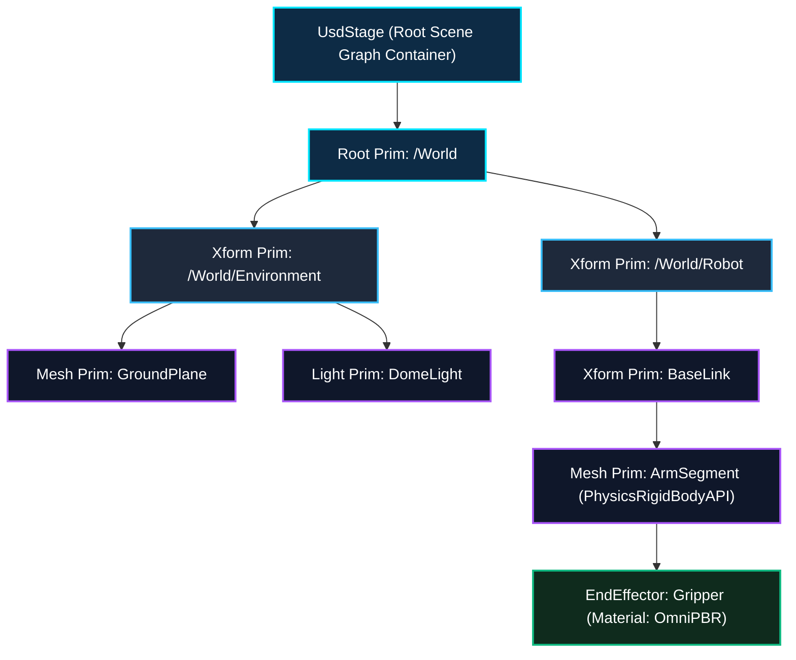
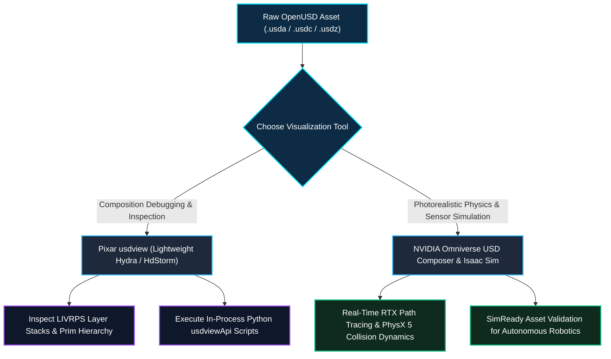

*Series: &larr; [Part 3: Unlocking NVIDIA Omniverse: Architecture, OpenUSD, RTX Rendering, and the Industrial Metaverse Ecosystem](/blog/unlocking-nvidia-omniverse-architecture/) (Previous) | [Part 5: Scaling Physics with Isaac Sim & Omniverse Replicator: GPU Dynamics, Synthetic Sensors, and Domain Randomization](/blog/scaling-physics-isaac-sim-omniverse-replicator/) (Next) &rarr;*

### Prior Reading Material

Before exploring the technical depths of OpenUSD, review these prerequisite posts across our series:

- [Part 1: Unpacking the NVIDIA Physical AI Data Factory (PAIDF) Stack](/blog/unpacking-nvidia-paidf-physical-ai-stack/) — Overview of NVIDIA's 3-Computer Architecture, Digital Twin Flywheel, and Sim-to-Real data generation.
- [Part 2: Inside NVIDIA Cosmos: World Foundation Models for Physical Commonsense & Video Trajectories](/blog/inside-nvidia-cosmos-world-foundation-models/) — Mixture-of-Transformers (MoT), continuous latent tokenizers, and physics-conditioned trajectory generation.
- [Part 3: Unlocking NVIDIA Omniverse: Architecture, OpenUSD, RTX Rendering, and the Industrial Metaverse Ecosystem](/blog/unlocking-nvidia-omniverse-architecture/) — Platform foundations, Nucleus live synchronization, and RTX path tracing.

---

## 1. Introduction: Why OpenUSD is the Lingua Franca of 3D Worlds

In traditional 3D graphics and engineering pipelines, interchange formats like `.obj`, `.fbx`, or `.stl` were built to convey static geometric snapshots. They fail completely when tasked with modeling complex, multi-agent physical environments with kinematic hierarchies, non-destructive layer overrides, variant configurations, and physically accurate material schemas.

**OpenUSD (Universal Scene Description)**, originally open-sourced by **Pixar Animation Studios** and standardized alongside **NVIDIA, Apple, Adobe, and Autodesk** under the **Alliance for OpenUSD (AOUSD)**, is not merely a file format—it is a high-performance extensible software framework for composing, describing, and reading 3D virtual worlds.

In NVIDIA's Physical AI and Omniverse ecosystems, OpenUSD serves as the **universal data contract** across CAD tools, physical simulators, and synthetic data generators.

### Official OpenUSD Reference & Documentation Hub

| Resource | Technical Description & Official Link |
| :--- | :--- |
| **OpenUSD Core Specification** | [Alliance for OpenUSD (AOUSD)](https://aousd.org/) & [Pixar OpenUSD Portal](https://openusd.org/) |
| **NVIDIA OpenUSD Overview** | [NVIDIA Omniverse OpenUSD Overview](https://docs.omniverse.nvidia.com/usd/latest/overview_external.html) |
| **OpenUSD FAQ & Core Concepts** | [Omniverse OpenUSD FAQ](https://docs.omniverse.nvidia.com/usd/latest/learn-openusd/faq.html) |
| **Sample Content & Asset Packs** | [NVIDIA OpenUSD Sample Content & Assets](https://docs.omniverse.nvidia.com/usd/latest/usd_content_samples/sample_content.html) |
| **Verified AI Agent Skills** | [NVIDIA Agent Skills for OpenUSD & SimReady](https://github.com/NVIDIA/skills) |
| **LearnOpenUSD Community** | [LearnOpenUSD Guided Curriculum](https://github.com/NVIDIA-Omniverse) |

---

## 2. Core Concepts: Stages, Prims, Properties, and Layers

OpenUSD structures 3D virtual reality into four foundational abstractions:

1. **Stage (`UsdStage`)**: The top-level scene graph container. A stage is populated by opening a root USD file and evaluating all composed layers, references, and payloads into a single runtime scene.
2. **Prim (`UsdPrim`)**: The primary nodes within a Stage hierarchy (e.g. `/World/Robots/KukaArm/Gripper`). Prims have types such as `Xform` (transforms), `Mesh` (geometry), `Camera`, `Light`, or physical schemas like `PhysicsRigidBodyAPI`.
3. **Properties (`UsdAttribute` & `UsdRelationship`)**: 
   - **Attributes**: Typed data values that vary over time or remain static (e.g., `double3 xformOp:translate`, `float mass = 12.5`, `color3f diffuseColor`).
   - **Relationships**: Pointers targeting other Prims in the stage (e.g., linking a mesh to a material schema: `/World/Materials/OmniPBR_Steel`).
4. **Layers (`SdfLayer`)**: The fundamental units of asset persistence on disk (`.usd`, `.usda` human-readable ASCII, `.usdc` binary crate format, or `.usdz` zero-compression zip package). Layers can be non-destructively stacked.



---

## 3. Engineering Deep-Dive: LIVRPS Composition Arcs

The hallmark of OpenUSD is its **non-destructive composition engine**. When a stage resolves the value of an attribute on a Prim, it searches through composition arcs according to the strict **LIVRPS** precedence order:

$$\text{Opinion Strength: } \mathbf{L} > \mathbf{I} > \mathbf{V} > \mathbf{R} > \mathbf{P} > \mathbf{S}$$

| Arc | Name | Precedence | Functionality & Mechanical Behavior |
| :---: | :--- | :---: | :--- |
| **L** | **Local Opinions** | **1 (Highest)** | Explicit edits authored directly on the active layer of the current stage. Always wins over referenced or inherited attributes. |
| **I** | **Inherits** | **2** | Non-destructive class inheritance where a Prim shares properties from a shared abstract class prim within the same layer stack. |
| **V** | **VariantSets** | **3** | Switchable property configurations authored inside the asset (e.g. toggling `gripper_type = ["vacuum", "two_finger", "parallel"]`). |
| **R** | **References** | **4** | Incorporates external `.usd` files into the current Prim namespace, enabling modular assembly of complex assets without duplicating data. |
| **P** | **Payloads** | **5** | Identical to references but **lazily loaded**. Allows massive multi-gigabyte factory models to open in seconds by only loading geometry when needed. |
| **S** | **Specializes** | **6 (Lowest)** | Defines fallback specialization behaviors that can be superseded by inherited or local opinions. |

---

## 4. Visualizing OpenUSD Files: From `usdview` to Omniverse Viewers

To inspect, debug, and validate OpenUSD assets, developers have multiple viewing and introspection options depending on the required level of fidelity:

### 4.1 Pixar `usdview`: The Diagnostic Powerhouse
`usdview` is the reference OpenUSD interactive introspection tool built on top of **Hydra** (USD's imaging framework) and PyQt/PySide. It is essential for developers debugging composition arcs, prim hierarchies, and time-sampled transforms.

#### Step 1: Install OpenUSD Pre-Built Binaries
On macOS, Linux, or Windows, install the official OpenUSD Python package:
```bash
pip install usd-core
```
Or download pre-compiled binaries from the [Alliance for OpenUSD GitHub Releases](https://github.com/PixarAnimationStudios/OpenUSD/releases).

#### Step 2: Launch `usdview`
Pass any `.usd`, `.usda`, or `.usdc` file path directly to the `usdview` CLI:
```bash
# Launch interactive visualizer
usdview /path/to/robot_cell.usda
```

#### Step 3: Inspecting Prim Hierarchies and Composition
Inside `usdview`:
- **Scenegraph Browser (Left Pane)**: Navigate the stage hierarchy (`/World/Robot/...`).
- **Composition Tab (Bottom Right)**: Inspect the exact **LIVRPS** arc that contributed each property value (Local, Reference, Inherit).
- **Hydra Render Delegate Switcher**: Switch between OpenGL Storm (`HdStorm`) and ray-tracing delegates.
- **Embedded Python Interpreter**: Press `Ctrl + \`` (or `Cmd + \``) to open an in-process interactive Python terminal targeting the live stage (`usdviewApi.stage`).

### 4.2 NVIDIA Omniverse Viewers & CAD-to-SimReady Pipelines
For photorealistic RTX path tracing and physical simulation validation:
1. **Omniverse USD Composer**: A full-featured spatial development application supporting physics inspection, lighting adjustment, and live-sync multi-user sessions.
2. **CAD-to-SimReady Workflows**: Utilizing sample assets from the [Omniverse Sample Content Library](https://docs.omniverse.nvidia.com/usd/latest/usd_content_samples/sample_content.html) to validate physical schemas (friction, collision meshes, inertia tensors) before feeding assets into Isaac Sim.



---

## 5. Interactive Python Simulation: OpenUSD LIVRPS Composition Resolver

The following standalone, zero-dependency Python script demonstrates:
1. Constructing multi-layer USD Prim hierarchies with Local, Reference, and VariantSet opinions.
2. Simulating the **LIVRPS** resolution engine to determine the winning property value.
3. Generating a formatted ASCII representation (`.usda`) of the composed stage.

<details><summary><b>Click to expand runnable Python simulation script</b></summary>

```python
#!/usr/bin/env python3
"""
OpenUSD LIVRPS Composition Engine & Stage Simulator
Demonstrates:
1. Multi-layered USD Stage construction.
2. Resolution of Local Opinions, Variants, and References (LIVRPS).
3. USDA ASCII generation and scene hierarchy traversal.
"""

class USDPropertyOpinion:
    """Represents a property opinion with an associated LIVRPS precedence layer."""
    # Precedence levels: Lower integer = higher strength (Local > Variant > Reference)
    PRECEDENCE = {
        "LOCAL": 1,
        "INHERIT": 2,
        "VARIANT": 3,
        "REFERENCE": 4,
        "PAYLOAD": 5,
        "SPECIALIZE": 6
    }

    def __init__(self, name, value, layer_type="LOCAL"):
        self.name = name
        self.value = value
        self.layer_type = layer_type
        self.strength = self.PRECEDENCE.get(layer_type, 99)

class USDComposedPrim:
    """Simulates an OpenUSD Primitive evaluating LIVRPS opinions."""
    def __init__(self, path, prim_type="Xform"):
        self.path = path
        self.prim_type = prim_type
        self.opinions = {} # property_name -> list of USDPropertyOpinion

    def add_opinion(self, prop_name, value, layer_type):
        if prop_name not in self.opinions:
            self.opinions[prop_name] = []
        self.opinions[prop_name].append(USDPropertyOpinion(prop_name, value, layer_type))

    def resolve_properties(self):
        """Evaluates LIVRPS composition: Strongest opinion wins."""
        resolved = {}
        for prop_name, opinion_list in self.opinions.items():
            # Sort by strength (lowest integer precedence number)
            winning_opinion = min(opinion_list, key=lambda op: op.strength)
            resolved[prop_name] = {
                "value": winning_opinion.value,
                "winner_source": winning_opinion.layer_type
            }
        return resolved

def main():
    print("=" * 70)
    print("📐 OpenUSD LIVRPS Composition & Scene Graph Resolution Simulator")
    print("=" * 70)

    # 1. Instantiate a Robot Gripper Prim
    prim_path = "/World/Robots/Franka_Arm/Gripper"
    gripper = USDComposedPrim(prim_path, "Mesh")

    print(f"\n📂 1. Authoring Multi-Layer Opinions on Prim: '{prim_path}'")
    
    # Add Layer Opinions across different LIVRPS sources:
    # A) Reference Layer specifies base gripper mass
    gripper.add_opinion("physics:mass_kg", 2.5, "REFERENCE")
    gripper.add_opinion("material:color", [0.8, 0.8, 0.8], "REFERENCE")

    # B) VariantSet switches gripper to Heavy-Duty model
    gripper.add_opinion("physics:mass_kg", 4.0, "VARIANT")
    gripper.add_opinion("gripper:max_aperture_mm", 120.0, "VARIANT")

    # C) Local Opinion authors direct override on the active stage
    gripper.add_opinion("physics:mass_kg", 3.2, "LOCAL")

    print("  Opinions Added:")
    print("    - [REFERENCE] physics:mass_kg = 2.5 kg")
    print("    - [VARIANT]   physics:mass_kg = 4.0 kg | gripper:max_aperture_mm = 120.0 mm")
    print("    - [LOCAL]     physics:mass_kg = 3.2 kg (Authored directly on root layer)")

    # 2. Resolve Composed Stage State
    print("\n⚙️ 2. Executing LIVRPS Composition Evaluation:")
    resolved = gripper.resolve_properties()

    for prop, data in resolved.items():
        print(f"  ✨ Property: '{prop:<25}' -> Resolved Value: {str(data['value']):<15} (Winner: {data['winner_source']})")

    print("\n📄 3. Generated Composed USDA ASCII Output:")
    print(f'#usda 1.0\ndef {gripper.prim_type} "Gripper" (')
    print('    customData = { string creator = "OpenUSD_Sim" }')
    print(')')
    print('{')
    for prop, data in resolved.items():
        print(f'    custom {prop} = {data["value"]} # Source: {data["winner_source"]}')
    print('}')

    print("\n✅ OpenUSD LIVRPS composition verified successfully.")
    print("=" * 70)

if __name__ == "__main__":
    main()
```

</details>

---

## 6. Summary & Architectural Takeaways

**OpenUSD** represents the foundational software standard bridging digital content creation, robotics simulation, and physical AI:

1. **Non-Destructive Scene Graphs**: By separating scene data into layers and evaluating them via strict **LIVRPS** composition, OpenUSD allows multi-disciplinary engineering teams to collaborate without file locks or data corruption.
2. **Diagnostic & Visual Tooling**: From lightweight debugging in **`usdview`** to real-time ray-traced validation in **Omniverse USD Composer**, developers have end-to-end tooling to introspect and verify scene composition.
3. **SimReady Physical Standards**: Combining geometric schemas with physics attributes (mass, friction, inertia) enables 3D assets to transition directly from CAD into high-throughput simulators.

In **Part 5** of our series, we will explore **NVIDIA Isaac Sim & Omniverse Replicator**, detailing GPU physics dynamics, synthetic sensor pipelines, and automated domain randomization.
