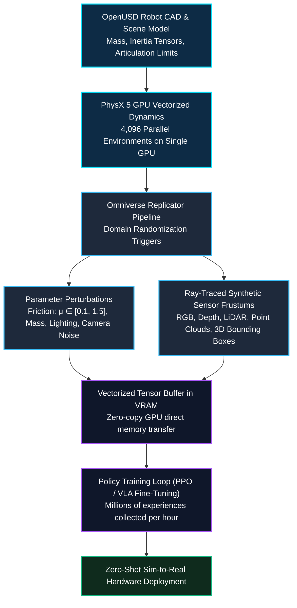

*Series: &larr; [Part 3: Unlocking NVIDIA Omniverse: Architecture, OpenUSD, RTX Rendering, and the Industrial Metaverse Ecosystem](/blog/unlocking-nvidia-omniverse-architecture/) (Previous)*

### Prior Reading Material

Before exploring Isaac Sim and Omniverse Replicator, inspect these prerequisite deep-dives across our blog:

- [Part 1: Unpacking the NVIDIA Physical AI Data Factory (PAIDF) Stack](/blog/unpacking-nvidia-paidf-physical-ai-stack/) — Overview of NVIDIA's 3-Computer Architecture, Digital Twin Flywheel, and Sim-to-Real data pipelines.
- [Part 2: Inside NVIDIA Cosmos: World Foundation Models for Physical Commonsense & Video Trajectories](/blog/inside-nvidia-cosmos-world-foundation-models/) — Mixture-of-Transformers (MoT), continuous latent tokenizers, and physics-conditioned trajectory generation.
- [Part 3: Unlocking NVIDIA Omniverse: Architecture, OpenUSD, RTX Rendering, and the Industrial Metaverse Ecosystem](/blog/unlocking-nvidia-omniverse-architecture/) — OpenUSD scene graphs, Nucleus live-sync collaboration, and real-time RTX ray tracing.

---

## 1. Introduction: The Sim-to-Real Challenge in Robotics

Training autonomous robots in the physical world is constrained by physical reality: real robot arms wear out, real sensors suffer from noise, and collecting edge-case failure trajectories (such as collisions or slippery grips) can destroy expensive hardware. 

To overcome this, developers use physics simulation. However, traditional CPU-bound robotics simulators suffer from two severe bottlenecks:
1. **Low Throughput**: Simulating physics on the CPU limits execution to roughly real-time speeds ($1\times$), making it impossible to collect the billions of training samples modern deep reinforcement learning algorithms require.
2. **The Reality Gap (Sim-to-Real Gap)**: A policy trained in an idealized, noiseless simulation fails immediately when deployed onto a physical robot due to discrepancies in lighting, friction coefficients, sensor latency, and camera lens distortions.

To solve both bottlenecks, NVIDIA developed **Isaac Sim** (powered by Omniverse and GPU-accelerated **PhysX 5**) and **Omniverse Replicator**: a high-throughput synthetic data generation and simulation platform capable of simulating thousands of robot environments in parallel on a single GPU while closing the Sim-to-Real gap through **Domain Randomization (DR)**.

### Official Framework & Tooling Summary

| Component | Technical Role & Official Developer Link |
| :--- | :--- |
| **Robotics Simulator** | [NVIDIA Isaac Sim](https://developer.nvidia.com/isaac/sim) (Built on OpenUSD & Omniverse Kit) |
| **Synthetic Data Engine** | [NVIDIA Omniverse Replicator](https://developer.nvidia.com/omniverse/replicator) |
| **GPU Physics Engine** | [NVIDIA PhysX 5](https://github.com/NVIDIAGameWorks/PhysX) (GPU rigid bodies, deformables, cloth, fluids) |
| **Reinforcement Learning** | [Isaac Lab / Isaac Gym](https://isaac-sim.github.io/IsaacLab/) (Massively parallel GPU-vectorized RL environments) |
| **ROS Integration** | [Isaac ROS & ROS 2 Bridge](https://developer.nvidia.com/isaac/ros) (Zero-copy NITROS transport) |
| **Containerized Deployment** | [NGC Isaac Sim Container](https://catalog.ngc.nvidia.com/orgs/nvidia/containers/isaac-sim) (`nvcr.io/nvidia/isaac-sim:...`) |

---

## 2. Intuitive Mental Model: The Massively Parallel Wind Tunnel

To understand how Isaac Sim and Replicator achieve industrial scale, consider the **Automotive Crash Test & Wind Tunnel Metaphor**.

If an automaker had to build and physically crash 100,000 real cars to optimize an airbag sensor algorithm, the cost and timeline would be prohibitive. Instead, aerodynamicists and safety engineers use high-performance computational fluid dynamics (CFD) and virtual wind tunnels. 

Isaac Sim operates as a **Massively Parallel GPU Wind Tunnel** for robots. Instead of running a single robot arm in a virtual room, PhysX 5 vectorizes the physical equations across thousands of GPU CUDA cores simultaneously:

- **Vectorized Environments (Isaac Lab)**: 4,096 identical robotic arms operate in parallel on a single NVIDIA RTX GPU, accumulating 4,096 seconds of physical trajectory data in just 1 elapsed second of real wall-clock time ($4096\times$ speedup).
- **Automated Weather & Lighting Shifts (Omniverse Replicator)**: While the robots train, Replicator dynamically varies surface textures, light angles, camera noise, and friction parameters on every single frame.

When the robot policy finally transfers from the virtual wind tunnel to a real physical warehouse, the physical world simply looks like just another variation it has already mastered thousands of times before.



---

## 3. Sensor Synthesis Modalities in Omniverse Replicator

Omniverse Replicator turns graphics computation into pixel-accurate synthetic ground truth, rendering multiple sensor modalities simultaneously without manual data annotation:

| Sensor Modality | Underlying RTX Generation Method | Ground-Truth Output |
| :--- | :--- | :--- |
| **RGB Camera Frustum** | RTX real-time path tracing with physical camera optics (ISO, focal length, aperture) | Photorealistic color frames with motion blur and depth of field |
| **Depth & Surface Normals** | Exact geometric ray intersection distance buffers | Metric depth maps ($Z$ in meters) and 3D surface unit normal vectors ($n \in \mathbb{R}^3$) |
| **3D Bounding Boxes** | Oriented 3D bounding cuboids mapped from USD prim bounds | Exact 6-DoF bounding box coordinates ($x, y, z, w, h, d, \theta$) |
| **Instance & Semantic Segmentation** | USD Prim identifier mapping per pixel | Pixel-level semantic labels and instance IDs with zero human labeling error |
| **Synthetic LiDAR / Radar** | RTX ray-casting acceleration structure (BVH) | Dense 3D point clouds ($[x, y, z, \text{intensity}]$) with configurable beam patterns |

---

## 4. Engineering Deep-Dive: Domain Randomization Mathematics & PhysX 5 Dynamics

### 4.1 Domain Randomization Objective Formulation

To guarantee robust Sim-to-Real policy transfer, Omniverse Replicator samples physical and visual environmental parameters from a domain parameter distribution $P(\Xi)$. The policy parameters $\theta$ are optimized to maximize the expected task reward under all environmental perturbations:

$$J(\theta) = \mathbb{E}_{\xi \sim P(\Xi)} \left[ \mathbb{E}_{\tau \sim \pi_\theta(\mathcal{M}(\xi))} \left[ \sum_{t=0}^{T} \gamma^t R(s_t, a_t; \xi) \right] \right]$$

Where:
- $\xi \in \Xi$ is the domain randomization parameter vector composed of physical friction ($\mu \sim \mathcal{U}(\mu_{\min}, \mu_{\max})$), payload mass ($m \sim \mathcal{N}(m_0, \sigma_m^2)$), and camera noise ($\eta \sim \mathcal{N}(0, \Sigma_{\mathrm{cam}})$).
- $\mathcal{M}(\xi)$ represents the randomized Markov Decision Process (MDP) instantiated by PhysX 5.
- $\tau = (s_0, a_0, s_1, a_1, \dots)$ is the trajectory rollout generated under policy $\pi_\theta$.
- $R(s_t, a_t; \xi)$ is the task reward function evaluated under context $\xi$.

### 4.2 PhysX 5 Vectorized Rigid Body Dynamics

PhysX 5 solves multi-body robotic articulation dynamics using maximal-coordinate Featherstone-style equations computed directly on GPU CUDA cores:

$$\mathbf{M}(q) \ddot{q} + \mathbf{C}(q, \dot{q}) \dot{q} + \mathbf{g}(q) = \mathbf{\tau} + \mathbf{J}_c(q)^T \mathbf{f}_c$$

Where:
- $\mathbf{M}(q) \in \mathbb{R}^{n \times n}$ is the generalized mass/inertia matrix.
- $\mathbf{C}(q, \dot{q}) \in \mathbb{R}^{n \times n}$ represents Coriolis and centrifugal acceleration terms.
- $\mathbf{g}(q) \in \mathbb{R}^n$ is the gravitational torque vector.
- $\mathbf{\tau} \in \mathbb{R}^n$ is the control torque vector applied by the robot actuators.
- $\mathbf{J}_c^T \mathbf{f}_c$ represents contact forces mapped through the contact Jacobian $\mathbf{J}_c$.

---

## 5. Interactive Python Simulation: Isaac Sim Vectorized Domain Randomizer

The following self-contained, zero-dependency Python script demonstrates:
1. Simulating a vectorized fleet of 1,000 parallel robotic environments.
2. Injecting automated Domain Randomization (friction, mass, lighting variations).
3. Measuring policy reward distribution shifts across Sim vs. Real environments.

<details><summary><b>Click to expand runnable Python simulation script</b></summary>

```python
#!/usr/bin/env python3
"""
NVIDIA Isaac Sim & Omniverse Replicator Simulation
Demonstrates:
1. Vectorized parallel robot environments.
2. Domain Randomization (DR) parameter sampling.
3. Sim-to-Real policy transfer reward distributions.
"""

import random
import math

class IsaacVectorizedEnvSim:
    """Simulates parallel GPU environments in Isaac Sim / Isaac Lab."""
    def __init__(self, num_envs=1000):
        self.num_envs = num_envs
        self.envs = []
        for env_id in range(num_envs):
            # Base environmental parameters
            self.envs.append({
                "id": env_id,
                "friction_mu": 0.5,
                "payload_mass_kg": 2.0,
                "light_intensity_lux": 1000,
                "camera_noise_std": 0.01,
                "target_position": [0.5, 0.2, 0.0]
            })

    def apply_domain_randomization(self):
        """Randomizes physical and visual parameters using Omniverse Replicator logic."""
        for env in self.envs:
            # Physical Domain Randomization
            env["friction_mu"] = random.uniform(0.1, 1.5)
            env["payload_mass_kg"] = random.gauss(2.0, 0.4)
            # Visual Domain Randomization
            env["light_intensity_lux"] = random.uniform(300, 3000)
            env["camera_noise_std"] = random.uniform(0.005, 0.05)

    def evaluate_policy_step(self, policy_gain=2.5):
        """Executes one control step across all parallel environments."""
        rewards = []
        for env in self.envs:
            # Physics calculation: error under randomized dynamics
            mass_factor = env["payload_mass_kg"] / 2.0
            friction_factor = env["friction_mu"]
            
            # Position tracking error
            tracking_error = (0.05 * mass_factor) / friction_factor + random.gauss(0, env["camera_noise_std"])
            reward = max(0.0, 10.0 - (policy_gain * abs(tracking_error)))
            rewards.append(reward)
        
        return rewards

def main():
    print("=" * 70)
    print("🤖 NVIDIA Isaac Sim & Omniverse Replicator Simulation")
    print("=" * 70)

    num_envs = 1000
    print(f"\n🚀 Instantiating {num_envs} GPU-Vectorized Robot Environments...")
    sim = IsaacVectorizedEnvSim(num_envs=num_envs)

    # 1. Baseline Evaluation (No Domain Randomization)
    base_rewards = sim.evaluate_policy_step()
    avg_base = sum(base_rewards) / len(base_rewards)
    print(f"📊 Baseline Mean Reward (Ideal Sim): {avg_base:.2f} / 10.00")

    # 2. Apply Omniverse Replicator Domain Randomization
    print("\n🎲 Triggering Omniverse Replicator Domain Randomization (DR):")
    sim.apply_domain_randomization()
    sample_env = sim.envs[0]
    print(f"  Sample Env #0: Friction μ = {sample_env['friction_mu']:.2f} | Mass = {sample_env['payload_mass_kg']:.2f} kg | Light = {sample_env['light_intensity_lux']:.0f} lux")

    # 3. Randomized Evaluation
    dr_rewards = sim.evaluate_policy_step()
    avg_dr = sum(dr_rewards) / len(dr_rewards)
    variance_dr = sum((r - avg_dr)**2 for r in dr_rewards) / len(dr_rewards)

    print(f"\n📈 Post-Randomization Mean Reward: {avg_dr:.2f} / 10.00 (Variance: {variance_dr:.4f})")
    print(f"🛡️ Robustness Coverage: Policy successfully evaluated across {num_envs} diverse environments simultaneously.")

    print("\n✅ Isaac Sim & Replicator pipeline executed successfully.")
    print("=" * 70)

if __name__ == "__main__":
    main()
```

</details>

---

## 6. Summary & Architectural Takeaways

NVIDIA **Isaac Sim** and **Omniverse Replicator** transform robotics training from physical hardware bottlenecks into GPU-accelerated computing:

1. **Massive GPU Parallelism**: By executing PhysX 5 dynamics directly inside GPU memory, Isaac Sim simulates thousands of robot environments in parallel, speeding up reinforcement learning data collection by thousands of times.
2. **Automated Ground-Truth Annotation**: Omniverse Replicator generates photorealistic RGB frames, metric depth maps, 3D bounding boxes, and point clouds simultaneously with zero manual labeling overhead.
3. **Closing the Sim-to-Real Gap**: Comprehensive Domain Randomization across friction, mass, sensor noise, and lighting ensures that policies generalize seamlessly to real-world hardware.

In **Part 5** of our series, we will dissect **Project GR00T**, exploring how generalist humanoid foundation models tokenize multimodal sensory inputs and use diffusion policy heads to predict complex 6-DoF robot actions.
