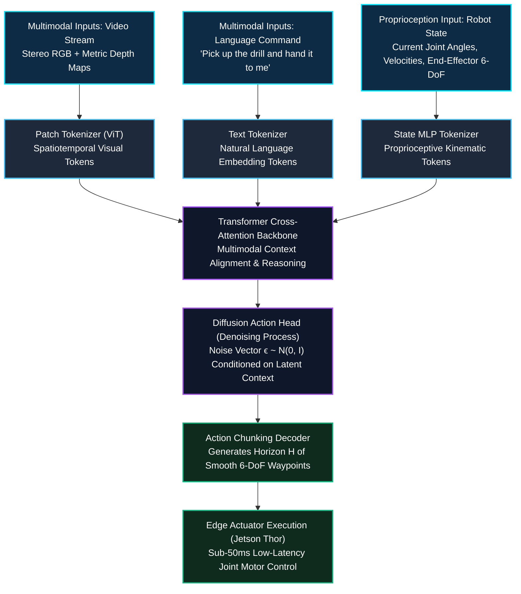

*Series: &larr; [Part 5: Scaling Physics with Isaac Sim & Omniverse Replicator: GPU Dynamics, Synthetic Sensors, and Domain Randomization](/blog/scaling-physics-isaac-sim-omniverse-replicator/) (Previous)*

### Prior Reading Material

Before exploring Project GR00T's Vision-Language-Action architecture, inspect these prerequisite deep-dives across our blog:

- [Part 1: Unpacking the NVIDIA Physical AI Data Factory (PAIDF) Stack](/blog/unpacking-nvidia-paidf-physical-ai-stack/) — Overview of NVIDIA's 3-Computer Architecture, Digital Twin Flywheel, and Sim-to-Real data generation.
- [Part 2: Inside NVIDIA Cosmos: World Foundation Models for Physical Commonsense & Video Trajectories](/blog/inside-nvidia-cosmos-world-foundation-models/) — Mixture-of-Transformers (MoT), continuous latent tokenizers, and physics-conditioned trajectory generation.
- [Part 3: Unlocking NVIDIA Omniverse: Architecture, OpenUSD, RTX Rendering, and the Industrial Metaverse Ecosystem](/blog/unlocking-nvidia-omniverse-architecture/) — OpenUSD scene graphs, Nucleus live synchronization, and real-time RTX ray tracing.
- [Part 5: Scaling Physics with Isaac Sim & Omniverse Replicator: GPU Dynamics, Synthetic Sensors, and Domain Randomization](/blog/scaling-physics-isaac-sim-omniverse-replicator/) — GPU physics dynamics, synthetic sensor pipelines, and automated domain randomization.

---

## 1. Introduction: The Generalist Humanoid Robot Challenge

Building generalist humanoid robots has long been considered the pinnacle of embodied AI. Unlike stationary robotic arms operating in controlled factory cages, a humanoid robot must navigate dynamic human environments, understand natural language instructions ("Pick up the mug and place it on the drying rack"), and coordinate dozens of mechanical degrees of freedom (DoF) across its arms, hands, torso, and legs simultaneously.

Historically, robotics control relied on fragmented, hand-engineered pipelines:
- A classical vision pipeline detected object bounding boxes.
- A natural language parser matched intent to pre-defined script commands.
- A path planner (like MoveIt or trajectory optimization) computed inverse kinematics.

When encountering novel object geometries, slippery textures, or ambiguous commands, these brittle pipelines collapsed. 

To overcome this, NVIDIA introduced **Project GR00T** (Generalist Robot 00 Technology): a foundational **Vision-Language-Action (VLA)** model designed specifically for humanoid robots. Project GR00T unifies perception, reasoning, and motor execution into an end-to-end multimodal transformer, processing camera video, speech instructions, and robotic joint proprioception to directly predict continuous, coordinated multi-joint motor actions.

### Official Platform & Model Reference

| Component | Technical Role & Official Developer Link |
| :--- | :--- |
| **Foundation Model Hub** | [NVIDIA Project GR00T Humanoid Model](https://developer.nvidia.com/project-gr00t) |
| **Physical AI Architecture** | [NVIDIA Embodied AI & Humanoid Ecosystem](https://www.nvidia.com/en-us/robotics/) |
| **Simulation & Imitation** | [NVIDIA Isaac Lab Teleoperation & Demonstration Tools](https://isaac-sim.github.io/IsaacLab/) |
| **Edge Hardware Target** | [NVIDIA Jetson Thor (Blackwell Architecture)](https://www.nvidia.com/en-us/autonomous-machines/embedded-systems/jetson-thor/) |
| **Real-Time Edge Runtime** | [NVIDIA Isaac ROS Acceleration](https://developer.nvidia.com/isaac/ros) |

---

## 2. Intuitive Mental Model: The Human Brain's Sensorimotor Cortex

To understand how Project GR00T unifies vision, language, and physical action, consider how a human athlete catches a baseball:

1. **Multimodal Sensory Inputs (Eyes & Ears)**: The player sees the arc of the ball through binocular stereo vision (RGB/Depth) while listening to the coach's call ("Second base!").
2. **Proprioceptive Awareness (Muscles & Joints)**: The nervous system constantly reads the angles, velocities, and tension of every tendon and muscle across the body.
3. **Sensorimotor Association Cortex (Multimodal Transformer)**: The brain does not calculate algebraic inverse kinematics matrices in separate software threads. It cross-attends visual trajectory tokens with proprioceptive body tokens and the spoken goal.
4. **Motor Cortex Denoising (Diffusion Action Head)**: Instead of outputting a single jerky instant motor command, the motor cortex generates a **smooth chunk of future action trajectories** (e.g. the next 500 milliseconds of arm reach and hand closure), refining the trajectory through continuous sensory feedback.

Project GR00T mimics this exact biological sensorimotor loop.



---

## 3. Multimodal Input Tokenization Architecture

Project GR00T ingests three heterogeneous data modalities and projects them into a unified embedding dimension $D$:

| Modality | Ingestion Format | Tokenization Mechanism | Embedding Output |
| :--- | :--- | :--- | :--- |
| **Visual Perception** | Multi-camera RGB video frames ($H \times W \times 3$) and Depth buffers | 2D/3D Vision Transformer (ViT) patch extraction with temporal positional encodings | $N_v$ Visual Tokens $\in \mathbb{R}^{N_v \times D}$ |
| **Language Instruction** | UTF-8 Text / Audio Transcripts ("Place the block on target") | Pre-trained text tokenizer and linguistic embedding projection | $N_l$ Text Tokens $\in \mathbb{R}^{N_l \times D}$ |
| **Robot Proprioception** | High-rate joint encoders (positions $q_t$, velocities $\dot{q}_t$, gripper aperture) | Multi-Layer Perceptron (MLP) kinematic projection layer | $N_p$ Proprioceptive Tokens $\in \mathbb{R}^{N_p \times D}$ |

---

## 4. Engineering Deep-Dive: Action Chunking & Diffusion Policy Heads

### 4.1 Why Standard Autoregressive Tokenization Fails for Continuous Motor Control

Traditional Language Models predict discrete text tokens one by one: $P(w_t \mid w_{<t})$. However, predicting continuous humanoid robot joint actions ($\mathbb{R}^{20+}$) autoregressively suffers from two fatal flaws:
1. **Compounding Compounding Error**: If the model slightly mispredicts the elbow joint angle at step $t=1$, that tiny error compounds exponentially by step $t=20$, causing the arm to drift into violent collisions.
2. **Multimodal Action Distributions**: When a robot must reach around an obstacle, there might be two equally valid paths (go left or go right). Mean-squared error (MSE) regression averages these two modes together, commanding the robot directly into the center of the obstacle.

### 4.2 Diffusion Action Head Formulation

To solve this, Project GR00T uses a **Conditional Diffusion Policy Action Head**. Instead of predicting a single instant action step, the diffusion model generates an **Action Chunk** $A_t = (a_t, a_{t+1}, \dots, a_{t+H})$ spanning a future temporal horizon $H$.

During inference, Gaussian noise $A^K \sim \mathcal{N}(0, \mathbf{I})$ is iteratively denoised over $K$ reverse diffusion steps conditioned on the multimodal transformer latent embedding $\mathbf{z}$:

$$A^{k-1} = \frac{1}{\sqrt{\alpha_k}} \left( A^k - \frac{1 - \alpha_k}{\sqrt{1 - \bar{\alpha}_k}} \epsilon_\theta(A^k, k, \mathbf{z}) \right) + \sigma_k \mathbf{z}_{\text{noise}}$$

Where:
- $A^k \in \mathbb{R}^{H \times D_a}$ is the action trajectory chunk at diffusion step $k$.
- $\epsilon_\theta(A^k, k, \mathbf{z})$ is the learned denoising network parameterized by weights $\theta$.
- $\mathbf{z}$ is the conditioning vector output by the cross-attention transformer backbone.
- $\alpha_k, \bar{\alpha}_k, \sigma_k$ are predefined noise variance schedule parameters.

The training objective optimizes the score-matching loss over true expert demonstration trajectories $A_0$:

$$\mathcal{L}_{\text{Diffusion}}(\theta) = \mathbb{E}_{k \sim [1, K], A_0, \epsilon \sim \mathcal{N}(0, \mathbf{I})} \left[ \left\| \epsilon - \epsilon_\theta\left(\sqrt{\bar{\alpha}_k} A_0 + \sqrt{1 - \bar{\alpha}_k}\epsilon, k, \mathbf{z}\right) \right\|^2 \right]$$

---

## 5. Interactive Python Simulation: VLA Tokenizer & Action Chunking Diffusion Head

The following standalone, zero-dependency Python script demonstrates:
1. Multimodal tokenization of camera RGB tokens, text instruction embeddings, and robot joint proprioception.
2. Cross-attention context fusion across modalities.
3. Simulating the reverse diffusion denoising process to generate smooth 6-DoF end-effector trajectory chunks.

<details><summary><b>Click to expand runnable Python simulation script</b></summary>

```python
#!/usr/bin/env python3
"""
NVIDIA Project GR00T VLA Tokenizer & Diffusion Action Head Simulation
Demonstrates:
1. Multimodal ingestion (Vision, Language, Proprioception).
2. Cross-attention context fusion.
3. Iterative reverse diffusion denoising for action chunking.
"""

import math
import random

class VLAMultimodalTokenizer:
    """Tokenizes and projects Vision, Language, and Proprioception into a shared dimension."""
    def __init__(self, embed_dim=64):
        self.embed_dim = embed_dim

    def tokenize_vision(self, num_patches=8):
        """Simulates ViT patch tokens extracted from multi-camera RGB/Depth frames."""
        return [[random.gauss(0, 1) for _ in range(self.embed_dim)] for _ in range(num_patches)]

    def tokenize_language(self, command_text):
        """Simulates linguistic embedding projection for a prompt."""
        words = command_text.lower().split()
        return [[(hash(w + str(i)) % 100) / 50.0 - 1.0 for i in range(self.embed_dim)] for w in words]

    def tokenize_proprioception(self, joint_angles):
        """Projects continuous joint angles (radians) into proprioceptive tokens."""
        token = [0.0] * self.embed_dim
        for i, angle in enumerate(joint_angles):
            token[i % self.embed_dim] += math.sin(angle)
            token[(i + 1) % self.embed_dim] += math.cos(angle)
        return [token]

class DiffusionActionHead:
    """Simulates a conditional diffusion action chunking decoder."""
    def __init__(self, action_horizon=8, action_dim=6, num_diffusion_steps=10):
        self.action_horizon = action_horizon
        self.action_dim = action_dim # [x, y, z, roll, pitch, yaw]
        self.num_diffusion_steps = num_diffusion_steps

    def denoise_action_chunk(self, context_vector, target_waypoint=[0.6, -0.2, 0.4]):
        """Iteratively denoises a Gaussian noise trajectory into a smooth motor action chunk."""
        # Initialize trajectory chunk with standard Gaussian noise
        trajectory = [[random.gauss(0, 1) for _ in range(self.action_dim)] for _ in range(self.action_horizon)]
        
        # Iterative reverse diffusion steps (k from K down to 1)
        for step in reversed(range(1, self.num_diffusion_steps + 1)):
            decay_factor = 1.0 - (step / self.num_diffusion_steps)
            for t in range(self.action_horizon):
                # Interpolate towards target conditioned on context
                progress = (t + 1) / self.action_horizon
                for d in range(min(3, self.action_dim)):
                    ideal_pos = target_waypoint[d] * progress
                    # Denoise step: pull towards target + shrink random variance
                    trajectory[t][d] = (trajectory[t][d] * (1.0 - decay_factor * 0.4)) + (ideal_pos * decay_factor * 0.4)
                # Denoise orientation [roll, pitch, yaw]
                for d in range(3, self.action_dim):
                    trajectory[t][d] *= 0.8
        
        return trajectory

def main():
    print("=" * 70)
    print("🤖 NVIDIA Project GR00T: Vision-Language-Action (VLA) Simulator")
    print("=" * 70)

    tokenizer = VLAMultimodalTokenizer(embed_dim=16)
    
    # 1. Multimodal Input Processing
    command = "pick up the electrical drill"
    current_joints = [0.0, -0.45, 0.0, 1.2, 0.0, -0.75, 0.0] # 7-DoF arm joint angles
    
    print(f"\n📥 1. Multimodal Token Ingestion:")
    print(f"  🗣️ Language Command: '{command}'")
    print(f"  🦾 Robot Joint Proprioception: {current_joints} rad")
    
    vision_tokens = tokenizer.tokenize_vision(num_patches=4)
    lang_tokens = tokenizer.tokenize_language(command)
    proprio_tokens = tokenizer.tokenize_proprioception(current_joints)
    
    print(f"  ✨ Vision Tokens Generated: {len(vision_tokens)} (dim={len(vision_tokens[0])})")
    print(f"  ✨ Language Tokens Generated: {len(lang_tokens)} (dim={len(lang_tokens[0])})")
    print(f"  ✨ Proprioception Tokens: {len(proprio_tokens)} (dim={len(proprio_tokens[0])})")

    # 2. Transformer Cross-Attention Context Fusion
    print("\n🧠 2. Fusing Context in Transformer Cross-Attention Backbone:")
    total_tokens = vision_tokens + lang_tokens + proprio_tokens
    print(f"  Stacked Input Sequence Length: {len(total_tokens)} tokens")
    
    # Mean-pool to simulate backbone latent context vector
    context_vector = [sum(t[i] for t in total_tokens) / len(total_tokens) for i in range(16)]
    print(f"  Fused Latent Context Vector: {[round(v, 2) for v in context_vector[:6]]}...")

    # 3. Diffusion Policy Action Chunking
    print("\n🌊 3. Executing Diffusion Action Head (Reverse Denoising Process):")
    action_head = DiffusionActionHead(action_horizon=6, action_dim=6, num_diffusion_steps=10)
    target_drill_pos = [0.55, -0.15, 0.32] # [x, y, z] in meters
    
    print(f"  Target End-Effector 3D Goal: {target_drill_pos} m")
    trajectory_chunk = action_head.denoise_action_chunk(context_vector, target_drill_pos)

    print("\n📍 4. Denoised 6-Horizon Action Chunk (6-DoF End-Effector Trajectory):")
    print("  Step | Pos X (m) | Pos Y (m) | Pos Z (m) | Roll (rad)| Pitch (rad)| Yaw (rad)")
    print("  " + "-" * 65)
    for t, step in enumerate(trajectory_chunk):
        print(f"  t+{t+1}  |  {step[0]:>8.3f} |  {step[1]:>8.3f} |  {step[2]:>8.3f} |  {step[3]:>8.3f} |  {step[4]:>8.3f} |  {step[5]:>8.3f}")

    print("\n✅ Project GR00T VLA pipeline executed successfully.")
    print("=" * 70)

if __name__ == "__main__":
    main()
```

</details>

---

## 6. Summary & Architectural Takeaways

NVIDIA **Project GR00T** establishes the blueprint for generalist humanoid robotics foundation models:

1. **Unified Multimodal Tokenization**: By projecting vision, language instructions, and robot proprioception into a shared transformer embedding space, GR00T enables robots to understand semantic goals in context with their physical embodiment.
2. **Diffusion Action Chunking**: Predicting multi-step trajectory chunks via reverse diffusion eliminates the compounding drift of autoregressive models while cleanly handling multimodal action paths.
3. **Physical AI Flywheel Integration**: Trained on billions of synthetic interaction steps from Isaac Sim and Cosmos world foundation models, GR00T models deploy directly onto edge hardware platforms like **Jetson Thor**.

In **Part 7** of our series, we will transition to edge silicon architecture, exploring **NVIDIA Jetson Thor Architecture & Isaac ROS Acceleration** for low-latency sub-50ms robotic control.
