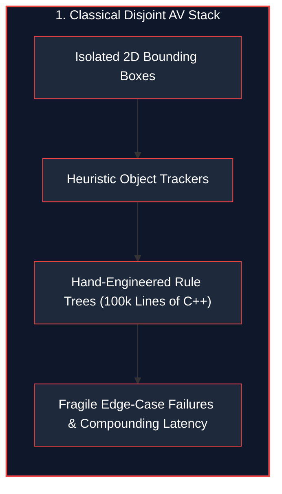
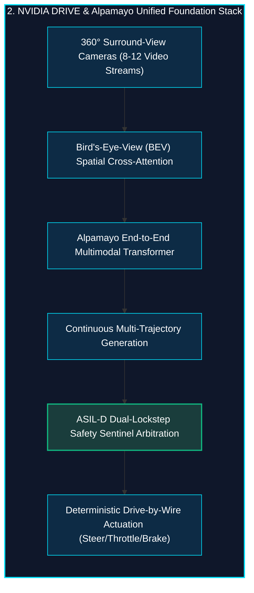
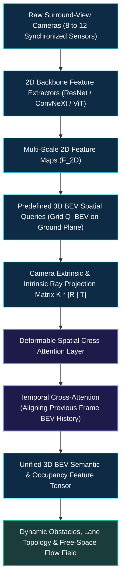
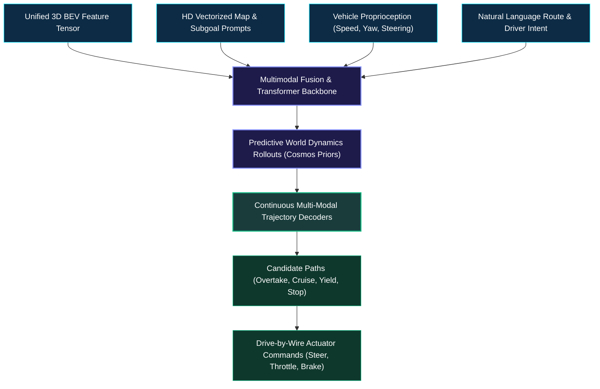
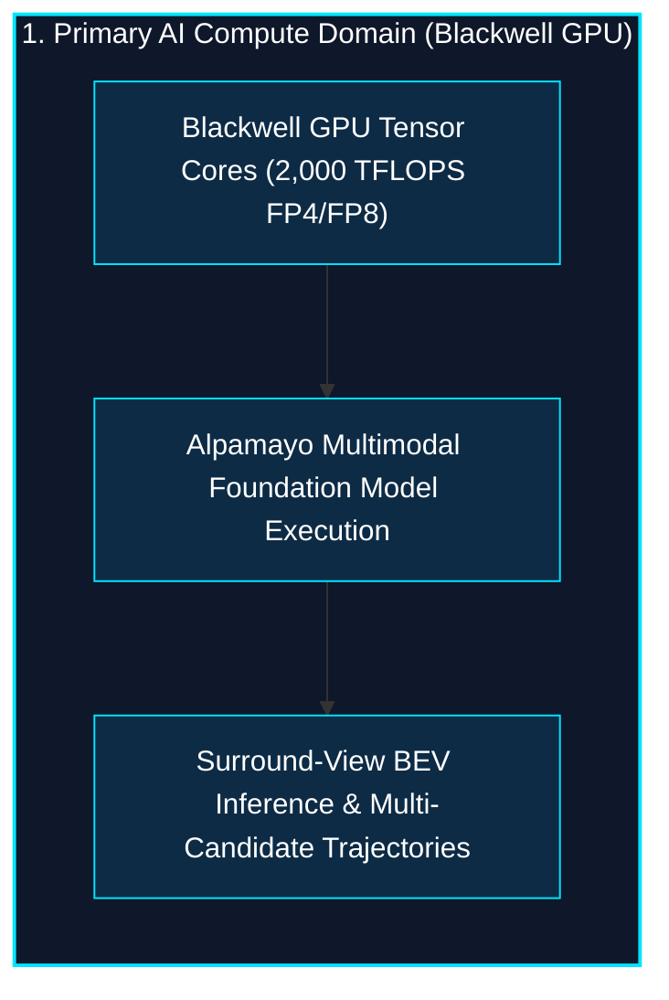
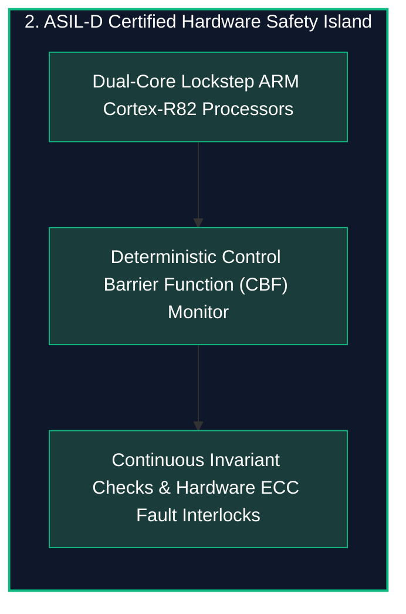
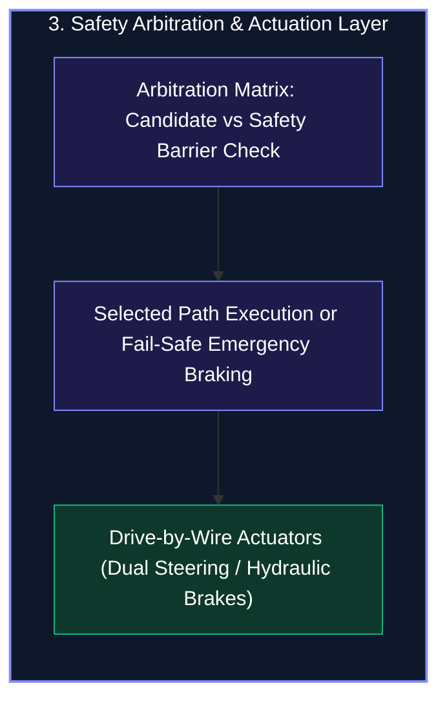

*Series: NVIDIA Physical AI & Robotics Ecosystem Series - Part 7*

*Series: &larr; [Part 6: Inside Project GR00T: Vision-Language-Action (VLA) Tokenization & Diffusion Action Heads](/blog/inside-project-gr00t-vla-diffusion-heads/) (Previous)*

### Prior Reading Material

Before exploring in-vehicle foundation models and autonomous drive actuation, inspect these foundational articles across our series:

* [Part 1: Unpacking the NVIDIA Physical AI Data Factory (PAIDF) Stack](/blog/unpacking-nvidia-paidf-physical-ai-stack/) — The complete synthetic-to-real Physical AI pipeline spanning Cosmos, Omniverse, Isaac Lab, and Jetson/DRIVE.
* [Part 2: Inside NVIDIA Cosmos](/blog/inside-nvidia-cosmos-world-foundation-models/) — World foundation models for physical commonsense, video prediction, and synthetic driving scenario generation.
* [Part 3: Unlocking NVIDIA Omniverse](/blog/unlocking-nvidia-omniverse-architecture/) — OpenUSD scene graphs, RTX real-time sensor ray tracing, and digital twin simulation.
* [Part 5: Scaling Physics with Isaac Sim & Omniverse Replicator](/blog/scaling-physics-isaac-sim-omniverse-replicator/) — Generating synthetic sensor data (RGB, Depth, LiDAR) with automated domain randomization.
* [Part 6: Inside Project GR00T](/blog/inside-project-gr00t-vla-diffusion-heads/) — Vision-Language-Action (VLA) tokenization and diffusion policy action heads for continuous physical control.
* [Part 9: The Evolutionary Arc of Computer Vision](/blog/evolutionary-arc-computer-vision-lenet-resnet-convnext-3d-video/) — From LeNet-5 and ResNet skip connections to ConvNeXt and 3D spatio-temporal video convolutions.

---

### NVIDIA DRIVE Thor & Alpamayo Foundation Model Architecture Summary

| Specification / Dimension | Details & Technical Parameters |
| :--- | :--- |
| **System-on-Chip (SoC)** | [NVIDIA DRIVE Thor / AGX](https://developer.nvidia.com/drive/agx) (Centralized Blackwell Automotive SoC) |
| **Reference Architecture** | [NVIDIA DRIVE Hyperion Platform](https://www.nvidia.com/en-us/solutions/autonomous-vehicles/drive-hyperion/) ([Global Robotaxi Reference Suite](https://nvidianews.nvidia.com/news/nvidia-drive-hyperion-becomes-the-global-platform-for-a-robotaxi-ready-world)) |
| **Compute Performance** | 1,000 to 2,000 TFLOPS (FP8 / FP4 Tensor Cores with Gen 5 NVLink-C2C) |
| **Foundation Model Stack** | **Alpamayo Foundation Models** (End-to-End Multimodal Vision-World-Trajectory Transformer) |
| **Perception Paradigm** | Surround-View 360° Multi-Camera Bird's-Eye-View (BEV) Transformer Fusion + Deformable Cross-Attention |
| **Simulation-to-Real Pipeline** | [NVIDIA DRIVE Sim / Omniverse](https://developer.nvidia.com/drive/drive-sim) synthetic sensor injection and closed-loop validation |
| **Functional Safety Rating** | ISO 26262 ASIL-D Certified, Dual Lockstep Sentinel Processors, Fail-Operational Hardware Redundancy |
| **Target Vehicle Deployments** | Level 4/5 Robotaxis, Commercial Trucking Fleets, and Next-Generation Software-Defined Consumer AVs |

---

## 1. The Story of the Chauffeur with 360° Vision and a Co-Pilot Sentinel

Imagine driving down a busy metropolitan avenue in heavy rain at dusk. A pedestrian steps out between two parked delivery vans on your left, a cyclist darts into your blind spot on your right, and an oncoming car makes an unprotected left turn across your path.

A human driver must rapidly dart their eyes between three mirrors and the windshield, constantly stitching fragmented visual glimpses into a mental map of where every object will move two seconds from now.





To solve autonomous mobility without brittle heuristic hand-coding, NVIDIA architected the **DRIVE & Alpamayo ecosystem** around two powerful concepts:

1. **The 360° Panoramic Room (Bird's-Eye-View Fusion)**:
   Instead of detecting isolated 2D bounding boxes in each separate camera frame, the vehicle projects all raw surround-view camera pixels into a continuous, top-down 3D ground plane called the **Bird's-Eye-View (BEV)** grid. Occlusions disappear because spatial cross-attention unifies all camera sightlines simultaneously.
2. **The Dual-Brain Cockpit (Neural Intelligence + ASIL-D Sentinel)**:
   The vehicle pairs a supercharged generative neural foundation model (**Alpamayo**) with an un-hackable, deterministic hardware guardrail (**DRIVE Thor ASIL-D Safety Island**). Alpamayo dreams up smooth, human-like navigation trajectories, while the ASIL-D sentinel continuously monitors physical collision boundaries and dynamic stability limits—guaranteeing safety even if an AI model encounters an out-of-distribution corner case.

---

## 2. Surround-View to Bird's-Eye-View (BEV) Transformer Fusion

In classical autonomous driving systems, perception ran independently on each camera: Front, Front-Left, Front-Right, Rear, and Sides. When an 18-wheel tractor-trailer spanned across both the front-center camera and the side-repeater camera, the perception pipeline treated it as two disjoint obstacles, producing jittering bounding boxes and erratic braking.

NVIDIA DRIVE eliminates this boundary fragmentation through **BEVFormer and Deformable Spatial Cross-Attention**:



### How Spatial Cross-Attention Works
1. **BEV Queries**: The model initializes a learnable 2D/3D grid of queries $Q_{\text{BEV}} \in \mathbb{R}^{H \times W \times C}$ representing a $100\text{m} \times 100\text{m}$ area centered around the ego-vehicle.
2. **Ray Probing**: For each query point $(x, y)$ on the ground plane, the system uses the known camera extrinsics (3D position and rotation $[R \mid T]$) and camera intrinsics (focal length $K$) to project a 3D ray back onto the image planes of all cameras that can see that point.
3. **Deformable Sampling**: Rather than computing dense attention over all image pixels (which would explode VRAM), deformable cross-attention samples a sparse set of $K$ reference points along the projection ray, pulling features directly into the BEV query cell.
4. **Temporal Self-Attention**: The current BEV representation is fused with the motion-compensated BEV representation from the previous time-step ($t-1$), giving the network instantaneous velocity vectors and occlusion memory for cars hidden behind buses.

---

## 3. Alpamayo: Multimodal End-to-End Autonomous Driving Foundation Models

Rather than splitting driving into dozens of fragile sub-modules (Lane Detection $\rightarrow$ Object Tracking $\rightarrow$ Behavior Prediction $\rightarrow$ Motion Planning), NVIDIA's **Alpamayo** foundation model family operates as an end-to-end multimodal reasoning engine:



### Why Generative Trajectory Planning Beats Heuristics
* **Multimodal Futures**: When approaching an ambiguous intersection, a rule-based system oscillates between stopping and going. Alpamayo generates multiple distinct probabilistic trajectory candidates (e.g., *Yield smoothly* vs. *Proceed behind cyclist*), scoring each path against safety, comfort, and route efficiency.
* **Physics Commonsense**: Grounded in NVIDIA Cosmos world foundation models ([Part 2](/blog/inside-nvidia-cosmos-world-foundation-models/)), Alpamayo understands physical cause-and-effect: splashing water creates temporary occlusion, snow banks reduce friction coefficients, and construction workers hold handheld stop signs.

---

## 4. Safety-Critical Hardware Redundancy: DRIVE Thor & ASIL-D Lockstep

Deploying massive 100-billion-parameter neural foundation models in a 2,000 kg vehicle traveling at 120 km/h requires uncompromising functional safety. If an operating system hangs or a neural network hallucinates, the vehicle must never lose steering or braking authority.

NVIDIA addresses this with **DRIVE Thor**, a centralized automotive compute platform delivering up to **2,000 TFLOPS of FP8/FP4 AI compute**:







### Safety Principles in the DRIVE Architecture
1. **Dual Lockstep Execution**: Safety-critical monitoring cores run the exact same instructions in cycle-by-cycle lockstep. If a cosmic ray or transistor glitch flips a bit, the comparator triggers an instantaneous hardware fault interrupt in less than 1 microsecond.
2. **Fail-Operational vs. Fail-Safe**:
   - **Fail-Operational**: If one camera or compute cluster experiences a degraded frame rate, the system seamlessly transitions to backup radar/camera streams without stopping the car.
   - **Fail-Safe**: If the primary neural model outputs a trajectory that breaches physical clearance invariants, the independent ASIL-D Safety Island overrides the planner and executes a smooth, deterministic lane-centering stop.

### NVIDIA DRIVE Hyperion: The Robotaxi-Ready Sensor & In-Vehicle Compute Platform

To transition autonomous architectures from prototype rigs to mass-manufactured commercial fleets, NVIDIA developed the [DRIVE Hyperion Platform](https://www.nvidia.com/en-us/solutions/autonomous-vehicles/drive-hyperion/) as a production-grade, [globally standardized reference architecture](https://nvidianews.nvidia.com/news/nvidia-drive-hyperion-becomes-the-global-platform-for-a-robotaxi-ready-world):

* **Standardized 360° Sensor Suite**: Integrates 12 exterior cameras, 9 millimeter-wave radars, 1 front/roof solid-state LiDAR, and 12 ultrasonic sensors into a unified, time-synchronized hardware topology.
* **Dual-SoC Redundant Compute**: Pairs dual centralized DRIVE Thor / Orin computing modules with isolated power supplies and CAN/Ethernet networks to eliminate single-point hardware failures.
* **Safety-Certified Data Pipelines**: Standardizes sensor data deserialization (GMSL2 / FPD-Link), camera calibration protocols, and real-time sensor ingestion directly into the Alpamayo BEV transformer models.

---


## 5. Engineering Deep-Dive: Mathematical Formulations

To understand how camera rays are projected into top-down grids and how trajectories are verified against physical barriers, we review the formal mathematics powering autonomous vehicle control.

### Mathematical Formulation 1: Multi-Camera 2D-to-BEV Coordinate Projection

Each 3D query point on the ground plane $P_{\text{ego}} = (X, Y, Z, 1)^T$ is mapped into pixel coordinates $(u, v)^T$ of camera $i$ using its extrinsic transformation matrix $[R_i \mid T_i]$ and intrinsic calibration matrix $K_i$:

$$s \begin{pmatrix} u \\ v \\ 1 \end{pmatrix} = K_i \begin{bmatrix} R_i & T_i \end{bmatrix} \begin{pmatrix} X \\ Y \\ Z \\ 1 \end{pmatrix}$$

Where:
* $K_i \in \mathbb{R}^{3 \times 3}$: Camera intrinsic matrix containing focal lengths $(f_x, f_y)$ and optical center $(c_x, c_y)$.
* $R_i \in \text{SO}(3), T_i \in \mathbb{R}^3$: Extrinsic rotation and translation expressing vehicle ego coordinates in camera frame $i$.
* $s$: Depth scale factor along the optical ray.

The spatial cross-attention feature for BEV query $Q_p$ at coordinate $p = (X, Y)$ is computed across all valid camera projections:

$$\text{BEV}(p) = \sum_{i=1}^{N_{\text{cam}}} \sum_{k=1}^{K_{\text{ref}}} \mathcal{W}_{i, k} \cdot F_{2D}^{(i)}\left( \mathcal{P}_i(p, z_k) \right)$$

Where $\mathcal{P}_i(p, z_k)$ projects ground query $p$ at elevation $z_k$ into camera $i$, and $\mathcal{W}_{i, k}$ represents the learned attention weights.

---

### Mathematical Formulation 2: Multi-Objective Trajectory Optimization

The Alpamayo trajectory generation engine optimizes a future waypoint sequence $\tau = \{ (x_t, y_t, v_t, \theta_t) \}_{t=1}^T$ across a prediction horizon $T$ by minimizing a composite cost function:

$$\mathcal{J}(\tau) = \lambda_{\text{track}} \mathcal{L}_{\text{track}}(\tau) + \lambda_{\text{comfort}} \mathcal{L}_{\text{comfort}}(\tau) + \lambda_{\text{safety}} \mathcal{L}_{\text{safety}}(\tau, \mathcal{O})$$

Where:
* **Tracking Loss**: $\mathcal{L}_{\text{track}}(\tau) = \sum_{t=1}^T \| y_t - y_t^{\text{goal}} \|^2$ penalizes deviation from the target lane center.
* **Comfort Loss**: $\mathcal{L}_{\text{comfort}}(\tau) = \sum_{t=1}^T \left( a_{\text{lat}, t}^2 + j_{\text{lon}, t}^2 \right)$ minimizes lateral acceleration and longitudinal jerk.
* **Safety Proximity Loss**: Penalizes intrusion into dynamic obstacle boundaries $\mathcal{O}$:

$$\mathcal{L}_{\text{safety}}(\tau, \mathcal{O}) = \sum_{t=1}^T \sum_{o \in \mathcal{O}} \max\left(0, d_{\text{safe}} - \| p_t - p_{o, t} \| \right)^2$$

---

### Mathematical Formulation 3: Control Barrier Functions (CBF) for ASIL-D Safety Invariants

To mathematically prove collision avoidance, the ASIL-D safety sentinel defines a safe state set $\mathcal{C} = \{ x \in \mathcal{X} \mid h(x) \ge 0 \}$ where $h(x)$ is a continuous differentiable barrier function measuring distance to obstacles:

$$\dot{h}(x, u) = \nabla h(x) \cdot f(x, u) \ge -\gamma(h(x))$$

Where:
* $h(x) = \| p_{\text{ego}} - p_{\text{obs}} \|^2 - d_{\text{min}}^2$
* $\gamma(\cdot)$ is an extended class-$\mathcal{K}$ function governing the allowable rate of approach.
* If any neural trajectory yields $\dot{h}(x, u) < -\gamma(h(x))$, the hardware sentinel rejects the command and enforces emergency decelerating control $u_{\text{fallback}}$.

---

## 6. Interactive Python Simulation

The zero-dependency Python script below simulates the end-to-end NVIDIA DRIVE and Alpamayo architecture:
1. Calibrates a 6-camera surround-view sensor suite and projects rays into a 2D ego-centric BEV occupancy grid.
2. Generates and scores multi-candidate trajectories (Overtake, Lane Keep, Deceleration, Lane Change).
3. Verifies each trajectory through an ISO 26262 ASIL-D Safety Sentinel with Control Barrier enforcement.
4. Renders a top-down ASCII Bird's-Eye-View map of the road environment and planned path.

<details><summary><b>Click to expand runnable Python simulation script</b></summary>

```python
#!/usr/bin/env python3
"""
NVIDIA DRIVE & Alpamayo Autonomous Vehicle Architecture Simulator
===================================================================
A standalone, zero-dependency Python simulation demonstrating:
1. Multi-Camera 360° Surround-View to Bird's-Eye-View (BEV) Spatial Transformation.
2. Alpamayo Foundation Model Multi-Candidate Trajectory Generation & Cost Evaluation.
3. ISO 26262 ASIL-D Safety Barrier Redundancy & Deterministic Emergency Fallback.
"""

import math
import random
from typing import List, Dict, Tuple, Optional

# ============================================================================
# 1. 360° SURROUND-VIEW CAMERA PROJECTION & BEV FUSION ENGINE
# ============================================================================

class CameraSensor:
    def __init__(self, name: str, yaw_deg: float, fov_deg: float, range_m: float):
        self.name = name
        self.yaw_rad = math.radians(yaw_deg)
        self.fov_rad = math.radians(fov_deg)
        self.range_m = range_m

    def project_to_bev(self, detected_u: float, detected_depth: float) -> Tuple[float, float]:
        """
        Projects a 2D camera detection (normalized horizontal coordinate u in [-1, 1], depth)
        into the 2D Ego-Centric Bird's-Eye-View (BEV) Cartesian frame (X_ego: forward, Y_ego: left).
        """
        ray_angle = self.yaw_rad + (detected_u * (self.fov_rad / 2.0))
        x_ego = detected_depth * math.cos(ray_angle)
        y_ego = detected_depth * math.sin(ray_angle)
        return x_ego, y_ego


class BEVOccupancyGrid:
    def __init__(self, x_bounds: Tuple[float, float], y_bounds: Tuple[float, float], resolution: float):
        self.x_min, self.x_max = x_bounds
        self.y_min, self.y_max = y_bounds
        self.res = resolution
        self.cols = int((self.x_max - self.x_min) / self.res)
        self.rows = int((self.y_max - self.y_min) / self.res)
        self.grid = [[0.0 for _ in range(self.cols)] for _ in range(self.rows)]

    def add_obstacle(self, x: float, y: float, radius: float, confidence: float):
        """Adds a probabilistic obstacle footprint to the BEV occupancy grid."""
        for r in range(self.rows):
            cell_y = self.y_min + (r + 0.5) * self.res
            for c in range(self.cols):
                cell_x = self.x_min + (c + 0.5) * self.res
                dist = math.hypot(cell_x - x, cell_y - y)
                if dist <= radius:
                    prob = confidence * math.exp(-0.5 * (dist / (radius + 1e-5)) ** 2)
                    self.grid[r][c] = max(self.grid[r][c], prob)

    def render_ascii_view(self, ego_x: float = 0.0, ego_y: float = 0.0, trajectory: Optional[List[Tuple[float, float]]] = None) -> str:
        """Renders a top-down ASCII Bird's Eye View map of the vehicle surroundings."""
        traj_cells = set()
        if trajectory:
            for tx, ty in trajectory:
                col = int((tx - self.x_min) / self.res)
                row = int((ty - self.y_min) / self.res)
                if 0 <= col < self.cols and 0 <= row < self.rows:
                    traj_cells.add((row, col))

        ego_c = int((ego_x - self.x_min) / self.res)
        ego_r = int((ego_y - self.y_min) / self.res)

        lines = []
        border = "+" + "-" * self.cols + "+"
        lines.append(border)

        for r in range(self.rows - 1, -1, -2):
            row_str = ["|"]
            for c in range(self.cols):
                if (r, c) == (ego_r, ego_c) or (r - 1, c) == (ego_r, ego_c):
                    row_str.append("🏎️")
                elif (r, c) in traj_cells or (r - 1, c) in traj_cells:
                    row_str.append("•")
                elif self.grid[r][c] > 0.6:
                    row_str.append("█")
                elif self.grid[r][c] > 0.2:
                    row_str.append("░")
                else:
                    row_str.append(" ")
            row_str.append("|")
            lines.append("".join(row_str))

        lines.append(border)
        return "\n".join(lines)


# ============================================================================
# 2. ALPAMAYO END-TO-END TRAJECTORY GENERATOR & COST EVALUATOR
# ============================================================================

class TrajectoryCandidate:
    def __init__(self, name: str, waypoints: List[Tuple[float, float, float]]):
        self.name = name
        self.waypoints = waypoints
        self.tracking_cost = 0.0
        self.comfort_cost = 0.0
        self.safety_cost = 0.0
        self.total_cost = 0.0
        self.is_valid = True


class AlpamayoPlanner:
    def __init__(self, horizon_sec: float = 4.0, dt: float = 0.5):
        self.horizon_sec = horizon_sec
        self.dt = dt
        self.steps = int(horizon_sec / dt)

    def generate_candidates(self, current_speed_mps: float, target_speed_mps: float) -> List[TrajectoryCandidate]:
        """Generates multi-modal trajectory candidate maneuvers."""
        candidates = []

        maneuvers = [
            ("Maintain Lane (Center)", 0.0, target_speed_mps, 0.0),
            ("Aggressive Left Overtake", 2.8, target_speed_mps * 1.1, 1.2),
            ("Conservative Left Nudge", 1.2, target_speed_mps * 0.9, 0.5),
            ("Right Lane Change", -3.2, target_speed_mps, -1.0),
            ("Comfortable Deceleration", 0.0, current_speed_mps * 0.5, 0.0),
        ]

        for name, max_lat_offset, target_v, lat_accel in maneuvers:
            waypoints = []
            x, y, v = 0.0, 0.0, current_speed_mps
            for step in range(1, self.steps + 1):
                t = step * self.dt
                progress = min(1.0, t / (self.horizon_sec * 0.6))
                s_curve = progress * progress * (3.0 - 2.0 * progress)
                y_step = max_lat_offset * s_curve
                
                v_step = current_speed_mps + (target_v - current_speed_mps) * (t / self.horizon_sec)
                x_step = x + v_step * self.dt
                x = x_step
                waypoints.append((x_step, y_step, v_step))

            candidates.append(TrajectoryCandidate(name, waypoints))

        return candidates

    def evaluate_costs(self, candidates: List[TrajectoryCandidate], obstacles: List[Dict[str, float]], target_y: float = 0.0):
        """Calculates multi-objective loss for each candidate trajectory."""
        for cand in candidates:
            # 1. Lateral lane tracking cost
            cand.tracking_cost = sum((wp[1] - target_y) ** 2 for wp in cand.waypoints) * 0.8

            # 2. Kinematic comfort cost (lateral jerk & speed variance)
            lat_jerks = 0.0
            for i in range(len(cand.waypoints) - 1):
                dy1 = cand.waypoints[i][1]
                dy2 = cand.waypoints[i + 1][1]
                lat_jerks += (dy2 - dy1) ** 2
            cand.comfort_cost = lat_jerks * 2.5

            # 3. Spatial Obstacle Proximity Cost
            cand.safety_cost = 0.0
            for wp_x, wp_y, _ in cand.waypoints:
                for obs in obstacles:
                    dist = math.hypot(wp_x - obs["x"], wp_y - obs["y"])
                    safety_margin = obs["radius"] + 1.8
                    if dist < safety_margin:
                        cand.safety_cost += (safety_margin - dist) * 150.0

            cand.total_cost = cand.tracking_cost + cand.comfort_cost + cand.safety_cost


# ============================================================================
# 3. ISO 26262 ASIL-D SAFETY BARRIER & REDUNDANCY SENTINEL
# ============================================================================

class ASILDSafetySentinel:
    def __init__(self, min_safe_distance_m: float = 1.8, max_allowable_lat_accel_g: float = 0.45):
        self.min_safe_dist = min_safe_distance_m
        self.max_lat_accel_mps2 = max_allowable_lat_accel_g * 9.81

    def verify_trajectory(self, trajectory: TrajectoryCandidate, obstacles: List[Dict[str, float]]) -> Tuple[bool, str]:
        """Independent deterministic safety invariant validation."""
        # Step 1: Kinematics Check
        for i in range(len(trajectory.waypoints) - 1):
            wp1 = trajectory.waypoints[i]
            wp2 = trajectory.waypoints[i + 1]
            dy = wp2[1] - wp1[1]
            dt = 0.5
            lat_v = dy / dt
            lat_a = abs(lat_v / dt)
            if lat_a > self.max_lat_accel_mps2:
                return False, f"Kinematic Violation: Lat Accel {lat_a:.2f} m/s² exceeds ASIL-D threshold {self.max_lat_accel_mps2:.2f} m/s²"

        # Step 2: Obstacle Spatial Boundary Check
        for wp_x, wp_y, _ in trajectory.waypoints:
            for obs in obstacles:
                dist = math.hypot(wp_x - obs["x"], wp_y - obs["y"])
                critical_threshold = obs["radius"] + self.min_safe_dist
                if dist < critical_threshold:
                    return False, f"Proximity Breach: Distance {dist:.2f}m < Safety Margin {critical_threshold:.2f}m to obstacle '{obs['name']}'"

        return True, "PASSED: Trajectory strictly compliant with ASIL-D safety invariants."

    def generate_fail_safe_fallback(self, current_speed_mps: float, steps: int = 8, dt: float = 0.5) -> TrajectoryCandidate:
        """Generates a deterministic emergency maximum comfort braking trajectory in the current lane."""
        waypoints = []
        x, y, v = 0.0, 0.0, current_speed_mps
        decel = 4.0
        for _ in range(steps):
            v = max(0.0, v - decel * dt)
            x += v * dt
            waypoints.append((x, y, v))
        return TrajectoryCandidate("ASIL-D Lockstep Fallback (Controlled Stop)", waypoints)


# ============================================================================
# 4. END-TO-END EXECUTION PIPELINE
# ============================================================================

def run_av_architecture_simulation():
    print("=" * 80)
    print("NVIDIA DRIVE & ALPAMAYO AUTONOMOUS VEHICLE ARCHITECTURE SIMULATOR")
    print("=" * 80)

    # 1. Setup 360° Sensor Suite
    cameras = [
        CameraSensor("Front-Center 120°", yaw_deg=0.0, fov_deg=120.0, range_m=120.0),
        CameraSensor("Front-Left 70°", yaw_deg=45.0, fov_deg=70.0, range_m=80.0),
        CameraSensor("Front-Right 70°", yaw_deg=-45.0, fov_deg=70.0, range_m=80.0),
        CameraSensor("Rear-Center 90°", yaw_deg=180.0, fov_deg=90.0, range_m=60.0),
        CameraSensor("Rear-Left 70°", yaw_deg=135.0, fov_deg=70.0, range_m=70.0),
        CameraSensor("Rear-Right 70°", yaw_deg=-135.0, fov_deg=70.0, range_m=70.0),
    ]

    print("\n[1] 360° SURROUND-VIEW SENSOR CALIBRATION MATRIX:")
    print("-" * 80)
    print(f"{'Camera Sensor':<22} | {'Yaw Angle':<12} | {'Field of View':<14} | {'Max Range (m)':<12}")
    print("-" * 80)
    for cam in cameras:
        print(f"{cam.name:<22} | {math.degrees(cam.yaw_rad):>6.1f}°      | {math.degrees(cam.fov_rad):>6.1f}°        | {cam.range_m:>6.1f} m")

    # 2. Build BEV Occupancy Grid and Populate Dynamic Environment
    bev = BEVOccupancyGrid(x_bounds=(-10.0, 50.0), y_bounds=(-12.0, 12.0), resolution=1.0)

    obstacles = [
        {"name": "Slow Cargo Truck (Center)", "x": 35.0, "y": 0.0, "radius": 2.0, "confidence": 0.98},
        {"name": "Cruising Sedan (Right Lane)", "x": 20.0, "y": -3.5, "radius": 1.5, "confidence": 0.95},
        {"name": "Highway Guardrail (Far Left)", "x": 40.0, "y": 6.0, "radius": 0.8, "confidence": 0.99},
    ]

    for obs in obstacles:
        bev.add_obstacle(obs["x"], obs["y"], obs["radius"], obs["confidence"])

    # 3. Alpamayo Multi-Candidate Trajectory Generation
    planner = AlpamayoPlanner(horizon_sec=4.0, dt=0.5)
    current_speed = 25.0  # 90 km/h
    target_speed = 25.0
    candidates = planner.generate_candidates(current_speed, target_speed)
    planner.evaluate_costs(candidates, obstacles, target_y=0.0)

    # Sort by total neural cost
    candidates.sort(key=lambda c: c.total_cost)

    print("\n[2] ALPAMAYO FOUNDATION MODEL CANDIDATE TRAJECTORY EVALUATION:")
    print("-" * 80)
    print(f"{'Candidate Maneuver':<30} | {'Tracking':<10} | {'Comfort':<9} | {'Safety Cost':<12} | {'Total Score':<10}")
    print("-" * 80)
    for c in candidates:
        print(f"{c.name:<30} | {c.tracking_cost:>8.2f} | {c.comfort_cost:>7.2f} | {c.safety_cost:>11.2f} | {c.total_cost:>10.2f}")

    # 4. ASIL-D Safety Sentinel Verification
    sentinel = ASILDSafetySentinel(min_safe_distance_m=1.8, max_allowable_lat_accel_g=0.45)
    print("\n[3] ISO 26262 ASIL-D DUAL-LOCKSTEP SAFETY SENTINEL ARBITRATION:")
    print("-" * 80)

    selected_trajectory = None
    for cand in candidates:
        passed, reason = sentinel.verify_trajectory(cand, obstacles)
        status_tag = "✅ VALID" if passed else "❌ REJECTED"
        print(f"• Candidate '{cand.name}': {status_tag}")
        print(f"  Reason: {reason}")
        if passed and selected_trajectory is None:
            selected_trajectory = cand

    if selected_trajectory is None:
        print("\n⚠️ ALL NEURAL CANDIDATES REJECTED! Triggering ASIL-D Fail-Safe Emergency Trajectory...")
        selected_trajectory = sentinel.generate_fail_safe_fallback(current_speed)

    print(f"\n🏆 FINAL ARBITRATED ACTION: {selected_trajectory.name}")
    print(f"  Waypoints (X forward, Y lateral, Velocity m/s):")
    for i, (wx, wy, wv) in enumerate(selected_trajectory.waypoints):
        print(f"    t={i*0.5+0.5:.1f}s: X={wx:>5.1f}m, Y={wy:>5.2f}m, V={wv*3.6:>5.1f} km/h")

    # 5. Top-Down Bird's-Eye-View (BEV) ASCII Map
    print("\n[4] UNIFIED BIRD'S-EYE-VIEW (BEV) OCCUPANCY GRID & TRAJECTORY OVERLAY:")
    print("Legend: 🏎️ Ego Vehicle | █ Dense Obstacle | ░ Probabilistic Margin | • Planned Path")
    bev_traj = [(wx, wy) for wx, wy, _ in selected_trajectory.waypoints]
    print(bev.render_ascii_view(ego_x=0.0, ego_y=0.0, trajectory=bev_traj))
    print("=" * 80)


if __name__ == "__main__":
    run_av_architecture_simulation()
```

</details>

---

## 7. Conclusion: The Physical AI Continuum from Simulation to Streets

The evolution from brittle rule-based ADAS to foundation-model-driven autonomous vehicles exemplifies the full **Physical AI Data Factory (PAIDF)** loop:

1. **Omniverse & Isaac Sim ([Part 3](/blog/unlocking-nvidia-omniverse-architecture/) & [Part 5](/blog/scaling-physics-isaac-sim-omniverse-replicator/))**: Billions of photorealistic edge-case miles, rainy highway merges, and sensor occlusions are synthesized on GPU clusters without endangering real vehicles.
2. **Cosmos World Foundation Models ([Part 2](/blog/inside-nvidia-cosmos-world-foundation-models/))**: Teach models the fundamental physical dynamics of moving traffic, pedestrian intent, and collision consequences.
3. **DRIVE Thor & Alpamayo In-Vehicle Deployment**: Real-time surround-view BEV cross-attention fused with 2,000 TFLOPS of Blackwell automotive compute translates world understanding into smooth, millisecond-latency trajectory decisions, verified by ASIL-D lockstep hardware guardrails.

By bridging synthetic simulation, multimodal transformers, and safety-certified silicon, autonomous driving transitions from experimental prototypes to dependable everyday transport.
