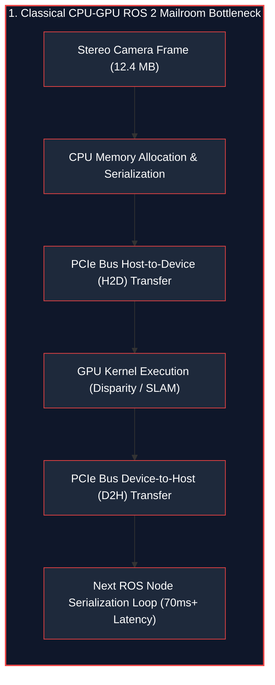
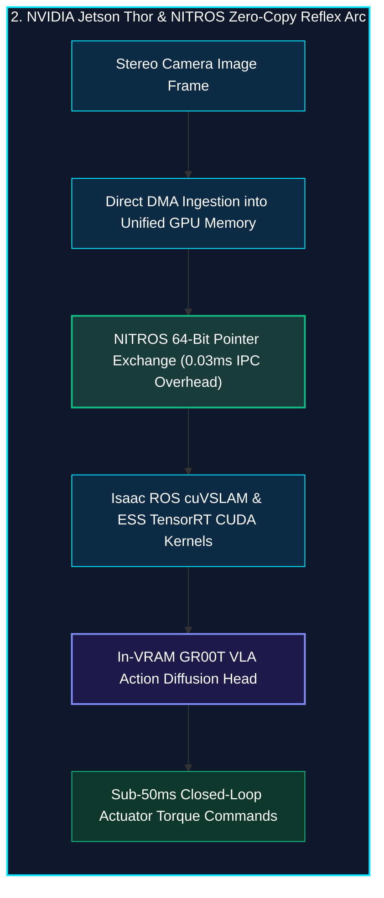
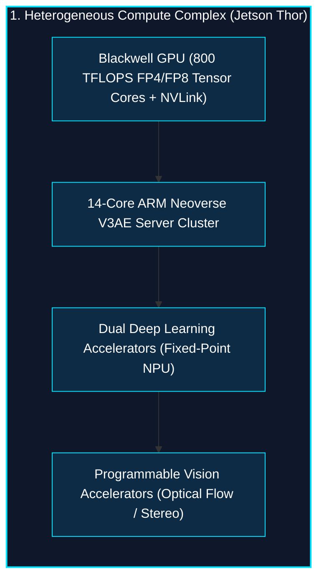
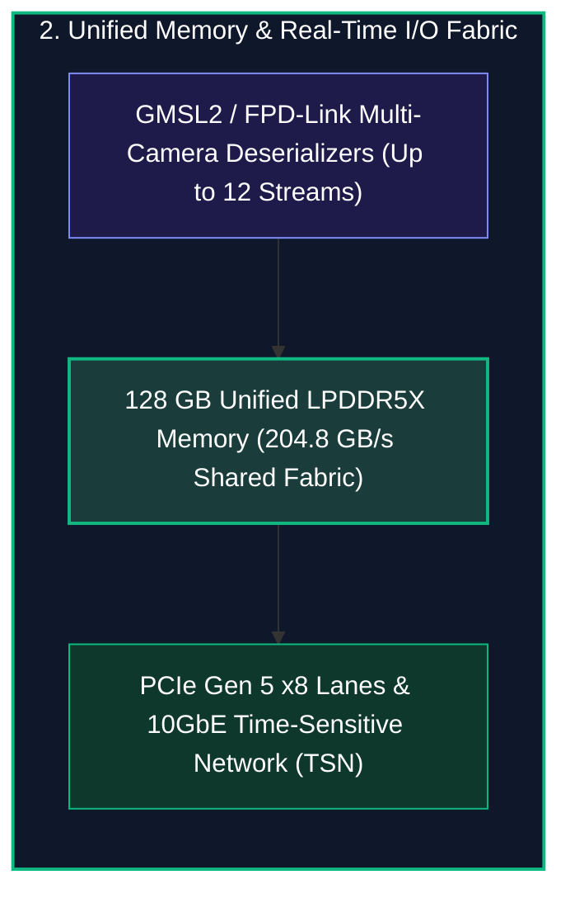
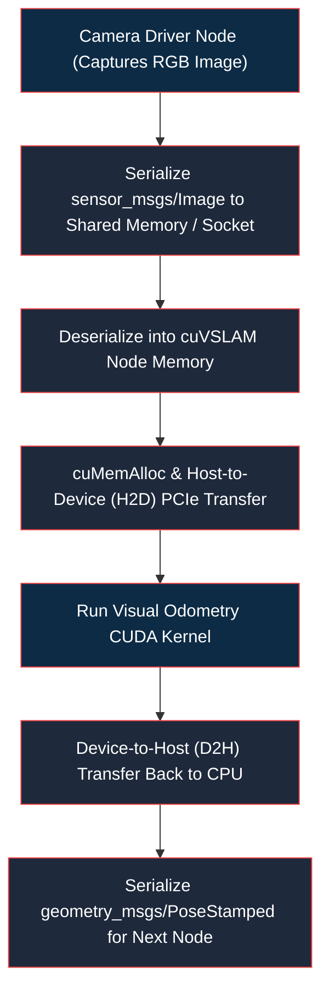
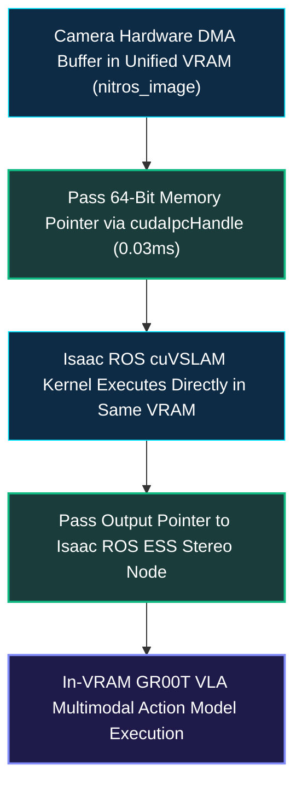
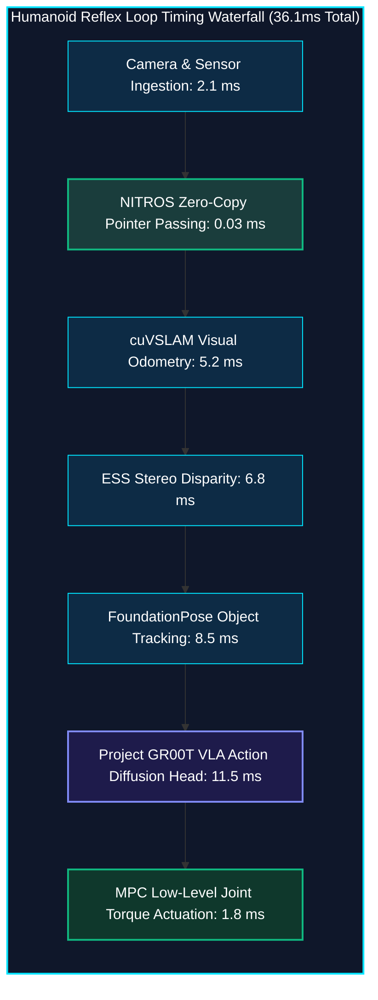

*Series: NVIDIA Physical AI & Robotics Ecosystem Series - Part 8*

*Series: &larr; [Part 7: From Simulation to Streets: NVIDIA DRIVE & Alpamayo Autonomous Vehicle Architecture](/blog/from-simulation-to-streets-nvidia-drive-alpamayo-av-architecture/) (Previous)*

### Prior Reading Material

Before exploring edge silicon acceleration and zero-copy robotics middleware, inspect these foundational articles across our series:

* [Part 1: Unpacking the NVIDIA Physical AI Data Factory (PAIDF) Stack](/blog/unpacking-nvidia-paidf-physical-ai-stack/) — The end-to-end framework uniting Cosmos, Omniverse, Isaac Sim, and Jetson edge deployment.
* [Part 5: Scaling Physics with Isaac Sim & Omniverse Replicator](/blog/scaling-physics-isaac-sim-omniverse-replicator/) — Massively parallel GPU dynamics, synthetic sensor synthesis, and Sim-to-Real transfer.
* [Part 6: Inside Project GR00T](/blog/inside-project-gr00t-vla-diffusion-heads/) — Vision-Language-Action (VLA) tokenization and diffusion policy action heads for humanoid motor control.
* [Part 7: From Simulation to Streets: NVIDIA DRIVE & Alpamayo Autonomous Vehicle Architecture](/blog/from-simulation-to-streets-nvidia-drive-alpamayo-av-architecture/) — Surround-view Bird's-Eye-View (BEV) transformer fusion and ASIL-D functional safety.
* [Google DeepMind's Gemini Robotics ER 2](/blog/0070-google-deepmind-gemini-robotics-er-2/) — Decoupling high-level multimodal reasoning from real-time low-level VLA motor execution.
* [Part 9: The Evolutionary Arc of Computer Vision](/blog/evolutionary-arc-computer-vision-lenet-resnet-convnext-3d-video/) — Convolutional feature extractors, ResNet skip connections, and spatial 3D vision.

---

### NVIDIA Jetson Thor & Isaac ROS Hardware Architecture Summary

| Specification / Dimension | Details & Technical Parameters |
| :--- | :--- |
| **Edge System-on-Chip (SoC)** | [NVIDIA Jetson Thor](https://www.nvidia.com/en-us/autonomous-machines/embedded-systems/jetson-thor/) (Compact Blackwell Robotics Module) |
| **AI Compute Throughput** | Up to **800 TFLOPS** (FP8 / FP4 Tensor Cores with Gen 5 NVLink-C2C) |
| **CPU Complex** | 14-core ARM Neoverse V3AE (Automotive Enhanced 64-bit Server Cores) |
| **Unified Memory Subsystem** | 128 GB LPDDR5X (204.8 GB/s High-Bandwidth Unified Physical Memory) |
| **Robotics Middleware** | [NVIDIA Isaac ROS](https://developer.nvidia.com/isaac-ros) (ROS 2 Humble / Jazzy Hardware-Accelerated GEMs) |
| **Zero-Copy IPC Transport** | **NITROS** (NVIDIA Isaac Transport for ROS via `cudaIpcMemHandle_t` pointer exchange) |
| **Thermal Power Envelope** | 40W to 100W Configurable TDP (Designed for Untethered Humanoid Robots & Mobile AMRs) |

---

## 1. The Story of the Human Reflex Arc vs. The Mailroom Bottleneck

When you accidentally touch a red-hot stove, your hand pulls back in under 30 milliseconds—long before your conscious brain even registers pain. This lightning-fast reaction happens because your body utilizes a localized **Spinal Reflex Arc**: high-bandwidth sensory nerves bypass bureaucratic brain loops to trigger motor neurons directly.

In classical robotics software, however, every sensor reading is forced through an inefficient corporate **Mailroom**:





When high-resolution stereo cameras (2x 1080p @ 60 FPS) generate hundreds of megabytes per second, transferring tensors back and forth across the system memory bus creates an insurmountable bottleneck. By the time a humanoid robot's CPU finishes serializing message packets, the robot has already tipped past its center of mass and fallen over.

To give humanoid robots human-like balance and reflexes, NVIDIA engineered **Jetson Thor** and **Isaac ROS NITROS**, creating a hardware-accelerated, zero-copy neural reflex arc.

---

## 2. NVIDIA Jetson Thor SoC: Silicon Built for Embodied AI

Running multimodal foundation models like Project GR00T ([Part 6](/blog/inside-project-gr00t-vla-diffusion-heads/)) and real-time visual odometry simultaneously on a bipedal robot requires data-center AI performance packed into a 50-watt battery budget.

**NVIDIA Jetson Thor** achieves this through a tightly integrated System-on-Chip (SoC) architecture:





### Key Silicon Innovations in Jetson Thor
1. **Blackwell FP4/FP8 Tensor Cores**: Delivers 800 TFLOPS of generative AI compute, enabling real-time diffusion denoising action heads to execute in under 12 milliseconds directly on-device.
2. **Unified Memory Architecture (UMA)**: The ARM CPU complex, Blackwell GPU, and hardware Vision Accelerators share a single contiguous 128 GB LPDDR5X memory pool, eliminating costly host-to-device memory copies.
3. **Hardware Optical Flow & Stereo Engines**: Dedicated silicon accelerators compute dense optical flow and pixel-level disparity without consuming main GPU shader cycles.

---

## 3. Isaac ROS & NITROS: Eliminating the Serialization Tax

The Robot Operating System (ROS 2) is the global standard for robotics software, organizing robot capabilities into modular communicating processes called **Nodes**.

However, standard ROS 2 introduces severe serialization overhead:



### The NITROS Solution (NVIDIA Isaac Transport for ROS)
**NITROS** replaces standard message passing with **Type Adaptation** and **Zero-Copy IPC**:



Because image and point cloud tensors never leave GPU memory, data copy overhead drops to **zero**, reducing inter-node transmission time from over **15 milliseconds to under 30 microseconds**.

### Essential Hardware-Accelerated Isaac ROS GEMs
* **`isaac_ros_visual_slam` (cuVSLAM)**: High-precision real-time visual inertial odometry delivering sub-centimeter localization at over 60 FPS while consuming less than 10% GPU load.
* **`isaac_ros_ess` (Stereo Disparity)**: Deep-learning-based disparity estimation network trained in Isaac Sim ([Part 5](/blog/scaling-physics-isaac-sim-omniverse-replicator/)), providing dense 3D depth maps even on untextured surfaces and glare.
* **`isaac_ros_foundationpose`**: Real-time 6D object pose tracking and 3D bounding box estimation for robotic grasping without CAD retraining.

---

## 4. The Sub-50ms Humanoid Reflex Latency Budget

To maintain upright balance on uneven terrain, a humanoid robot's control loop must operate within a strict **Dynamic Stability Horizon ($\tau \le 50\text{ms}$)**:



When running non-accelerated CPU nodes, cumulative latency swells to **73.5 ms (13.6 Hz)**. At 13 Hz, control corrections arrive too late, inducing resonant oscillations that destabilize the robot.

With Jetson Thor and Isaac ROS NITROS, total end-to-end loop latency drops to **36.1 ms (27.7 Hz)**, comfortably inside the critical 50ms stability window and ensuring agile, rock-solid physical balance.

---

## 5. Engineering Deep-Dive: Mathematical Formulations

To understand how hardware zero-copy memory transport and visual odometry algorithms operate at the silicon level, we review the formal mathematical formulations.

### Mathematical Formulation 1: Zero-Copy Memory Bandwidth Conservation

In standard ROS 2 pipelines with $N$ nodes passing tensor $D$ of size $S_{\text{tensor}}$ across the system memory bus, total inter-process memory copy time $T_{\text{copy}}$ is governed by:

$$T_{\text{copy}} = \sum_{k=1}^{N-1} \left( \frac{2 \cdot S_{\text{tensor}}}{\text{BW}_{\text{host}}} + \frac{S_{\text{tensor}}}{\text{BW}_{\text{H2D}}} + \frac{S_{\text{tensor}}}{\text{BW}_{\text{D2H}}} \right)$$

Where:
* $\text{BW}_{\text{host}}$: CPU memory bandwidth ($~32\text{ GB/s}$).
* $\text{BW}_{\text{H2D}}, \text{BW}_{\text{D2H}}$: PCIe bus bandwidth ($~16\text{ GB/s}$).

Under Isaac ROS NITROS with Unified Physical Address space $P_{\text{CUDA}}$, all nodes reference the exact same memory allocation:

$$T_{\text{NITROS}} = \sum_{k=1}^{N-1} \frac{\text{sizeof}(\text{cudaIpcHandle})}{\text{BW}_{\text{register}}} \approx \sum_{k=1}^{N-1} \frac{64\text{ bytes}}{\text{BW}_{\text{register}}} \to 0.03\text{ ms}$$

Resulting in a near $100\times$ reduction in IPC overhead and zero bus saturation.

---

### Mathematical Formulation 2: cuVSLAM Bundle Adjustment & Reprojection Loss

Isaac ROS cuVSLAM tracks 6-DoF robot poses $T_j \in \text{SE}(3)$ and 3D landmark points $X_i \in \mathbb{R}^3$ by solving non-linear least-squares bundle adjustment over a sliding temporal window:

$$\min_{X_i, T_j} \sum_{j \in \mathcal{F}} \sum_{i \in \mathcal{K}_j} \rho\left( \left\| p_{ij} - \pi(K, T_j, X_i) \right\|_{\Sigma_{ij}}^2 \right) + \sum_{k \in \mathcal{I}} \left\| e_{\text{IMU}}^{(k)} \right\|_{\Sigma_{\text{IMU}}}^2$$

Where:
* $\pi(K, T_j, X_i) = K \begin{bmatrix} R_j & t_j \end{bmatrix} X_i$: Camera pinhole projection model.
* $p_{ij}$: Observed 2D feature keypoint in frame $j$.
* $\rho(\cdot)$: Huber robust loss function mitigating outlier feature matches.
* $e_{\text{IMU}}^{(k)}$: Pre-integrated visual-inertial odometry error residual.

Jetson Thor's Blackwell Tensor Cores and CUDA warp-level matrix solvers accelerate the sparse Levenberg-Marquardt optimizer, completing full bundle adjustment in under $5.2\text{ ms}$.

---

### Mathematical Formulation 3: Humanoid Zero-Moment Point (ZMP) Stability Bound

For a humanoid robot of center-of-mass height $z_c$ under gravity $g$, the natural frequency of inverted pendulum dynamics is given by $\omega_0 = \sqrt{\frac{g}{z_c}}$.

The maximum permissible perception-to-actuation control loop latency $\tau_{\text{feedback}}$ to prevent tipping is strictly bounded by:

$$\tau_{\text{feedback}} \le \frac{1}{\omega_0} \ln\left( 1 + \frac{\Delta x_{\text{support}}}{z_c \cdot \theta_{\text{max}}} \right) \approx 50\text{ ms}$$

Where:
* $\Delta x_{\text{support}}$: Half-width of the robot's foot support polygon ($~0.08\text{m}$).
* $\theta_{\text{max}}$: Maximum recoverable tilt angle before unrecoverable angular momentum builds.

Maintaining $\tau_{\text{feedback}} = 36.1\text{ ms} < 50\text{ ms}$ guarantees continuous balance restoration before angular momentum exceeds actuator torque limits.

---

## 6. Interactive Python Simulation

The zero-dependency Python script below simulates the end-to-end humanoid perception-to-action graph, comparing standard ROS 2 memory serialization against NVIDIA Isaac ROS NITROS zero-copy IPC:

<details><summary><b>Click to expand runnable Python simulation script</b></summary>

```python
#!/usr/bin/env python3
"""
NVIDIA Jetson Thor & Isaac ROS Hardware Acceleration Simulator
================================================================
A standalone, zero-dependency Python simulation demonstrating:
1. End-to-end Humanoid Perception-to-Action Robotics Pipeline.
2. Standard ROS 2 (CPU-GPU Host Copy) vs. NVIDIA Isaac ROS NITROS (Zero-Copy CUDA IPC).
3. Sub-50ms Reflex Latency Budget & Dynamic Balance Stability Analysis.
"""

import math
import time
from typing import List, Dict, Tuple

# ============================================================================
# 1. ROBOTIC PIPELINE NODE DEFINITIONS
# ============================================================================

class PipelineNode:
    def __init__(self, name: str, compute_time_gpu_ms: float, input_tensor_mb: float, is_gpu_accelerated: bool):
        self.name = name
        self.gpu_compute_ms = compute_time_gpu_ms
        self.tensor_size_mb = input_tensor_mb
        self.is_gpu_accelerated = is_gpu_accelerated

    def simulate_standard_ros2(self, pcie_bandwidth_gbps: float = 16.0, cpu_copy_bandwidth_gbps: float = 32.0) -> Dict[str, float]:
        """Simulates standard ROS 2 host-device memory serialization copy."""
        cpu_copy_time_ms = (self.tensor_size_mb / 1024.0) / cpu_copy_bandwidth_gbps * 1000.0 * 2.0
        h2d_transfer_ms = (self.tensor_size_mb / 1024.0) / pcie_bandwidth_gbps * 1000.0
        d2h_transfer_ms = (self.tensor_size_mb / 1024.0) / pcie_bandwidth_gbps * 1000.0 if self.is_gpu_accelerated else 0.0

        ipc_overhead_ms = cpu_copy_time_ms + h2d_transfer_ms + d2h_transfer_ms
        compute_ms = self.gpu_compute_ms if self.is_gpu_accelerated else self.gpu_compute_ms * 3.5
        total_ms = ipc_overhead_ms + compute_ms

        return {
            "ipc_overhead_ms": ipc_overhead_ms,
            "compute_ms": compute_ms,
            "total_ms": total_ms,
            "bytes_copied_mb": self.tensor_size_mb * 3.0,
        }

    def simulate_nitros_zero_copy(self) -> Dict[str, float]:
        """Simulates NVIDIA Isaac ROS NITROS Zero-Copy CUDA IPC."""
        ipc_overhead_ms = 0.03
        compute_ms = self.gpu_compute_ms
        total_ms = ipc_overhead_ms + compute_ms

        return {
            "ipc_overhead_ms": ipc_overhead_ms,
            "compute_ms": compute_ms,
            "total_ms": total_ms,
            "bytes_copied_mb": 0.0,
        }


# ============================================================================
# 2. FULL ROBOTIC PIPELINE BENCHMARK
# ============================================================================

def run_jetson_ros_simulation():
    print("=" * 85)
    print("NVIDIA JETSON THOR & ISAAC ROS HARDWARE ACCELERATION BENCHMARK")
    print("=" * 85)

    nodes = [
        PipelineNode("1. Stereo Camera Ingestion (2x 1080p RGB-D)", compute_time_gpu_ms=2.1, input_tensor_mb=12.4, is_gpu_accelerated=True),
        PipelineNode("2. Visual SLAM (Standard CPU vs. cuVSLAM)", compute_time_gpu_ms=5.2, input_tensor_mb=12.4, is_gpu_accelerated=False),
        PipelineNode("3. Stereo Disparity (OpenCV vs. cuStereo/ESS)", compute_time_gpu_ms=6.8, input_tensor_mb=12.4, is_gpu_accelerated=False),
        PipelineNode("4. 6D Object Pose (FoundationPose TensorRT)", compute_time_gpu_ms=8.5, input_tensor_mb=8.0, is_gpu_accelerated=True),
        PipelineNode("5. Project GR00T VLA Action Diffusion Head", compute_time_gpu_ms=11.5, input_tensor_mb=4.2, is_gpu_accelerated=True),
        PipelineNode("6. MPC Low-Level Actuator Trajectory Solver", compute_time_gpu_ms=1.8, input_tensor_mb=0.5, is_gpu_accelerated=True),
    ]

    print("\n[1] PIPELINE STAGES & TENSOR PAYLOADS (Humanoid Reflex Graph):")
    print("-" * 85)
    print(f"{'Pipeline Node':<45} | {'Tensor (MB)':<12} | {'GPU Compute (ms)':<15}")
    print("-" * 85)
    for n in nodes:
        print(f"{n.name:<45} | {n.tensor_size_mb:>9.1f} MB | {n.gpu_compute_ms:>13.1f} ms")

    std_results = [n.simulate_standard_ros2() for n in nodes]
    nitros_results = [n.simulate_nitros_zero_copy() for n in nodes]

    std_total_time = sum(r["total_ms"] for r in std_results)
    std_ipc_time = sum(r["ipc_overhead_ms"] for r in std_results)
    std_data_copied = sum(r["bytes_copied_mb"] for r in std_results)

    nitros_total_time = sum(r["total_ms"] for r in nitros_results)
    nitros_ipc_time = sum(r["ipc_overhead_ms"] for r in nitros_results)
    nitros_data_copied = sum(r["bytes_copied_mb"] for r in nitros_results)

    print("\n[2] END-TO-END LATENCY WATERFALL BREAKDOWN:")
    print("-" * 85)
    print(f"{'Pipeline Node':<40} | {'Std ROS 2 (ms)':<16} | {'Isaac ROS NITROS (ms)':<20}")
    print("-" * 85)
    for i, n in enumerate(nodes):
        s_t = std_results[i]["total_ms"]
        n_t = nitros_results[i]["total_ms"]
        speedup = s_t / n_t
        print(f"{n.name:<40} | {s_t:>12.2f} ms | {n_t:>14.2f} ms ({speedup:.1f}x)")

    print("-" * 85)
    print(f"{'TOTAL END-TO-END LOOP LATENCY':<40} | {std_total_time:>12.2f} ms | {nitros_total_time:>14.2f} ms ({std_total_time/nitros_total_time:.2f}x)")
    print(f"{'TOTAL INTER-PROCESS COPY OVERHEAD':<40} | {std_ipc_time:>12.2f} ms | {nitros_ipc_time:>14.2f} ms")
    print(f"{'MEMORY TRANSFERRED PER LOOP':<40} | {std_data_copied:>12.1f} MB | {nitros_data_copied:>14.1f} MB")

    target_stability_limit_ms = 50.0
    max_hz_std = 1000.0 / std_total_time
    max_hz_nitros = 1000.0 / nitros_total_time

    print("\n[3] HUMANOID BALANCE & REAL-TIME REFLEX FEASIBILITY:")
    print("-" * 85)
    print(f"• Dynamic Stability Horizon Limit: < {target_stability_limit_ms:.1f} ms (Min 20 Hz closed-loop reaction)")
    print(f"• Standard ROS 2 Pipeline:       {std_total_time:.2f} ms ({max_hz_std:.1f} Hz) -> ❌ UNSTABLE (Loop lag induces falling)")
    print(f"• Isaac ROS NITROS on Thor:      {nitros_total_time:.2f} ms ({max_hz_nitros:.1f} Hz) -> ✅ STABLE (Instantaneous reflex authority)")

    print("\n[4] VISUAL LATENCY COMPARISON:")
    print("-" * 85)
    bar_scale = 1.2
    std_bars = "█" * int(std_total_time * bar_scale)
    nitros_bars = "█" * int(nitros_total_time * bar_scale)
    limit_bars = "│" + " " * int(target_stability_limit_ms * bar_scale - 1) + "⚠️ 50ms Critical Limit"

    print(f"Std ROS 2   : [{std_bars}] {std_total_time:.1f} ms")
    print(f"Isaac ROS   : [{nitros_bars}] {nitros_total_time:.1f} ms")
    print(f"Threshold   :  {limit_bars}")
    print("=" * 85)


if __name__ == "__main__":
    run_jetson_ros_simulation()
```

</details>

---

## 7. Conclusion: The Edge Physical AI Frontier

The convergence of **NVIDIA Jetson Thor** and **Isaac ROS** marks a pivotal milestone in Embodied AI:

1. **Silicon Specialization**: Blackwell Tensor Cores deliver 800 TFLOPS of generative foundation model compute within an energy envelope suited for untethered humanoid operation.
2. **Zero-Copy Middleware**: NITROS eliminates the CPU serialization bottleneck, transforming ROS 2 from a high-latency mailroom into a sub-millisecond reflex network.
3. **From Simulation to the Edge**: Models trained across thousands of parallel Isaac Sim environments ([Part 5](/blog/scaling-physics-isaac-sim-omniverse-replicator/)) deploy seamlessly to physical Jetson Thor hardware with zero architectural redesign.

By uniting high-throughput foundation models with sub-50ms reflex loops, Physical AI machines achieve the cognitive depth to understand human instructions and the physical agility to navigate the real world safely.
