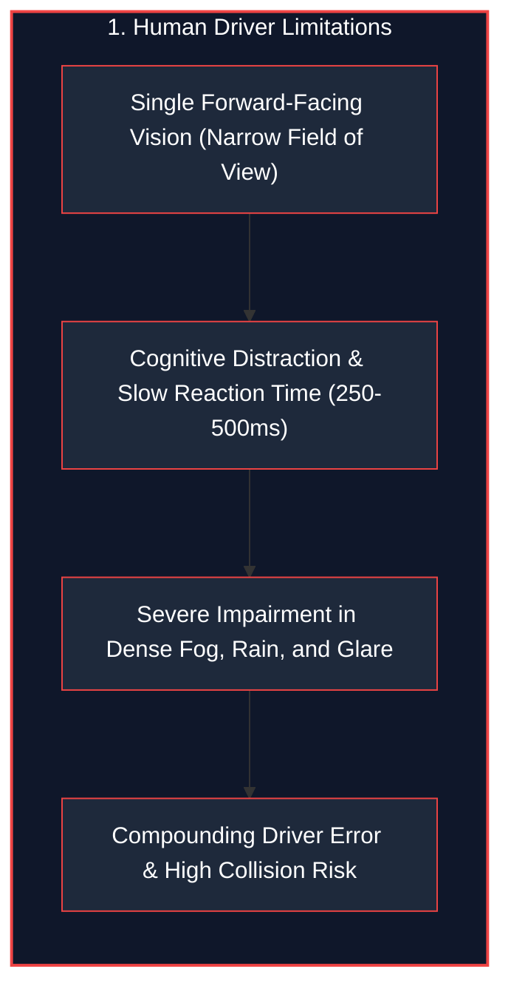
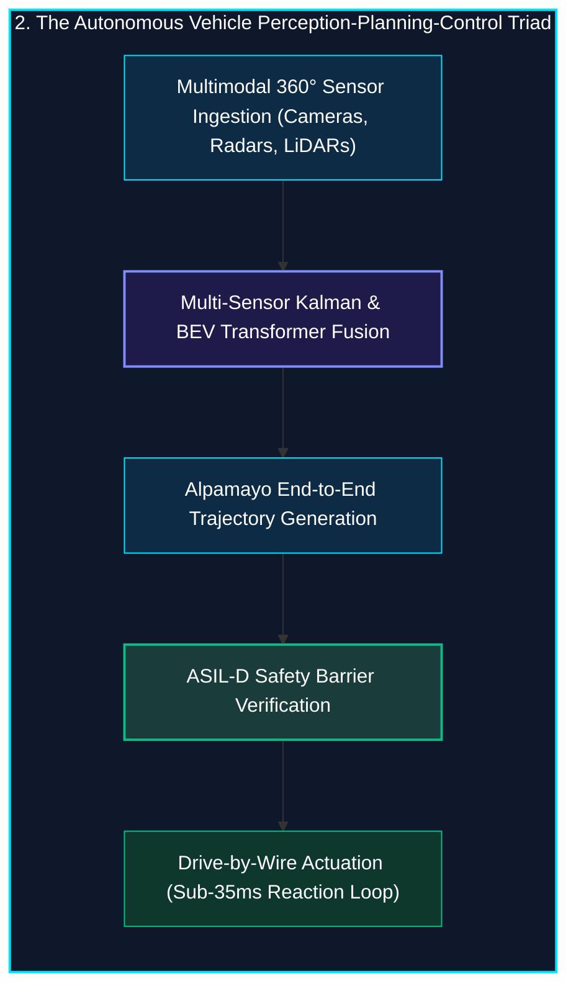
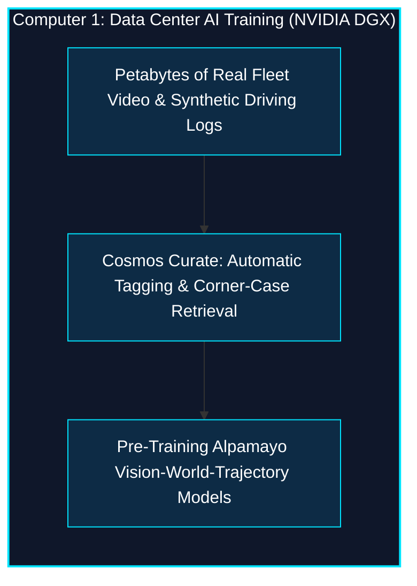
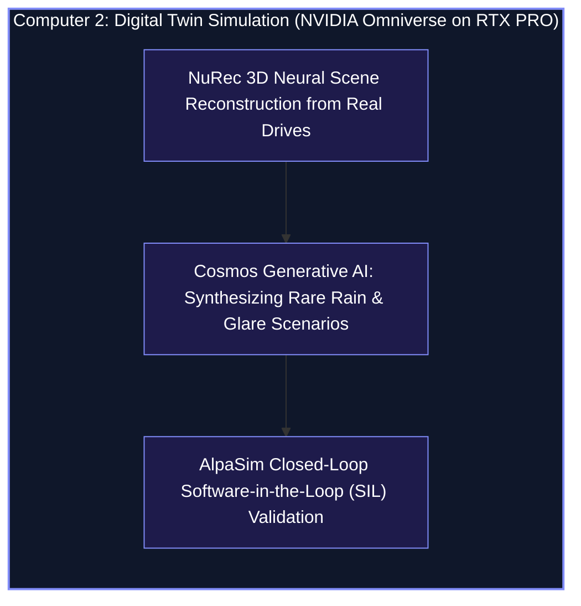
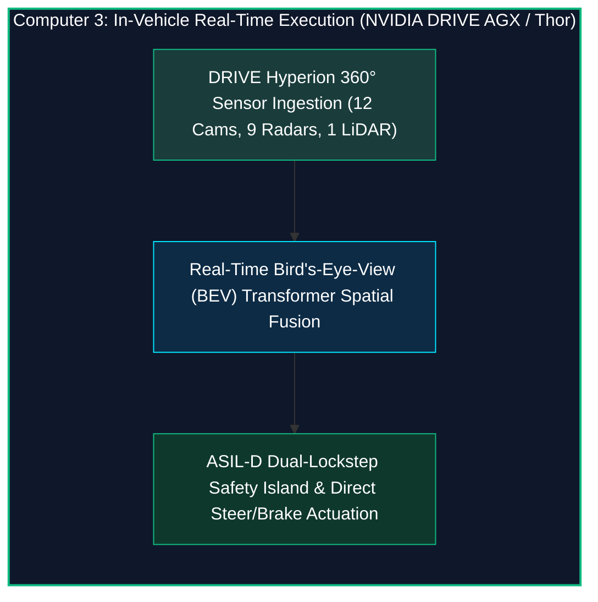
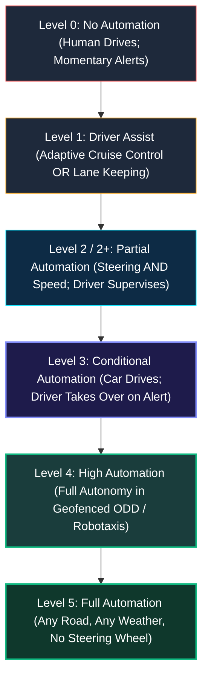
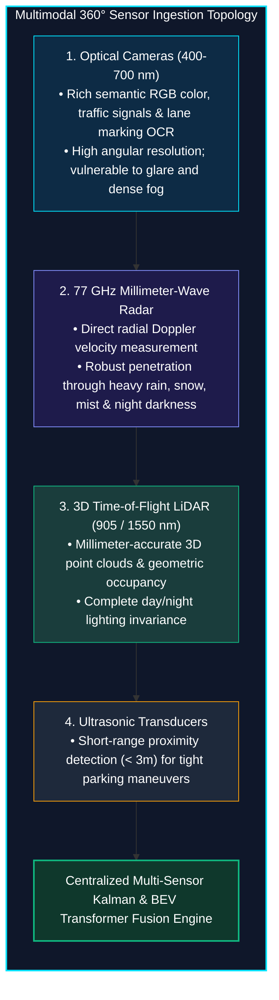

*Series: NVIDIA Physical AI & Robotics Ecosystem Series - Part 9*

*Series: &larr; [Part 8: Silicon at the Edge: NVIDIA Jetson Thor Architecture & Isaac ROS Acceleration](/blog/silicon-at-the-edge-nvidia-jetson-thor-isaac-ros/) (Previous)*

### Prior Reading Material

Before exploring autonomous vehicle foundations and multi-sensor fusion paradigms, inspect these foundational articles across our series:

* [Part 1: Unpacking the NVIDIA Physical AI Data Factory (PAIDF) Stack](/blog/unpacking-nvidia-paidf-physical-ai-stack/) — The end-to-end framework uniting Cosmos, Omniverse, Isaac Lab, and DRIVE/Jetson deployment.
* [Part 2: Inside NVIDIA Cosmos](/blog/inside-nvidia-cosmos-world-foundation-models/) — World foundation models for physical commonsense and generative synthetic driving scenarios.
* [Part 3: Unlocking NVIDIA Omniverse](/blog/unlocking-nvidia-omniverse-architecture/) — OpenUSD scene graphs, RTX real-time sensor ray tracing, and digital twin simulation.
* [Part 5: Scaling Physics with Isaac Sim & Omniverse Replicator](/blog/scaling-physics-isaac-sim-omniverse-replicator/) — Massively parallel GPU dynamics and synthetic sensor synthesis with domain randomization.
* [Part 6: Inside Project GR00T](/blog/inside-project-gr00t-vla-diffusion-heads/) — Vision-Language-Action (VLA) tokenization and diffusion policy action heads for embodied control.
* [Part 7: From Simulation to Streets: NVIDIA DRIVE & Alpamayo Autonomous Vehicle Architecture](/blog/from-simulation-to-streets-nvidia-drive-alpamayo-av-architecture/) — Surround-view Bird's-Eye-View (BEV) transformer fusion and ASIL-D functional safety.
* [Part 8: Silicon at the Edge: NVIDIA Jetson Thor Architecture & Isaac ROS Acceleration](/blog/silicon-at-the-edge-nvidia-jetson-thor-isaac-ros/) — Blackwell edge compute, NITROS zero-copy IPC, and sub-50ms closed-loop reflex budgets.

---

### The 3-Computer Autonomous Vehicle Stack Summary

| Computing Layer | Hardware Platform | Core Function & Official Reference |
| :--- | :--- | :--- |
| **1. Training Computer** | [NVIDIA DGX Platform](https://www.nvidia.com/en-us/data-center/dgx-platform/) | Large-scale foundation model pre-training, [Cosmos Curate](https://github.com/nvidia-cosmos/cosmos-curate) fleet data indexing, and [Alpamayo VLA model](https://www.nvidia.com/en-us/solutions/autonomous-vehicles/alpamayo/) training. |
| **2. Simulation Computer** | [NVIDIA Omniverse on RTX PRO Servers](https://www.nvidia.com/en-us/solutions/autonomous-vehicles/simulation/) | [NuRec neural reconstruction](https://www.nvidia.com/en-us/omniverse/), generative edge-case world rollouts, and [AlpaSim closed-loop benchmarking](https://www.nvidia.com/en-us/solutions/autonomous-vehicles/simulation/). |
| **3. In-Vehicle Computer** | [NVIDIA DRIVE AGX / DRIVE Thor](https://developer.nvidia.com/drive/agx) | Real-time 360° sensor ingestion, [DRIVE Hyperion platform](https://www.nvidia.com/en-us/solutions/autonomous-vehicles/drive-hyperion/), BEV transformer fusion, and ASIL-D safety arbitration. |

---

## 1. The Story of the Symphony of Senses

When a human drives a car down a crowded city street, survival depends on a rapid cognitive cycle: **Perception $\rightarrow$ Planning $\rightarrow$ Control**. Your eyes scan brake lights, your ears hear an approaching ambulance siren, and your inner ear senses the physical acceleration of the chassis as you smoothly turn the steering wheel.

Yet, human perception has fundamental physical limits: we cannot see in thick fog, our night vision is poor, and our reaction time averages 250 to 500 milliseconds.





An Autonomous Vehicle (AV) replaces fragmented human perception with an orchestrated **Symphony of Senses**:
* **Cameras** act as the sharp eyes, deciphering colors, speed limit signs, and traffic signal states.
* **Radar** acts as bat-like echolocation, sending 77 GHz microwave pulses that punch straight through blinding rain and fog to measure object velocities instantly via the Doppler effect.
* **LiDAR** acts as a spatial ruler, firing millions of laser pulses per second to paint an exact millimeter-precise 3D point cloud of the world.

---

## 2. The 3-Computer Architecture of Autonomous Driving

Building a production autonomous vehicle is far more than slapping an AI chip onto a dashboard. It requires a synchronized data factory spanning **three specialized computers**:







1. **Training Computer (NVIDIA DGX)**: The supercomputer brain in the cloud where petabytes of real-world fleet data are filtered by **Cosmos Curate**, indexing rare edge cases (e.g., a mattress falling off a truck) and training multi-billion parameter foundation models.
2. **Simulation Computer (NVIDIA Omniverse on RTX PRO)**: The virtual proving ground where **Omniverse NuRec** reconstructs real routes into photorealistic digital twins, while **Cosmos** injects hazardous weather variations to stress-test driving policies across billions of virtual miles in **AlpaSim**.
3. **In-Vehicle Computer (NVIDIA DRIVE Thor & [DRIVE Hyperion](https://www.nvidia.com/en-us/solutions/autonomous-vehicles/drive-hyperion/))**: The production-ready reference architecture integrating standardized 360° sensor suites (exterior cameras, radars, LiDARs, ultrasonics) and redundant compute into an ISO 26262 ASIL-D certified platform. Combined with [NVIDIA Halos](https://www.nvidia.com/en-us/ai-trust-center/halos/autonomous-vehicles/) safety validation, it executes real-time neural perception and emergency fallback actuation in under 25 milliseconds.

---

## 3. Demystifying the 6 SAE Autonomy Levels

The Society of Automotive Engineers (SAE) defines **six levels of driving automation** (SAE J3016) based on who does what, when:



### SAE Autonomy Classification Matrix

| SAE Level | Autonomy Tier | Steering & Acceleration | Environmental Monitoring | Fallback Responsibility | Typical Commercial Example |
| :--- | :--- | :--- | :--- | :--- | :--- |
| **Level 0** | No Automation | Human | Human | Human | Automatic Emergency Braking (AEB) |
| **Level 1** | Driver Assistance | System OR Human | Human | Human | Basic Adaptive Cruise Control |
| **Level 2** | Partial Automation | System | Human | Human (Eyes on road) | Highway Lane Centering + ACC |
| **Level 2+ / 2++** | Expanded Automation | System | System / Human | Human (Hands-off, Eyes-on) | NVIDIA DRIVE AV Supervised Highway |
| **Level 3** | Conditional Automation | System | System | Human on Request (10s buffer) | Traffic Jam Pilot on certified freeways |
| **Level 4** | High Automation | System | System | System (Minimum Risk Maneuver) | Commercial Urban Robotaxis & Hub Fleets |
| **Level 5** | Full Automation | System | System | System (No steering wheel) | Universal all-weather autonomous transport |

---

## 4. The Sensor Modality Matrix: Cameras, Radars, and LiDARs

No single sensor is sufficient for safety-critical autonomous mobility. Each modality brings distinct physical advantages:



### Sensor Physics Comparison

* **Cameras (Optical $400 - 700\text{ nm}$)**: Highest resolution and lowest cost. Essential for reading traffic lights, road text, and lane markers. Vulnerable to sun glare, dirty lenses, and dense fog.
* **Radar (Millimeter Wave $76 - 81\text{ GHz}$)**: Measures object range and direct radial velocity via the Doppler frequency shift. Unaffected by rain, snow, fog, or darkness. Lower angular resolution for fine object classification.
* **LiDAR (Infrared Lasers $905\text{ nm} / 1550\text{ nm}$)**: Fires up to 2 million laser pulses per second, directly calculating photon time-of-flight to generate dense 3D geometric point clouds. Invariant to external lighting conditions.

---

## 5. Engineering Deep-Dive: Mathematical Formulations

To understand how multiple noisy sensor measurements are fused and how Operational Design Domains are evaluated, we review the formal mathematics.

### Mathematical Formulation 1: Multi-Sensor Covariance Intersection & Fusion

When fusing independent observations $z_i$ from $N$ sensor modalities with measurement error covariance matrices $R_i$, the optimal Maximum Likelihood State Estimate $\hat{x}_{\text{fused}}$ and its posterior covariance $P_{\text{fused}}$ are computed as:

$$P_{\text{fused}} = \left( \sum_{i=1}^N R_i^{-1} \right)^{-1}$$

$$\hat{x}_{\text{fused}} = P_{\text{fused}} \left( \sum_{i=1}^N R_i^{-1} z_i \right)$$

Because $\sum R_i^{-1} > R_k^{-1}$ for any single sensor $k$, the fused uncertainty is strictly smaller than any individual sensor ($P_{\text{fused}} < R_k$). Even if a camera's variance spikes ($R_{\text{cam}} \to \infty$) in blinding fog, radar and LiDAR keep $P_{\text{fused}}$ bounded.

---

### Mathematical Formulation 2: Radar Doppler Radial Velocity Vector Resolution

A 77 GHz automotive radar measures the radial velocity $v_r$ of a moving target relative to the vehicle's heading vector $\theta$:

$$v_r = \vec{v}_{\text{target}} \cdot \hat{r} = v_x \cos\theta + v_y \sin\theta$$

Where the Doppler frequency shift $\Delta f$ directly reveals velocity:

$$\Delta f = \frac{2 f_0 v_r}{c}$$

Providing instantaneous velocity measurements without requiring multi-frame optical tracking differentials.

---

### Mathematical Formulation 3: Operational Design Domain (ODD) State Verification

A vehicle's Operational Design Domain is defined as a bounded parameter space $\Omega_{\text{ODD}} \subset \mathbb{R}^D$ encompassing road types, weather conditions, and sensor uncertainties:

$$\mathcal{P}\left(\text{State} \in \Omega_{\text{ODD}} \mid \mathbf{Z}\right) = \prod_{k=1}^D \mathbb{I}\left( z_k \in [\text{min}_k, \text{max}_k] \right) \ge \Gamma_{\text{safety}}$$

If adverse weather causes $\mathcal{P} < \Gamma_{\text{safety}}$, the system immediately initiates a safe degradation transition (e.g., Level 4 Minimal Risk Maneuver).

---

## 6. Interactive Python Simulation

The zero-dependency Python script below simulates multi-sensor Kalman fusion under varying weather conditions (Clear Daylight, Heavy Rain & Fog, Blizzard) and arbitrates active SAE Autonomy Levels:

<details><summary><b>Click to expand runnable Python simulation script</b></summary>

```python
#!/usr/bin/env python3
"""
Autonomous Vehicle Fundamentals & Multi-Sensor Fusion Simulator
================================================================
A standalone, zero-dependency Python simulation demonstrating:
1. Multimodal Sensor Modality Modeling (Camera, Radar, LiDAR).
2. Extended Kalman Filter (EKF) Multi-Sensor State Estimation under Adverse Weather.
3. SAE Autonomy Levels & Operational Design Domain (ODD) Boundary Evaluation.
"""

import math
import random
from typing import Dict, List, Tuple, Optional

# ============================================================================
# 1. SENSOR MODALITY MODELS & ADVERSE ENVIRONMENT PERTURBATIONS
# ============================================================================

class SensorObservation:
    def __init__(self, sensor_name: str, x: float, y: float, vx: float, vy: float, variance: float, valid: bool):
        self.sensor_name = sensor_name
        self.x = x
        self.y = y
        self.vx = vx
        self.vy = vy
        self.variance = variance
        self.valid = valid


class AutonomousVehicleSensors:
    def __init__(self, true_x: float, true_y: float, true_vx: float, true_vy: float):
        self.true_x = true_x
        self.true_y = true_y
        self.true_vx = true_vx
        self.true_vy = true_vy

    def sample_sensors(self, weather: str = "heavy_rain_fog") -> List[SensorObservation]:
        """Simulates raw sensor readings with realistic physics-based noise profiles."""
        obs = []

        if weather == "clear_daylight":
            cam_var, radar_var, lidar_var = 0.05, 0.40, 0.02
            cam_drop, radar_drop, lidar_drop = 0.0, 0.0, 0.0
        elif weather == "heavy_rain_fog":
            cam_var, radar_var, lidar_var = 1.80, 0.45, 0.35
            cam_drop, radar_drop, lidar_drop = 0.30, 0.02, 0.15
        else:  # dense_night_blizzard
            cam_var, radar_var, lidar_var = 4.50, 0.55, 1.20
            cam_drop, radar_drop, lidar_drop = 0.70, 0.05, 0.40

        # 1. Camera
        if random.random() > cam_drop:
            cx = self.true_x + random.gauss(0, math.sqrt(cam_var))
            cy = self.true_y + random.gauss(0, math.sqrt(cam_var))
            cvx = self.true_vx + random.gauss(0, math.sqrt(cam_var * 2.0))
            cvy = self.true_vy + random.gauss(0, math.sqrt(cam_var * 2.0))
            obs.append(SensorObservation("Camera (RGB)", cx, cy, cvx, cvy, cam_var, True))
        else:
            obs.append(SensorObservation("Camera (RGB)", 0.0, 0.0, 0.0, 0.0, 999.0, False))

        # 2. Radar
        if random.random() > radar_drop:
            rx = self.true_x + random.gauss(0, math.sqrt(radar_var))
            ry = self.true_y + random.gauss(0, math.sqrt(radar_var))
            rvx = self.true_vx + random.gauss(0, 0.08)
            rvy = self.true_vy + random.gauss(0, 0.08)
            obs.append(SensorObservation("Radar (77GHz Doppler)", rx, ry, rvx, rvy, radar_var, True))
        else:
            obs.append(SensorObservation("Radar (77GHz Doppler)", 0.0, 0.0, 0.0, 0.0, 999.0, False))

        # 3. LiDAR
        if random.random() > lidar_drop:
            lx = self.true_x + random.gauss(0, math.sqrt(lidar_var))
            ly = self.true_y + random.gauss(0, math.sqrt(lidar_var))
            lvx = self.true_vx + random.gauss(0, math.sqrt(lidar_var * 1.5))
            lvy = self.true_vy + random.gauss(0, math.sqrt(lidar_var * 1.5))
            obs.append(SensorObservation("LiDAR (3D Point Cloud)", lx, ly, lvx, lvy, lidar_var, True))
        else:
            obs.append(SensorObservation("LiDAR (3D Point Cloud)", 0.0, 0.0, 0.0, 0.0, 999.0, False))

        return obs


# ============================================================================
# 2. MULTI-SENSOR KALMAN FILTER FUSION ENGINE
# ============================================================================

class MultiSensorFusionEngine:
    def __init__(self):
        self.state = [0.0, 0.0, 0.0, 0.0]
        self.covariance = [1.0, 1.0, 1.0, 1.0]

    def fuse_observations(self, observations: List[SensorObservation]) -> Tuple[List[float], List[float]]:
        """Fuses asynchronous multimodal observations using optimal variance weighting."""
        valid_obs = [o for o in observations if o.valid]
        if not valid_obs:
            return self.state, self.covariance

        inv_vars_pos = [1.0 / o.variance for o in valid_obs]
        total_inv_pos = sum(inv_vars_pos)
        weights_pos = [iv / total_inv_pos for iv in inv_vars_pos]

        fused_x = sum(w * o.x for w, o in zip(weights_pos, valid_obs))
        fused_y = sum(w * o.y for w, o in zip(weights_pos, valid_obs))
        fused_var_pos = 1.0 / total_inv_pos

        inv_vars_vel = []
        for o in valid_obs:
            v_var = 0.02 if "Radar" in o.sensor_name else o.variance * 1.5
            inv_vars_vel.append(1.0 / v_var)
        total_inv_vel = sum(inv_vars_vel)
        weights_vel = [iv / total_inv_vel for iv in inv_vars_vel]

        fused_vx = sum(w * o.vx for w, o in zip(weights_vel, valid_obs))
        fused_vy = sum(w * o.vy for w, o in zip(weights_vel, valid_obs))
        fused_var_vel = 1.0 / total_inv_vel

        self.state = [fused_x, fused_y, fused_vx, fused_vy]
        self.covariance = [fused_var_pos, fused_var_pos, fused_var_vel, fused_var_vel]
        return self.state, self.covariance


# ============================================================================
# 3. SAE AUTONOMY LEVELS & OPERATIONAL DESIGN DOMAIN (ODD) ARBITRATOR
# ============================================================================

class OperationalDesignDomain:
    @staticmethod
    def evaluate_sae_level(weather: str, fused_pos_uncertainty: float, hd_map_confidence: float) -> Dict[str, str]:
        """Evaluates operational boundaries and matches the system to SAE Autonomy Levels."""
        if fused_pos_uncertainty < 0.10 and hd_map_confidence > 0.90 and weather == "clear_daylight":
            return {
                "active_level": "SAE Level 4 (High Automation)",
                "driver_role": "Passenger (Zero supervision required in geofenced ODD)",
                "fallback_mode": "Autonomous Minimum Risk Maneuver (Pull to Shoulder)",
                "odd_status": "✅ FULL ODD COMPLIANCE",
            }
        elif fused_pos_uncertainty < 0.35 and hd_map_confidence > 0.70:
            return {
                "active_level": "SAE Level 3 (Conditional Automation)",
                "driver_role": "Fallback Ready (Must resume control within 10s upon request)",
                "fallback_mode": "Driver Handover Request -> Controlled Deceleration",
                "odd_status": "⚠️ CONDITIONAL ODD (Weather / Vision degraded)",
            }
        elif fused_pos_uncertainty < 0.80:
            return {
                "active_level": "SAE Level 2+ (Expanded Supervised ADAS)",
                "driver_role": "Active Supervisor (Hands-on / Eyes-on-road mandatory)",
                "fallback_mode": "Immediate Driver Takeover & Audible Chime",
                "odd_status": "⚠️ RESTRICTED ODD (Driver actively steering)",
            }
        else:
            return {
                "active_level": "SAE Level 0 / 1 (Driver in Full Command)",
                "driver_role": "Active Driver (Emergency Braking Assist active only)",
                "fallback_mode": "Full Manual Control",
                "odd_status": "❌ OUTSIDE OPERATIONAL DESIGN DOMAIN",
            }


# ============================================================================
# 4. SIMULATION PIPELINE EXECUTION
# ============================================================================

def run_av_fundamentals_simulation():
    random.seed(42)
    print("=" * 85)
    print("AUTONOMOUS VEHICLE FUNDAMENTALS & MULTI-SENSOR FUSION BENCHMARK")
    print("=" * 85)

    true_target = {"x": 42.0, "y": 1.2, "vx": 22.0, "vy": 0.0}
    sensors = AutonomousVehicleSensors(true_target["x"], true_target["y"], true_target["vx"], true_target["vy"])
    fusion_engine = MultiSensorFusionEngine()

    print(f"\n[1] GROUND TRUTH OBSTACLE STATE:")
    print(f"  • Position: X={true_target['x']:.2f} m (Forward), Y={true_target['y']:.2f} m (Lateral)")
    print(f"  • Velocity: Vx={true_target['vx']:.2f} m/s ({true_target['vx']*3.6:.1f} km/h), Vy={true_target['vy']:.2f} m/s")

    test_weathers = ["clear_daylight", "heavy_rain_fog", "dense_night_blizzard"]

    for w_idx, weather in enumerate(test_weathers, 1):
        print("\n" + "-" * 85)
        print(f"[{w_idx}] SCENARIO EVALUATION: Weather = {weather.upper()}")
        print("-" * 85)

        raw_observations = sensors.sample_sensors(weather=weather)
        print(f"{'Sensor Modality':<25} | {'Obs X (m)':<10} | {'Obs Y (m)':<10} | {'Obs Vx (m/s)':<14} | {'Status'}")
        print("-" * 85)
        for o in raw_observations:
            if o.valid:
                print(f"{o.sensor_name:<25} | {o.x:>8.2f} m | {o.y:>8.2f} m | {o.vx:>10.2f} m/s  | ✅ ACTIVE (var={o.variance:.2f})")
            else:
                print(f"{o.sensor_name:<25} | {'--':>8}   | {'--':>8}   | {'--':>10}      | ❌ BLINDED / OCCLUDED")

        fused_state, fused_cov = fusion_engine.fuse_observations(raw_observations)
        pos_error = math.hypot(fused_state[0] - true_target["x"], fused_state[1] - true_target["y"])
        vel_error = math.hypot(fused_state[2] - true_target["vx"], fused_state[3] - true_target["vy"])

        print(f"\n  🎯 MULTI-SENSOR FUSED ESTIMATE:")
        print(f"     Position: X={fused_state[0]:.2f} m, Y={fused_state[1]:.2f} m (Position Error: {pos_error:.3f} m, Uncertainty: ±{math.sqrt(fused_cov[0]):.3f}m)")
        print(f"     Velocity: Vx={fused_state[2]:.2f} m/s ({fused_state[2]*3.6:.1f} km/h), Vy={fused_state[3]:.2f} m/s (Velocity Error: {vel_error:.3f} m/s)")

        hd_map_conf = 0.95 if weather == "clear_daylight" else (0.80 if weather == "heavy_rain_fog" else 0.50)
        odd_decision = OperationalDesignDomain.evaluate_sae_level(weather, fused_cov[0], hd_map_conf)

        print(f"\n  🛡️ ODD & SAE LEVEL ARBITRATION:")
        print(f"     • Operating Mode: {odd_decision['active_level']}")
        print(f"     • Driver Role:    {odd_decision['driver_role']}")
        print(f"     • Fallback Rule:  {odd_decision['fallback_mode']}")
        print(f"     • ODD Health:     {odd_decision['odd_status']}")

    print("=" * 85)


if __name__ == "__main__":
    run_av_fundamentals_simulation()
```

</details>

---

## 7. Conclusion: The Full Physical AI & Robotics Arc

Across our 9-part **NVIDIA Physical AI & Robotics Ecosystem Series**, we have journeyed through the entire Physical AI spectrum:

1. **The Data Factory & World Models ([Part 1](/blog/unpacking-nvidia-paidf-physical-ai-stack/) & [Part 2](/blog/inside-nvidia-cosmos-world-foundation-models/))**: Generating synthetic physical commonsense with NVIDIA Cosmos.
2. **Simulation & Digital Twins ([Part 3](/blog/unlocking-nvidia-omniverse-architecture/), [Part 4](/blog/demystifying-openusd-architecture-and-tools/), [Part 5](/blog/scaling-physics-isaac-sim-omniverse-replicator/))**: OpenUSD composition, RTX ray tracing, and PhysX 5 GPU-accelerated domain randomization.
3. **Embodied Foundation Models ([Part 6](/blog/inside-project-gr00t-vla-diffusion-heads/))**: Humanoid sensorimotor intelligence via Project GR00T and diffusion action chunking.
4. **End-to-End Autonomous Vehicles ([Part 7](/blog/from-simulation-to-streets-nvidia-drive-alpamayo-av-architecture/) & [Part 9](/blog/demystifying-autonomous-vehicles-sae-levels-sensor-fusion/))**: 360° BEV transformer fusion, Alpamayo foundation models, SAE Level 0–5 autonomy tiers, and multimodal sensor fusion.
5. **Edge Silicon & Zero-Copy Reflexes ([Part 8](/blog/silicon-at-the-edge-nvidia-jetson-thor-isaac-ros/))**: Deploying foundation models on Jetson Thor with Isaac ROS NITROS for sub-50ms physical agility.

By unifying data centers, photorealistic physics simulations, and in-vehicle edge computing, autonomous vehicles and humanoid robots are transforming from futuristic research into real-world everyday intelligence.
