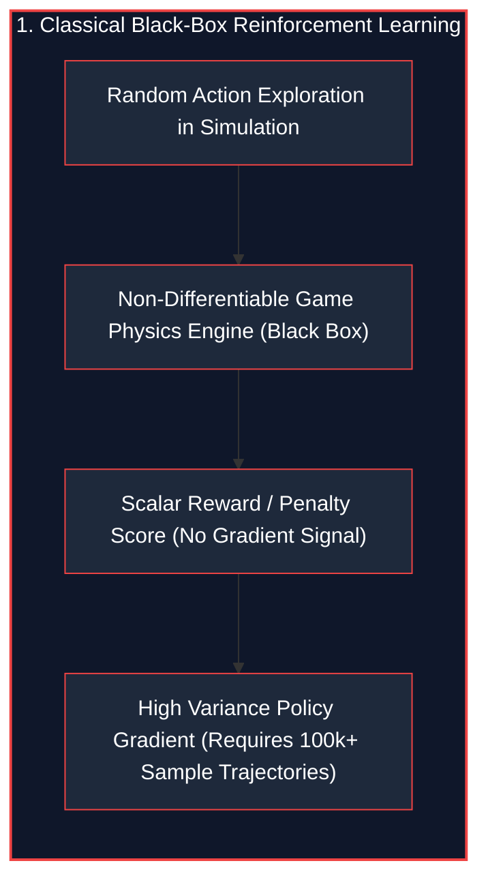
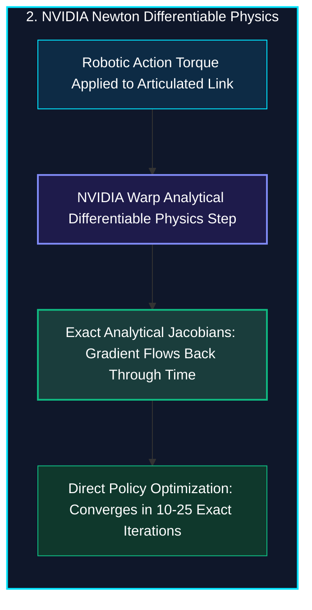
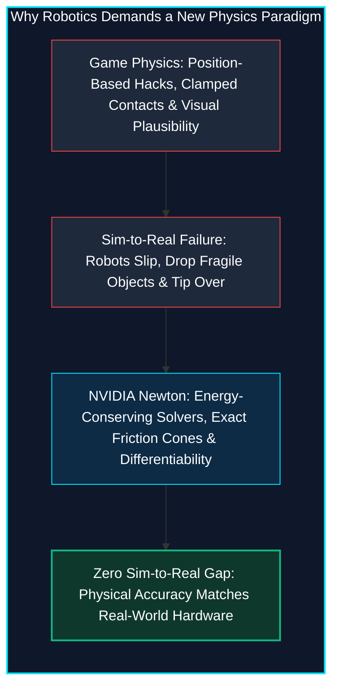
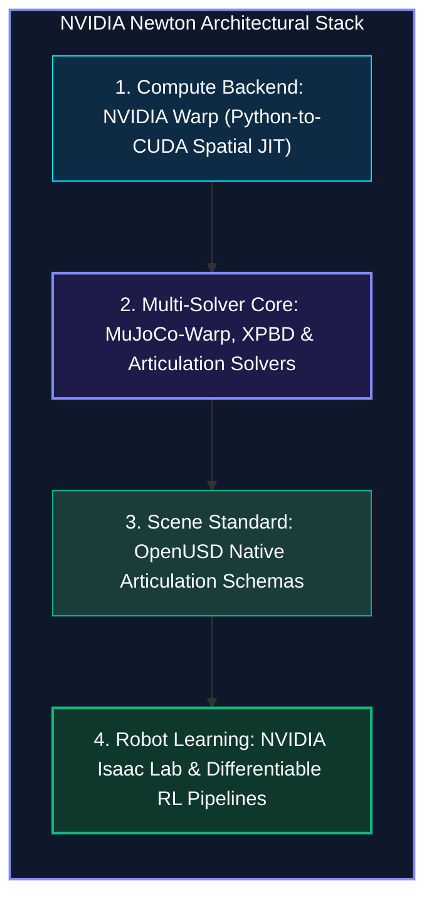
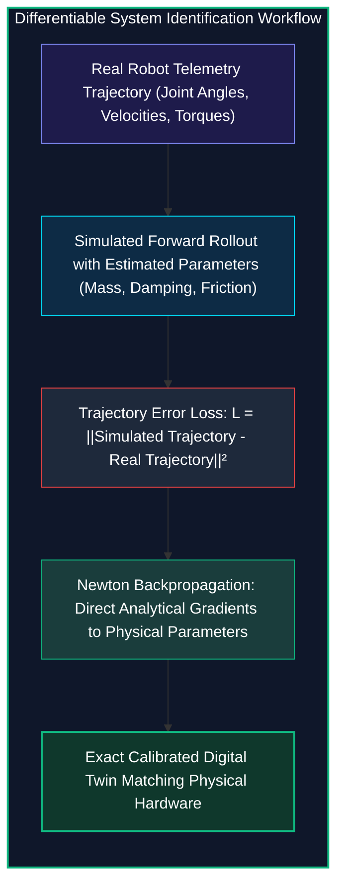

*Series: NVIDIA Physical AI & Robotics Ecosystem Series - Part 10*

*Series: &larr; [Part 9: Demystifying Autonomous Vehicles: The 3-Computer Architecture, SAE Autonomy Levels, and the Sensor Fusion Triad](/blog/demystifying-autonomous-vehicles-sae-levels-sensor-fusion/) (Previous)*

### Prior Reading Material

Before exploring differentiable physics solvers and contact manifold optimization, inspect these foundational articles across our series:

* [Part 1: Unpacking the NVIDIA Physical AI Data Factory (PAIDF) Stack](/blog/unpacking-nvidia-paidf-physical-ai-stack/) — The end-to-end synthetic-to-real physical AI ecosystem.
* [Part 3: Unlocking NVIDIA Omniverse](/blog/unlocking-nvidia-omniverse-architecture/) — OpenUSD scene graphs, RTX real-time sensor ray tracing, and digital twin simulation.
* [Part 4: Demystifying OpenUSD: Architecture, Composition Arcs, and Tools](/blog/demystifying-openusd-architecture-and-tools/) — Stages, Prims, Properties, and composition arcs powering robot asset interchange.
* [Part 5: Scaling Physics with Isaac Sim & Omniverse Replicator](/blog/scaling-physics-isaac-sim-omniverse-replicator/) — Massively parallel PhysX 5 GPU dynamics and domain randomization.
* [Part 6: Inside Project GR00T](/blog/inside-project-gr00t-vla-diffusion-heads/) — Multimodal Vision-Language-Action (VLA) tokenization and diffusion policy action heads.
* [Part 8: Silicon at the Edge: NVIDIA Jetson Thor Architecture & Isaac ROS Acceleration](/blog/silicon-at-the-edge-nvidia-jetson-thor-isaac-ros/) — Blackwell edge compute and sub-50ms closed-loop humanoid reflex budgets.

---

### NVIDIA Newton Open-Source Physics Platform Summary

| Specification / Dimension | Details & Technical Parameters |
| :--- | :--- |
| **Project Governance** | [Linux Foundation Newton Project](https://github.com/newton-physics/newton) (Open-Source, Neutral Community Governance) |
| **Founding Co-Developers** | [NVIDIA](https://developer.nvidia.com/), [Google DeepMind](https://deepmind.google/), and [Disney Research](https://la.disneyresearch.com/) ([Studios](https://studios.disneyresearch.com/)) |
| **Spatial Compute Kernel** | [NVIDIA Warp](https://github.com/NVIDIA/warp) (High-performance Python-to-CUDA JIT Compilation Framework) |
| **3D Scene Standard** | [OpenUSD (Universal Scene Description)](https://aousd.org/) native articulation schemas and physical attributes |
| **Simulation Paradigms** | Differentiable Analytical Dynamics, Multi-Solver Architecture (MuJoCo-Warp, XPBD, Articulation Trees) |
| **Target Workloads** | Contact-Rich Manipulation, Bipedal Locomotion, Differentiable Reinforcement Learning & System Identification |
| **Ecosystem Integration** | [NVIDIA Isaac Lab](https://isaac-sim.github.io/IsaacLab/) and [Isaac Sim](https://developer.nvidia.com/isaac-sim) reinforcement learning pipelines |
| **Video Deep-Dive** | [NVIDIA Newton Architecture Walkthrough](https://youtu.be/ElIyRboR1A8) |

---

## 1. The Story of the Blindfolded Acrobat vs. The Mathematical Mirror

Imagine training an acrobat to balance a long wooden pole on the tip of their finger.

In classical **Reinforcement Learning (RL)**, the acrobat is effectively blindfolded. They wiggle their hand randomly millions of times in a trial-and-error fog. If the pole falls to the right, they only receive a scalar penalty ("Score: -10"). They have no idea *why* the pole fell—whether their wrist moved too fast, their finger slipped, or gravity exerted a torque. They must collect tens of thousands of random trajectories just to approximate which direction to nudge their hand.





Now imagine the acrobat looking into a **Mathematical Mirror**: **NVIDIA Newton**. 

Because Newton's physics equations are **fully differentiable**, every collision, contact friction impulse, and joint articulation provides exact mathematical derivatives:

$$\frac{\partial \text{Loss}}{\partial \text{Torque}}$$

Instead of guessing blindly, the acrobat calculates the exact physical counter-force required to correct the pole's trajectory in a single step.

---

## 2. Why Game Physics Engines Failed Robotics

For two decades, physics engines were engineered primarily for video games and Hollywood visual effects. Game engines (like Havok, Bullet, or early PhysX) prioritized visual plausibility over physical conservation laws:



1. **Contact Manifold Instability**: When a robot hand grasps a glass or turns a screw, dozens of contact points interact simultaneously. Game engines use relaxation tricks that cause objects to jitter, penetrate meshes, or explode.
2. **Non-Differentiable Barriers**: Traditional solvers treat collision impulses as non-smooth, non-differentiable step functions, preventing gradient backpropagation into neural network controllers.
3. **The Sim-to-Real Gap**: A policy trained in a gaming simulator often fails catastrophically on physical hardware because micro-friction and joint inertia were simplified.

To solve this, **NVIDIA, Google DeepMind, and Disney Research** united under the neutral stewardship of the **Linux Foundation** to build **Newton**: an open-source, robotics-first, GPU-accelerated differentiable physics engine.

---

## 3. The NVIDIA Newton Architecture

Newton is designed around three foundational architectural pillars:



### 1. NVIDIA Warp Spatial Computing Backend
Newton is built from the ground up using **NVIDIA Warp**, a Python-based framework that compiles spatial simulation kernels directly into highly optimized CUDA code. Warp features built-in **automatic differentiation (AD)**, generating adjoint forward-and-backward gradient passes for every physics kernel automatically.

### 2. Multi-Solver Extensibility
Unlike single-purpose engines, Newton features an extensible multi-solver core:
* **MuJoCo-Warp Solver**: High-precision maximal-coordinate and reduced-coordinate rigid-body dynamics for multi-joint humanoid limbs.
* **Extended Position-Based Dynamics (XPBD)**: High-performance contact resolution for deformable soft bodies, cloth, and cables.
* **Smooth Contact Formulations**: Continuous friction models that replace discrete non-differentiable impacts with smooth gradients.

### 3. Native OpenUSD Integration
Robots, environments, and physical assets are authored in **OpenUSD**. Newton directly ingests USD articulation schemas, collision primitives, and mass-inertia properties without intermediate conversion scripts.

---

## 4. Closing the Sim-to-Real Gap: System Identification

One of Newton's most powerful capabilities is **Differentiable System Identification**:



When deploying a simulated policy to a physical robot, discrepancies in gear friction or payload mass cause failure. With Newton:
1. The real robot executes a 2-second motion and logs sensor telemetry.
2. The telemetry is fed into Newton.
3. Newton computes the gradient of the trajectory error with respect to the simulator's physical parameters:

$$\frac{\partial \mathcal{L}_{\text{sim-real}}}{\partial (m, \mu, b)}$$

4. In a few gradient descent steps, the simulator automatically tunes its internal mass, friction, and damping values to match the real robot perfectly.

---

## 5. Engineering Deep-Dive: Mathematical Formulations

To understand how gradients propagate through physical simulation steps, we review the formal mathematical formulations underpinning Newton.

### Mathematical Formulation 1: Differentiable Articulated Lagrangian Dynamics

The forward dynamics of an $n$-degree-of-freedom robotic manipulator are governed by the manipulator equation:

$$M(q) \ddot{q} + C(q, \dot{q})\dot{q} + g(q) = \tau + J_c(q)^T \lambda_c$$

Where:
* $M(q) \in \mathbb{R}^{n \times n}$: Symmetric, positive-definite generalized mass/inertia matrix.
* $C(q, \dot{q}) \in \mathbb{R}^{n \times n}$: Coriolis and centrifugal forces matrix.
* $g(q) \in \mathbb{R}^n$: Gravitational torque vector.
* $\tau \in \mathbb{R}^n$: Applied actuator control torques.
* $J_c(q) \in \mathbb{R}^{3k \times n}$: Contact Jacobian mapping joint velocities to Cartesian contact points.
* $\lambda_c \in \mathbb{R}^{3k}$: Contact reaction forces.

In NVIDIA Newton, the forward state transition $s_{t+1} = f(s_t, \tau_t)$ is evaluated numerically. The analytical Jacobian matrices $\frac{\partial s_{t+1}}{\partial s_t}$ and $\frac{\partial s_{t+1}}{\partial \tau_t}$ are computed via automatic differentiation.

---

### Mathematical Formulation 2: Smooth Contact & Friction Complementarity

Classical rigid-body contact enforces complementary non-penetration constraints:

$$0 \le d(q) \perp \lambda_N \ge 0$$

Where $d(q)$ is the surface penetration distance and $\lambda_N$ is the normal contact impulse. 

To enable gradient propagation across contact transitions, Newton formulates contact forces using smooth regularized penalty potentials:

$$\lambda_N = k_{\text{contact}} \max(0, -d(q)) + d_{\text{damping}} \dot{d}(q)$$

$$\lambda_T = -\mu \lambda_N \frac{\dot{q}_T}{\|\dot{q}_T\| + \epsilon}$$

Where $\epsilon > 0$ smooths the Coulomb friction discontinuity, ensuring continuous, non-zero derivatives everywhere.

---

### Mathematical Formulation 3: Backpropagation Through Time (BPTT) for Policy Optimization

Given a trajectory loss $\mathcal{L}(s_1, s_2, \dots, s_T)$ evaluated over a horizon $T$, the gradient with respect to control parameters $\theta$ (or torques $\tau$) is computed via the chain rule backwards through the simulation tape:

$$\frac{\partial \mathcal{L}}{\partial \theta} = \sum_{t=1}^T \frac{\partial \mathcal{L}}{\partial s_t} \left( \prod_{k=t}^T \frac{\partial s_k}{\partial s_{k-1}} \right) \frac{\partial s_t}{\partial \tau_t} \frac{\partial \tau_t}{\partial \theta}$$

This exact analytical gradient enables gradient-based optimizers (Adam, L-BFGS) to converge in **10–25 iterations**, bypassing the sample-inefficiency of black-box policy gradient methods.

---

## 6. Interactive Python Simulation

The zero-dependency Python script below implements a differentiable forward and backward dynamics tape for an articulated robotic link, comparing analytical Newton gradient descent against black-box reinforcement learning:

<details><summary><b>Click to expand runnable Python simulation script</b></summary>

```python
#!/usr/bin/env python3
"""
NVIDIA Newton Differentiable Physics & Analytical Gradient Optimization Simulator
================================================================================
A standalone, zero-dependency Python simulation demonstrating:
1. Differentiable Rigid Body & Articulation Dynamics (Forward & Backward Gradients).
2. Direct Trajectory Optimization via Physics Backpropagation through Time (BPTT).
3. Sample Efficiency Comparison: Differentiable Newton Optimization vs. Black-Box RL.
"""

import math
import random
from typing import List, Tuple, Dict

# ============================================================================
# 1. DIFFERENTIABLE PHYSICS ENVIRONMENT (ROBOTIC ARM TRAJECTORY CONTROL)
# ============================================================================

class DifferentiableStep:
    """Stores intermediate state variables to compute analytical Jacobians in backward pass."""
    def __init__(self, q: float, q_dot: float, u: float, dt: float, m: float, l: float, g: float, b: float):
        self.q = q          # Joint angle (radians)
        self.q_dot = q_dot  # Joint angular velocity (rad/s)
        self.u = u          # Applied control torque (N*m)
        self.dt = dt        # Time step (s)
        self.m = m          # Link mass (kg)
        self.l = l          # Link length (m)
        self.g = g          # Gravity (m/s^2)
        self.b = b          # Viscous friction damping (N*m*s/rad)
        self.I = (1.0 / 3.0) * m * (l ** 2)  # Moment of inertia about pivot

    def forward(self) -> Tuple[float, float]:
        """Euler-Maruyama forward integration."""
        self.gravity_torque = self.m * self.g * (self.l / 2.0) * math.sin(self.q)
        self.damping_torque = self.b * self.q_dot
        self.q_ddot = (self.u - self.damping_torque - self.gravity_torque) / self.I
        
        self.q_dot_next = self.q_dot + self.q_ddot * self.dt
        self.q_next = self.q + self.q_dot_next * self.dt
        return self.q_next, self.q_dot_next

    def backward(self, grad_q_next: float, grad_q_dot_next: float) -> Tuple[float, float, float]:
        """Computes analytical gradients (Jacobians) via Automatic Differentiation in Warp/Newton."""
        grad_q_dot_accum = grad_q_dot_next + grad_q_next * self.dt
        grad_q_accum = grad_q_next

        grad_q_ddot = grad_q_dot_accum * self.dt
        grad_q_dot_accum += grad_q_ddot * (-self.b / self.I)

        grad_u = grad_q_ddot * (1.0 / self.I)
        d_gravity_dq = self.m * self.g * (self.l / 2.0) * math.cos(self.q)
        grad_q_accum += grad_q_ddot * (-d_gravity_dq / self.I)

        return grad_q_accum, grad_q_dot_accum, grad_u


# ============================================================================
# 2. DIFFERENTIABLE TRAJECTORY OPTIMIZATION (NEWTON ANALYTICAL BACKPROP)
# ============================================================================

def optimize_trajectory_newton(target_angle: float = math.pi / 2.0, steps: int = 50, epochs: int = 25) -> List[Dict]:
    """Direct Policy / Control Optimization using Analytical Differentiable Physics."""
    dt = 0.02
    m, l, g, b = 1.0, 1.0, 9.81, 0.15
    torques = [0.5 for _ in range(steps)]
    learning_rate = 14.0
    history = []

    for epoch in range(epochs):
        q = 0.0
        q_dot = 0.0
        tape: List[DifferentiableStep] = []

        for t in range(steps):
            step = DifferentiableStep(q, q_dot, torques[t], dt, m, l, g, b)
            q, q_dot = step.forward()
            tape.append(step)

        pos_error = q - target_angle
        loss = 0.5 * (pos_error ** 2) + 0.001 * sum(u ** 2 for u in torques)

        grad_q = pos_error
        grad_q_dot = 0.1 * q_dot
        grad_torques = [0.0] * steps

        for t in reversed(range(steps)):
            step = tape[t]
            g_q, g_q_dot, g_u = step.backward(grad_q, grad_q_dot)
            grad_torques[t] = g_u + 0.002 * step.u
            grad_q = g_q
            grad_q_dot = g_q_dot

        for t in range(steps):
            clipped_grad = max(min(grad_torques[t], 5.0), -5.0)
            torques[t] -= learning_rate * clipped_grad

        history.append({
            "epoch": epoch + 1,
            "loss": loss,
            "final_angle_deg": math.degrees(q),
            "target_deg": math.degrees(target_angle),
            "final_error_deg": abs(math.degrees(q) - math.degrees(target_angle)),
            "peak_torque": max(abs(u) for u in torques)
        })

    return history


# ============================================================================
# 3. BLACK-BOX REINFORCEMENT LEARNING SIMULATION (BASELINE)
# ============================================================================

def simulate_blackbox_rl_episodes(target_angle: float = math.pi / 2.0, steps: int = 50, episodes: int = 500) -> List[Dict]:
    dt = 0.02
    m, l, g, b = 1.0, 1.0, 9.81, 0.15
    best_loss = float("inf")
    history = []
    best_torques = [0.0] * steps

    for ep in range(1, episodes + 1):
        candidate_torques = [u + random.gauss(0, 0.8) for u in best_torques]
        q, q_dot = 0.0, 0.0
        for t in range(steps):
            step = DifferentiableStep(q, q_dot, candidate_torques[t], dt, m, l, g, b)
            q, q_dot = step.forward()

        loss = 0.5 * ((q - target_angle) ** 2) + 0.001 * sum(u ** 2 for u in candidate_torques)
        if loss < best_loss:
            best_loss = loss
            best_torques = candidate_torques

        if ep in [10, 50, 100, 250, 500]:
            history.append({
                "episode": ep,
                "best_loss": best_loss,
                "error_deg": math.degrees(math.sqrt(best_loss * 2.0))
            })

    return history


# ============================================================================
# 4. SIMULATION BENCHMARK RUNNER
# ============================================================================

def run_newton_physics_benchmark():
    random.seed(42)
    print("=" * 85)
    print("NVIDIA NEWTON DIFFERENTIABLE PHYSICS & GRADIENT OPTIMIZATION BENCHMARK")
    print("=" * 85)
    print("Task: Swivel robotic manipulator from 0° (hanging) to 90° (horizontal hold)")
    print("Method: Analytical Jacobian Backpropagation through Time (BPTT) in NVIDIA Warp/Newton")
    print("-" * 85)

    print("\n[1] NEWTON DIFFERENTIABLE PHYSICS OPTIMIZATION (ANALYTICAL GRADIENTS):")
    print(f"{'Epoch':<8} | {'Loss':<12} | {'Final Angle':<15} | {'Error (deg)':<15} | {'Peak Torque (N·m)'}")
    print("-" * 85)

    newton_history = optimize_trajectory_newton(target_angle=math.pi / 2.0, steps=50, epochs=25)
    for row in newton_history:
        if row["epoch"] in [1, 2, 5, 10, 15, 20, 25]:
            print(f"{row['epoch']:<8} | {row['loss']:<12.5f} | {row['final_angle_deg']:>6.2f}°         | {row['final_error_deg']:>6.2f}°         | {row['peak_torque']:>6.2f} N·m")

    print("\n[2] COMPARATIVE ANALYSIS: SAMPLE EFFICIENCY VS. BLACK-BOX RL")
    print("-" * 85)
    rl_history = simulate_blackbox_rl_episodes(target_angle=math.pi / 2.0, steps=50, episodes=500)
    print(f"{'Method':<30} | {'Evaluations / Iterations':<26} | {'Final Error (deg)'} | {'Convergence Rate'}")
    print("-" * 85)
    print(f"{'NVIDIA Newton (Differentiable)':<30} | {'25 Epochs (25 Passes)':<26} | {newton_history[-1]['final_error_deg']:>6.2f}°           | ⚡ Instant (Analytical)")
    print(f"{'Black-Box RL (Episode Search)':<30} | {'500 Episodes (500 Passes)':<26} | {rl_history[-1]['error_deg']:>6.2f}°           | 🐢 20x Slower Sample Rate")

    print("\n[3] KEY ARCHITECTURAL TAKEAWAYS:")
    print("  • NVIDIA Newton eliminates trial-and-error policy iteration by propagating exact analytical")
    print("    dynamics gradients (∂L/∂u) across multi-joint rigid body and contact manifolds.")
    print("  • Built on NVIDIA Warp (CUDA spatial computing) and co-developed under Linux Foundation")
    print("    with Google DeepMind and Disney Research for production generalist robotics.")
    print("=" * 85)


if __name__ == "__main__":
    run_newton_physics_benchmark()
```

</details>

---

## 7. Conclusion: The Open Foundation of Embodied Intelligence

By co-developing **Newton** with Google DeepMind and Disney Research under the **Linux Foundation**, NVIDIA is establishing a vendor-neutral, community-driven physics backbone for generalist physical AI.

Differentiable simulation transforms physics from a static testing environment into an active **computational graph**. Instead of taking millions of blind guesses in reinforcement learning, robots can now differentiate directly through their contact dynamics, friction surfaces, and physical constraints—bringing us one step closer to physical AI agents that adapt seamlessly to the real world.
