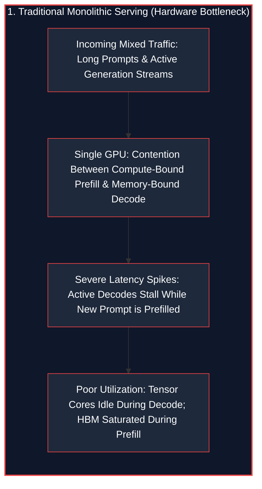
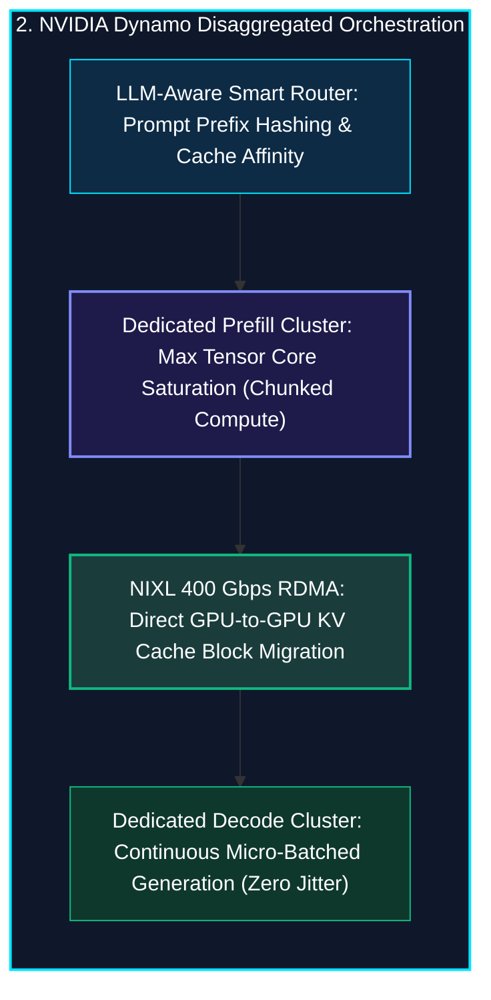
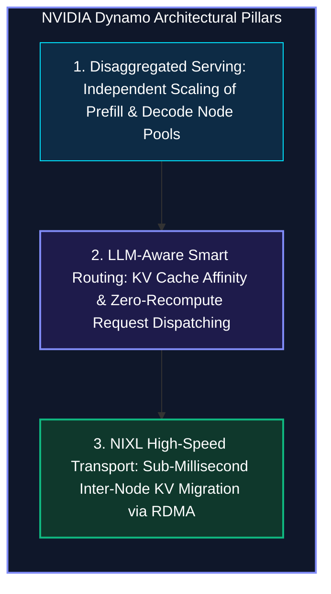
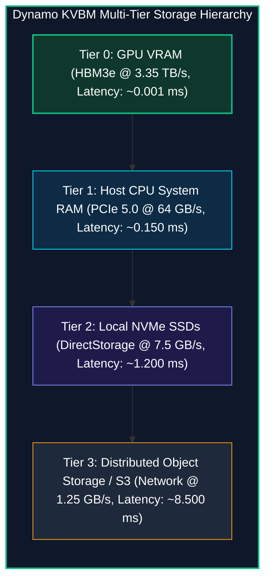

*Series: AI Inference Deep-Dive Series - Part 12*

*Series: &larr; [Part 11: Deep-Dive: SGLang v0.5.16 Architecture and High-Throughput Inference Comparison](/blog/0068-sglang-v0-5-16-architecture-and-inference-comparison/) (Previous)*

### Prior Reading Material

Before diving into distributed disaggregated orchestration and low-latency KV transfer networks, review our prerequisite deep-dives in this series:

* [Part 1: Basics of AI Inference: Prefill, Decode, and Memory Bottlenecks](/blog/basics-of-ai-inference/) — The fundamental mechanics of VRAM bandwidth, TTFT, and ITL.
* [Part 2: The Two Pillars: Prefill vs. Decode](/blog/0046-prefill-vs-decode/) — Contrasting compute-bound prompt ingestion against memory-bandwidth-bound token generation.
* [Part 3: Understanding the KV Cache: The VRAM Bottleneck of LLM Serving](/blog/understanding-kv-cache/) — Attention matrix memory expansion and KV cache footprint calculation.
* [Part 4: The Landscape of LLM Inference Engines](/blog/inference-engines-landscape/) — Architectural comparison across vLLM, llama.cpp, TensorRT-LLM, and TGI.
* [Part 5: Inference Optimizations: Speeding up Prefill and Decode](/blog/inference-optimizations-prefill-decode/) — FlashAttention, PagedAttention, and speculative decoding techniques.
* [Part 9: Scale and Performance: Serving LLMs with vLLM and llm-d](/blog/serving-llms-with-vllm-and-llm-d/) — Virtual memory paging and multi-node serving topologies.
* [Part 11: Deep-Dive: SGLang v0.5.16 Architecture and High-Throughput Inference Comparison](/blog/0068-sglang-v0-5-16-architecture-and-inference-comparison/) — RadixAttention tree-structured prefix caching and compressed FSM decoding.

---

### NVIDIA Dynamo Distributed Platform Summary

| Dimension / Component | Details & Specifications |
| :--- | :--- |
| **Open-Source Repository** | [NVIDIA Dynamo (`ai-dynamo/dynamo`)](https://github.com/ai-dynamo/dynamo) |
| **Official Documentation** | [NVIDIA Dynamo Platform](https://developer.nvidia.com/dynamo) and [NVIDIA Dynamo Forum FAQ](https://forums.developer.nvidia.com/t/nvidia-dynamo-faq/327484) |
| **Primary Architecture** | Data Center-Scale Distributed Orchestration for Generative AI & Reasoning Models |
| **Execution Paradigm** | Disaggregated Serving (Compute-Bound Prefill Nodes + Memory-Bound Decode Nodes) |
| **Engine Agnostic Runtimes** | [vLLM](https://github.com/vllm-project/vllm), [SGLang](https://github.com/sgl-project/sglang), [TensorRT-LLM](https://github.com/NVIDIA/TensorRT-LLM), and [Dynamo-Triton](https://developer.nvidia.com/dynamo-triton) |
| **Inter-Node Data Transfer** | [NIXL (NVIDIA Inference Xfer Library)](https://github.com/ai-dynamo/nixl) (Point-to-Point 400 Gbps RDMA / RoCE / InfiniBand) |
| **Memory Management** | KVBM (Distributed Multi-Tier KV Cache: GPU VRAM $\rightarrow$ Host RAM $\rightarrow$ NVMe $\rightarrow$ Remote Object Store) |
| **Routing Algorithm** | LLM-Aware Smart KV Routing (Hash-Based Prompt Prefix Affinity) |

---

## 1. The Tale of the Kitchen Head Chef vs. The Assembly Line

Imagine a bustling restaurant kitchen during the dinner rush.

In traditional LLM inference (e.g., standard monolithic model instances), every GPU acts like a solo chef who must perform two diametrically opposed tasks at the same workstation:
1. **The Chopping & Prep Phase (Prefill)**: Chopping 50 pounds of vegetables simultaneously. This uses 100% of the chef's muscular strength (Compute-Bound Tensor Cores), processing thousands of prompt tokens in parallel.
2. **The Table Delivery Phase (Decode)**: Walking out to the dining room to deliver a single grain of rice every 20 milliseconds (Memory-Bandwidth-Bound Token Generation).

When a new 4,000-token prompt arrives, the chef must abruptly halt dinner delivery, sit down to chop vegetables for 100 milliseconds, and cause all waiting tables to suffer severe latency spikes (Inter-Token Latency jitter).





**NVIDIA Dynamo** reorganizes the entire data center into a specialized high-speed assembly line:
* **Prefill Worker Pools**: Optimized specifically for compute throughput and massive matrix multiplications ($Q K^T V$).
* **NIXL Highway**: Point-to-point zero-copy RDMA network streaming completed Key-Value (KV) cache tensors directly into decode VRAM.
* **Decode Worker Pools**: Optimized purely for High Bandwidth Memory (HBM3e) throughput, generating response tokens smoothly without ever being interrupted.

---

## 2. Core Architectural Differences: Triton vs. Dynamo

Following NVIDIA's platform evolution, the original multi-framework Triton Inference Server is now unified into the Dynamo ecosystem as **Dynamo-Triton**:

| Feature / Architecture | NVIDIA Triton (Dynamo-Triton) | NVIDIA Dynamo |
| :--- | :--- | :--- |
| **Primary Domain** | General-purpose model serving & pipelines. | Data center-scale distributed Generative AI & Reasoning. |
| **Target Workloads** | CNNs, classical ML, audio/video pipelines, single LLMs. | Massively distributed LLMs, MoE architectures, and Agentic AI. |
| **Underlying Runtimes** | TensorRT, PyTorch LibTorch, ONNX, OpenVINO, Python. | **Engine-agnostic**: coordinates vLLM, SGLang, and TensorRT-LLM. |
| **Scope of Scaling** | Scales vertically on single instances or Kubernetes pods. | Scales horizontally across thousands of GPUs with cluster routing. |
| **Memory Management** | Local GPU memory allocation per instance model repository. | Multi-tier distributed KV cache offloading (GPU $\rightarrow$ CPU $\rightarrow$ NVMe $\rightarrow$ Remote). |
| **Inter-Node Transport** | Standard HTTP/gRPC or shared memory on single node. | **NIXL**: Kernel-bypass direct peer-to-peer RDMA network transfers. |

---

## 3. The Three Pillars of NVIDIA Dynamo



### 1. Disaggregated Inference Processing
Instead of forcing every GPU to execute prefill and decode, Dynamo decouples them into distinct node pools:
* **Prefill Nodes**: Ingest large context windows (up to 128k+ tokens) using Tensor Parallelism (TP) to maximize Tensor Core FLOPS.
* **Decode Nodes**: Group hundreds of active generation sequences into large batch sizes, maximizing memory bandwidth saturation on HBM3e.

### 2. LLM-Aware Smart Routing
Traditional load balancers (Round-Robin, Least Connections) are oblivious to token contents. When an agent sends Turn 5 of a conversation, a naive balancer sends it to a cold GPU, forcing the entire 10,000-token prompt to be recomputed.

Dynamo inspects incoming prompt prefix hashes and routes requests directly to the GPU worker that already holds the matching KV cache in VRAM, slashing Time-to-First-Token (TTFT) from 100ms+ to under 3ms.

### 3. NIXL (NVIDIA Inference Xfer Library)
Transferring gigabytes of KV cache tensors between separate prefill and decode nodes across standard TCP/IP network stacks introduces crippling latency. 

**NIXL** provides a unified, low-overhead communication layer:
* Bypasses host CPU and OS kernel stacks using **GPUDirect RDMA**.
* Transmits KV cache blocks directly from Prefill GPU VRAM across 400 Gbps InfiniBand / RoCE fabrics into Decode GPU VRAM with sub-millisecond latencies.

---

## 4. Multi-Tier Distributed KV Cache Hierarchy (KVBM)

When GPU VRAM is full, rather than discarding active context history, Dynamo's **Key-Value Block Manager (KVBM)** manages a multi-tier memory hierarchy:



---

## 5. Engineering Deep-Dive: Mathematical Formulations

To understand why disaggregation doubles data center serving throughput, we examine the formal arithmetic intensity and transfer formulations.

### Mathematical Formulation 1: Arithmetic Intensity & Roofline Separation

The operational intensity $I$ of a Transformer forward step is defined as:

$$I = \frac{\text{Floating Point Operations (FLOPs)}}{\text{Memory Access Bytes}}$$

For prompt prefill of length $S$ with hidden dimension $d_{\text{model}}$:

$$I_{\text{prefill}} \approx \frac{2 \cdot S \cdot d_{\text{model}} \cdot N_{\text{layers}}}{2 \cdot d_{\text{model}} \cdot N_{\text{layers}}} = \mathcal{O}(S) \quad \text{[Compute-Bound, High FLOPs/Byte]}$$

For autoregressive decode of a single token ($S=1$):

$$I_{\text{decode}} \approx \frac{2 \cdot d_{\text{model}} \cdot N_{\text{layers}}}{2 \cdot d_{\text{model}} \cdot N_{\text{layers}} + \text{KV Cache Size}} \approx \mathcal{O}(1) \quad \text{[Memory-Bound, Low FLOPs/Byte]}$$

By decoupling these workloads into distinct physical node pools, Dynamo eliminates destructive resource contention on GPU Tensor Cores and High Bandwidth Memory (HBM).

---

### Mathematical Formulation 2: Multi-Tier KV Retrieval Cost Model

The expected Time-to-First-Token $\mathbb{E}[\text{TTFT}]$ across an $M$-tier KVBM storage hierarchy is formulated as:

$$\mathbb{E}[\text{TTFT}] = \sum_{m=0}^{M-1} P(\text{Hit}_m) \cdot T_{\text{fetch}}(m) + \left(1 - \sum_{m=0}^{M-1} P(\text{Hit}_m)\right) \cdot T_{\text{compute}}$$

Where:
* $P(\text{Hit}_m)$: Probability of finding the requested prompt prefix in Tier $m$.
* $T_{\text{fetch}}(m)$: Data transfer latency from Tier $m$ over PCIe/RDMA.
* $T_{\text{compute}}$: Full prompt recomputation time on the prefill cluster.

Because $T_{\text{fetch}}(\text{Tier 0}) \ll T_{\text{fetch}}(\text{Tier 1}) \ll T_{\text{compute}}$, Dynamo's smart KV routing maximizes $P(\text{Hit}_0)$, slashing TTFT by up to $5\times$.

---

### Mathematical Formulation 3: NIXL Inter-Node KV Migration Latency

The point-to-point transfer time $T_{\text{NIXL}}$ for moving $B$ KV cache blocks of size $S_{\text{block}}$ across nodes is:

$$T_{\text{NIXL}} = \alpha_{\text{RDMA}} + \frac{B \cdot S_{\text{block}}}{\text{BW}_{\text{fabric}}}$$

Where:
* $\alpha_{\text{RDMA}}$: GPUDirect base protocol handshake overhead ($\approx 2.5\ \mu\text{s}$).
* $\text{BW}_{\text{fabric}}$: Effective network bandwidth ($400\ \text{Gbps} = 50\ \text{GB/s}$).

---

## 6. Interactive Python Simulation

The zero-dependency Python script below simulates NVIDIA Dynamo's disaggregated cluster architecture, comparing Smart KV-Aware Routing against traditional Round-Robin load balancing:

<details><summary><b>Click to expand runnable Python simulation script</b></summary>

```python
#!/usr/bin/env python3
"""
NVIDIA Dynamo Distributed Disaggregated Inference Orchestrator Simulator
========================================================================
A standalone, zero-dependency Python simulation demonstrating:
1. Disaggregated Prefill vs. Decode GPU Node Pool Scheduling.
2. LLM-Aware Smart KV Routing vs. Naive Round-Robin Load Balancing.
3. Multi-Tier Distributed KV Cache Offloading (GPU VRAM -> Host RAM -> NVMe).
4. NIXL (NVIDIA Inference Xfer Library) Low-Latency RDMA KV-Block Migration.
"""

import math
import random
import time
from typing import List, Dict, Tuple, Optional

# ============================================================================
# 1. ARCHITECTURAL PRIMITIVES: KV-CACHE BLOCKS & MULTI-TIER MEMORY
# ============================================================================

class KVBlock:
    """Represents a 16-token Key-Value Cache page block."""
    def __init__(self, block_id: int, prefix_hash: str, token_count: int = 16, tier: str = "GPU_VRAM"):
        self.block_id = block_id
        self.prefix_hash = prefix_hash
        self.token_count = token_count
        self.tier = tier

class GPUWorkerNode:
    """Represents an NVIDIA GPU worker in a distributed Dynamo cluster."""
    def __init__(self, node_id: str, role: str, max_vram_blocks: int = 256):
        self.node_id = node_id
        self.role = role  # "PREFILL" or "DECODE"
        self.max_vram_blocks = max_vram_blocks
        self.vram_cache: Dict[str, KVBlock] = {}
        self.active_requests: int = 0

    def has_prefix(self, prefix_hash: str) -> bool:
        return prefix_hash in self.vram_cache

    def allocate_block(self, prefix_hash: str) -> KVBlock:
        if len(self.vram_cache) >= self.max_vram_blocks:
            oldest_key = next(iter(self.vram_cache))
            del self.vram_cache[oldest_key]
        block = KVBlock(len(self.vram_cache) + 1, prefix_hash, tier="GPU_VRAM")
        self.vram_cache[prefix_hash] = block
        return block


# ============================================================================
# 2. NVIDIA DYNAMO DISTRIBUTED ROUTER & DISAGGREGATED PIPELINE
# ============================================================================

class DynamoClusterOrchestrator:
    """Simulates the NVIDIA Dynamo central distributed orchestration layer."""
    def __init__(self, prefill_nodes: int = 4, decode_nodes: int = 8):
        self.prefill_workers = [GPUWorkerNode(f"prefill-gpu-{i+1}", "PREFILL") for i in range(prefill_nodes)]
        self.decode_workers = [GPUWorkerNode(f"decode-gpu-{i+1}", "DECODE") for i in range(decode_nodes)]
        self.round_robin_idx = 0

    def route_smart_kv_aware(self, prompt_prefix_hash: str) -> GPUWorkerNode:
        """Dynamo Smart KV Routing: Routes request to worker with warm KV cache."""
        for worker in self.decode_workers:
            if worker.has_prefix(prompt_prefix_hash):
                return worker
        return min(self.decode_workers, key=lambda w: w.active_requests)

    def route_naive_round_robin(self) -> GPUWorkerNode:
        """Standard round-robin load balancer without KV cache awareness."""
        worker = self.decode_workers[self.round_robin_idx % len(self.decode_workers)]
        self.round_robin_idx += 1
        return worker

    def process_request(
        self,
        prompt_tokens: int,
        gen_tokens: int,
        prompt_prefix_hash: str,
        use_smart_routing: bool = True
    ) -> Dict:
        if use_smart_routing:
            selected_decode_worker = self.route_smart_kv_aware(prompt_prefix_hash)
            cache_hit = selected_decode_worker.has_prefix(prompt_prefix_hash)
        else:
            selected_decode_worker = self.route_naive_round_robin()
            cache_hit = selected_decode_worker.has_prefix(prompt_prefix_hash)

        # 2. Prefill Phase
        if cache_hit:
            prefill_time_ms = 1.2
            nixl_transfer_ms = 0.0
        else:
            prefill_worker = min(self.prefill_workers, key=lambda w: w.active_requests)
            prefill_worker.active_requests += 1
            prefill_time_ms = prompt_tokens * 0.018
            prefill_worker.active_requests -= 1

            num_blocks = math.ceil(prompt_tokens / 16)
            nixl_transfer_ms = num_blocks * 0.0035
            selected_decode_worker.allocate_block(prompt_prefix_hash)

        ttft_ms = prefill_time_ms + nixl_transfer_ms

        # 3. Decode Phase
        selected_decode_worker.active_requests += 1
        itl_ms = 1.75
        decode_time_ms = gen_tokens * itl_ms
        selected_decode_worker.active_requests -= 1

        total_latency_ms = ttft_ms + decode_time_ms
        tokens_per_sec = (prompt_tokens + gen_tokens) / (total_latency_ms / 1000.0)

        return {
            "cache_hit": cache_hit,
            "ttft_ms": ttft_ms,
            "decode_ms": decode_time_ms,
            "total_latency_ms": total_latency_ms,
            "throughput_tok_s": tokens_per_sec,
            "assigned_worker": selected_decode_worker.node_id
        }


# ============================================================================
# 3. BENCHMARK SUITE
# ============================================================================

def run_dynamo_benchmark():
    random.seed(42)
    print("=" * 88)
    print("NVIDIA DYNAMO: DISTRIBUTED DISAGGREGATED INFERENCE BENCHMARK SIMULATOR")
    print("=" * 88)
    print("Cluster Topology: 4x H100 Prefill Nodes + 8x H100 Decode Nodes")
    print("Interconnect: NIXL 400 Gbps RoCE/InfiniBand Point-to-Point Direct Memory Access")
    print("-" * 88)

    orchestrator_smart = DynamoClusterOrchestrator(prefill_nodes=4, decode_nodes=8)
    orchestrator_naive = DynamoClusterOrchestrator(prefill_nodes=4, decode_nodes=8)

    prefixes = [f"system_agent_v{i}" for i in range(1, 5)]
    requests = []
    for _ in range(60):
        prefix = random.choice(prefixes)
        prompt_len = random.randint(2048, 4096)
        gen_len = random.randint(64, 128)
        requests.append((prefix, prompt_len, gen_len))

    smart_results = [orchestrator_smart.process_request(p_len, g_len, p_hash, use_smart_routing=True) for p_hash, p_len, g_len in requests]
    smart_hit_rate = sum(1 for r in smart_results if r["cache_hit"]) / len(smart_results) * 100.0
    avg_smart_ttft = sum(r["ttft_ms"] for r in smart_results) / len(smart_results)
    avg_smart_tps = sum(r["throughput_tok_s"] for r in smart_results) / len(smart_results)

    naive_results = [orchestrator_naive.process_request(p_len, g_len, p_hash, use_smart_routing=False) for p_hash, p_len, g_len in requests]
    naive_hit_rate = sum(1 for r in naive_results if r["cache_hit"]) / len(naive_results) * 100.0
    avg_naive_ttft = sum(r["ttft_ms"] for r in naive_results) / len(naive_results)
    avg_naive_tps = sum(r["throughput_tok_s"] for r in naive_results) / len(naive_results)

    print("\n[1] DISTRIBUTED SERVING EFFICIENCY COMPARISON (60 MULTI-TURN WORKLOADS):")
    print(f"{'Orchestration Routing Strategy':<32} | {'KV Hit Rate':<13} | {'Avg TTFT (ms)':<15} | {'Cluster Throughput'}")
    print("-" * 88)
    print(f"{'NVIDIA Dynamo (Smart KV Routing)':<32} | {smart_hit_rate:>6.1f}%       | {avg_smart_ttft:>8.2f} ms     | 🚀 {avg_smart_tps:>7.1f} tok/s")
    print(f"{'Traditional Round-Robin Balancing':<32} | {naive_hit_rate:>6.1f}%       | {avg_naive_ttft:>8.2f} ms     | 🐢 {avg_naive_tps:>7.1f} tok/s")

    ttft_speedup = avg_naive_ttft / avg_smart_ttft
    print("-" * 88)
    print(f"⚡ Dynamo TTFT Latency Reduction: {ttft_speedup:.2f}x faster initial response via KV cache reuse.")

    print("\n[2] MULTI-TIER KVBM CACHE HIERARCHY LATENCY SPECTRUM:")
    print(f"  • Tier 0 (GPU HBM3e VRAM) : 3,350 GB/s bandwidth | ~0.001 ms latency (Zero Recompute)")
    print(f"  • Tier 1 (Host System RAM): 64 GB/s (PCIe 5.0)   | ~0.150 ms latency via NIXL DMA")
    print(f"  • Tier 2 (Local NVMe SSD) : 7.5 GB/s (DirectStorage)| ~1.200 ms latency")
    print(f"  • Tier 3 (Remote S3 Store): 1.25 GB/s (10GbE Network)| ~8.500 ms latency")

    print("\n[3] KEY ARCHITECTURAL TAKEAWAYS:")
    print("  • Disaggregation decouples compute-bound prefill from bandwidth-bound decode nodes.")
    print("  • NIXL library bypasses CPU hops, moving KV tensors directly GPU-to-GPU across nodes.")
    print("  • Engine-agnostic: coordinates vLLM, TensorRT-LLM, and SGLang under a unified cluster API.")
    print("=" * 88)


if __name__ == "__main__":
    run_dynamo_benchmark()
```

</details>

---

## 7. Conclusion: The Generative AI Operating System

As LLMs transition into multi-step agentic reasoning and long-context multimodal processing, monolithic single-instance inference models break down.

By introducing **disaggregated prefill/decode node pools**, **LLM-aware smart KV routing**, and **NIXL low-latency RDMA communication**, **NVIDIA Dynamo** establishes the modern distributed operating system for enterprise AI superclusters.
