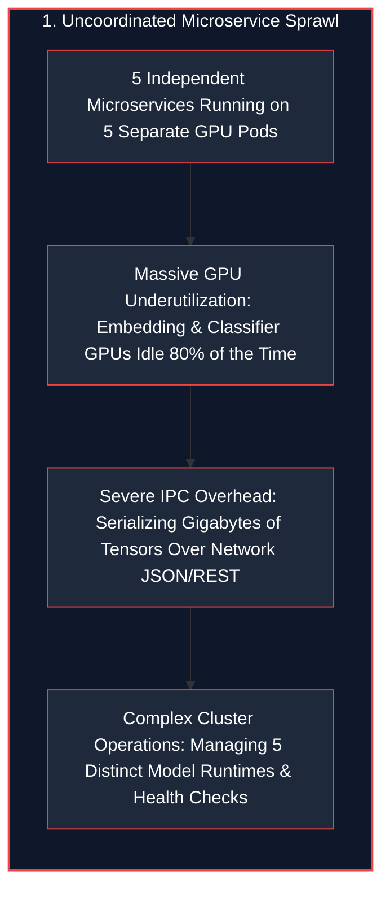
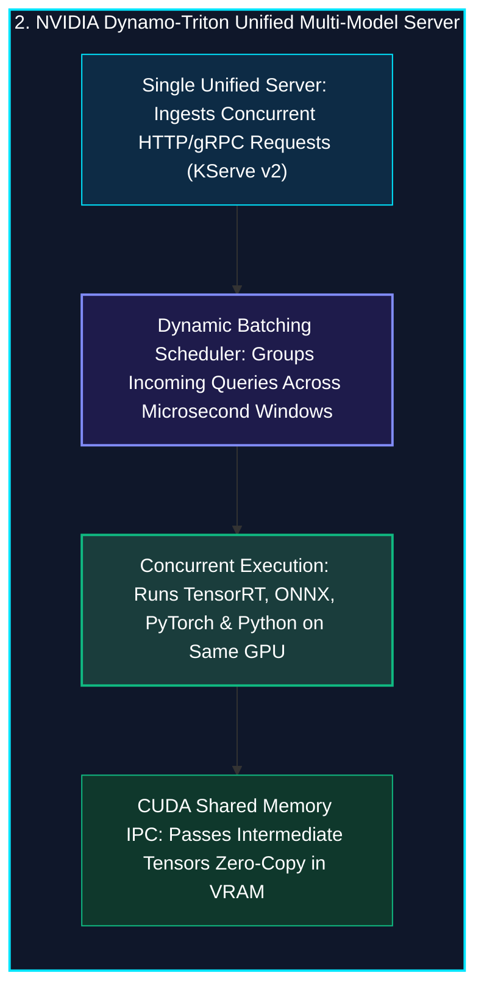
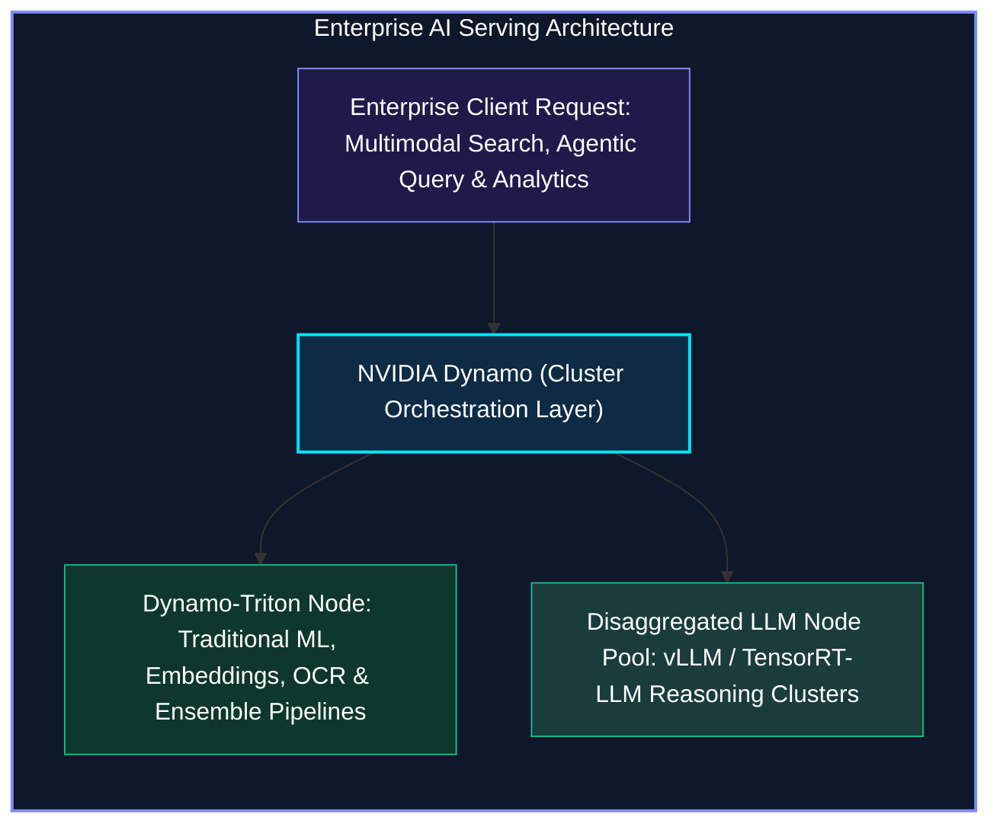
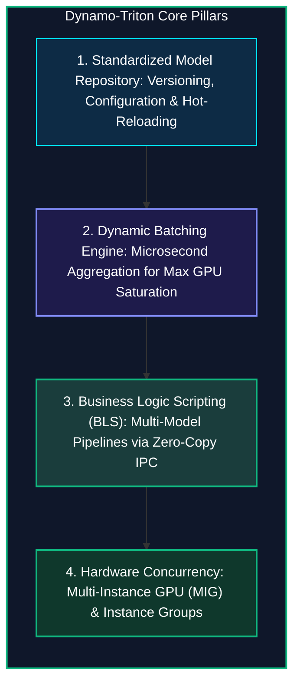

*Series: AI Inference Deep-Dive Series - Part 13*

*Series: &larr; [Part 12: NVIDIA Dynamo: Data Center-Scale Disaggregated Generative AI Orchestration](/blog/nvidia-dynamo-disaggregated-generative-ai-orchestration/) (Previous)*

### Prior Reading Material

Before exploring multi-framework model serving, dynamic batching schedulers, and ensemble pipelines, inspect these foundational articles across our inference series:

* [Part 1: Basics of AI Inference: Prefill, Decode, and Memory Bottlenecks](/blog/basics-of-ai-inference/) — Foundational metrics covering VRAM bandwidth, TTFT, and ITL.
* [Part 4: The Landscape of LLM Inference Engines](/blog/inference-engines-landscape/) — Open-source vs enterprise runtimes (Triton, TensorRT-LLM, vLLM, llama.cpp).
* [Part 5: Inference Optimizations: Speeding up Prefill and Decode](/blog/inference-optimizations-prefill-decode/) — Kernel-level optimizations, batch scheduling, and continuous batching.
* [Part 9: Scale and Performance: Serving LLMs with vLLM and llm-d](/blog/serving-llms-with-vllm-and-llm-d/) — Virtual memory paging and multi-node cluster topologies.
* [Part 12: NVIDIA Dynamo: Data Center-Scale Disaggregated Generative AI Orchestration](/blog/nvidia-dynamo-disaggregated-generative-ai-orchestration/) — Disaggregated prefill/decode node pools, smart KV routing, and NIXL RDMA transport.

---

### NVIDIA Dynamo-Triton Serving Platform Summary

| Dimension / Component | Details & Specifications |
| :--- | :--- |
| **Open-Source Repository** | [NVIDIA Triton Server (`triton-inference-server/server`)](https://github.com/triton-inference-server/server) |
| **Official Documentation** | [NVIDIA Dynamo-Triton Developer Portal](https://developer.nvidia.com/dynamo-triton) and [Triton User Guide](https://docs.nvidia.com/deeplearning/triton-inference-server/user-guide/docs/index.html) |
| **Primary Domain** | Enterprise General-Purpose Model Serving & Complex Multi-Model Pipelines |
| **Multi-Framework Backends** | [TensorRT](https://developer.nvidia.com/tensorrt), [ONNX Runtime](https://onnxruntime.ai/), [PyTorch (LibTorch)](https://pytorch.org/), [OpenVINO](https://www.intel.com/content/www/us/en/developer/tools/openvino-toolkit/overview.html), Python, FIL (Forest Inference Library) |
| **Standard Protocol APIs** | HTTP/REST ([KServe v2 Data Plane](https://kserve.github.io/website/)), gRPC, and Native In-Process C API |
| **Scheduling Engines** | Dynamic Batching, Sequence Batching (Stateful Stateful Models), Ensemble Scheduling, Rate Limiting |
| **Inter-Model IPC** | CUDA Shared Memory (`cudaIpcMemHandle`) for Zero-Copy In-GPU Pipeline Transfers |
| **Hardware Orchestration** | Concurrent Model Execution, Multi-GPU Instances, Multi-Instance GPU (MIG) Partitioning |

---

## 1. The Tale of the International Airport Terminal vs. The Dedicated Bullet Train

In modern enterprise AI, no real-world application relies on a single model in isolation. 

Consider an enterprise search application:
1. An incoming customer voice request is converted to text via an acoustic model (PyTorch).
2. An image query is normalized and embedded via a Vision Transformer (TensorRT).
3. A semantic search model matches catalog vectors (ONNX Runtime).
4. A ranking model scores candidate items using an XGBoost decision tree (Forest Inference Library).
5. Finally, a Generative LLM synthesizes a personalized answer.





**NVIDIA Triton (now Dynamo-Triton)** serves as the **Grand International Terminal** of AI inference. It hosts dozens of heterogeneous models on the same GPU, batches requests dynamically, and routes tensors between pipeline stages with zero-copy CUDA shared memory.

---

## 2. How Dynamo and Dynamo-Triton Complement Each Other

A common misconception is that NVIDIA Dynamo replaces Triton. In reality, they operate in symbiotic harmony across the enterprise stack:



* **Dynamo-Triton**: Deployed on individual server nodes to execute diverse model backends (CNNs, embeddings, tabular classification, and audio/video feature extraction) with sub-millisecond efficiency.
* **NVIDIA Dynamo**: Deployed on top to orchestrate the entire multi-node cluster, managing distributed LLM token generation, disaggregated prefill/decode node pools, and smart KV routing.

---

## 3. The Core Capabilities of Dynamo-Triton



### 1. The Standardized Model Repository
Dynamo-Triton organizes all models in a structured file hierarchy containing weights and `config.pbtxt` definitions:

```
model_repository/
├── vit_embedding_tensorrt/
│   ├── 1/
│   │   └── model.plan
│   └── config.pbtxt
├── bge_encoder_onnx/
│   ├── 1/
│   │   └── model.onnx
│   └── config.pbtxt
└── search_pipeline_bls/
    ├── 1/
    │   └── model.py
    └── config.pbtxt
```

### 2. Dynamic Batching Engine
Instead of processing solo requests one-by-one (which leaves GPU Tensor Cores 90% idle), Dynamo-Triton's dynamic batcher holds incoming requests in a microsecond queue window via `max_queue_delay_microseconds: 4000`. 

It bundles concurrent requests into high-throughput tensor batches of size $N \le B_{\text{max}}$.

### 3. Business Logic Scripting (BLS) & Zero-Copy CUDA IPC
When chaining multiple models in an ensemble, traditional setups serialize tensors to host RAM over JSON or gRPC. 

Dynamo-Triton's **Business Logic Scripting (BLS)** allows Python scripts to execute inside the C++ server core, passing GPU memory pointers (`cudaIpcMemHandle`) directly between models without a single byte copying across PCIe or CPU memory.

---

## 4. Engineering Deep-Dive: Mathematical Formulations

To understand the mathematical guarantees of dynamic batching and ensemble pipelines, we review the formal queuing and throughput equations.

### Mathematical Formulation 1: Dynamic Batching Latency-Throughput Optimization

Let $\lambda$ be the request arrival rate (Poisson process) and $T_{\text{exec}}(B)$ be the batch execution latency:

$$T_{\text{exec}}(B) = T_{\text{base}} + \beta \log_2(B)$$

Where $\beta$ is the sub-linear Tensor Core overhead scaling factor.

Given a maximum queue delay window $\Delta_{\text{queue}}$ and maximum batch size $B_{\text{max}}$, the expected batch size $\mathbb{E}[B]$ formed by the dynamic batcher is:

$$\mathbb{E}[B] = \min\left( B_{\text{max}}, \lambda \cdot \Delta_{\text{queue}} + 1 \right)$$

The resulting system throughput $\Theta$ (requests per second) scales as:

$$\Theta = \frac{\mathbb{E}[B]}{\Delta_{\text{queue}} + T_{\text{exec}}(\mathbb{E}[B])}$$

By tuning $\Delta_{\text{queue}} \in [2\text{ms}, 5\text{ms}]$, throughput increases by **$3\times$ to $5\times$** while keeping $p99$ tail latency well within interactive SLA budgets ($< 25\text{ms}$).

---

### Mathematical Formulation 2: Zero-Copy CUDA Shared Memory Bandwidth Conservation

For a multi-model pipeline with $K$ sequential stages processing tensor input $X \in \mathbb{R}^{B \times C \times H \times W}$ with total size $S_X$ bytes:

Under traditional socket serialization (gRPC / loopback TCP):

$$\text{Data Transferred}_{\text{Socket}} = 2 \cdot (K - 1) \cdot S_X \quad \text{[VRAM} \rightarrow \text{CPU Host} \rightarrow \text{VRAM]}$$

Under Dynamo-Triton CUDA Shared Memory (`cudaIpcHandle`):

$$\text{Data Transferred}_{\text{CUDA IPC}} = (K - 1) \cdot 64\text{ bytes (Memory Pointer Descriptor)}$$

$$\text{Bandwidth Savings} = 1 - \frac{64 \cdot (K - 1)}{2 \cdot (K - 1) \cdot S_X} \approx 99.99\%$$

---

## 5. Interactive Python Simulation

The zero-dependency Python script below simulates Dynamo-Triton's multi-framework execution, dynamic batching timeout scheduler, and Business Logic Scripting (BLS) zero-copy ensemble pipeline:

<details><summary><b>Click to expand runnable Python simulation script</b></summary>

```python
#!/usr/bin/env python3
"""
NVIDIA Triton (Dynamo-Triton) Enterprise Multi-Model Serving & Ensemble Simulator
================================================================================
A standalone, zero-dependency Python simulation demonstrating:
1. Multi-Framework Model Repository Concurrent Execution (TensorRT, ONNX, PyTorch).
2. Dynamic Request Batching with Configurable Queue Delay Windows (max_queue_delay).
3. Business Logic Scripting (BLS) Multi-Model Ensemble Pipelines & Shared Memory IPC.
"""

import math
import random
import time
from typing import List, Dict, Tuple, Optional

# ============================================================================
# 1. MODEL REPOSITORY ABSTRACTIONS & INFERENCE RUNTIMES
# ============================================================================

class ModelInstance:
    """Represents a deployed model backend instance inside Dynamo-Triton."""
    def __init__(self, name: str, framework: str, base_latency_ms: float, max_batch_size: int = 16):
        self.name = name
        self.framework = framework  # "TensorRT", "ONNXRuntime", "PyTorch_LibTorch", "Python_BLS"
        self.base_latency_ms = base_latency_ms
        self.max_batch_size = max_batch_size
        self.queue: List[Dict] = []
        self.total_processed_requests: int = 0
        self.total_batches_executed: int = 0

    def compute_batch_latency(self, batch_size: int) -> float:
        """Sub-linear scaling: processing batch_size=8 takes much less than 8x single latency."""
        return self.base_latency_ms * (1.0 + 0.15 * math.log2(batch_size))


# ============================================================================
# 2. DYNAMIC BATCHING SCHEDULER
# ============================================================================

class DynamicBatchScheduler:
    """Simulates Dynamo-Triton's Dynamic Batching Engine."""
    def __init__(self, model: ModelInstance, max_queue_delay_ms: float = 4.0):
        self.model = model
        self.max_queue_delay_ms = max_queue_delay_ms

    def execute_requests(self, incoming_requests: List[Dict], enable_dynamic_batching: bool = True) -> List[Dict]:
        results = []
        if not enable_dynamic_batching:
            for req in incoming_requests:
                latency = self.model.base_latency_ms
                results.append({
                    "req_id": req["id"],
                    "model": self.model.name,
                    "batch_size": 1,
                    "queue_delay_ms": 0.0,
                    "execution_ms": latency,
                    "total_latency_ms": latency
                })
            return results

        i = 0
        while i < len(incoming_requests):
            batch = []
            queue_delay = 0.0
            while i < len(incoming_requests) and len(batch) < self.model.max_batch_size:
                batch.append(incoming_requests[i])
                i += 1
                queue_delay += random.uniform(0.1, 0.4)
                if queue_delay >= self.max_queue_delay_ms:
                    break

            batch_size = len(batch)
            exec_time = self.model.compute_batch_latency(batch_size)
            total_time = queue_delay + exec_time

            for req in batch:
                results.append({
                    "req_id": req["id"],
                    "model": self.model.name,
                    "batch_size": batch_size,
                    "queue_delay_ms": queue_delay,
                    "execution_ms": exec_time,
                    "total_latency_ms": total_time
                })

        return results


# ============================================================================
# 3. BUSINESS LOGIC SCRIPTING (BLS) ENSEMBLE PIPELINE
# ============================================================================

class BLSEnsemblePipeline:
    """
    Simulates a 3-Stage Visual-Semantic Search Ensemble in Dynamo-Triton:
    Stage 1: Python Preprocessor (Image resize & normalization)
    Stage 2: TensorRT Feature Extractor (Vision Transformer Embeddings)
    Stage 3: PyTorch Vector Matcher (Cosine Similarity against Catalog)
    """
    def __init__(self):
        self.stage1_preproc = ModelInstance("image_preprocess", "Python_BLS", base_latency_ms=0.8, max_batch_size=32)
        self.stage2_tensorrt = ModelInstance("vit_embedding_trt", "TensorRT", base_latency_ms=2.4, max_batch_size=16)
        self.stage3_matcher = ModelInstance("catalog_cosine_matcher", "PyTorch_LibTorch", base_latency_ms=1.1, max_batch_size=32)

    def process_pipeline(self, num_requests: int = 50, use_shared_memory_ipc: bool = True) -> Dict:
        ipc_overhead_per_stage = 0.02 if use_shared_memory_ipc else 1.85
        requests = [{"id": f"req_{i+1}"} for i in range(num_requests)]
        
        s1_results = DynamicBatchScheduler(self.stage1_preproc, 2.0).execute_requests(requests, enable_dynamic_batching=True)
        s2_results = DynamicBatchScheduler(self.stage2_tensorrt, 3.0).execute_requests(requests, enable_dynamic_batching=True)
        s3_results = DynamicBatchScheduler(self.stage3_matcher, 2.0).execute_requests(requests, enable_dynamic_batching=True)

        total_latencies = []
        for i in range(num_requests):
            e2e_time = (s1_results[i]["total_latency_ms"] + 
                        s2_results[i]["total_latency_ms"] + 
                        s3_results[i]["total_latency_ms"] + 
                        2 * ipc_overhead_per_stage)
            total_latencies.append(e2e_time)

        avg_latency = sum(total_latencies) / len(total_latencies)
        throughput = (num_requests / (sum(total_latencies) / len(total_latencies))) * 1000.0

        return {
            "avg_latency_ms": avg_latency,
            "throughput_req_s": throughput,
            "ipc_mode": "Shared Memory (cudaIpcHandle)" if use_shared_memory_ipc else "Socket TCP/gRPC Loopback"
        }


# ============================================================================
# 4. BENCHMARK SUITE & RUNNER
# ============================================================================

def run_dynamo_triton_benchmark():
    random.seed(42)
    print("=" * 88)
    print("NVIDIA TRITON (DYNAMO-TRITON) MULTI-MODEL SERVING & DYNAMIC BATCHING BENCHMARK")
    print("=" * 88)
    print("Model Repositories: TensorRT (Vision), ONNX Runtime (NLP), PyTorch (Embeddings), Python BLS")
    print("-" * 88)

    trt_model = ModelInstance("resnet50_tensorrt", "TensorRT", base_latency_ms=3.0, max_batch_size=16)
    test_requests = [{"id": f"req_{i+1}"} for i in range(64)]

    unbatched_scheduler = DynamicBatchScheduler(trt_model)
    unbatched_res = unbatched_scheduler.execute_requests(test_requests, enable_dynamic_batching=False)
    unbatched_avg_lat = sum(r["total_latency_ms"] for r in unbatched_res) / len(unbatched_res)
    unbatched_tps = (len(test_requests) / (unbatched_avg_lat * len(test_requests) / 1000.0))

    batched_scheduler = DynamicBatchScheduler(trt_model, max_queue_delay_ms=3.5)
    batched_res = batched_scheduler.execute_requests(test_requests, enable_dynamic_batching=True)
    batched_avg_lat = sum(r["total_latency_ms"] for r in batched_res) / len(batched_res)
    avg_batch_size = sum(r["batch_size"] for r in batched_res) / len(batched_res)
    batched_tps = (len(test_requests) / (batched_avg_lat * (len(test_requests) / avg_batch_size) / 1000.0))

    print("\n[1] DYNAMIC BATCHING THROUGHPUT BENCHMARK (64 CONCURRENT REQUESTS):")
    print(f"{'Serving Execution Mode':<32} | {'Avg Batch Size':<15} | {'Latency (ms)':<14} | {'Throughput'}")
    print("-" * 88)
    print(f"{'Unbatched Immediate Execution':<32} | {'1.0 (Solo)':<15} | {unbatched_avg_lat:>7.2f} ms     | 🐢 {unbatched_tps:>7.1f} req/s")
    print(f"{'Dynamo-Triton Dynamic Batching':<32} | {f'{avg_batch_size:.1f} (Batched)':<15} | {batched_avg_lat:>7.2f} ms     | 🚀 {batched_tps:>7.1f} req/s")

    throughput_gain = batched_tps / unbatched_tps
    print("-" * 88)
    print(f"⚡ Dynamic Batching Throughput Gain: {throughput_gain:.2f}x higher request density on same GPU.")

    pipeline = BLSEnsemblePipeline()
    shm_res = pipeline.process_pipeline(num_requests=50, use_shared_memory_ipc=True)
    grpc_res = pipeline.process_pipeline(num_requests=50, use_shared_memory_ipc=False)

    print("\n[2] BUSINESS LOGIC SCRIPTING (BLS) ENSEMBLE PIPELINE (3-MODEL STACK):")
    print(f"{'Inter-Model IPC Transport':<32} | {'Avg E2E Latency':<15} | {'Pipeline Throughput'}")
    print("-" * 88)
    print(f"{shm_res['ipc_mode']:<32} | {shm_res['avg_latency_ms']:>7.2f} ms       | 🚀 {shm_res['throughput_req_s']:>7.1f} req/s")
    print(f"{grpc_res['ipc_mode']:<32} | {grpc_res['avg_latency_ms']:>7.2f} ms       | 🐢 {grpc_res['throughput_req_s']:>7.1f} req/s")

    print("\n[3] KEY ARCHITECTURAL TAKEAWAYS:")
    print("  • Dynamo-Triton serves diverse multi-framework models with concurrent model instances.")
    print("  • Dynamic Batching groups requests across microsecond windows, saturating Tensor Cores.")
    print("  • BLS ensembles route multi-model intermediate tensors via CUDA shared memory zero-copy.")
    print("=" * 88)


if __name__ == "__main__":
    run_dynamo_triton_benchmark()
```

</details>

---

## 6. Conclusion: The Foundation of Production AI Serving

By unifying **multi-framework model repositories**, **microsecond dynamic batching**, and **zero-copy Business Logic Scripting (BLS)**, **NVIDIA Dynamo-Triton** provides the enterprise production standard for multi-model inference pipelines.

Whether orchestrating embedding models for semantic retrieval, computer vision pipelines for autonomous robotics, or serving classical ML tabular models alongside generative reasoning agents, Dynamo-Triton delivers maximum hardware saturation and lowest latency for production environments.
